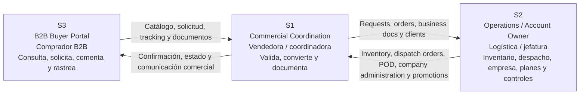
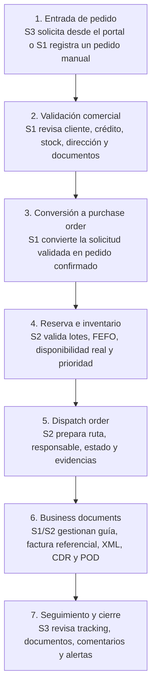
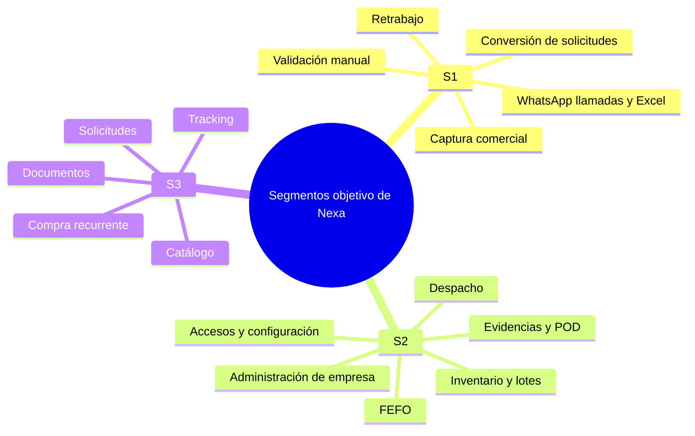
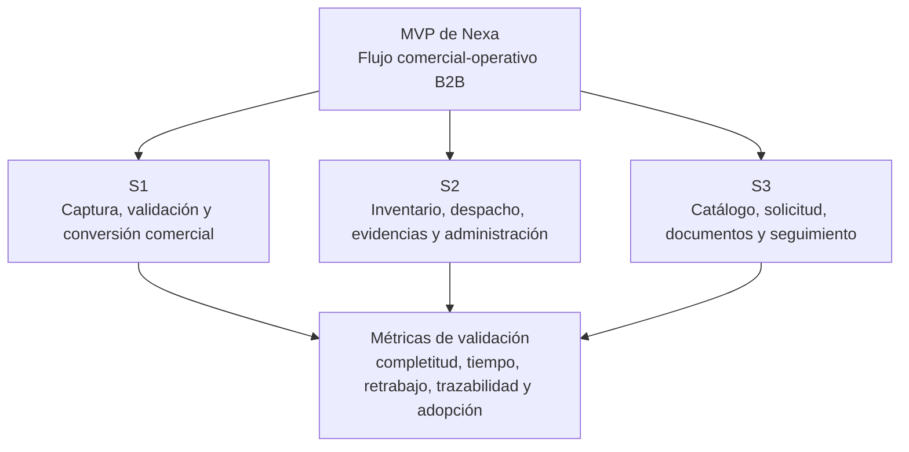

### **1.3. Segmentos Objetivos**

La segmentación de Nexa se define a partir del flujo real de coordinación comercial y operativa en empresas importadoras o distribuidoras de productos refrigerados y congelados. Nexa se plantea como una plataforma **SaaS B2B** contratada por una empresa de cadena de frío, la cual habilita distintos perfiles de uso dentro de un mismo ecosistema operacional.

En esta sección, los segmentos objetivo funcionan como la base de investigación y diseño del producto. Por ello, no se presentan como módulos del sistema, sino como actores del dominio que concentran fricciones distintas y complementarias.

### ***Modelo SaaS y actores del ecosistema***

Nexa funciona bajo un modelo SaaS orientado a empresas B2B de cadena de frío. Dentro de este modelo, S1 y S2 son usuarios internos de la empresa contratante, mientras que S3 corresponde al comprador externo habilitado para interactuar con el portal de compra. Las responsabilidades administrativas de empresa, accesos, planes y configuración son asumidas por S2 como **Operations / Account Owner**.

*Tabla. Reglas de segmentación del modelo SaaS de Nexa*

| Elemento | Definición |
|---|---|
| Empresa contratante | Importadora o distribuidora de cadena de frío que contrata Nexa como sistema de coordinación comercial-operativa. |
| Tenant | Espacio de trabajo de la empresa contratante, donde se gestionan usuarios, productos, pedidos, inventario, documentos y configuración. |
| Usuarios internos | S1 y S2. Trabajan dentro del tenant de la empresa contratante y participan en el flujo comercial-operativo. |
| Comprador externo habilitado | S3. Cliente B2B que accede al portal para consultar catálogo, generar solicitudes, revisar pedidos, documentos y seguimiento. |
| Account ownership | Responsabilidad asumida por S2 para administrar empresa, accesos, suscripción, operación e información crítica del tenant. |
| Alcance inicial | Nexa no reemplaza un ERP completo en su primera versión. Se enfoca en reducir doble digitación, ordenar documentos, mejorar trazabilidad y conectar pedido, validación, inventario y despacho. |

>*Nota*: La tabla aclara cómo se organiza el modelo SaaS de Nexa. Elaboración Propia.

### ***Resumen de Segmentos Objetivo***

*Tabla. Resumen comparativo de segmentos objetivo de Nexa*

| Segmento objetivo | Quién es | Problema / trabajo principal | Módulos asociados                                                                                                                |
|---|---|---|---|
| **S1: Commercial Coordination** | Vendedoras o coordinadoras comerciales de la importadora/distribuidora. | Reciben pedidos por WhatsApp, llamada, Excel o portal; validan cliente, stock, credito y documentos; convierten solicitudes en pedidos. | Purchase Requests, Purchase Orders, Manual Order Entry, B2B Clients, Business Documents, Product Catalog visible. |
| **S2: Operations / Account Owner** | Logística, jefatura de operaciones, responsable de almacén o responsable interno de la empresa contratante. | Controlan inventario, lotes, FEFO, despachos, evidencias, documentos operativos, promociones, portales externos, administración de empresa, suscripción y accesos. | Inventory Control, Dispatch Orders, Proof of Delivery, Operational Analytics, Promotions, Customer Portals, Company Administration. |
| **S3: B2B Buyer Portal** | Cliente comprador B2B: restaurante, supermercado, retail, comprador mayorista, comprador minorista. | Consulta catálogo, arma solicitudes, revisa estado, conversa con S1, descarga documentos y sigue el despacho de sus pedidos. | Product Catalog, Request Builder, My Requests, My Orders, Business Documents, Premium Catalog, Assistant Preview, Buyer Profile. |

>*Nota*: La tabla sintetiza la segmentación de Nexa y conecta cada segmento con su problema principal y módulos funcionales. Elaboración Propia.

*Figura. Flujo de interacción entre los segmentos objetivo*

>*Nota*: El gráfico representa la relación transversal entre el comprador B2B, la coordinación comercial y la operación interna de la empresa contratante. Elaboración Propia.

### ***Flujo integrado de Nexa***

El flujo base de Nexa inicia cuando un comprador B2B genera una solicitud desde el portal o cuando el equipo comercial registra manualmente un pedido recibido por canales tradicionales. A partir de ese punto, la plataforma permite ordenar la validación comercial, convertir la solicitud en un pedido confirmado, coordinar la reserva de inventario, preparar el despacho, gestionar documentos y ofrecer seguimiento al comprador.

Este flujo permite conectar los tres segmentos sin tratarlos como experiencias aisladas.

*Tabla. Flujo base actualizado de Nexa*

| Paso | Actor | Flujo | Descripción |
|---|---|---|---|
| 1 | S3 / S1 | Entrada de pedido | El comprador arma una solicitud desde el portal o S1 registra un pedido recibido por WhatsApp, llamada, Excel u otro canal tradicional. |
| 2 | S1 | Validación comercial | Se revisa RUC/cliente, crédito, stock disponible, observaciones, dirección y documentos requeridos. |
| 3 | S1 | Conversión a purchase order | La solicitud validada se convierte en pedido confirmado, dejando trazabilidad del origen. |
| 4 | S2 | Reserva e inventario | Operaciones valida lotes, FEFO, disponibilidad real, temperatura y prioridad de despacho. |
| 5 | S2 | Dispatch order | Se prepara ruta, responsable, estado, evidencias y proof of delivery. |
| 6 | S1 / S2 | Business documents | Se gestionan factura referencial, guía, XML, CDR, POD y tareas manuales de portales externos. |
| 7 | S3 | Seguimiento y cierre | El comprador ve tracking, estado, documentos visibles, comentarios y alertas del pedido. |

>*Nota*: La tabla describe el flujo transversal que conecta solicitud, validación comercial, inventario, despacho, documentos y seguimiento dentro de Nexa. Elaboración Propia.

*Figura. Flujo base actualizado de Nexa*

>*Nota*: El gráfico resume el recorrido end-to-end del pedido dentro de Nexa, desde la entrada de la solicitud hasta el seguimiento final del comprador. Elaboración Propia.

### ***Sustento demográfico y estadístico***

El dominio de Nexa se ubica en la distribución B2B de productos refrigerados y congelados, donde la coordinación entre ventas, logística y compradores comerciales todavía depende de canales informales, validaciones manuales y registros dispersos. Esta situación es especialmente crítica porque el pedido no solo contiene una intención de compra: también activa decisiones de disponibilidad, inventario, rotación, preparación, despacho, documentación y seguimiento.

El sustento estadístico permite justificar por qué los tres segmentos son relevantes para el proyecto. Según Lucky-Xplora (2022), el 83% de las bodegas del canal tradicional se encuentra en un nivel principiante de madurez digital, mientras que solo alrededor del 28% utiliza alguna aplicación para gestionar tareas del negocio. Este dato refuerza la importancia del S3, ya que el comprador comercial B2B necesita una experiencia simple, clara y cercana a sus hábitos actuales de compra.

Además, la problemática de cadena de frío exige control operativo y trazabilidad. Bravo De la Cruz et al. (2025) reportan 64 incidentes de ruptura de cadena de frío en establecimientos de una microred de salud durante un año, lo que evidencia que la falta de control, trazabilidad y coordinación puede convertirse en un riesgo operativo recurrente. Este punto refuerza la importancia del S2, porque logística y operación deben convertir la solicitud comercial en una operación viable, controlada y trazable.

En paralelo, la captura comercial sigue siendo un punto sensible del flujo. Cuando los pedidos llegan por WhatsApp, llamada, audio, Excel o listas informales, la vendedora o coordinadora comercial debe interpretar información incompleta y trasladarla hacia operación. Por ello, el S1 es crítico: si el pedido nace desordenado, el error se propaga hacia inventario, preparación, despacho, documentos y atención posterior.

*Figura. Lectura visual del sustento de segmentación*

>*Nota*: El gráfico resume los focos de fricción que justifican cada segmento dentro del dominio comercial-operativo de Nexa. Elaboración Propia.

### ***Análisis detallado por segmento***

#### **S1: Commercial Coordination**

El S1 está conformado por vendedoras, asesoras o coordinadoras comerciales de la importadora o distribuidora. Este segmento representa el punto donde muchas solicitudes de compra ingresan al flujo interno de Nexa, ya sea desde el portal del comprador o desde canales tradicionales como WhatsApp, llamada, Excel o mensajes directos.

Su importancia radica en que una parte significativa de los errores posteriores puede originarse en esta etapa. Si la solicitud se registra con datos incompletos, productos mal interpretados, cantidades ambiguas, condiciones comerciales no verificadas o documentos pendientes, el problema se traslada hacia inventario, preparación, despacho y atención posterior.

En Nexa, el S1 no solo registra información. También valida datos comerciales, revisa clientes, consulta disponibilidad visible, documenta observaciones y convierte solicitudes en pedidos confirmados. Por ello, este segmento conecta directamente con módulos como **Purchase Requests**, **Purchase Orders**, **Manual Order Entry**, **B2B Clients**, **Business Documents** y **Product Catalog**.

##### Ficha rápida del segmento

- **Actor principal**: vendedoras, asesoras comerciales, mercaderistas y coordinadoras comerciales.
- **Contexto dominante**: atención rápida a compradores B2B mediante portal, llamadas, WhatsApp, listas de productos, notas de voz, Excel o mensajes dispersos.
- **Responsabilidad principal**: recibir, interpretar, validar, ordenar y canalizar solicitudes hacia operación.
- **Dolor principal**: pedidos dispersos, doble digitación, validaciones manuales y baja visibilidad inmediata de stock o condiciones.
- **Valor esperado**: capturar solicitudes de forma estructurada, reducir errores, validar información comercial y responder al comprador con mayor seguridad.

##### Plano demográfico y ocupacional

El S1 suele ubicarse en roles comerciales u operativos de primera línea. Su trabajo exige comunicación constante, rapidez para responder y capacidad para coordinar con compradores y áreas internas. Puede tratar directamente con clientes recurrentes, compradores de alto volumen o negocios pequeños que esperan atención inmediata.

A nivel ocupacional, este segmento no necesariamente cuenta con poder de decisión estratégico sobre la empresa, pero sí influye directamente en la calidad del pedido. Su desempeño afecta el tiempo de respuesta, la satisfacción del comprador y la cantidad de errores que llegan a operación.

*Tabla. Caracterización ocupacional del S1*

| Variable | Caracterización esperada |
|---|---|
| Rango ocupacional | Personal comercial, ventas internas, mercaderistas, coordinadoras comerciales o asistentes de pedidos. |
| Relación con el comprador | Alta: mantiene contacto frecuente con compradores mayoristas, minoristas y negocios B2B. |
| Nivel de decisión | Medio u operativo: puede registrar, canalizar y consultar, pero no siempre aprobar excepciones. |
| Presión del rol | Alta: debe responder rápido sin perder precisión. |
| Entorno de trabajo | Oficina, punto de venta, almacén administrativo o trabajo móvil mediante celular. |

>*Nota*: Caracteriza el rol ocupacional del S1 para ubicarlo dentro del proceso de captura, validación y conversión comercial. Elaboración Propia.

##### Plano conductual

El comportamiento del S1 está marcado por la necesidad de resolver solicitudes con rapidez. En la práctica, esto suele implicar alternar entre conversaciones, hojas de cálculo, catálogos, consultas internas y validaciones con logística o almacén. Esta fragmentación genera dependencia de memoria, experiencia personal y coordinación informal.

Debe responder rápido al comprador, pero la información que necesita para responder correctamente no siempre está centralizada. Por ello, Nexa debe permitirle trabajar con una solicitud más ordenada desde el inicio, reduciendo la necesidad de reconstruir información desde mensajes o archivos dispersos.

*Tabla. Comportamientos actuales del S1 y sus consecuencias*

| Comportamiento actual | Consecuencia |
|---|---|
| Recibe pedidos por WhatsApp, llamada, audio, Excel o listas escritas. | El pedido puede llegar incompleto, desordenado o difícil de interpretar. |
| Consulta stock, precios o condiciones en más de una fuente. | Aumenta el tiempo de respuesta y el riesgo de información desactualizada. |
| Reenvía información a logística o almacén. | Aparece doble digitación o pérdida de detalle. |
| Aclara dudas con el comprador durante el proceso. | Se generan interrupciones, retrasos y mayor dependencia de comunicación manual. |
| Convierte solicitudes en pedidos confirmados. | Si la validación previa es débil, el error se traslada al flujo operativo. |

>*Nota*: Resume las prácticas actuales del S1 y las consecuencias que justifican una captura más estructurada. Elaboración Propia.

##### Plano tecnológico

El S1 suele tener familiaridad práctica con herramientas digitales básicas, especialmente mensajería instantánea, llamadas, hojas de cálculo y sistemas internos simples. Sin embargo, esa familiaridad no significa que trabaje en un flujo integrado. El problema no es la ausencia total de tecnología, sino el uso de herramientas dispersas que no aseguran trazabilidad.

Para este segmento, Nexa debe sentirse más rápido y confiable que el proceso informal. Si el sistema añade pasos innecesarios, formularios extensos o validaciones lentas, la adopción puede verse afectada. Por ello, la experiencia debe priorizar rapidez, claridad y continuidad entre solicitud, validación y conversión a pedido.

*Tabla. Implicancias tecnológicas para el S1*

| Aspecto tecnológico | Implicancia para Nexa |
|---|---|
| Uso frecuente de celular, WhatsApp y archivos compartidos. | La experiencia debe ser responsive y permitir acciones rápidas. |
| Alternancia entre varias fuentes de información. | El sistema debe centralizar comprador, catálogo, disponibilidad, solicitud y pedido. |
| Baja tolerancia a flujos lentos. | La captura debe ser guiada, pero no rígida. |
| Necesidad de historial y trazabilidad. | Cada solicitud debe conservar información clara para seguimiento posterior. |
| Conversión de solicitudes en pedidos. | La plataforma debe permitir que una solicitud validada se convierta en purchase order. |

>*Nota*: Relaciona el uso actual de herramientas digitales del S1 con decisiones de diseño para Nexa. Elaboración Propia.

##### Plano de valor esperado

El valor esperado para el S1 se concentra en reducir retrabajo y aumentar seguridad al responder. Nexa debe permitir que la vendedora o coordinadora comercial registre solicitudes de manera estructurada, consulte información relevante, visualice condiciones comerciales y evite depender de conversaciones dispersas para reconstruir lo solicitado.

*Tabla. Dolores, respuesta esperada y métricas sugeridas para el S1*

| Dolor del segmento | Respuesta esperada de Nexa | Métrica de validación sugerida |
|---|---|---|
| El pedido llega incompleto o ambiguo. | Flujo de captura con productos, cantidades, comprador, observaciones y condiciones registradas. | Porcentaje de solicitudes registradas con información completa. |
| El stock o las condiciones no se confirman con rapidez. | Consulta de disponibilidad y datos comerciales desde el flujo de validación. | Tiempo promedio para confirmar disponibilidad al comprador. |
| Hay doble digitación entre ventas y operación. | Solicitud estructurada que puede convertirse en pedido confirmado. | Número de pasos manuales entre captura y conversión a pedido. |
| Se repiten aclaraciones por WhatsApp o llamada. | Historial y detalle de la solicitud disponible para seguimiento. | Cantidad de aclaraciones por solicitud antes de confirmación. |
| La documentación queda dispersa. | Registro de documentos y observaciones asociadas al pedido. | Porcentaje de pedidos con documentos u observaciones registradas correctamente. |

>*Nota*: Conecta los principales dolores del S1 con respuestas funcionales y métricas futuras de validación. Elaboración Propia.

#### **S2: Operations / Account Owner**

El S2 está conformado por logística, jefatura de operaciones, responsables de almacén, inventario, despacho o responsables internos de la empresa contratante. Este segmento se ubica por encima del flujo comercial directo y tiene una visión más amplia del cumplimiento del pedido, la operación del tenant y la administración de la cuenta.

Su responsabilidad principal es convertir la solicitud comercial en una operación ejecutable. Aunque no siempre inicia la relación con el comprador, sí debe asegurar que el pedido pueda cumplirse con stock disponible, lotes adecuados, criterios FEFO, preparación correcta, coordinación de despacho, control de evidencias y gestión de documentos.

Además, el S2 asume el rol de account ownership. Las responsabilidades de configuración de empresa, administración de usuarios, accesos, planes, promociones y control operativo recaen en este segmento, ya que representa a la empresa contratante dentro de la plataforma.

En Nexa, el S2 conecta directamente con módulos como **Inventory Control**, **Dispatch Orders**, **Proof of Delivery**, **Operational Analytics**, **Promotions**, **Customer Portals** y **Company Administration**.

##### Ficha rápida del segmento

- **Actor principal**: logística, jefatura de operaciones, responsable de almacén, coordinadora operativa, encargada de inventario, despacho o responsable interno de la empresa contratante.
- **Contexto dominante**: coordinación entre ventas, inventario, lotes, preparación, despacho, evidencias, documentos, accesos y configuración de empresa.
- **Responsabilidad principal**: validar disponibilidad real, controlar inventario, organizar preparación, coordinar despacho, gestionar evidencias y administrar la operación del tenant.
- **Dolor principal**: información dispersa entre áreas, stock no siempre confiable, cambios de último minuto, trazabilidad fragmentada y administración operativa poco centralizada.
- **Valor esperado**: mayor control operativo, mejor visibilidad del pedido, reducción de incidencias y administración centralizada de la empresa contratante.

##### Plano demográfico y ocupacional

El S2 representa perfiles con mayor responsabilidad interna que el S1. Suelen ser personas encargadas de coordinar equipos, revisar disponibilidad, controlar salidas, organizar prioridades, responder ante problemas operativos y tomar decisiones relacionadas con la continuidad del servicio.

A diferencia del S1, este segmento no solo necesita rapidez, sino control. Su interés principal no es vender más en el momento, sino asegurar que lo vendido pueda prepararse, despacharse y cumplirse sin generar pérdidas, reclamos, quiebres de stock o desorden interno.

En el modelo SaaS de Nexa, el S2 también tiene una responsabilidad administrativa. Esto significa que puede encargarse de gestionar información de la empresa, usuarios internos, permisos, configuración de portales, promociones y condiciones generales de operación.

*Tabla. Caracterización ocupacional del S2*

| Variable | Caracterización esperada |
|---|---|
| Rango ocupacional | Jefatura, coordinación o responsabilidad operativa en logística, almacén, inventario, despacho o administración interna. |
| Relación con el comprador | Indirecta: normalmente recibe presión a través de ventas, atención comercial o reclamos posteriores. |
| Nivel de decisión | Medio o alto operativo: puede priorizar pedidos, validar disponibilidad, coordinar recursos y administrar información de la empresa. |
| Presión del rol | Alta: debe resolver problemas que impactan cumplimiento, costos, trazabilidad y satisfacción del comprador. |
| Entorno de trabajo | Almacén, oficina operativa, centro de distribución o coordinación híbrida entre áreas. |

>*Nota*: Caracteriza el rol ocupacional del S2 para ubicarlo dentro de la coordinación operativa y administración interna de la empresa contratante. Elaboración Propia.

##### Plano conductual

El S2 opera en un entorno donde la información debe transformarse en acción. Recibe pedidos ya capturados o comunicados por ventas, revisa si se pueden cumplir, valida disponibilidad real, organiza preparación, coordina despacho y gestiona incidencias. Cuando la información llega incompleta o tarde, operación termina absorbiendo el error.

También debe controlar elementos que no siempre son visibles para el comprador, pero que determinan el cumplimiento del pedido: lotes, rotación, temperatura, prioridad, ruta, responsable, evidencias, documentos y estado de entrega. Por ello, necesita una vista más integral del flujo, no solo una lista de pedidos.

Debe garantizar cumplimiento operativo, pero muchas veces trabaja con información comercial que no está suficientemente validada ni estructurada. Además, si la configuración de empresa, usuarios o accesos está separada del flujo operativo, la gestión del tenant se vuelve más difícil de controlar.

*Tabla. Comportamientos actuales del S2 y sus consecuencias*

| Comportamiento actual | Consecuencia |
|---|---|
| Revisa disponibilidad con base en registros internos, conteos, archivos o coordinación verbal. | Puede haber diferencias entre stock percibido y stock real. |
| Organiza preparación según urgencia, cliente, disponibilidad o criterio operativo. | La priorización puede depender de decisiones manuales poco trazables. |
| Coordina con ventas ante cambios, faltantes o restricciones de despacho. | Se generan demoras y retrabajo antes de la preparación o entrega. |
| Controla lotes, rotación, temperatura o condiciones operativas. | Si no existe trazabilidad, aumenta el riesgo de errores en productos sensibles. |
| Supervisa evidencias de entrega o proof of delivery. | La confirmación de cumplimiento puede quedar fragmentada en fotos, mensajes o documentos separados. |
| Administra usuarios, accesos o configuraciones de empresa. | Si la administración no está centralizada, se dificulta el control del tenant. |

>*Nota*: Resume las prácticas actuales del S2 y las consecuencias que justifican mayor visibilidad operativa y administración centralizada. Elaboración Propia.

##### Plano tecnológico

El S2 necesita herramientas que ofrezcan visibilidad, control y trazabilidad. Puede usar hojas de cálculo, sistemas internos, registros de inventario, grupos de mensajería, documentación física o plataformas externas. Sin embargo, cuando estos recursos no están conectados, el seguimiento del pedido y la administración operativa se vuelven procesos manuales.

Para este segmento, Nexa debe funcionar como una capa de coordinación operativa. No basta con mostrar pedidos: debe ayudar a entender qué queda por atender, qué se puede preparar, qué requiere validación, qué incidencias deben atenderse y qué información del tenant debe mantenerse bajo control.

Además, el S2 requiere acceso a funciones administrativas relacionadas con empresa, usuarios, permisos, promociones y portales externos. Estas funciones deben presentarse como parte de la operación de la empresa contratante, no como un segmento separado.

*Tabla. Implicancias tecnológicas para el S2*

| Aspecto tecnológico | Implicancia para Nexa |
|---|---|
| Necesidad de visibilidad sobre pedidos, stock y despacho. | Debe existir una vista operativa clara por estado, prioridad, disponibilidad y etapa del flujo. |
| Control de lotes, FEFO y disponibilidad real. | El sistema debe permitir validar inventario considerando criterios operativos de cadena de frío. |
| Uso de registros internos o documentos separados. | La plataforma debe reducir dependencia de archivos dispersos, mensajes o controles manuales. |
| Coordinación con varias áreas. | Los estados del pedido deben ser compartidos y entendibles para S1 y S2. |
| Control de evidencias y POD. | Las evidencias deben asociarse al pedido y al despacho correspondiente. |
| Administración de empresa, accesos y configuración. | El S2 debe contar con funciones de company administration dentro del tenant. |

>*Nota*: Relaciona las necesidades tecnológicas del S2 con decisiones de diseño orientadas al control operativo y administración de la cuenta. Elaboración Propia.

##### Plano de valor esperado

El valor esperado para el S2 se relaciona con control operativo y administración centralizada. Nexa debe permitir que la jefatura o coordinación operativa vea pedidos por revisar, valide disponibilidad, controle inventario, organice preparación, gestione despacho, registre evidencias, revise incidencias y administre información clave de la empresa contratante.

*Tabla. Dolores, respuesta esperada y métricas sugeridas para el S2*

| Dolor del segmento | Respuesta esperada de Nexa | Métrica de validación sugerida |
|---|---|---|
| La información comercial llega incompleta. | Pedido estructurado antes de entrar a preparación. | Porcentaje de pedidos que no requieren devolución a ventas. |
| El stock no está conectado con el pedido. | Consulta de disponibilidad, lotes y criterios FEFO desde el flujo operativo. | Porcentaje de pedidos validados sin ajuste manual. |
| Hay cambios de último minuto. | Estados e incidencias visibles para ventas y operación. | Número de incidencias registradas por pedido. |
| La trazabilidad depende de mensajes o papeles. | Historial operativo del pedido, despacho y documentos asociados. | Porcentaje de pedidos con estado actualizado. |
| Las evidencias de entrega quedan dispersas. | Registro de proof of delivery asociado al dispatch order. | Porcentaje de despachos con evidencia registrada. |
| La administración de empresa no está centralizada. | Gestión de usuarios, accesos, configuración y datos del tenant desde Nexa. | Número de configuraciones críticas administradas desde la plataforma. |

>*Nota*: Conecta los principales dolores del S2 con respuestas funcionales y métricas futuras de validación. Elaboración Propia.

#### **S3: B2B Buyer Portal**

El S3 está conformado por compradores B2B externos habilitados por la empresa contratante, como restaurantes, supermercados, negocios retail, compradores mayoristas, compradores minoristas y negocios HORECA. Este segmento representa el origen de la demanda y participa en el flujo mediante la consulta de catálogo, creación de solicitudes, revisión de pedidos, descarga de documentos y seguimiento del despacho.

Su interés principal no es usar una plataforma por novedad tecnológica, sino abastecerse con menor incertidumbre. Para este actor, la utilidad de Nexa depende de que pueda consultar productos, armar solicitudes, revisar el estado de sus pedidos y acceder a información clara sin perder la sensación de respaldo humano.

En Nexa, el S3 conecta directamente con módulos como **Product Catalog**, **Request Builder**, **My Requests**, **My Orders**, **Business Documents**, **Premium Catalog**, **Assistant Preview** y **Buyer Profile**.

##### Ficha rápida del segmento

- **Actor principal**: compradores B2B, restaurantes, supermercados, negocios retail, compradores mayoristas, compradores minoristas y negocios HORECA.
- **Contexto dominante**: compra recurrente de productos refrigerados o congelados para mantener stock, ventas y continuidad operativa.
- **Responsabilidad principal**: consultar catálogo, solicitar productos, revisar pedidos, descargar documentos y coordinar la recepción.
- **Dolor principal**: incertidumbre sobre disponibilidad, precios, confirmación, cambios de último minuto, documentos y estado de entrega.
- **Valor esperado**: catálogo claro, solicitud autónoma, confirmación confiable, documentos visibles y seguimiento comprensible.

##### Plano demográfico y ocupacional

El S3 agrupa a personas que compran para sostener una actividad comercial. Pueden ser dueños de negocio, encargados de compras, administradores de local, responsables de reposición o compradores frecuentes de una empresa cliente. Su toma de decisión suele estar asociada a continuidad de stock, margen, confianza en el proveedor y rapidez de atención.

A diferencia de un consumidor final, este comprador no adquiere productos para consumo personal, sino para mantener la operación de su propio negocio. Por ello, la falta de confirmación, los cambios inesperados, la ausencia de documentos o la demora en entrega pueden afectar sus ventas, su flujo de caja y su relación con clientes finales.

*Tabla. Caracterización ocupacional del S3*

| Variable | Caracterización esperada |
|---|---|
| Rango ocupacional | Dueños de negocio, compradores, encargados de tienda, administradores o responsables de reposición. |
| Relación con el proveedor | Alta: depende de proveedores recurrentes para mantener inventario y continuidad comercial. |
| Nivel de decisión | Medio o alto en su negocio: decide qué comprar, cuándo comprar y a quién comprar. |
| Presión del rol | Alta: debe evitar quiebres de stock y responder a la demanda de sus clientes. |
| Entorno de trabajo | Restaurante, supermercado, retail, bodega, minimarket, local comercial, pequeño almacén u operación HORECA. |

>*Nota*: Caracteriza el rol ocupacional del S3 para ubicarlo dentro de la demanda recurrente B2B. Elaboración Propia.

##### Plano conductual

El S3 compra bajo presión de continuidad. Su comportamiento está determinado por la necesidad de abastecerse a tiempo, conseguir productos disponibles y evitar faltantes que afecten sus ventas. Actualmente puede depender de llamadas, mensajes de WhatsApp, listas enviadas por vendedores o acuerdos informales con proveedores conocidos.

No busca digitalizarse por sí mismo; busca comprar con menos incertidumbre y mantener su negocio abastecido. Por ello, el portal debe funcionar como una extensión clara del vínculo comercial existente, no como una barrera adicional.

*Tabla. Comportamientos actuales del S3 y sus consecuencias*

| Comportamiento actual | Consecuencia |
|---|---|
| Solicita productos por WhatsApp, llamada, Excel o contacto directo con la vendedora. | La información del pedido puede quedar dispersa o incompleta. |
| Consulta disponibilidad antes de decidir. | Si la respuesta demora, puede buscar otro proveedor o modificar su compra. |
| Espera confirmación manual del pedido. | Se genera incertidumbre hasta que alguien responde. |
| Solicita documentos o comprobantes después del pedido. | La información puede quedar repartida entre correos, mensajes o archivos separados. |
| Consulta el estado de entrega por canales informales. | Aumenta la carga de comunicación para ventas y operación. |
| Mantiene confianza en proveedores conocidos. | La adopción digital depende de que el portal no elimine el respaldo humano. |

>*Nota*: Resume las prácticas actuales del S3 y las consecuencias que justifican un portal de compra más claro y trazable. Elaboración Propia.

##### Plano tecnológico

El S3 puede usar herramientas digitales cotidianas, pero su nivel de madurez digital puede variar bastante. Algunos compradores pueden estar familiarizados con aplicaciones móviles, pagos digitales o catálogos en línea; otros pueden seguir dependiendo casi por completo de WhatsApp, llamadas y listas enviadas por el proveedor.

Por ello, Nexa debe ofrecer una experiencia clara, con bajo esfuerzo de aprendizaje y con información útil desde el primer uso. El portal no debe sentirse como una carga administrativa adicional, sino como una forma más ordenada de hacer algo que el comprador ya realiza: consultar, pedir, confirmar, revisar documentos y seguir el estado de entrega.

*Tabla. Implicancias tecnológicas para el S3*

| Aspecto tecnológico | Implicancia para Nexa |
|---|---|
| Uso habitual de celular. | El portal debe funcionar correctamente en pantallas pequeñas y permitir consulta rápida. |
| Familiaridad variable con aplicaciones. | La navegación debe ser simple, directa y tolerante a errores. |
| Dependencia de WhatsApp o llamadas. | El sistema debe ofrecer claridad sin eliminar soporte humano. |
| Necesidad de catálogo claro. | El comprador debe poder revisar productos, disponibilidad o información comercial relevante. |
| Necesidad de seguimiento. | Los pedidos deben mostrar estados comprensibles y trazables. |
| Necesidad de documentos. | Los documentos visibles deben estar asociados al pedido correspondiente. |

>*Nota*: Relaciona la madurez digital variable del S3 con decisiones de diseño orientadas a simplicidad, confianza y seguimiento. Elaboración Propia.

##### Plano de valor esperado

El valor esperado para el S3 se relaciona con autonomía y confianza. Nexa debe permitir que el comprador revise productos, arme solicitudes, confirme información relevante, consulte documentos y siga el estado de sus pedidos sin depender completamente de conversaciones informales.

De esta manera, el S3 valida que Nexa no solo ordena el trabajo interno de la empresa contratante, sino que también mejora la experiencia externa del comprador B2B.

*Tabla. Dolores, respuesta esperada y métricas sugeridas para el S3*

| Dolor del segmento | Respuesta esperada de Nexa | Métrica de validación sugerida |
|---|---|---|
| No sabe con certeza qué productos están disponibles. | Catálogo con productos, información comercial y disponibilidad o confirmación clara. | Porcentaje de productos consultados antes de generar una solicitud. |
| Debe esperar respuesta manual. | Solicitud autónoma con confirmación posterior visible. | Tiempo entre solicitud y confirmación. |
| No tiene seguimiento claro. | Estado del pedido entendible para el comprador. | Número de consultas de estado realizadas desde el portal. |
| Los documentos están dispersos. | Documentos visibles y asociados al pedido correspondiente. | Porcentaje de pedidos con documentos consultados desde el portal. |
| Puede desconfiar de un canal impersonal. | Soporte o contacto humano complementario durante el flujo. | Porcentaje de pedidos digitales que no requieren llamada adicional. |

>*Nota*: Conecta los principales dolores del S3 con respuestas funcionales y métricas futuras de validación. Elaboración Propia.

### ***Impacto en el MVP y Métricas de Validación***

Los tres segmentos validan el núcleo inicial del producto porque cubren el recorrido mínimo que Nexa necesita ordenar: entrada de pedido, validación comercial, conversión a pedido confirmado, control de inventario, preparación, despacho, documentos y seguimiento. En consecuencia, el MVP no debe evaluarse solo por la cantidad de pantallas implementadas, sino por su capacidad para reducir fricción entre estos actores.

La relación entre segmentos y funcionalidades permite sostener que Nexa no funciona como un ERP completo, sino como una capa operacional enfocada en conectar el flujo comercial con la ejecución logística y la experiencia del comprador B2B.

*Tabla. Impacto de los segmentos en el MVP y métricas de validación*

| Segmento objetivo | Función dentro del MVP | Funcionalidades relacionadas | Métricas de validación sugeridas |
|---|---|---|---|
| S1 | Validar la captura estructurada de solicitudes, la validación comercial y la conversión a pedidos confirmados. | Purchase Requests, Purchase Orders, Manual Order Entry, B2B Clients, Business Documents y Product Catalog visible. | Porcentaje de solicitudes completas, tiempo promedio de validación, número de pasos manuales entre captura y pedido confirmado, y cantidad de aclaraciones antes de confirmar. |
| S2 | Validar el control operativo del tenant, la disponibilidad real, la preparación, el despacho, las evidencias y la administración interna. | Inventory Control, Dispatch Orders, Proof of Delivery, Operational Analytics, Promotions, Customer Portals y Company Administration. | Porcentaje de pedidos validados sin ajuste manual, pedidos con estado actualizado, despachos con evidencia registrada, incidencias por pedido y configuraciones críticas administradas desde la plataforma. |
| S3 | Validar la utilidad del portal para consulta, solicitud, seguimiento, documentos y continuidad de abastecimiento. | Product Catalog, Request Builder, My Requests, My Orders, Business Documents, Premium Catalog, Assistant Preview y Buyer Profile. | Tiempo entre solicitud y confirmación, productos consultados antes de solicitar, pedidos digitales que no requieren llamada adicional, consultas de estado desde el portal y documentos revisados por pedido. |

>*Nota*: La tabla conecta cada segmento con el alcance inicial del MVP y propone métricas futuras para validar si Nexa reduce fricción en el flujo principal del pedido. Elaboración Propia.

*Figura. Relación entre segmentos, MVP y validación*

>*Nota*: El gráfico muestra cómo el MVP se valida a través de la interacción entre captura comercial, coordinación operativa y experiencia del comprador B2B. Elaboración Propia.

### ***Conclusiones por segmento***

Cada segmento cumple una función específica dentro del recorrido del pedido y justifica decisiones posteriores de requisitos, diseño, arquitectura y validación.

*Tabla. Conclusiones de trazabilidad por segmento*

| Segmento | Conclusión |
|---|---|
| S1 | Justifica las épicas e historias relacionadas con solicitudes, validación comercial, clientes B2B, documentos y conversión a pedidos confirmados. |
| S2 | Justifica las épicas e historias relacionadas con inventario, lotes, FEFO, despacho, evidencias, administración de empresa, accesos y control del tenant. |
| S3 | Justifica las épicas e historias relacionadas con catálogo, portal comprador, creación de solicitudes, seguimiento de pedidos, consulta de documentos y comunicación con la empresa proveedora. |

>*Nota*: La tabla resume cómo cada segmento sostiene la trazabilidad entre investigación, funcionalidades, user stories, bounded contexts y evidencias de validación. Elaboración Propia.

En conjunto, los tres segmentos permiten representar el ciclo principal de Nexa: el comprador solicita, el equipo comercial valida y convierte, y operación controla la ejecución. Esta lectura articula Lean UX, Needfinding, User Stories, Product Backlog, C4, DDD y los diagramas de clases.
