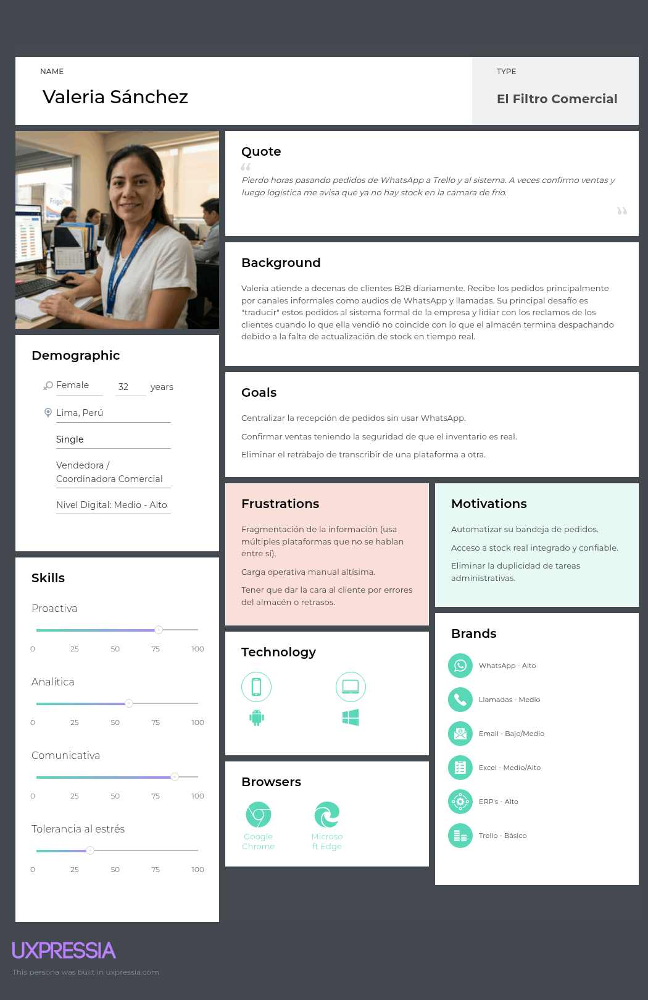
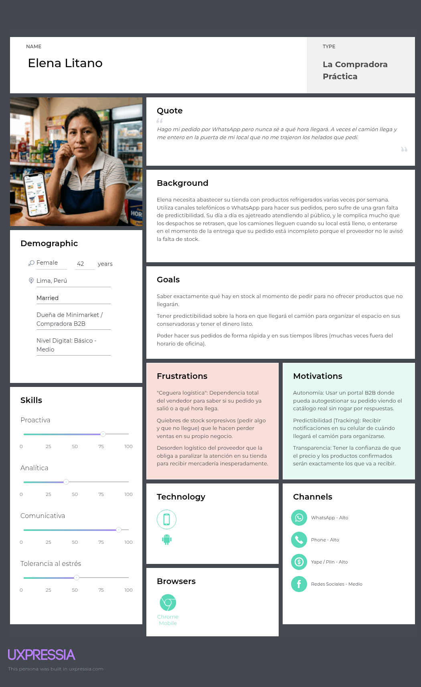
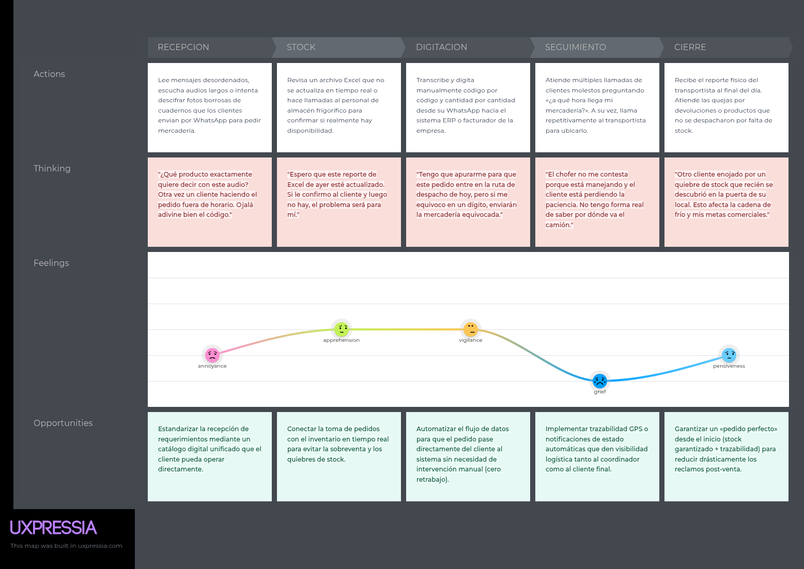
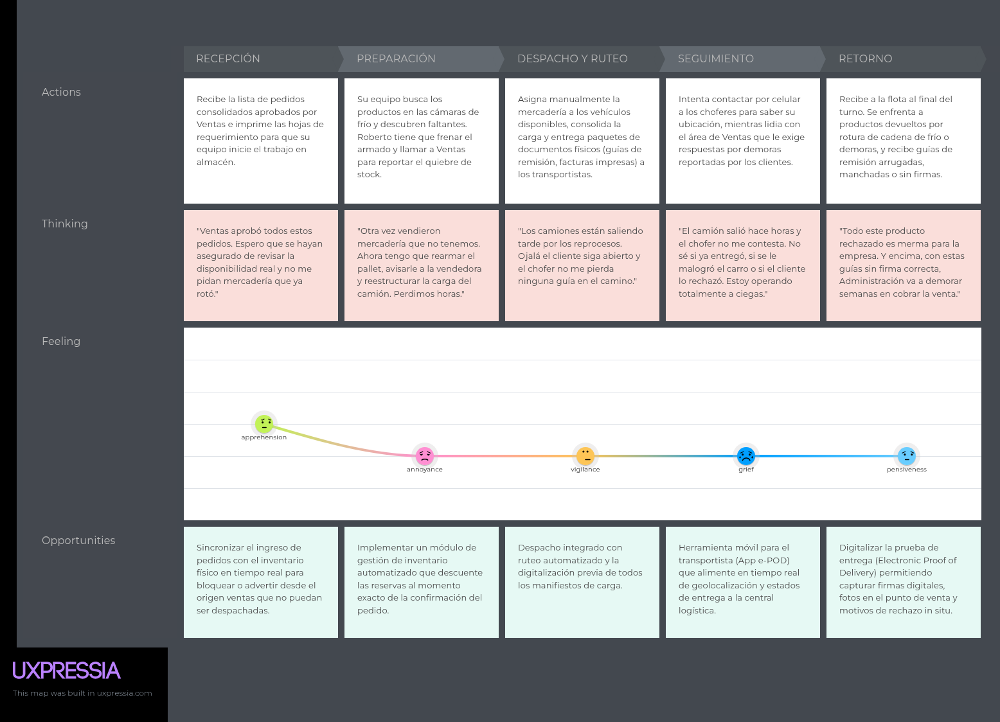
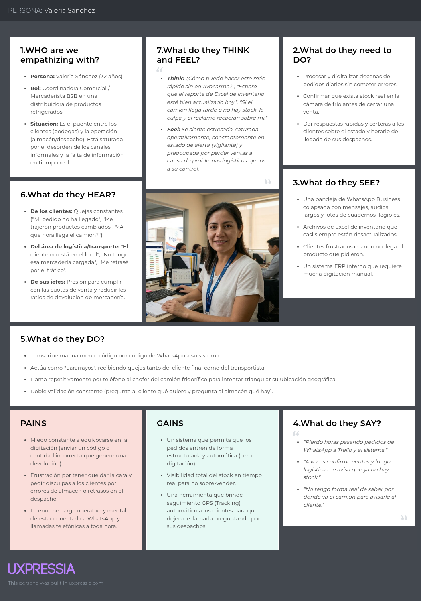
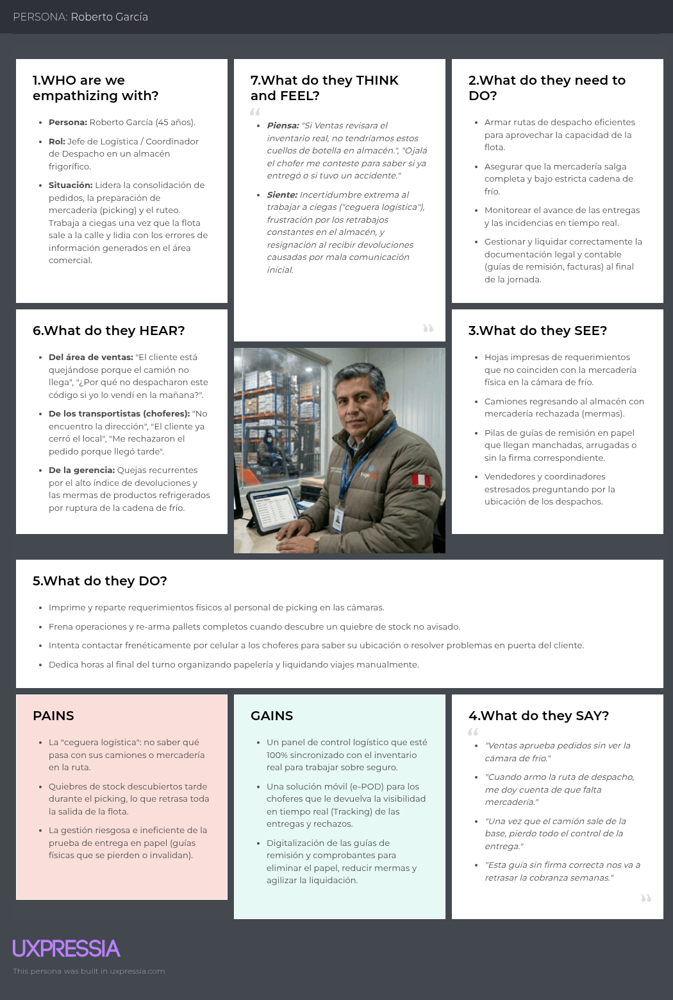
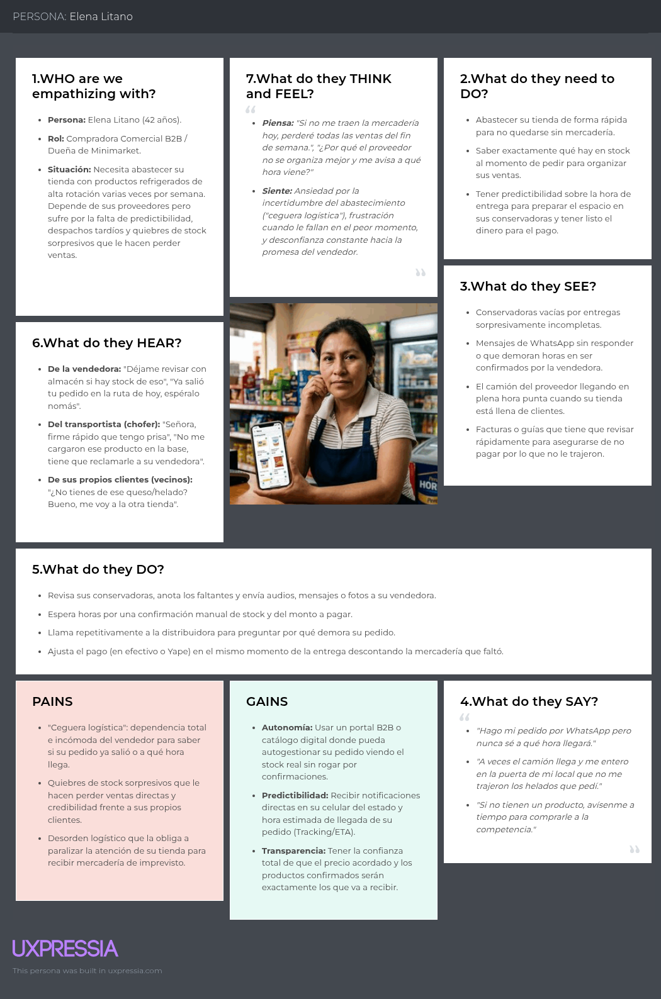

## **2.3. Needfinding**

La construcción de este bloque parte de tres insumos previos. El primero es el análisis de entrevistas de la sección 2.2, que identifica patrones de comportamiento, fricciones recurrentes y expectativas de adopción. El segundo es el análisis competitivo de la sección 2.1, que muestra que las soluciones existentes resuelven fragmentos del problema, pero no articulan con suficiente claridad la continuidad entre captura comercial, abastecimiento del cliente y cierre de entrega. El tercero es la lógica del dominio modelada en el proyecto, donde cada segmento interviene en un momento distinto del flujo.

Los artefactos de needfinding traducen evidencia cualitativa en criterios de diseño: quién necesita autonomía, quién necesita visibilidad, quién necesita rapidez, quién necesita trazabilidad y en qué punto del recorrido cada necesidad se vuelve más sensible.

### ***2.3.1. User Personas***

La construcción de los User Personas permite representar de forma más concreta a los principales perfiles que intervienen en el flujo de Nexa. Cada arquetipo sintetiza necesidades, frustraciones y expectativas identificadas durante el proceso de investigación, relacionando los hallazgos cualitativos con decisiones de diseño para la plataforma. De esta manera, los perfiles no solo describen usuarios, sino que ayudan a entender qué problema enfrenta cada segmento y qué tipo de solución necesita dentro del proceso comercial, operativo y de abastecimiento B2B.

*User Persona — S1: Commercial Coordination — Valeria Sánchez*

Valeria Sánchez representa al perfil comercial encargado de recibir, interpretar y registrar pedidos B2B. Su trabajo suele depender de mensajes, llamadas, audios o listas enviadas por clientes, lo que genera una carga constante de validación manual. Este perfil permite entender la importancia de que Nexa reduzca el retrabajo desde la captura del pedido, ordenando la información comercial antes de que pase hacia las áreas operativas.

> *Nota:* Representación del arquetipo de vendedoras y coordinación comercial, enfocado en reducir la carga administrativa y el retrabajo en la captura del pedido. Elaboración propia.

*User Persona — S2: Operations / Account Owner — Roberto García*

Roberto García representa al perfil operativo que debe asegurar que cada pedido confirmado pueda prepararse, despacharse y cerrarse correctamente. Su principal reto es trabajar con información confiable sobre inventario, lotes, vencimientos, rutas e incidencias. Por ello, este User Persona evidencia la necesidad de que Nexa brinde mayor visibilidad operativa y trazabilidad durante la preparación, despacho y entrega de los pedidos.

> *Nota:* Representación sintética del arquetipo de coordinación logística y operativa, enfocada en el control del cumplimiento, la visibilidad del despacho y el cierre con evidencia. Su construcción se apoya en hallazgos de trazabilidad, incidencias y coordinación operativa dentro del dominio. Elaboración propia.

*User Persona — S3: B2B Buyer Portal — Elena Litano*

Elena Litano representa al comprador B2B que necesita abastecer su negocio con mayor autonomía y claridad. Actualmente, su experiencia depende en gran parte de la comunicación directa con el vendedor para confirmar productos, disponibilidad, precios y estado de entrega. Este perfil ayuda a orientar Nexa hacia un portal donde el cliente pueda consultar información, generar solicitudes y dar seguimiento a sus pedidos sin depender de consultas constantes por canales informales.

> *Nota:* Representación sintética del arquetipo de comprador comercial B2B, construida a partir de entrevistas a compradores minoristas y mayoristas, más evidencia de adopción digital del canal tradicional. Elaboración propia.

### ***2.3.2. User Task Matrix***

#### User Task Matrix: Frecuencia e Importancia por Arquetipo

| Tareas del Mundo Real                                     | Valeria (S1) |             | Roberto (S2) |             | Elena (S3)          |             |
|:----------------------------------------------------------|:------------------------|:------------|:------------------------|:------------|:--------------------|:------------|
|                                                           | Frecuencia              | Importancia | Frecuencia              | Importancia | Frecuencia          | Importancia |
| **Revisar lista de precios y stock disponible**           | Alta                    | Alta        | Media                   | Alta        | Alta                | Alta        |
| **Elaborar y enviar listas de pedido**                    | Alta                    | Alta        | -                       | -           | Alta                | Alta        |
| **Revisar deudas y límite de crédito del comprador**      | Alta                    | Alta        | -                       | -           | Baja                | Media       |
| **Controlar fechas de caducidad de la mercadería**        | Media                   | Alta        | Alta                    | Alta        | Alta                | Alta        |
| **Preparar y organizar la carga física para el reparto**  | -                       | -           | Alta                    | Alta        | -                   | -           |
| **Consultar avance o momento estimado de entrega**        | Alta                    | Media       | Alta                    | Alta        | Alta                | Alta        |
| Tareas del Mundo Real                                     | Valeria (S1: Comercial) |             | Roberto (S2: Logística) |             | Elena (S3: Comprador B2B) |             |

> *Nota:* Análisis de la carga de tareas manuales distribuidas a lo largo de la cadena de suministro refrigerada. Frecuencia e importancia determinadas mediante el análisis cualitativo de las entrevistas (Needfinding). Elaboración propia.

### ***2.3.3. User Journey Mapping***

Los Journey Maps describen la situación actual de cada segmento antes de Nexa. Representan el recorrido As-Is: cómo se realiza hoy cada proceso, qué fricciones aparecen en cada etapa y dónde se concentra el mayor estrés operativo. No describen la experiencia dentro de la plataforma propuesta.

*Journey Map As-Is — S1: Commercial Coordination*
*Journey Map As-Is — S1: Coordinación comercial / ventas internas*

> *Nota:* Mapeo del proceso actual de captura y gestión de pedidos, identificando puntos de dolor en la transcripción manual y la dispersión de canales. Elaboración propia.

> *Nota:* Mapeo de la ruta logística actual, enfatizando los cuellos de botella en la comunicación de incidencias y la falta de trazabilidad operativa. Elaboración propia.

*Journey Map As-Is — S3: B2B Buyer Portal*

> *Nota:* Mapeo de la experiencia actual de abastecimiento del cliente, destacando la incertidumbre en el seguimiento de entrega y la dependencia del vendedor. Elaboración propia.

Los tres recorridos muestran un mismo flujo con fricciones distintas. En S1 el problema aparece como ambigüedad y retrabajo en la captura comercial; en S2 como presión operativa, incidencias y coordinación logística con información incompleta; y en S3 como incertidumbre sobre disponibilidad, confirmación y seguimiento del pedido.

Para el diseño, esto exige cuidar no solo la captura del pedido, sino también las transiciones entre confirmación, preparación, despacho y entrega.

#### As-Is Scenario Map

El recorrido del As-Is Scenario Map se estructura en seis etapas operativas, alineadas estrictamente con los tres segmentos canónicos del producto y representados por sus respectivos User Personas: S1, S2 y S3.

#### Mapa de Escenario Actual (As-Is)

| Etapa Operativa (As-Is) | Actores | Acciones actuales | Pain points reales | Emociones / Fricciones                                              | Oportunidades de diseño |
|---|---|---|---|---|---|
| **1. Necesidad y reabastecimiento** | S3 | Revisa stock propio en sus conservadoras, estima rotación, arma lista mental o en papel, y consulta por WhatsApp/llamada. | Catálogo desactualizado, sin precios ni disponibilidad visible, sin histórico de compras ágil. | Incertidumbre, urgencia, dependencia del vendedor. | Catálogo vivo con precios, disponibilidad y sugerencias de compra por cliente. |
| **2. Captura del pedido** | S1, S3 | El pedido entra por WhatsApp, audio, foto de lista o llamada. S1 transcribe e interpreta al ERP/Excel. | Transcripción manual, ambigüedad de códigos, doble digitación, stock no confirmado en tiempo real. | Presión, retrabajo, miedo a equivocarse al transcribir. | Formulario estructurado con validación de código interno, precio, stock y crédito en un solo paso. |
| **3. Validación de stock, crédito y FEFO** | S1, S2 | S1 consulta stock en ERP y por teléfono a almacén; revisa crédito en módulo separado. S2 confirma por lote/vencimiento. | Stock desactualizado en ERP, crédito fragmentado, rotación FEFO/FIFO coordinada verbalmente. | Desconfianza del sistema, interrupciones constantes entre áreas.                 | Vista única de stock real, crédito disponible y lotes priorizados por vencimiento. |
| **4. Preparación y picking en almacén** | S2 | Se imprime guía de remisión, se arman cajas/pallets manualmente, se valida visualmente temperatura y fecha. | Errores de picking, lote incorrecto, ruptura de cadena de frío no registrada, quiebres de stock descubiertos tarde. | Estrés por el tiempo, reclamos posteriores, riesgo de mermas.                     | Lista de picking digital con lote/vencimiento sugerido y checklist de temperatura integrado. |
| **5. Despacho y tránsito** | S2 | Cargan vehículo, salen con guía física, coordinan ruta por teléfono; el cliente llama a ventas para conocer el avance. | "Ceguera logística": sin estado visible para el cliente, sin trazabilidad operativa suficiente, llamadas interrumpen al conductor. | Cansancio, llamadas invasivas cruzadas, ansiedad del cliente final.                 | Estado compartido de despacho y registro operativo mínimo. |
| Etapa Operativa (As-Is) | Actores | Acciones actuales | Pain points reales | Emociones / Fricciones                                               | Oportunidades de diseño |

Estos puntos describen oportunidades del proceso actual. La primera iteración prioriza la captura estructurada del pedido y la visibilidad básica de estado entre S1, S2 y S3.

### ***2.3.4. Empathy Mapping***

A continuación, se presentan los Empathy Maps desarrollados para cada segmento objetivo.

*Empathy Map — S1: Commercial Coordination*

> *Nota:* Análisis de expectativas y temores del personal administrativo respecto a la adopción tecnológica. Elaboración propia.

*Empathy Map — S2: Operations / Account Owner*
*Empathy Map — S2: Jefatura logística / coordinación operativa*

*Empathy Map — S3: B2B Buyer Portal*

> *Nota:* Identificación de motivadores extrínsecos e intrínsecos para la digitalización del comprador comercial B2B. Elaboración propia.

*Síntesis de Empathy Mapping*

| Segmento | Principal pain | Principal gain | Design implication |
|---|---|---|---|
| S1 | Pedidos incompletos, doble digitación y validaciones dispersas | Registrar y seguir pedidos con menor retrabajo | Captura asistida con cliente, productos, condiciones y estado visible |
| S2 | Información incompleta para preparar, priorizar o despachar | Control operativo con inventario, pedido y despacho en una misma lectura | Vistas de inventario, priorización FEFO, despacho y cierre con evidencia |
| S3 | Incertidumbre sobre catálogo, disponibilidad y avance del pedido | Comprar con más autonomía y recibir confirmaciones claras | Portal comprador con catálogo, pedido y seguimiento como alcance planificado |

> *Nota:* La tabla resume los principales dolores, ganancias esperadas e implicancias de diseño identificadas a partir de los empathy maps. Elaboración propia.

### ***Síntesis complementaria de Needfinding***

#### User Goals por Segmento

Los user goals sintetizan el objetivo principal que cada segmento busca alcanzar al interactuar con Nexa. Esta síntesis conecta los hallazgos de entrevistas, User Personas, User Task Matrix, Journey Maps y Empathy Maps con decisiones concretas de diseño. Su función es asegurar que cada flujo del producto responda a una necesidad identificada y no a una decisión arbitraria de interfaz.

De acuerdo con los hallazgos del needfinding, S1 necesita validar rápido, S2 necesita controlar la ejecución operativa y S3 necesita mayor visibilidad y confianza durante el pedido.
*Tabla: User Goals por segmento*

| Segmento | User Persona | Goal principal | Pain actual | Gain esperado | Evidencia de entrevistas / hallazgos | Decisión de diseño relacionada |
|:---|:---|:---|:---|:---|:---|:---|
| S1 | Valeria Sánchez | Registrar, validar y convertir solicitudes B2B en pedidos confirmados con menor esfuerzo manual. | Pedidos recibidos por WhatsApp, audios, llamadas o listas; doble digitación; validaciones dispersas de cliente, stock, crédito y documentos. | Menor tiempo de registro, menor retrabajo comercial y mayor trazabilidad desde el origen del pedido. | Las entrevistas evidencian que la captura comercial suele depender de canales informales y que los errores de interpretación se trasladan hacia operación. | Flujo de entrada de pedido, validación comercial, purchase requests, purchase orders y registro manual asistido. |
| S2 | Roberto García | Controlar inventario, lotes, preparación, despacho, evidencias y administración operativa del tenant. | Stock no siempre confiable, coordinación verbal con almacén, quiebres detectados tarde, cierres sin evidencia digital y baja visibilidad compartida entre áreas. | Menor error de stock, mejor priorización operativa, control de despacho y mayor capacidad para administrar empresa, usuarios y accesos. | Las entrevistas muestran falta de visibilidad de inventario en tiempo real, coordinación operativa fragmentada y necesidad de evidencias para cerrar entregas. | Inventory Control, Dispatch Orders, Proof of Delivery, Company Administration y vistas operativas por estado. |
| S3 | Elena Litano | Consultar catálogo, generar solicitudes, revisar pedidos, acceder a documentos y seguir el estado del despacho con mayor autonomía. | Incertidumbre sobre disponibilidad, dependencia del vendedor, ausencia de historial claro, seguimiento por WhatsApp o llamada y documentos dispersos. | Mayor visibilidad del pedido, más confianza en el proveedor y menor dependencia de consultas manuales. | Las entrevistas reflejan que el comprador necesita saber qué puede pedir, si su pedido fue confirmado, cuándo llegará y dónde consultar documentos. | Buyer Portal, Product Catalog, Request Builder, My Requests, My Orders, Business Documents y tracking visible. |

> *Nota:* S3 se documenta como flujo de planificación en la primera iteración; los flujos internos S1 y S2 constituyen la evidencia de validación principal. Los user goals conectan la investigación cualitativa del needfinding con los wireflows y user flows de la sección 4.4. Elaboración propia.

#### Trazabilidad investigación → producto

La siguiente tabla documenta cómo cada insumo de investigación derivó en un artefacto de diseño, qué segmento afecta y cómo informa las decisiones de producto. Su función es demostrar que el MVP no surge de suposiciones no sustentadas, sino de evidencia cualitativa sistemáticamente procesada.

*Tabla. Trazabilidad investigación → producto*

| Insumo de investigación | Artefacto derivado | Segmento | Cómo informa el diseño del producto |
|:---|:---|:---|:---|
| Entrevistas sobre pedidos recibidos por WhatsApp, audios, llamadas y listas manuales. | User Persona S1 → User Goal S1 | S1 | Justifica un flujo asistido de captura y validación comercial que reduzca doble digitación y errores desde el origen. |
| Entrevistas sobre falta de visibilidad de stock, coordinación verbal con almacén y cierres sin evidencia. | User Persona S2 → User Goal S2 | S2 | Justifica módulos de inventario, lotes, despacho, estados operativos, proof of delivery y administración del tenant. |
| Entrevistas sobre incertidumbre del comprador respecto a disponibilidad, confirmación, documentos y estado del pedido. | User Persona S3 → User Goal S3 | S3 | Justifica el portal B2B con catálogo, solicitudes, pedidos, documentos visibles y seguimiento autónomo. |
| User Task Matrix con tareas de alta frecuencia e importancia por arquetipo. | Priorización funcional del MVP | S1, S2, S3 | Permite identificar qué tareas deben resolverse primero para demostrar valor operativo y comercial. |
| Journey Maps de los recorridos actuales. | Puntos de dolor por etapa del proceso | S1, S2, S3 | Revelan dónde se concentran las fricciones entre solicitud, validación, inventario, despacho y cierre. |
| Empathy Maps por segmento. | Gains, pains e implicancias de diseño | S1, S2, S3 | Ayudan a convertir necesidades emocionales y operativas en criterios de experiencia, claridad y trazabilidad. |
| Entrevistas: pedidos recibidos por WhatsApp, audio y listas manuales; doble digitación y errores de transcripción | User Persona S1 (Valeria) → User Goal S1 | S1 | Justifica el flujo asistido de captura de pedido con validación de cliente, stock y condición comercial en un solo paso |

>*Nota*: La trazabilidad demuestra que cada decisión de diseño tiene origen identificable en evidencia cualitativa. Los artefactos de investigación son fuente directa para los user goals, el backlog, los flujos de producto y la arquitectura de información. Elaboración propia.