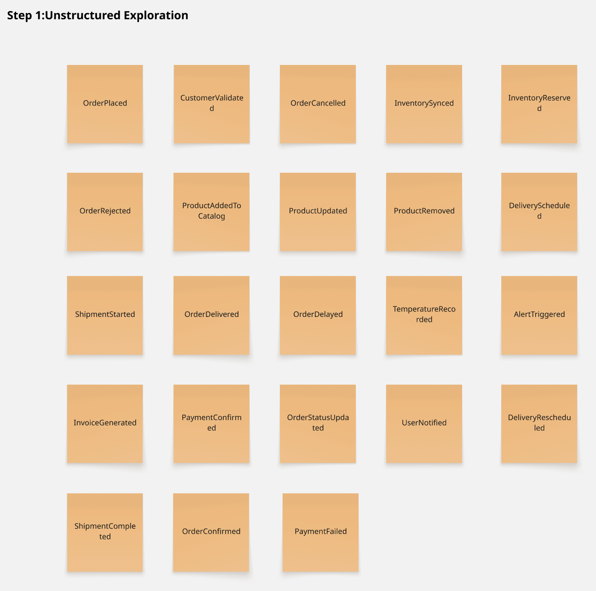
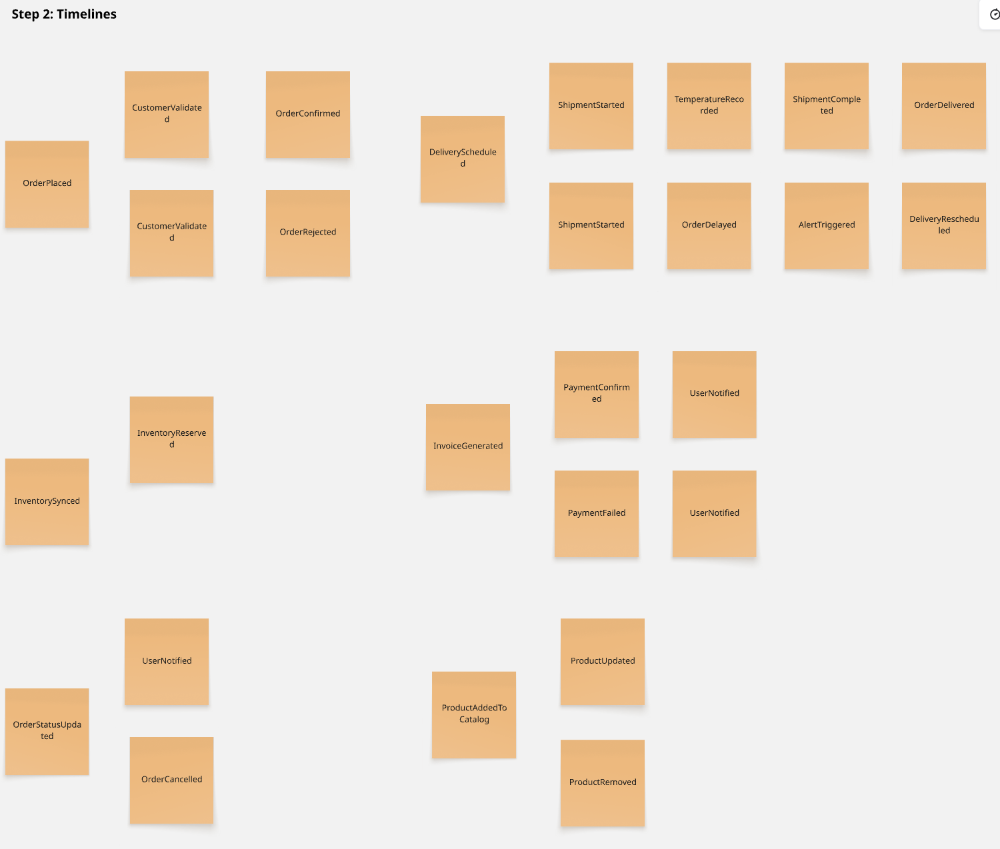
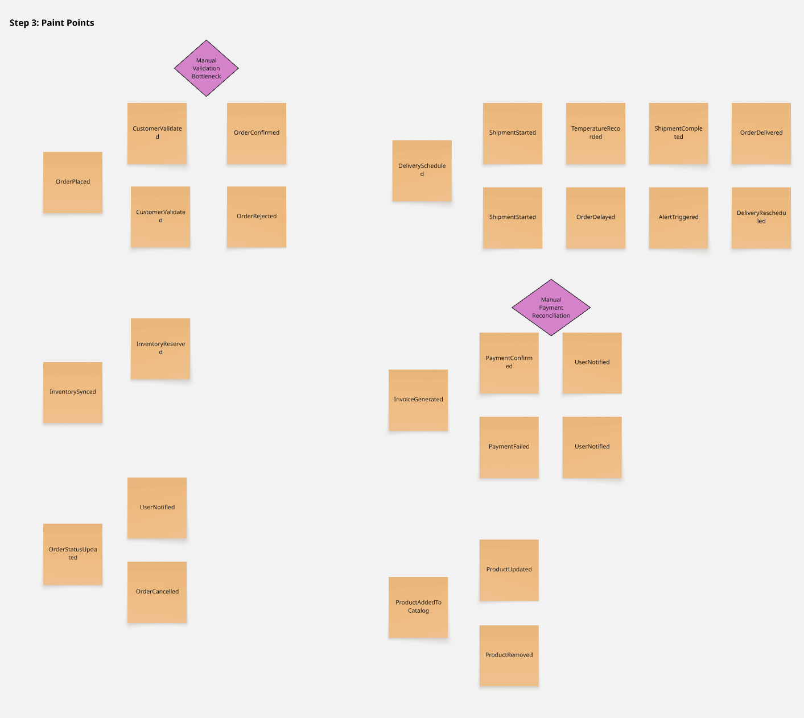

## **2.4. Big Picture EventStorming**

El Big Picture EventStorming de Nexa modela el flujo principal del pedido B2B de productos refrigerados, desde la intención de compra hasta el cierre de la entrega. Su propósito en esta etapa no es diseñar todavía la arquitectura técnica del sistema, sino hacer visible el recorrido del negocio, los actores que intervienen, los eventos más relevantes del dominio y los puntos de fricción que explican por qué el problema persiste.

El modelado mantiene la misma taxonomía canónica definida en el proyecto. En ese marco, el **S1** se expresa principalmente en la captura asistida y validación comercial; el **S2** en la coordinación logística, preparación, despacho, gestión de incidencias y cierre de entrega; y el **S3** en la consulta, envío y seguimiento del pedido por parte del comprador comercial. Las restricciones operativas del dominio permanecen visibles a lo largo del flujo, pero no redefinen la segmentación del informe.

El EventStorming se construyó como un ejercicio de síntesis del dominio a partir de la evidencia reunida en entrevistas, needfinding y análisis competitivo. En lugar de partir de pantallas o módulos, el equipo ordenó primero los hechos que modifican el estado del pedido y luego examinó qué actores, restricciones y tensiones aparecen en esas transiciones. Este enfoque resulta útil porque evita diseñar el sistema desde una lista de funcionalidades dispersas y obliga a pensar el producto como una secuencia coherente de eventos del negocio.

### ***2.4.1. Proceso de construcción del modelado***

*Big Picture EventStorming — Step 1: Exploration*

*Big Picture EventStorming — Step 2: Timeline*

*Big Picture EventStorming — Step 3: Pain Points*

*Proceso de construcción del modelado*

| Etapa | Propósito | Resultado obtenido |
| :--- | :--- | :--- |
| **1. Delimitación del flujo** | Definir qué tramo del negocio debía representarse en el MVP | Se acotó el modelado desde la intención de compra hasta el cierre de entrega |
| **2. Identificación de eventos** | Reconocer qué hechos cambian realmente el estado del pedido | Se consolidó la secuencia borrador → envío → validación → confirmación → preparación → despacho → entrega |
| **3. Asociación de actores e intervención** | Vincular cada cambio de estado con los responsables y momentos críticos del flujo | Se clarificó la participación de cliente comercial, coordinación comercial, operación y reparto |
| **4. Identificación de restricciones** | Hacer visibles las fricciones y condiciones operativas que impiden un flujo continuo | Se incorporaron validación comercial tardía, stock incierto, FEFO manual, visibilidad fragmentada y cierre débil de entrega |

> *Nota:* La tabla resume el proceso seguido para convertir evidencia cualitativa en un modelo de dominio entendible y útil para el MVP. Elaboración propia.

### ***2.4.2. Actores del dominio***

*Actores del dominio*

| Actor / rol operativo | Segmento asociado | Responsabilidad principal |
|---|---|---|
| Comprador comercial B2B | S3 | Consulta catálogo, arma solicitudes, revisa el estado del pedido, accede a documentos visibles y da seguimiento a la entrega. |
| Coordinación comercial | S1 | Recibe pedidos por portal, WhatsApp, llamada o Excel; identifica al cliente, valida condiciones comerciales y convierte solicitudes en pedidos confirmados. |
| Responsable comercial autorizado | S1 / S2 | Revisa bloqueos comerciales, observaciones, crédito, documentos requeridos y coordinación con operación antes de confirmar el pedido. |
| Operación / almacén | S2 | Controla disponibilidad real, reservas, lotes, vencimientos, criterios FEFO, preparación del pedido y prioridad de despacho. |
| Responsable de despacho | S2 | Prepara la salida, asigna ruta o responsable de entrega, actualiza estados operativos y registra incidencias de despacho. |
| Operations / Account Owner | S2 | Administra empresa, usuarios, accesos, configuración base, reglas internas, parámetros operativos y visibilidad general del tenant. |
| Reparto / transportista | S2 | Ejecuta la entrega, reporta incidencias y registra evidencia mínima de conformidad o proof of delivery. |

> *Nota:* La tabla de planteamiento de las responsabilidades en relación a un segmento asociado. Elaboración propia.

### ***2.4.3. Eventos del dominio y puntos de tensión principales***

*Eventos del dominio y puntos de tensión principales*

| Evento del dominio | Actores implicados | Tensión o implicancia observada |
|---|---|---|
| Solicitud de compra iniciada | S3, S1 | El pedido puede nacer desde el portal del comprador o desde canales informales atendidos por coordinación comercial. |
| Purchase Request registrada | S3, S1 | La información inicial puede llegar incompleta, duplicada o con observaciones no estructuradas. |
| Solicitud enviada para validación comercial | S1 | Empieza la revisión de cliente, crédito, stock preliminar, dirección, condiciones y documentos requeridos. |
| Solicitud validada o bloqueada | S1, S2 | Si crédito, stock o condiciones no son consistentes, la solicitud no debe convertirse todavía en pedido confirmado. |
| Purchase Order generada | S1, S2, S3 | La solicitud validada se convierte en pedido confirmado y deja trazabilidad del origen. |
| Inventario reservado o ajustado | S2 | La operación revisa disponibilidad real, lotes, vencimientos, temperatura y prioridad FEFO. |
| Pedido preparado para despacho | S2 | Aparecen tensiones de picking, lotes, faltantes, sustituciones y preparación física del producto. |
| Dispatch Order creada | S2 | Se organiza ruta, responsable, estado operativo, evidencias requeridas y condiciones de entrega. |
| Business Documents asociados | S1, S2 | Factura referencial, guía, XML, CDR, POD u otros documentos deben quedar vinculados al pedido. |
| Pedido despachado | S2, S3 | La visibilidad del estado se vuelve crítica para reducir llamadas, reclamos e incertidumbre del comprador. |
| Incidencia de ruta registrada | S2, S1, S3 | Una demora, rechazo, faltante o cambio debe comunicarse oportunamente para evitar pérdida de trazabilidad. |
| Entrega cerrada con evidencia | S2, S3 | El cierre con evidencia permite reducir reclamos abiertos y sostener confianza en el cumplimiento. |
| Pedido cancelado antes de despacho | S1, S2, S3 | La cancelación exige liberar reservas, ajustar continuidad operativa y comunicar el cambio al comprador. |

> *Nota:* Tabla de eventos relacionados a un actor implicado y una tensión o implicancia. Elaboración propia.

### ***2.4.4. Pain points y restricciones operativas identificadas***

*Pain points y restricciones operativas identificadas*

| Pain point o restricción | Dónde aparece | Efecto sobre el flujo |
|----------|------------|------------------|
| Validación comercial tardía | Entre envío y confirmación del pedido | Se prometen pedidos que luego deben corregirse o bloquearse |
| Stock poco confiable o poco visible | Antes de la confirmación y durante preparación | La disponibilidad percibida no coincide con la realidad operativa |
| Visibilidad fragmentada del estado | Entre confirmación, despacho e incidencia | Cada actor pierde contexto y aumenta la dependencia de llamadas o mensajes |
| Control FEFO manual o disperso | Durante preparación y despacho | El manejo de vencimientos depende de memoria operativa y revisiones paralelas |
| Cierre de entrega con evidencia insuficiente | Al final del flujo | Quedan reclamos, dudas sobre cumplimiento y poca trazabilidad del servicio |
| Dependencia de coordinación humana para destrabar el proceso | En todo el ciclo del pedido | El flujo no escala bien y se vuelve sensible a interrupciones y retrabajo |

### ***2.4.5. Comandos, políticas y read models del dominio***

A partir de los eventos y los pain points identificados, el Big Picture permite explicitar los **comandos** (intenciones que disparan cambios de estado), las **políticas** (reacciones automáticas del dominio ante ciertos eventos) y los **read models** (vistas de solo lectura que los actores necesitan para decidir). Esta explicitación refuerza la lectura del flujo sin introducir artefactos técnicos nuevos: se derivan únicamente de los eventos ya modelados.

| Comando (intención del actor) | Evento(s) que dispara | Política reactiva del dominio | Read Model que habilita la decisión |
|---|---|---|---|
| `CrearPurchaseRequest` (S3 / S1) | `PurchaseRequestRegistrada` | Si la solicitud proviene de canal informal, se registra el origen para mantener trazabilidad. | `CatálogoDisponibleParaCliente`, `FichaComercialDelCliente` |
| `EnviarSolicitudParaValidación` (S1) | `SolicitudEnviadaParaValidaciónComercial` | La solicitud queda pendiente hasta revisar cliente, crédito, stock preliminar, dirección y documentos requeridos. | `ResumenDeSolicitudPendiente` |
| `ValidarSolicitudComercial` (S1) | `SolicitudValidada` o `SolicitudBloqueada` | Si existen restricciones comerciales, la solicitud se bloquea y se comunica la observación. | `VistaDeCréditoYCondiciones`, `StockPreliminarPorCodigoInterno` |
| `ConvertirEnPurchaseOrder` (S1) | `PurchaseOrderGenerada` | La solicitud validada se convierte en pedido confirmado y se notifica al comprador. | `EstadoDelPedidoParaCliente`, `DetalleDePurchaseOrder` |
| `ReservarInventario` (S2) | `InventarioReservado` o `ReservaAjustada` | Se contrasta disponibilidad real con stock preliminar y se corrigen diferencias antes de preparar. | `StockRealPorCodigoInterno`, `ReservasPorPedido` |
| `AsignarLotesFEFO` (S2) | `LoteAsignado` | Se prioriza el lote con vencimiento más próximo apto para despacho. | `ListaDePickingFEFO` |
| `CrearDispatchOrder` (S2) | `DispatchOrderCreada` | Se define ruta, responsable, estado operativo y evidencias requeridas para la entrega. | `HojaDeRuta`, `PanelDeDespachos` |
| `AsociarBusinessDocuments` (S1 / S2) | `BusinessDocumentsAsociados` | Los documentos quedan vinculados al pedido para consulta interna y visibilidad del comprador cuando corresponda. | `RepositorioDocumentalDelPedido` |
| `ActualizarEstadoDeEntrega` (S2) | `PedidoDespachado` o `IncidenciaDeRutaRegistrada` | El estado se actualiza y se notifica a coordinación comercial y comprador cuando sea relevante. | `EstadoDeEntregaParaCliente`, `BitácoraDeIncidenciasPorPedido` |
| `CerrarEntregaConPOD` (S2) | `EntregaCerradaConEvidencia` | El pedido queda cerrado con evidencia mínima de conformidad o proof of delivery. | `EvidenciaDeEntrega`, `HistorialDelPedido` |
| `CancelarPedido` (S1 / S3) | `PedidoCancelado` | Se liberan reservas y se comunica la cancelación a los actores involucrados. | `EstadoDelPedidoParaCliente` |

Los comandos expresan la intención del actor; los eventos confirman que el estado efectivamente cambió; las políticas capturan las reacciones automáticas que el dominio debe sostener (reservas, validaciones, notificaciones, FEFO, liberación de stock); y los read models son las vistas consolidadas que permiten al S1, al S2 y al S3 decidir con información consistente. Juntos, cierran la secuencia del Big Picture como una cadena de *intención → hecho → reacción → visibilidad*, no como pantallas aisladas.

### ***2.4.6. Evidencia de colaboración del modelado***

  
  
> *Nota:* *Figura: Sesión colaborativa del equipo KING durante la construcción del Big Picture EventStorming. Elaboración propia.*

### ***2.4.7. Flujo resumido del dominio***

1. El comprador B2B consulta el catálogo y crea una solicitud desde el portal, o el S1 registra una solicitud recibida por WhatsApp, llamada o Excel.
2. El S1 identifica al cliente y revisa condiciones comerciales, crédito, observaciones, dirección, stock preliminar y documentos requeridos.
3. La solicitud pasa a validación comercial antes de convertirse en un pedido confirmado.
4. Si la validación es satisfactoria, el S1 convierte la solicitud en una Purchase Order con trazabilidad del origen.
5. El S2 revisa inventario real, reservas, lotes, vencimientos, criterios FEFO, temperatura y prioridad de despacho.
6. El S2 prepara el pedido y genera la Dispatch Order con ruta, responsable, estado operativo y evidencias requeridas.
7. El S1 y el S2 asocian los Business Documents necesarios para el seguimiento y cierre del pedido.
8. Durante el despacho, el S2 actualiza estados, registra incidencias y permite que el S3 consulte el avance.
9. La entrega se cierra con evidencia o POD, y el pedido queda concluido con historial trazable.

Este modelado refuerza dos ideas centrales del proyecto: el problema principal no está en un único “módulo” aislado, sino en la transición entre captura, validación, disponibilidad, despacho y cierre; y las restricciones operativas del dominio siguen siendo decisivas para definir reglas y criterios de funcionamiento a lo largo del flujo.

La principal contribución del EventStorming al capítulo no es solo ordenar nombres de eventos, sino mostrar que el valor del sistema depende de sostener continuidad entre estados. Si el pedido cambia de mano entre actores, pero el sistema no conserva reglas, evidencia y visibilidad comunes, el problema persiste aunque existan interfaces nuevas. En ese sentido, el modelado confirma que la unidad real de diseño no es una pantalla aislada, sino el tránsito completo del pedido entre S1, S2, S3 y las restricciones definidas por la operación.
