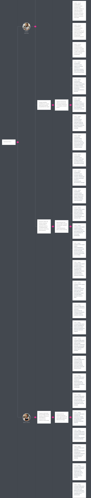
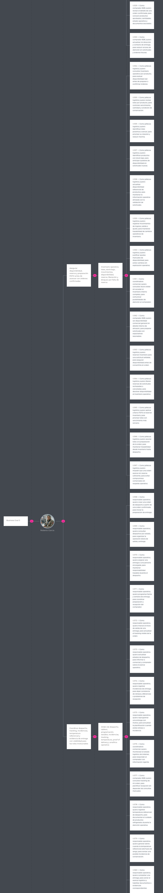
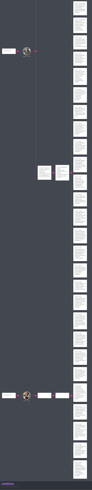

## 3.2. Impact Mapping

El mapa se organiza a partir del flujo principal de Nexa: consulta de catálogo, preparación de solicitudes, validación comercial, reserva de inventario, preparación FEFO, despacho trazable, documentación comercial y pago simulado. De esta forma, cada entregable funcional se relaciona con un impacto esperado y con historias de usuario verificables.

1. **Meta (Goal):** resultado de negocio que se desea alcanzar.
2. **Actor:** participante cuyo comportamiento puede acercar o alejar la meta.

**Business Goals SMART de Nexa**
*Impact Mapping de Nexa — Alineación de metas, actores e impactos del MVP*

| Business Goal ID | Business Goal SMART | Métrica de evaluación |
|---|---|---|
| BG01 | Alcanzar que al menos el 70% de las solicitudes B2B del piloto sean registradas o gestionadas desde Nexa durante los primeros 8 meses de operación, reduciendo la dependencia de WhatsApp, llamadas, papel y portales externos. | Porcentaje de solicitudes B2B registradas en Nexa sobre el total de solicitudes atendidas. |

### Impact Mapping

La lectura central del diagrama es que Nexa no persigue una optimización genérica de la cadena de frío, sino una reducción específica de fricción en el pedido y en su trazabilidad posterior. Esa definición es importante porque delimita alcance. El proyecto prioriza visibilidad comercial y operativa donde la investigación encontró mayor densidad de errores: captura informal del pedido, validación tardía de stock o condiciones, incertidumbre sobre la entrega y baja capacidad de cierre con evidencia trazable.

### Evidencia visual del Impact Mapping

| Business Goal SMART | Actor / Persona | Impact | Deliverable |
|---|---|---|---|---|
| Alcanzar que 500 clientes comerciales B2B realicen pedidos recurrentes a través de la plataforma de manera autónoma en los primeros 6 meses de lanzamiento. | Elena Litano — S3: Comprador B2B / cliente comercial | Migrar el hábito de compra de WhatsApp hacia la plataforma web, autogestionando requerimientos sin esperar confirmación manual. | Portal B2B con catálogo interactivo y sistema de envío. |

Una consecuencia relevante de esta lectura es que el mapa también justifica exclusiones. Quedan fuera del MVP inicial funcionalidades más amplias como analítica avanzada, optimización de rutas o automatizaciones secundarias porque, aunque puedan ser valiosas en el mediano plazo, no atacan primero el punto de quiebre identificado en la investigación: la discontinuidad entre captura, validación, abastecimiento y entrega. Mantener esa frontera fortalece la coherencia del capítulo, ya que el backlog deja de parecer una acumulación de ideas y se presenta como una secuencia argumentada de decisiones.

**Impact Mapping de Nexa**
Desde la lógica del informe, el Impact Mapping cumple así una función de bisagra. El Capítulo 2 demuestra dónde está el problema y quiénes lo experimentan con más intensidad; esta sección define qué cambios de comportamiento vale la pena provocar; y el Product Backlog de la sección 3.3 materializa ese razonamiento en un orden de construcción y liberación técnicamente ejecutable. Esa continuidad es la que permite leer el Capítulo 3 como especificación sustentada y no solo como inventario de historias.