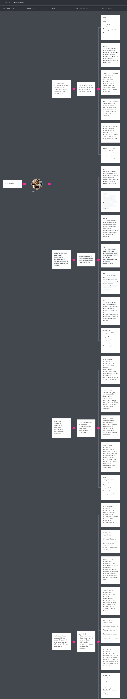

## 3.2. Impact Mapping

El Impact Mapping de Nexa conecta los objetivos de negocio del producto con los actores que habilitan el cambio esperado, los impactos observables, los entregables funcionales y las User Stories que permiten materializar la propuesta de valor. Esta sección permite validar que las funcionalidades priorizadas respondan a necesidades reales del negocio B2B de productos gourmet refrigerados y no únicamente a componentes de interfaz.

El mapa se organiza a partir del flujo principal de Nexa: consulta de catálogo, preparación de solicitudes, validación comercial, reserva de inventario, preparación FEFO, despacho trazable, documentación comercial y pago simulado. De esta forma, cada entregable funcional se relaciona con un impacto esperado y con historias de usuario verificables.

### Business Goals SMART

**Business Goals SMART de Nexa**

| Business Goal ID | Business Goal SMART | Métrica de evaluación |
|---|---|---|
| BG01 | Alcanzar que al menos el 70% de las solicitudes B2B del piloto sean registradas o gestionadas desde Nexa durante los primeros 8 meses de operación, reduciendo la dependencia de WhatsApp, llamadas, papel y portales externos. | Porcentaje de solicitudes B2B registradas en Nexa sobre el total de solicitudes atendidas. |
| BG02 | Reducir en 40% los errores de redigitación, datos comerciales incompletos o solicitudes sin trazabilidad durante los primeros 8 meses de operación piloto. | Cantidad de solicitudes observadas por errores de captura, cliente, cantidades o condiciones comerciales. |
| BG03 | Lograr que al menos el 80% de las órdenes confirmadas del piloto cuenten con reserva de inventario, preparación con criterio FEFO, tracking y evidencia de entrega registrada en Nexa durante los primeros 8 meses. | Porcentaje de órdenes confirmadas con reserva, preparación, tracking y proof of delivery registrados. |
| BG04 | Lograr que al menos el 75% de las órdenes cerradas del piloto cuenten con resumen de cobro, estado de pago simulado y documentos comerciales visibles desde Nexa durante los primeros 8 meses. | Porcentaje de órdenes cerradas con resumen de cobro, estado de pago y documentos visibles. |

### Impact Mapping

El Impact Mapping de Nexa relaciona cada objetivo de negocio con los actores que habilitan el cambio esperado, los impactos operativos, los entregables funcionales y las User Stories vigentes.

### Evidencia visual del Impact Mapping

**Impact Mapping de Nexa**

El Impact Mapping mantiene trazabilidad con el flujo funcional definido para Nexa y permite priorizar entregables que reducen dependencia de canales informales, redigitación comercial, quiebres de inventario, seguimiento logístico manual y baja visibilidad documental.

La lectura central del Impact Mapping es que Nexa organiza un flujo operativo completo: catálogo vigente, solicitud estructurada, validación comercial, reserva de inventario, preparación trazable, despacho con seguimiento, documentación visible y pago simulado. Esta relación permite que la priorización del Product Backlog se oriente primero a las historias que habilitan el flujo principal de negocio y luego a capacidades de administración, configuración y soporte operativo.
