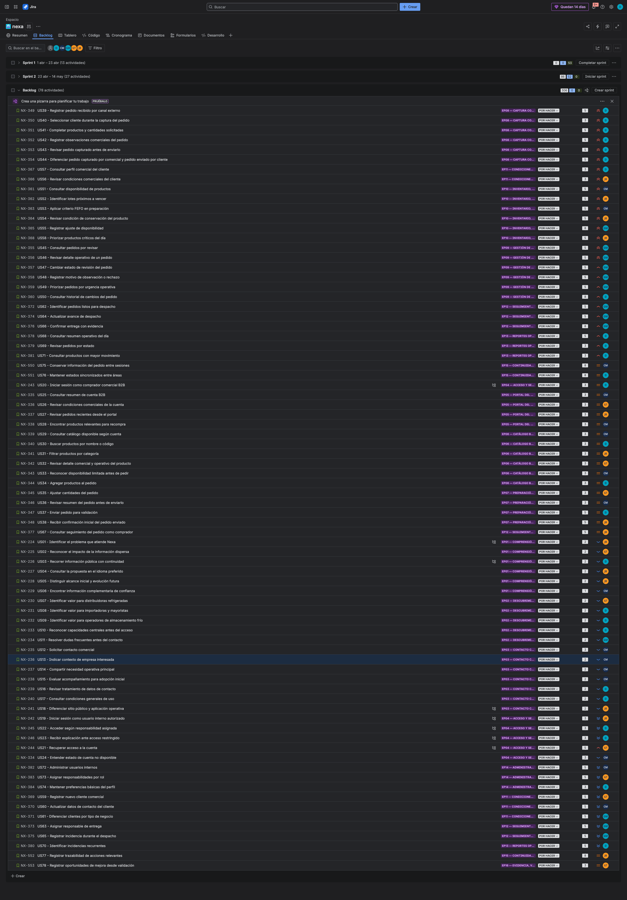

## 3.3. Product Backlog

El Product Backlog se ordena por valor de negocio y severidad del problema detectado, no por orden técnico de construcción. Las historias de autenticación, acceso y administración se consideran habilitadoras de plataforma; por ello se ubican después de los flujos funcionales principales de pedidos, visibilidad comercial, inventario, despacho y seguimiento.

**Product Backlog de Nexa**
La estimación utiliza la escala de **1, 2, 3, 5 y 8 Story Points**. **1 SP** representa contenido muy pequeño o información estática simple; **2 SP**, historias simples de baja interacción; **3 SP**, interacciones estándar o reglas de negocio simples; **5 SP**, flujos de varios pasos, validaciones o visibilidad entre áreas; y **8 SP**, historias complejas con trazabilidad, sincronización, continuidad, evidencia, FEFO o dependencia operativa fuerte.

| # Orden | User Story Id | Título | Descripción | Story Points (1 / 2 / 3 / 5 / 8) |
|---:|---|---|---|---:|
| 1 | US07 | Consultar catálogo gourmet autorizado | **Como** comprador B2B, **quiero** consultar el catálogo gourmet refrigerado autorizado para mi cuenta, **para** identificar productos disponibles antes de preparar una solicitud de compra. | 5 |
| 2 | US10 | Revisar ficha comercial del producto | **Como** comprador B2B, **quiero** revisar la ficha de un producto gourmet refrigerado, **para** decidir considerando precio, unidad, conservación, presentación y disponibilidad comercial. | 5 |
| 3 | US08 | Buscar productos por nombre comercial o código interno | **Como** comprador B2B, **quiero** buscar productos por nombre comercial o código interno, **para** encontrar con rapidez los productos que necesito reabastecer. | 2 |
| 4 | US09 | Filtrar productos por categoría gourmet | **Como** comprador B2B, **quiero** filtrar productos por categorías como quesos, charcutería, fiambres premium, lácteos gourmet o mantequillas especiales, **para** revisar grupos alineados a mi necesidad de compra. | 2 |
| 5 | US11 | Reconocer disponibilidad comercial limitada | **Como** comprador B2B, **quiero** reconocer cuándo un producto tiene disponibilidad comercial limitada, **para** evitar asumir que toda cantidad solicitada será confirmada automáticamente. | 2 |
| 6 | US62 | Ver disponibilidad comercial sin inventario interno | **Como** comprador B2B, **quiero** ver disponibilidad comercial general sin detalle interno de almacén, **para** preparar solicitudes con expectativas razonables. | 1 |
| 7 | US18 | Iniciar solicitud desde productos seleccionados | **Como** comprador B2B, **quiero** iniciar una solicitud con productos seleccionados del catálogo, **para** preparar un pedido sujeto a validación comercial. | 5 |
| 8 | US19 | Ajustar cantidades solicitadas | **Como** comprador B2B, **quiero** ajustar cantidades de cada producto, **para** adecuar la solicitud a la demanda real de mi negocio. | 5 |
| 9 | US20 | Registrar observaciones de compra | **Como** comprador B2B, **quiero** registrar observaciones sobre entrega, prioridad o condiciones esperadas, **para** ayudar a que la distribuidora evalúe mejor mi solicitud. | 2 |
| 10 | US21 | Revisar resumen antes de enviar solicitud | **Como** comprador B2B, **quiero** revisar productos, cantidades y total estimado antes de enviar una solicitud, **para** reducir errores de abastecimiento. | 5 |
| 11 | US22 | Enviar solicitud de compra | **Como** comprador B2B, **quiero** enviar mi solicitud de compra a la distribuidora, **para** recibir validación de disponibilidad, cliente y condiciones comerciales. | 8 |
| 12 | US23 | Recibir constancia de solicitud enviada | **Como** comprador B2B, **quiero** recibir una constancia inicial de solicitud enviada, **para** saber que aún no es una orden confirmada y que será revisada. | 2 |
| 13 | US24 | Consultar mis solicitudes | **Como** comprador B2B, **quiero** consultar mis solicitudes enviadas, **para** revisar su estado sin depender de llamadas o mensajes externos. | 5 |
| 14 | US25 | Revisar detalle de solicitud | **Como** comprador B2B, **quiero** revisar el detalle de una solicitud, **para** entender productos, observaciones, estado y acciones pendientes. | 5 |
| 15 | US26 | Responder observaciones comerciales | **Como** comprador B2B, **quiero** responder observaciones o ajustes solicitados por coordinación comercial, **para** desbloquear la evaluación de mi solicitud. | 5 |
| 16 | US27 | Cancelar solicitud no confirmada | **Como** comprador B2B, **quiero** cancelar una solicitud que aún no fue confirmada como orden, **para** evitar la atención de una compra que ya no necesito. | 5 |
| 17 | US31 | Revisar bandeja de solicitudes | **Como** coordinadora comercial, **quiero** revisar la bandeja de solicitudes de compra, **para** priorizar las solicitudes enviadas por compradores B2B. | 5 |
| 18 | US32 | Filtrar solicitudes por estado | **Como** coordinadora comercial, **quiero** filtrar solicitudes por estado, **para** atender primero las que requieren validación, ajuste o respuesta al comprador. | 2 |
| 19 | US12 | Consultar catálogo durante validación | **Como** coordinadora comercial, **quiero** consultar catálogo, precios y disponibilidad comercial visible, **para** validar solicitudes de compra con información alineada al producto ofrecido. | 1 |
| 20 | US33 | Validar datos comerciales del cliente | **Como** coordinadora comercial, **quiero** validar cliente, RUC y condiciones comerciales de una solicitud, **para** decidir si puede avanzar a evaluación operativa y posterior conversión a orden. | 5 |
| 21 | US34 | Consultar disponibilidad visible para validar | **Como** coordinadora comercial, **quiero** consultar disponibilidad comercial visible durante la validación, **para** comunicar al comprador si la solicitud requiere ajuste. | 5 |
| 22 | US35 | Solicitar ajuste al comprador | **Como** coordinadora comercial, **quiero** solicitar ajustes sobre productos, cantidades o datos, **para** completar solicitudes antes de rechazarlas o convertirlas en orden. | 5 |
| 23 | US40 | Mantener conversación con comprador | **Como** coordinadora comercial, **quiero** mantener mensajes asociados a solicitud u orden, **para** resolver dudas sin perder trazabilidad. | 2 |
| 24 | US36 | Rechazar solicitud con motivo | **Como** coordinadora comercial, **quiero** rechazar una solicitud con motivo claro, **para** cerrar solicitudes que no pueden atenderse sin dejar ambigüedad al comprador. | 5 |
| 25 | US37 | Confirmar validación comercial | **Como** coordinadora comercial, **quiero** confirmar que cliente y condiciones comerciales fueron validados, **para** habilitar la reserva operativa antes de la orden. | 5 |
| 26 | US54 | Consultar inventario operativo | **Como** jefatura logística, **quiero** consultar inventario operativo por producto, **para** evaluar disponibilidad real antes de preparar o confirmar órdenes. | 5 |
| 27 | US55 | Revisar detalle de lotes | **Como** jefatura logística, **quiero** revisar lotes por producto, **para** controlar vencimiento, cantidad y condición de conservación. | 2 |
| 28 | US61 | Consultar stock visible para comunicación | **Como** coordinadora comercial, **quiero** consultar stock visible sin acceder al inventario interno completo, **para** comunicar posibilidades de atención al comprador. | 2 |
| 29 | US63 | Reservar inventario para solicitud validada | **Como** jefatura logística, **quiero** reservar inventario para una solicitud validada, **para** asegurar disponibilidad antes de convertirla en orden. | 8 |
| 30 | US65 | Aplicar criterio FEFO en reserva | **Como** jefatura logística, **quiero** aplicar criterio FEFO al reservar inventario, **para** priorizar lotes con vencimiento más cercano. | 8 |
| 31 | US66 | Preparar orden con lotes trazables | **Como** jefatura logística, **quiero** asociar lotes a la preparación de la orden, **para** mantener trazabilidad desde inventario hasta despacho. | 5 |
| 32 | US67 | Bloquear confirmación sin reserva | **Como** jefatura logística, **quiero** impedir que una orden avance sin reserva suficiente, **para** evitar compromisos comerciales sin respaldo operativo. | 8 |
| 33 | US64 | Liberar reserva no confirmada | **Como** jefatura logística, **quiero** liberar reservas de solicitudes rechazadas o canceladas, **para** devolver disponibilidad al inventario operativo. | 2 |
| 34 | US58 | Actualizar inventario referencial | **Como** jefatura logística, **quiero** actualizar disponibilidad referencial de productos, **para** mantener la información operativa alineada con la validación de solicitudes. | 5 |
| 35 | US59 | Registrar movimiento de stock | **Como** jefatura logística, **quiero** registrar movimientos de ingreso, salida o ajuste, **para** mantener trazabilidad de cambios operativos de inventario. | 5 |
| 36 | US60 | Justificar ajuste de disponibilidad | **Como** jefatura logística, **quiero** justificar ajustes manuales de disponibilidad, **para** evitar cambios sin explicación operativa. | 5 |
| 37 | US56 | Identificar lotes próximos a vencer | **Como** jefatura logística, **quiero** identificar lotes próximos a vencer, **para** priorizar su rotación y reducir merma. | 1 |
| 38 | US57 | Consultar stock bajo | **Como** jefatura logística, **quiero** identificar productos con stock bajo, **para** anticipar quiebres de disponibilidad en solicitudes nuevas. | 1 |
|---|---|---|---|---:|
| 1 | US39 | Registrar pedido recibido por canal externo | Como coordinadora comercial, quiero registrar en Nexa un pedido recibido por conversación, llamada o coordinación directa, para evitar que la información quede dispersa fuera del flujo operativo. | 5 |
| 2 | US40 | Seleccionar cliente durante la captura del pedido | Como coordinadora comercial, quiero asociar cada pedido a un cliente comercial existente, para asegurar que las condiciones y datos de atención correspondan al comprador correcto. | 3 |
| 3 | US41 | Completar productos y cantidades solicitadas | Como coordinadora comercial, quiero registrar productos y cantidades solicitadas por el cliente, para trasladar el pedido a logística con información clara y verificable. | 5 |
| 4 | US42 | Registrar observaciones comerciales del pedido | Como coordinadora comercial, quiero agregar observaciones relevantes al pedido, para que logística comprenda condiciones, urgencias o acuerdos mencionados por el cliente. | 5 |
| 5 | US43 | Revisar pedido capturado antes de enviarlo | Como coordinadora comercial, quiero revisar el pedido capturado antes de enviarlo a revisión, para reducir errores de cliente, producto, cantidad o condiciones. | 5 |
| 6 | US44 | Diferenciar pedido capturado por comercial y pedido enviado por cliente | Como coordinadora comercial, quiero identificar si un pedido fue capturado internamente o enviado desde el portal B2B, para entender el origen de la solicitud y atenderla con el contexto adecuado. | 5 |
| 7 | US57 | Consultar perfil comercial del cliente | Como coordinadora comercial, quiero consultar el perfil de un cliente B2B, para atender sus pedidos considerando datos de contacto, tipo de negocio y relación comercial. | 3 |
| 8 | US56 | Revisar condiciones comerciales del cliente | Como coordinadora comercial, quiero revisar condiciones comerciales asociadas a un cliente, para validar si un pedido debe atenderse con crédito, pago al contado u otra condición. | 3 |
| 9 | US51 | Consultar disponibilidad de productos | Como jefatura logística, quiero consultar disponibilidad de productos, para validar si un pedido puede prepararse antes de confirmarlo al cliente. | 5 |
| 10 | US52 | Identificar lotes próximos a vencer | Como jefatura logística, quiero identificar lotes próximos a vencer, para priorizar su rotación y reducir riesgo de merma. | 5 |
| 11 | US53 | Aplicar criterio FEFO en preparación | Como jefatura logística, quiero considerar primero los productos con vencimiento más cercano, para preparar pedidos respetando una rotación adecuada. | 5 |
| 12 | US54 | Revisar condición de conservación del producto | Como jefatura logística, quiero consultar la condición de conservación de cada producto, para evitar preparar o despachar productos bajo condiciones incorrectas. | 5 |
| 13 | US55 | Registrar ajuste de disponibilidad | Como jefatura logística, quiero registrar ajustes de disponibilidad cuando se detecten diferencias, para mantener la información operativa lo más confiable posible. | 8 |
| 14 | US58 | Priorizar productos críticos del día | Como jefatura logística, quiero identificar productos que concentran riesgo operativo por baja disponibilidad, vencimiento cercano o demanda no atendida, para priorizar la revisión antes de confirmar nuevos pedidos. | 5 |
| 15 | US45 | Consultar pedidos por revisar | Como jefatura logística, quiero consultar los pedidos por revisar, para organizar la validación operativa sin depender de mensajes dispersos. | 5 |
| 16 | US46 | Revisar detalle operativo de un pedido | Como jefatura logística, quiero revisar el detalle completo de un pedido, para decidir si puede prepararse, observarse o rechazarse. | 5 |
| 17 | US47 | Cambiar estado de revisión del pedido | Como jefatura logística, quiero actualizar el estado de revisión de un pedido, para que coordinación comercial y comprador sepan si la solicitud avanza, requiere ajuste o no puede atenderse. | 5 |
| 18 | US48 | Registrar motivo de observación o rechazo | Como jefatura logística, quiero registrar el motivo por el que un pedido queda observado o rechazado, para que comercial pueda comunicarlo al cliente con claridad. | 5 |
| 19 | US49 | Priorizar pedidos por urgencia operativa | Como jefatura logística, quiero identificar pedidos con mayor urgencia o cercanía de atención, para organizar mejor la preparación del día. | 5 |
| 20 | US50 | Consultar historial de cambios del pedido | Como coordinadora comercial, quiero consultar los cambios relevantes de un pedido, para explicar al cliente qué ocurrió durante la revisión y preparación. | 8 |
| 21 | US62 | Identificar pedidos listos para despacho | Como responsable de despacho, quiero identificar pedidos listos para entrega, para organizar la distribución del día con información confiable. | 5 |
| 22 | US64 | Actualizar avance de despacho | Como responsable de despacho, quiero actualizar el avance de una entrega, para que comercial, logística y cliente conozcan el estado del pedido. | 5 |
| 23 | US66 | Confirmar entrega con evidencia | Como responsable de despacho, quiero registrar evidencia de entrega, para respaldar que el pedido fue atendido correctamente. | 8 |
| 24 | US68 | Consultar resumen operativo del día | Como jefatura logística, quiero consultar un resumen operativo del día, para priorizar pedidos, preparación, despacho e incidencias. | 5 |
| 25 | US69 | Revisar pedidos por estado | Como coordinadora comercial, quiero revisar pedidos agrupados por estado, para dar seguimiento a solicitudes por revisar, aprobadas, observadas o entregadas. | 3 |
| 26 | US71 | Consultar productos con mayor movimiento | Como coordinadora comercial, quiero identificar productos con mayor movimiento, para entender mejor la demanda de clientes B2B y anticipar necesidades comerciales. | 3 |
| 27 | US76 | Mantener estados sincronizados entre áreas | Como jefatura logística, quiero que los estados de los pedidos se mantengan actualizados para comercial y compradores, para evitar respuestas contradictorias durante la atención. | 8 |
| 28 | US20 | Iniciar sesión como comprador comercial B2B | Como comprador comercial B2B, quiero iniciar sesión en mi portal de cliente, para consultar catálogo, preparar pedidos y revisar el seguimiento de mis compras. | 3 |
| 29 | US25 | Consultar resumen de cuenta B2B | Como comprador comercial B2B, quiero revisar un resumen de mi cuenta, para identificar pedidos activos, condiciones comerciales y próxima atención. | 3 |
| 30 | US26 | Revisar condiciones comerciales de la cuenta | Como comprador comercial B2B, quiero revisar condiciones básicas asociadas a mi cuenta, para saber si mi compra depende de crédito, pago al contado u otra condición comercial. | 3 |
| 31 | US27 | Revisar pedidos recientes desde el portal | Como comprador comercial B2B, quiero revisar mis pedidos recientes, para consultar su estado sin depender de mensajes externos. | 3 |
| 32 | US28 | Encontrar productos relevantes para recompra | Como comprador comercial B2B, quiero encontrar productos relevantes para mi negocio al ingresar al portal, para iniciar compras recurrentes con menos esfuerzo. | 3 |
| 33 | US29 | Consultar catálogo disponible según cuenta | Como comprador comercial B2B, quiero consultar los productos disponibles para mi cuenta, para preparar pedidos con información clara y confiable. | 3 |
| 34 | US30 | Buscar productos por nombre o código | Como comprador comercial B2B, quiero buscar productos por nombre o código, para encontrar rápidamente lo que necesito comprar. | 3 |
| 35 | US31 | Filtrar productos por categoría | Como comprador comercial B2B, quiero filtrar productos por categoría, para revisar solo grupos de productos relacionados con mi necesidad de compra. | 3 |
| 36 | US32 | Revisar detalle comercial y operativo del producto | Como comprador comercial B2B, quiero revisar el detalle de un producto antes de agregarlo al pedido, para decidir considerando precio, conservación, unidad y disponibilidad. | 3 |
| 37 | US33 | Reconocer disponibilidad limitada antes de pedir | Como comprador comercial B2B, quiero reconocer cuándo un producto tiene disponibilidad limitada, para evitar asumir que la cantidad solicitada será confirmada automáticamente. | 3 |
| 38 | US34 | Agregar productos al pedido | Como comprador comercial B2B, quiero agregar productos disponibles a mi pedido, para construir una solicitud de abastecimiento desde el portal. | 3 |
| 39 | US35 | Ajustar cantidades del pedido | Como comprador comercial B2B, quiero ajustar cantidades de productos seleccionados, para adecuar el pedido a la demanda real de mi negocio. | 3 |
| 40 | US36 | Revisar resumen del pedido antes de enviarlo | Como comprador comercial B2B, quiero revisar productos, cantidades y total antes de enviar mi pedido, para reducir errores en la solicitud de abastecimiento. | 3 |
| 41 | US37 | Enviar pedido para validación | Como comprador comercial B2B, quiero enviar mi pedido para revisión de la distribuidora, para recibir confirmación sobre disponibilidad, condiciones y atención. | 5 |
| 42 | US38 | Recibir confirmación inicial del pedido enviado | Como comprador comercial B2B, quiero recibir una confirmación clara después de enviar mi pedido, para saber que la solicitud fue recibida y qué ocurrirá después. | 5 |
| 43 | US67 | Consultar seguimiento del pedido como comprador | Como comprador comercial B2B, quiero consultar el avance de mis pedidos, para planificar recepción y reducir consultas repetitivas a la distribuidora. | 5 |
| 44 | US75 | Conservar información del pedido entre sesiones | Como comprador comercial B2B, quiero que la información de mis pedidos enviados se conserve cuando vuelva a ingresar, para consultar seguimiento o historial sin repetir solicitudes. | 8 |
| 45 | US01 | Identificar el problema que atiende Nexa | Como visitante comercial, quiero identificar qué problema operativo atiende Nexa, para decidir si la solución se relaciona con los pedidos refrigerados de mi negocio. | 2 |

### Síntesis del Product Backlog

### Evidencia del Product Backlog en Jira

El backlog prioriza el flujo de negocio que permite pasar de la consulta de productos a una solicitud enviada, validada y convertida en orden, con disponibilidad revisada, pago representado dentro del alcance del prototipo, despacho, evidencia de entrega y documentos visibles para los actores correspondientes. Esta organización evita colocar primero capacidades internas o administrativas que no representan el valor principal percibido por el comprador B2B.
El Product Backlog de Nexa se gestiona en Jira como herramienta de seguimiento del proyecto. La vista permite observar las historias de usuario priorizadas por valor de negocio, su estado, responsable, épica asociada y estimación en Story Points. Esta evidencia complementa la tabla redactada en el reporte, donde se mantiene la descripción formal de cada User Story y su estimación.

> *Nota:* La evidencia visual de Jira respalda la existencia del Product Backlog en la herramienta de gestión; la tabla principal de la sección 3.3 conserva la especificación textual exigida para las User Stories, su descripción y sus Story Points. Elaboración propia.
