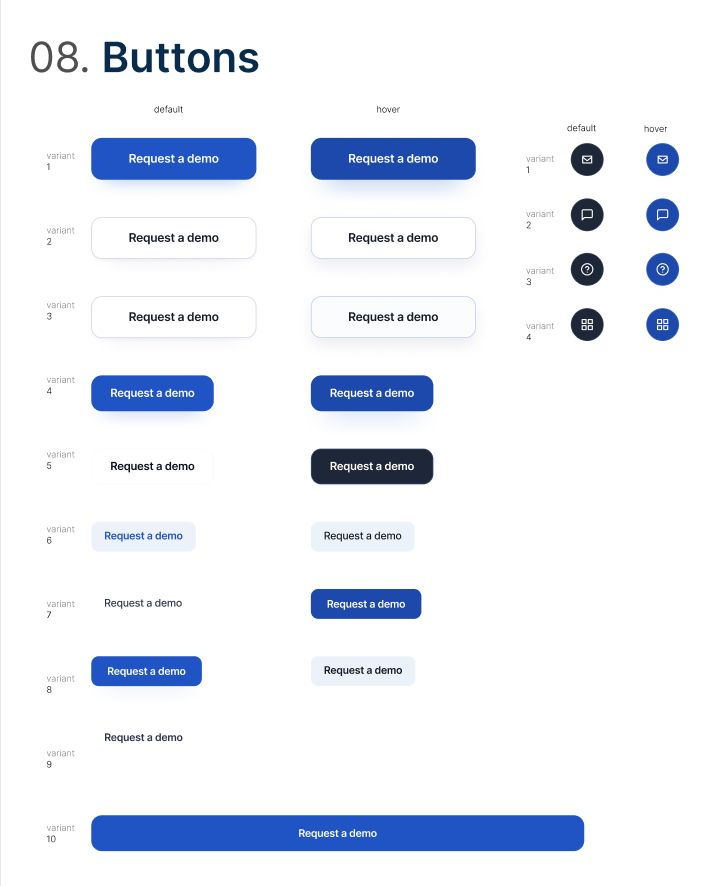

# Capítulo IV: Product Design

El Capítulo IV documenta la transición desde el descubrimiento del dominio hacia la materialización visual, funcional y arquitectónica de Nexa. En esta sección se establecen los criterios estéticos, las estructuras de información y las decisiones de diseño que permiten representar de forma coherente el flujo comercial-operativo de la plataforma.
El Capítulo IV representa la transición desde la fase de descubrimiento hacia la materialización visual y arquitectónica de la plataforma. En esta sección se documentan los criterios estéticos, las estructuras de información y las decisiones de diseño que permiten transformar los Bounded Contexts identificados en el dominio en una solución digital coherente. Nexa se construye como un ecosistema de tres superficies complementarias: una landing page pública, una webapp operativa interna y un portal B2B para compradores comerciales. Cada superficie comparte un lenguaje visual común pero se adapta al contexto de uso específico.

## 4.1. Style Guidelines

El sistema visual de Nexa se organiza mediante design tokens, criterios tipográficos, patrones de interacción, lineamientos de espaciado y assets reutilizables. Estos lineamientos funcionan como fuente común para mantener consistencia entre la Landing Page, la Web Application interna y el Buyer Portal.

Las superficies del producto se diferencian de la siguiente manera:

- La **Landing Page pública** comunica valor, confianza y especialización SaaS B2B para empresas de cadena de frío.
- La **Web Application interna** atiende a S1 — Commercial Coordination y S2 — Operations / Account Owner. S1 incluye a la coordinadora comercial; S2 incluye a jefatura logística, responsable operativo y company owner.
Nexa utiliza un sistema visual unificado que se adapta según la superficie del producto. Las tres superficies comparten ADN visual (familia cromática, tipografía, espaciado y patrones de componentes), pero difieren intencionalmente en densidad, escala y tono comunicacional:

- **Landing Page** — superficie editorial y de conversión. Usa tipografía de mayor escala, CTAs promocionales y composiciones de baja densidad para comunicar valor.
- **Webapp Operativa (Ops)** — superficie de trabajo interno para coordinación comercial y logística. Usa controles compactos, tablas, formularios, drawers y dashboards con alta densidad informativa.
- **Portal B2B** — superficie para compradores comerciales. Combina claridad de catálogo con funcionalidad transaccional para pedidos y seguimiento.

### 4.1.1. General Style Guidelines

#### Branding

Nexa proyecta una identidad SaaS B2B especializada en cadena de frío. Su marca debe comunicar confianza, trazabilidad, control operativo y claridad comercial, evitando una estética genérica de ERP o una apariencia excesivamente promocional. El valor visual de Nexa está en mostrar continuidad entre la solicitud del comprador, la validación comercial, la reserva de inventario, el despacho, los documentos comerciales, el proceso de pago simulado y el seguimiento de la orden.

La identidad visual se apoya en una base azul, superficies limpias, jerarquía clara y estados semánticos visibles. Esta combinación permite que la plataforma sea percibida como una herramienta confiable para coordinar pedidos B2B refrigerados sin perder la precisión operativa necesaria en inventario, FEFO, temperatura, evidencia de entrega y documentos.

La marca debe sostener tres principios:

- **Claridad comercial:** el comprador y la coordinadora comercial deben comprender productos, solicitudes, órdenes, cobros referenciales y documentos sin ambigüedad.
- **Control operativo:** la jefatura logística, el responsable operativo y el company owner deben identificar estados, reservas, alertas, incidencias y configuraciones sin fricción.
- **Continuidad del flujo:** cada superficie debe reforzar que Nexa conecta catálogo, promociones, solicitudes, órdenes, inventario, despacho, tracking, evidencia, pago simulado y cierre documental.
El sistema visual de Nexa se implementa mediante Design Tokens en CSS nativo (`tokens.css`), lo que permite gestionar cambios globales desde un único punto de verdad. Los tokens cubren color, tipografía, espaciado, radios y sombras, y se consumen tanto en la landing como en la webapp.

La arquitectura de tokens facilita:

#### Color Palette

La paleta se organiza en cinco grupos funcionales: marca primaria, base/superficie, texto, estados semánticos y acentos de interacción.

*Sistema de Colorimetría Nexa*

> *Nota:* Especificación de Brand Colors, Text Colors y Status Colors. Elaboración propia.
Especificación de Brand Colors, Text Colors y Status Colors. Elaboración propia.

|---|---|---|---|---|
| Primary Blue | `#2563EB` / familia azul Nexa | Marca, CTAs, enlaces activos y acciones principales | Botones principales, enlaces destacados, acentos de sección | Acciones primarias, estados activos, navegación, filtros seleccionados |
| Primary Hover / Dark Blue | `#1D4ED8` / tonos oscuros de marca | Jerarquía, hover, headers oscuros y contraste | Navbar, footer, hover de CTA | Sidebar, topbar, foco activo, estados de navegación |
| Warm Off-White | `#F9F7F4` / base cálida | Fondo general y descanso visual | Background de secciones claras | Fondo de workspace y paneles secundarios |
| Surface White | `#FFFFFF` | Contenedores, cards y formularios | Cards de beneficios, cards de flujo, bloques de contenido | Cards de métricas, formularios, tablas y paneles de detalle |
| Neutral Grey | Escala `#E5E7EB` a `#111827` | Bordes, labels, texto secundario y jerarquía textual | Subtítulos, separadores, textos descriptivos | Labels, bordes de tabla, metadata, estados inactivos |
| Primary Blue | Marca, CTAs, estados activos | Hero buttons, enlaces principales | Botones de acción, sidebar activo, badges | Misma familia cromática |
| Warm Off-White | Fondo base, descanso visual | Background de secciones claras | Background de contenido principal | Base cálida compartida |
| Neutral Grey | Texto secundario, bordes sutiles | Subtítulos, separadores | Labels, bordes de tabla, texto guía | Escalas similares |
| Dark Surface | Navbar, footer, contraste | Header y footer del sitio | Sidebar colapsado, overlays | Tono oscuro compartido |
| Status: Optimal | Confirmación, éxito | Badges de disponibilidad | Stock OK, pedido confirmado, entrega exitosa | Verde semántico |
| Status: Critical | Error, ruptura, alerta | — | Stock agotado, validación fallida, temperatura fuera de rango | Rojo semántico |
| Status: Warning | Atención, riesgo moderado | — | Lote próximo a vencer, crédito limitado | Ámbar semántico |

#### Typography

Nexa utiliza una combinación tipográfica orientada a claridad, jerarquía visual y lectura rápida de información operativa. La Landing Page usa mayor escala y peso visual para comunicar valor; la Web Application utiliza tamaños más compactos para soportar tablas, formularios, estados y dashboards.

*Sistema Tipográfico Nexa*

> *Nota:* Definición de jerarquías para Display, Headings, Body y Mono. Elaboración propia.

| Nivel | Familia principal | Uso en Landing Page | Uso en Web Application |
|---|---|---|---|
| Display / Hero | Plus Jakarta Sans / Inter fallback | Títulos hero, titulares de alto impacto y mensajes de conversión | No aplica como patrón dominante |
| Heading | Plus Jakarta Sans / Inter fallback | Títulos de sección, bloques de propuesta de valor | Títulos de módulo, encabezados de páginas y cards |
| Body | Inter | Párrafos, descripciones, FAQ y textos editoriales | Labels, contenido de tabla, formularios, descripciones y mensajes de ayuda |
| Label / Caption | Inter | Microcopy de CTA, etiquetas de sección y textos secundarios | Badges, metadata, estados, filtros y mensajes de validación |
| Mono / Technical | JetBrains Mono / Fira Code fallback | Códigos o referencias puntuales si aplica | Códigos internos de producto, códigos de lote, timestamps, identificadores de pedido, referencias documentales y datos técnicos de trazabilidad |

La jerarquía tipográfica se adapta al contexto de uso:

- La **Landing Page** prioriza impacto visual con títulos grandes, espaciado amplio y secciones de baja densidad.
- La **Web Application interna** prioriza legibilidad funcional con headings entre 18px y 32px, body entre 13px y 16px, captions de 12px y uso monoespaciado solo para datos técnicos.
Definición de jerarquías para Display, Headings, Body y Mono. Elaboración propia.

| Nivel | Familia | Uso en Landing | Uso en Webapp |
|---|---|---|---|
| Display / Hero | Inter (700–800) | Títulos hero, `clamp(46px, 5.8vw, 84px)` | — |
| Heading | Inter (600–700) | Títulos de sección | Títulos de módulo, encabezados de card |
| Body | Inter (400) | Párrafos, descripciones | Labels, contenido de tabla, descripciones |
| Label / Caption | Inter (500) | Micro-copy de CTA | Badges, estados, metadata |

### 4.1.2. Web Style Guidelines

#### Components and UI Patterns

*Botones y Componentes Nexa*

> *Nota:* Variantes de botones primarios, secundarios y estados. Elaboración propia.

Los componentes deben representar entidades reales del dominio: catálogo gourmet, promociones, solicitudes, órdenes, clientes B2B, inventario, reservas, lotes FEFO, despacho, tracking, temperatura, evidencia de entrega, cobro referencial, documentos comerciales y estado de pago.

#### Shared Patterns

| Patrón | Comportamiento | Propósito | Ejemplos en Nexa |
|---|---|---|---|
| Botón primario | Fondo azul primario, texto blanco, hover oscuro y foco visible | Ejecutar la acción principal del contexto | Enviar solicitud, confirmar validación comercial, reservar inventario, registrar despacho |
| Botón secundario | Fondo claro o transparente, borde visible y texto de alto contraste | Ofrecer acciones alternativas sin competir con la principal | Guardar borrador, revisar detalle, descargar documento, volver al catálogo |
| Cards / Surfaces | Fondo blanco, border-radius consistente, sombra sutil y separación clara | Agrupar información relacionada | Producto gourmet, promoción activa, resumen de orden, estado de despacho, cobro referencial |
| Form fields | Borde neutro, label visible, placeholder breve y focus ring azul | Reducir errores de entrada y orientar la captura de datos | Cliente B2B, código interno, cantidad, lote, temperatura, motivo de incidencia |
| Status badges | Color semántico + texto corto y contrastado | Comunicar estado sin depender solo del color | En revisión comercial, orden confirmada, inventario reservado, en preparación, en tránsito |
| Tables | Cabeceras claras, filas densas, acciones por fila y filtros | Revisar información operativa de alto volumen | Solicitudes, órdenes, clientes B2B, inventario, reservas, dispatch orders, documentos |
| Drawers / Modals | Contenido contextual sin abandonar el flujo principal | Ver detalle, editar o confirmar acciones | Detalle de solicitud, ajuste de reserva, evidencia de entrega, documentos comerciales |
| Empty states | Mensaje breve + siguiente acción sugerida | Orientar al usuario cuando no hay datos cargados | Sin solicitudes registradas, sin promociones activas, sin documentos disponibles |
| Alerts | Título, explicación y acción recomendada | Comunicar bloqueos, advertencias o confirmaciones | Lote próximo a vencer, incidencia registrada, stock agotado, pago simulado rechazado |

#### Surface Variations

| Componente | Landing Page | Web Application interna | Buyer Portal |
|---|---|---|---|
| CTA principal | Botón alto, texto comercial y orientación a contacto o acceso | Botón compacto con acción operativa específica | Botón directo para solicitar, revisar tracking o consultar documentos |
| Cards | Comunican beneficios, dolores, soluciones y cobertura del sistema | Muestran métricas, entidades, estados y resúmenes de operación | Presentan productos, promociones, órdenes y documentos visibles |
| Navegación | Navbar horizontal con secciones de contenido y acceso a plataforma | Sidebar o navegación por módulos de negocio | Navegación simple por catálogo, solicitudes, órdenes, documentos y perfil |
| Tablas | Uso limitado | Componente central para solicitudes, órdenes, clientes, inventario, reservas y dispatch orders | Uso moderado para historial de solicitudes, órdenes y documentos |
| Formularios | Formularios de contacto o solicitud comercial | Captura y validación de solicitudes, clientes, inventario, documentos y configuración | Solicitud de compra, perfil del comprador, dirección de entrega y preferencias |
| Drawers / Modals | Uso limitado o no dominante | Detalle de entidad, edición rápida y confirmación de acciones | Detalle de pedido, evidencia visible, documento comercial o resumen de pago |
| Badges / Estados | Uso moderado para reforzar confianza | Uso frecuente para solicitudes, inventario, temperatura, despacho, documentos y pago | Uso claro y simple para solicitud, tracking, documentos y estado de pago |
Variantes de botones primarios, secundarios y estados. Elaboración propia.

#### Patrones compartidos
|---|---|
| Navegación | Icono + label textual para reducir ambigüedad |
| Estados | Icono opcional acompañado de badge o texto |
| Acciones | Iconos reconocibles para editar, ver detalle, filtrar, descargar o confirmar |
| Operación | Iconos asociados a catálogo, solicitudes, órdenes, inventario, despacho, documentos, tracking y pago |
| Accesibilidad | No depender únicamente del icono para comunicar significado |

| Botón primario | Fondo azul primario, texto blanco, border-radius consistente |
| Botón secundario | Borde azul, fondo transparente o claro |
| Cards / Surfaces | Fondo blanco, border-radius redondeado, sombra sutil |
| Form fields | Borde gris, texto guía en gris medio, focus ring azul |
| Status badges | Color semántico + texto en contraste |
|---|---|---|
| 1.4.3 Contrast (Minimum) | Textos principales con contraste suficiente sobre fondos claros y oscuros | Lectura de catálogo, tablas, estados, documentos y resúmenes de pago |
| 2.1.1 Keyboard Accessible | Navegación por teclado en enlaces, botones, formularios y controles principales | Validación de solicitudes, filtros, formularios de clientes B2B y documentos |
| 2.4.4 Link Purpose | Labels y textos de enlace comprensibles sin depender solo del contexto visual | Acciones como ver detalle, descargar documento, revisar tracking o consultar pago |
| 1.4.11 Non-text Contrast | Bordes, focus rings, estados y controles visibles con contraste adecuado | Formularios, botones, badges, tablas, drawers y modals |
| 3.3.1 Error Identification | Mensajes de error claros en formularios y validaciones | Código interno no encontrado, cantidad inválida, stock agotado, incidencia sin motivo |
| 3.3.2 Labels or Instructions | Campos con labels visibles, instrucciones breves y placeholders no críticos | Solicitud de compra, reserva de inventario, temperatura, documento comercial y perfil del comprador |

Los estados críticos no deben comunicarse únicamente mediante color. Cada badge, alerta o validación debe incluir texto breve y comprensible, por ejemplo: `En revisión comercial`, `Orden confirmada`, `Inventario reservado`, `Lote próximo a vencer`, `En preparación`, `En tránsito`, `Entrega cerrada`, `Pago simulado`, `Documentos disponibles` o `Incidencia registrada`, según corresponda al flujo de negocio.

| CTA principal | Botón alto (48–56px), texto promocional, a veces con icono | Botón compacto (36–40px), texto de acción operativa |
| Cards | Comunican valor, beneficios, propuesta | Muestran métricas, KPIs, resumen de entidad |
| Navegación | Navbar horizontal con dropdown de soluciones | Sidebar vertical con módulos agrupados por dominio |
| Tablas | No aplica | Componente central: filas densas, filtros, ordenamiento |
| Drawers/Modals | No aplica | Detalle de entidad, formularios de edición rápida |
| Badges/Estados | Mínimo (disponibilidad) | Frecuente (estados de pedido, stock, temperatura, crédito) |

---

#### Responsive and Surface Adaptation

El sistema de diseño opera sobre una rejilla de 12 columnas con breakpoints para Desktop HD (1440px), Desktop (1024px), Tablet (768px) y Mobile (375px).

*Sistema de Rejilla y Breakpoints*

Dimensionamiento para Desktop HD, Desktop y Tablet. Elaboración propia.

*Escala de Espaciado*

Escala basada en múltiplos de 4px, desde 4px hasta 96px. Elaboración propia.

**Comportamiento responsive por superficie:**

- **Landing**: responsive completo con menú mobile colapsable, hero adaptativo y secciones que pasan de multi-columna a stack vertical.
- **Webapp**: diseñada primariamente para desktop/tablet en contexto de estación de trabajo; en mobile, el sidebar colapsa y las tablas adoptan scroll horizontal o vista de tarjeta compacta.
- **Portal B2B**: responsive orientado a tablet y mobile para compradores que consultan desde dispositivo.

Los componentes interactivos respetan una altura mínima de 44px en superficies táctiles, anticipando uso con guantes en entornos refrigerados. La evidencia visual se concentra en los paneles de estilo y en los artefactos de wireframes/mockups documentados en las secciones siguientes.
