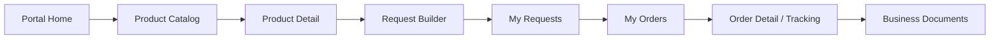

## 4.2. Information Architecture

La arquitectura de información de Nexa organiza el contenido y los flujos de interacción alrededor de tres superficies complementarias: el sitio público o Landing Page, la Web Application interna y el Buyer Portal. Esta organización responde al modelo SaaS B2B del producto: una empresa importadora o distribuidora de cadena de frío contrata Nexa y habilita usuarios internos y externos dentro de un mismo ecosistema operacional.

Para mantener consistencia con los segmentos definitivos del proyecto, la información no se organiza únicamente por pantallas, sino por responsabilidades de negocio. **S1 — Commercial Coordination** utiliza la consola interna para recibir solicitudes, validar clientes, revisar condiciones comerciales, convertir solicitudes en órdenes de compra y gestionar documentos comerciales. **S2 — Operations / Account Owner** utiliza la consola interna para controlar inventario, lotes, reservas, despacho, evidencias, promociones, portales externos y administración de la empresa contratante. **S3 — B2B Buyer Portal** utiliza el portal para consultar catálogo, construir solicitudes, revisar pedidos, acceder a documentos y seguir el estado de entrega.

```mermaid
flowchart LR
    S3["S3 — B2B Buyer Portal<br/>Catálogo, solicitud, pedidos, documentos y seguimiento"]
    S1["S1 — Commercial Coordination<br/>Validación, clientes, solicitudes de compra, órdenes de compra y documentos comerciales"]
    S2["S2 — Operations / Account Owner<br/>Inventario, órdenes de despacho, POD, analítica, promociones y administración de empresa"]

    S3 -->|"envía solicitud o consulta estado"| S1
    S1 -->|"valida y convierte en orden de compra"| S2
    S2 -->|"prepara despacho, evidencia y trazabilidad"| S3
    S2 -->|"actualiza disponibilidad y documentos"| S1

### 4.2.1. Organization Systems

La arquitectura de información de Nexa combina distintos sistemas de organización para responder a la naturaleza del producto. La Landing Page necesita una estructura clara para comunicar valor; la Web Application interna requiere vistas densas y filtrables para S1 y S2; y el Buyer Portal necesita un flujo secuencial que permita al comprador B2B avanzar desde el catálogo hasta el seguimiento de su orden.

| Sistema de organización | Uso en Nexa | Superficie |
|---|---|---|
| Jerárquico | Landing Page: Home > Solutions > página específica | Landing Page |
| Secuencial | Catálogo > detalle > request builder > solicitud > orden > tracking | Buyer Portal |
| Matricial | Filtros por estado, cliente, fecha, lote, documento o responsable | Web Application interna |
| Por audiencia | S1, S2 y S3 según responsabilidad de negocio | Todas |
| Por tópicos | Platform, Solutions, Company, FAQ | Landing Page |
| Cronológico | Solicitudes, órdenes, despachos y documentos por fecha | Web Application / Buyer Portal |
| Alfabético | Clientes B2B, productos y documentos cuando aplique | Web Application / Buyer Portal |

#### Landing Page — Organización jerárquica con apoyo matricial

El sitio público presenta una arquitectura jerárquica de dos niveles. El punto de entrada es la página principal, desde la cual el visitante accede a las áreas troncales **Platform**, **Solutions**, **Company** y **FAQ**. Dentro de **Solutions**, la navegación se orienta por tipo de operador de cadena de frío: **Importers & Wholesalers**, **Distributors** y **Cold Storage Operators**.


```mermaid
graph TD
    Home["Home / index.html"] --> Platform["Platform"]
    Home --> Solutions["Solutions Hub"]
    Home --> Company["Company"]
    Home --> FAQ["FAQ"]
    Home --> Legal["Legal Pages"]

    Solutions --> Importers["Importers & Wholesalers"]
    Solutions --> Distributors["Distributors"]
    Solutions --> Storage["Cold Storage Operators"]

    Legal --> Terms["Terms"]
    Legal --> Privacy["Privacy"]
    Legal --> Cookies["Cookies"]
```

La profundidad máxima de navegación comercial es de dos niveles (`Home > Solutions > Distributors`), lo que favorece rapidez de acceso y reduce carga cognitiva. Las páginas legales se ubican como soporte desde el footer y no forman parte del flujo principal de conversión. Las llamadas a la acción conectan el descubrimiento del producto con la solicitud de demostración o el ingreso a la Web Application.

#### Web Application interna — Organización funcional por capacidades de negocio

La Web Application interna se organiza mediante un sidebar persistente y rutas agrupadas por responsabilidad de negocio. Esta estructura permite que S1 y S2 trabajen sobre el mismo tenant sin mezclar sus responsabilidades principales.

| Segmento | Grupo funcional | Módulos principales | Propósito |
|---|---|---|---|
| S1 — Commercial Coordination | Commercial | Commercial Dashboard, Product Catalog, Purchase Requests, Purchase Orders, Manual Order Entry, B2B Clients, Business Documents | Recibir, validar, convertir y documentar pedidos B2B |
| S2 — Operations / Account Owner | Operations | Operations Dashboard, Inventory Control, Inventory Lots, Dispatch Orders, Proof of Delivery, Operational Analytics, Business Documents, Promotions, Customer Portals, Company Administration | Controlar inventario, despacho, evidencias, operación, cuenta y configuración de empresa |
| S1 / S2 | Shared account area | Profile | Mantener información del usuario autenticado dentro del tenant |

La separación por grupos no implica aplicaciones distintas. Ambos segmentos internos utilizan la misma consola, pero la navegación se filtra según rol, responsabilidad y scope operativo.

#### Buyer Portal — Organización transaccional orientada al comprador

El Buyer Portal se organiza alrededor del flujo de abastecimiento de S3. La estructura prioriza la autonomía del comprador para consultar productos, armar una solicitud, revisar su historial, acceder a documentos y seguir el estado de sus pedidos.

| Etapa | Módulo del portal | Propósito para S3 |
|---|---|---|
| Descubrimiento | Home, Product Catalog, Premium | Revisar productos disponibles, promociones y catálogo visible |
La profundidad máxima es de dos niveles (`Home > Solutions > Distributors`), lo que favorece rapidez de acceso y reduce carga cognitiva. Varias páginas incluyen CTAs cruzados hacia Company, FAQ y el hub de Solutions, combinando la base jerárquica con accesos laterales que aceleran la exploración.

#### Route Architecture and Navigation Storytelling

La arquitectura de rutas se organiza por experiencia y capacidad de negocio, agrupando autenticación, consola interna y portal comprador. Las rutas principales se documentan como rutas canónicas porque comunican mejor las capacidades actuales del producto, no como pantallas aisladas.

La webapp utiliza Vue Router con hash history (necesario para despliegue en GitHub Pages sin rewrite de rutas). Las rutas se agrupan por experiencia, no por página arbitraria:
|---|---|---|---|---|
| Auth | `/auth/login` | S1, S2, S3: B2B Buyer Portal | Acceso autenticado | Entrada al sistema y selección de experiencia según scope |
| Auth | `/auth/recover` | S1, S2, S3: B2B Buyer Portal | Recuperación de acceso | Soporte para credenciales |
| Auth | `/auth/blocked` | S1, S2, S3: B2B Buyer Portal | Acceso bloqueado | Informar bloqueo de cuenta o acceso restringido |
| Auth | `/auth/forbidden` | S1, S2, S3: B2B Buyer Portal | Acceso no autorizado | Informar que el usuario no tiene permisos para la vista solicitada |
| Ops | `/ops/commercial/dashboard` | S1: Commercial Coordination | Dashboard comercial | Lectura rápida de solicitudes, órdenes bloqueadas y documentos por revisar |
| Ops | `/ops/product-catalog` | S1: Commercial Coordination | Catálogo operativo | Consulta de productos visibles para operación comercial |
| Ops | `/ops/commercial/purchase-requests` | S1: Commercial Coordination | Solicitudes B2B | Bandeja de solicitudes recibidas desde el portal |
| Ops | `/ops/commercial/purchase-requests/:id` | S1: Commercial Coordination | Validación de solicitud | Revisión comercial antes de conversión |
| Ops | `/ops/commercial/purchase-orders` | S1: Commercial Coordination | Órdenes de compra | Seguimiento de pedidos confirmados |
| Ops | `/ops/commercial/purchase-orders/:id` | S1: Commercial Coordination | Detalle de orden | Trazabilidad comercial del pedido |
| Ops | `/ops/commercial/manual-order-entry` | S1: Commercial Coordination | Registro manual | Captura de pedidos recibidos fuera del portal |
| Ops | `/ops/commercial/client-accounts` | S1: Commercial Coordination | Clientes B2B | Gestión de cuentas, crédito e historial |
| Ops | `/ops/commercial/business-documents` | S1: Commercial Coordination | Documentos comerciales | Revisión de documentos requeridos para venta y despacho |
| Ops | `/ops/operations/dashboard` | S2: Operations / Account Owner | Dashboard operativo | Lectura rápida de inventario, despacho, POD e incidentes |
| Ops | `/ops/operations/inventory-control` | S2: Operations / Account Owner | Control de inventario | Stock, lotes, FEFO, vencimientos y disponibilidad |
| Ops | `/ops/operations/inventory-lots` | S2: Operations / Account Owner | Lotes de inventario | Revisión de lotes, vencimientos y trazabilidad |
| Ops | `/ops/operations/dispatch-orders` | S2: Operations / Account Owner | Órdenes de despacho | Preparación y asignación de salidas |
| Ops | `/ops/operations/dispatch-orders/:id` | S2: Operations / Account Owner | Detalle de despacho | Seguimiento operativo de ruta, estado y evidencia |
| Ops | `/ops/operations/proof-of-delivery` | S2: Operations / Account Owner | Evidencias de entrega | Control de POD y cierre de entrega |
| Ops | `/ops/operations/operational-analytics` | S2: Operations / Account Owner | Analítica operativa | Indicadores de pedidos, inventario y despacho |
| Ops | `/ops/operations/business-documents` | S2: Operations / Account Owner | Documentos operativos | Soporte documental para despacho y cumplimiento |
| Ops | `/ops/operations/promotions` | S2: Operations / Account Owner | Promociones | Configuración de comunicación comercial visible al comprador |
| Ops | `/ops/operations/customer-portals` | S2: Operations / Account Owner | Portales externos | Gestión de tareas vinculadas a portales de clientes |
| Ops | `/ops/operations/company-administration` | S2: Operations / Account Owner | Administración de empresa | Configuración de empresa, cuenta, tenant y suscripción |
| Ops | `/ops/profile` | S1, S2 | Perfil interno | Datos de usuario y cuenta autenticada |
| Portal | `/portal/home` | S3: B2B Buyer Portal | Inicio comprador | Resumen de pedidos, solicitudes y productos destacados |
| Portal | `/portal/product-catalog` | S3: B2B Buyer Portal | Catálogo de productos | Exploración y selección de productos disponibles |
| Portal | `/portal/product-catalog/:id` | S3: B2B Buyer Portal | Detalle de producto | Revisión de información antes de agregar al pedido |
| Portal | `/portal/request-builder` | S3: B2B Buyer Portal | Constructor de solicitud | Confirmación de ítems y envío de solicitud |
| Portal | `/portal/purchase-requests` | S3: B2B Buyer Portal | Mis solicitudes | Seguimiento de solicitudes enviadas |
| Portal | `/portal/purchase-requests/:id` | S3: B2B Buyer Portal | Detalle de solicitud | Revisión de estado, comentarios y trazabilidad inicial |
| Portal | `/portal/purchase-orders` | S3: B2B Buyer Portal | Mis pedidos | Revisión de órdenes confirmadas |
| Portal | `/portal/purchase-orders/success` | S3: B2B Buyer Portal | Confirmación de pedido | Confirmar resultado luego de enviar una solicitud u orden |
| Portal | `/portal/purchase-orders/:id` | S3: B2B Buyer Portal | Detalle de pedido | Tracking, documentos y estado operativo |
| Portal | `/portal/business-documents` | S3: B2B Buyer Portal | Documentos | Consulta de documentos visibles para el comprador |
| Portal | `/portal/payment-methods` | S3: B2B Buyer Portal | Métodos de pago | Selección de método de pago y simulador de estado de pago |
| Portal | `/portal/premium` | S3: B2B Buyer Portal | Premium preview | Vista de valor comercial y promociones destacadas |
| Portal | `/portal/profile` | S3: B2B Buyer Portal | Perfil comprador | Datos de cuenta y comprador asociado |
| Portal soporte | `/portal/legal/terms` | S3: B2B Buyer Portal | Términos legales | Soporte legal/comunicacional del portal; no forma parte del happy path de compra |
| Portal soporte | `/portal/legal/privacy` | S3: B2B Buyer Portal | Privacidad | Soporte legal/comunicacional del portal; no forma parte del happy path de compra |
| Portal soporte | `/portal/support` | S3: B2B Buyer Portal | Soporte | Canal de ayuda y comunicación del comprador; no forma parte del happy path de compra |

La documentación principal utiliza únicamente rutas canónicas implementadas porque son las que comunican mejor las capacidades del producto y su organización por experiencia.

#### Aliases y Redirecciones del Router (Legacy Redirects)
Para mantener la compatibilidad con enlaces y menús antiguos, el router de la aplicación maneja redirecciones automáticas hacia las rutas canónicas listadas anteriormente:
*   **Aliases de Coordinación Comercial (S1)**:
    *   `/ops/commercial/orders` y `/ops/orders` $\rightarrow$ redireccionan a `/ops/commercial/purchase-orders`
    *   `/ops/commercial/orders/create` y `/ops/orders/new` $\rightarrow$ redireccionan a `/ops/commercial/manual-order-entry`
    *   `/ops/commercial/orders/:id` y `/ops/orders/:id` $\rightarrow$ redireccionan a `/ops/commercial/purchase-orders/:id`
    *   `/ops/commercial/requests` $\rightarrow$ redirecciona a `/ops/commercial/purchase-requests`
    *   `/ops/commercial/requests/:id` $\rightarrow$ redirecciona a `/ops/commercial/purchase-requests/:id`
    *   `/ops/commercial/manual-order` $\rightarrow$ redirecciona a `/ops/commercial/manual-order-entry`
    *   `/ops/clients` $\rightarrow$ redirecciona a `/ops/commercial/client-accounts`
    *   `/ops/catalog` $\rightarrow$ redirecciona a `/ops/product-catalog`
    *   `/ops/commercial/promotions` $\rightarrow$ redirecciona a `/ops/operations/promotions`
    *   `/ops/commercial/documents` $\rightarrow$ redirecciona a `/ops/commercial/business-documents`
*   **Aliases de Operaciones (S2)**:
    *   `/ops/settings` y `/ops/company-administration` $\rightarrow$ redireccionan a `/ops/operations/company-administration`
    *   `/ops/inventory` $\rightarrow$ redirecciona a `/ops/operations/inventory-control`
    *   `/ops/dispatch` $\rightarrow$ redirecciona a `/ops/operations/dispatch-orders`
    *   `/ops/dispatch/:id` $\rightarrow$ redirecciona a `/ops/operations/dispatch-orders/:id`
    *   `/ops/evidence` $\rightarrow$ redirecciona a `/ops/operations/proof-of-delivery`
| Auth | `/auth/login` | Acceso autenticado | Todos | Entrada al sistema con separación por rol |

### 4.2.2. Labeling Systems

El sistema de etiquetado mantiene consistencia entre superficies y usa vocabulario de dominio alineado al flujo comercial-operativo de Nexa. Las etiquetas deben comunicar acciones de negocio, no nombres técnicos internos. Cuando se usan nombres canónicos en inglés, estos se reservan para rutas, módulos o capacidades reconocibles dentro de la arquitectura del producto.
El sistema de etiquetado mantiene consistencia entre superficies y alineación con el vocabulario del dominio.

**Landing — etiquetas de navegación y conversión:**

| Tipo | Ejemplos | Función |
|---|---|---|
| Navegación global | Inicio, Plataforma, Soluciones, Empresa, FAQ | Orientar al visitante entre áreas troncales |
| Segmentación comercial | Importadores y mayoristas, Distribuidores, Operadores de cámaras frías | Presentar casos de uso por tipo de empresa contratante |
| CTA principales | Solicitar una demostración, Ingresar | Conectar descubrimiento con conversión o acceso |
| Vocabulario de dominio | Inventario, pedidos B2B, FEFO, despacho, trazabilidad, cadena de frío | Mantener coherencia con la propuesta de valor |

**Web Application interna — etiquetas por responsabilidad interna:**

| Segmento | Etiquetas de navegación | Acciones principales | Estados y datos clave |
|---|---|---|---|
| S1 | Dashboard comercial, Catálogo, Solicitudes B2B, Órdenes de compra, Registro manual, Clientes B2B, Documentos comerciales | Validar solicitud, convertir a orden, registrar pedido, revisar cliente, observar documento | Solicitud enviada, En revisión comercial, Requiere ajuste, En validación, Bloqueada, Documento por revisar |
| S2 | Dashboard operaciones, Control de inventario, Lotes, Órdenes de despacho, Evidencias de entrega, Analítica operativa, Promociones, Portales externos, Administración de empresa | Reservar stock, revisar FEFO, preparar despacho, cerrar POD, configurar empresa | Stock bajo, Stock agotado, Lote próximo a vencer, En tránsito, Entrega cerrada, Incidencia registrada |
| S1 / S2 | Perfil | Actualizar datos de usuario | Rol, empresa, tenant, scope |

| Tipo | Ejemplos | Función |
|---|---|---|
| Navegación | Home, Product Catalog, Request Builder, My Requests, My Orders, Business Documents, Premium, Profile | Guiar al comprador por su flujo de abastecimiento |
| Acciones | Add to cart, Submit Request, View detail, Back to catalog, View my orders | Convertir exploración en solicitud y seguimiento |
| Estados | Solicitud enviada, En revisión comercial, Orden confirmada, En preparación, En tránsito, Entrega cerrada | Comunicar avance sin exponer complejidad interna |
| Módulos del sidebar | Dashboard, Catálogo, Pedidos, Inventario, Clientes, Despacho, Reportes | Navegación funcional por dominio |
| Acciones primarias | Nuevo pedido, Despachar, Cerrar entrega, Exportar | Operaciones de comando |

### 4.2.3. SEO Tags and Meta Tags

La implementación SEO y metadata de Nexa distingue entre el sitio público y la Web Application autenticada. La Landing Page busca descubrimiento, comunicación de valor y conversión pública. La Web Application y el Buyer Portal, al operar detrás de autenticación, incluyen metadata descriptiva y configuración `noindex, nofollow` para evitar indexación de rutas internas.

**Landing Page pública:**

| Página | Title | Meta description / OG description | Keywords | Author | Observación |
|---|---|---|---|---|---|
| Home | Nexa — Tu operación de charcutería y lácteos, por fin visible | Presenta la propuesta de valor principal para operaciones de charcutería, quesos y lácteos | Nexa, cold chain, charcutería, lácteos, inventario, pedidos B2B, FEFO | Nexa | Entrada principal de conversión |
| Platform | Nexa — What the Platform Does | Explica las áreas funcionales de la plataforma | Nexa, plataforma, catálogo, inventario, pedidos, despacho, FEFO | Nexa | Vista de explicación funcional |
| Solutions Hub | Nexa Solutions — Built for the Nodes That Matter Most | Agrupa casos de uso por tipo de operador | Nexa, soluciones, importadores, distribuidores, cámaras frías, cold chain | Nexa | Hub de segmentación comercial |
| Importers & Wholesalers | Nexa Solutions — Importers & Wholesalers | Presenta valor para importadores y mayoristas | Nexa, importadores, mayoristas, inventario, cold chain, lotes | Nexa | Página comercial de Solution |
| Distributors | Nexa Solutions — Charcuterie & Dairy Distribution | Presenta valor para distribución, FEFO, despacho y portal B2B | Nexa, distribuidores, portal B2B, FEFO, despacho, pedidos | Nexa | Página más cercana al flujo principal de Nexa |
| Cold Storage Operators | Nexa Solutions — Cold Storage Operators | Presenta valor para cámaras frías y monitoreo operativo | Nexa, cámaras frías, cold storage, lácteos, auditoría, monitoreo operativo | Nexa | Página comercial orientada a gestión operativa |
| Company | Nexa — Who We Are | Presenta al equipo y contexto del proyecto | Nexa, equipo, Lima, cold chain, distribución refrigerada | Nexa | Soporte de confianza |
| FAQ | Nexa FAQ — Everything You Need to Know Before You Decide | Responde dudas frecuentes sobre implementación, seguridad, precios e integraciones operativas | Nexa, FAQ, implementación, seguridad, precios, integraciones operativas | Nexa | Soporte para decisión antes de demo |

**Web Application y Buyer Portal autenticados:**

| Superficie | Title | Meta description | Keywords | Author | Robots | Propósito |
|---|---|---|---|---|---|---|
La implementación SEO en el sitio público se apoya en etiquetas `<title>`, `<meta name="description">`, `<meta name="author">` y propiedades Open Graph adaptadas por vista. El sitio no implementa `<meta name="keywords">` (estrategia basada en contenido semántico, no en keywords explícitas).


### 4.2.4. Searching Systems

El sistema de búsqueda de Nexa se plantea como búsqueda contextual por módulo. Cada superficie presenta criterios, filtros y resultados alineados con el tipo de tarea que el usuario necesita resolver. Esta decisión reduce complejidad cognitiva y protege la visibilidad por scope: S1 consulta información comercial, S2 consulta información operativa y S3 consulta únicamente información asociada a su cuenta compradora.

| Superficie / módulo | Búsqueda | Filtros | Resultado mostrado | Segmento |
|---|---|---|---|---|
| Landing Page | Navegación directa, dropdown de Solutions y FAQ por tema | Tópico, tipo de solución, sección de contenido | Enlaces de navegación, bloques de contenido y respuestas agrupadas | Visitante / empresa interesada |
| Web Application S1 | Solicitudes, órdenes, catálogo, clientes B2B y documentos comerciales | Estado, cliente, fecha, categoría, disponibilidad, promoción, tipo de documento, estado de pago | Tablas operativas, badges de estado, drawers de detalle y estados vacíos con siguiente acción | S1 |
| Web Application S2 | Inventario, lotes, reservas, órdenes de despacho, evidencias y documentos operativos | Lote, vencimiento, stock, responsable, fecha, estado de despacho, incidencia, tipo de documento | Tablas densas, cards de stock, listas compactas, badges de alerta y detalle operativo | S2 |
| Buyer Portal S3 | Catálogo por nombre comercial o código interno, solicitudes, órdenes, documentos y tracking | Categoría, disponibilidad, promoción, fecha, estado de solicitud, estado de pago, tipo de documento | Cards de producto, listas compactas, timelines de tracking, documentos visibles y estados vacíos con mensaje claro | S3 |

**Landing**: no incorpora motor de búsqueda. El volumen de páginas es reducido y el descubrimiento se resuelve con navegación directa (dropdown de Solutions, enlaces cruzados, sidebar de FAQ con categorías).

### 4.2.5. Navigation Systems

#### Landing — navegación global + contextual

El sitio público utiliza navegación global persistente con logo, enlaces troncales, dropdown de Solutions, selector de idioma y CTAs. Las páginas de Solutions funcionan como navegación contextual para visitantes que desean entender la propuesta según su tipo de operación. FAQ utiliza agrupación por temas para facilitar la exploración de preguntas frecuentes. En móvil, el menú colapsado mantiene acceso a las rutas principales sin alterar la jerarquía del sitio.
El sitio público utiliza una navbar persistente (logo, enlaces troncales, dropdown de Solutions, selector de idioma, CTA). Las subpáginas de Solutions incorporan breadcrumbs (`Soluciones / Distribuidores`). La página FAQ usa sidebar con anclas internas. En móvil, un menú colapsado con overlay mantiene acceso a todas las rutas.

| Capa | Componente | Función |
|---|---|---|
| Global | Navbar principal | Acceso a Inicio, Plataforma, Soluciones, Empresa, FAQ y CTAs |
| Contextual | Dropdown de Solutions | Acceso a páginas por tipo de operador |
| Local | Categorías internas de FAQ | Exploración rápida de preguntas y respuestas |
| Soporte | Footer y páginas legales | Acceso a términos, privacidad y cookies |
| Móvil | Menú colapsado | Adaptación de la navegación principal a pantallas pequeñas |

#### Web Application interna — navegación por rol y responsabilidad

La consola interna utiliza sidebar persistente y top bar. El sidebar organiza módulos por grupo funcional y filtra opciones según el rol autenticado. El top bar mantiene el contexto de empresa activa, idioma, notificaciones y cuenta.

| Segmento | Navegación principal | Criterio de organización |
|---|---|---|
| S1 — Commercial Coordination | Dashboard comercial, Catálogo, Solicitudes B2B, Órdenes de compra, Registro manual, Clientes B2B, Documentos comerciales, Perfil | Validación y conversión comercial del pedido |
| S2 — Operations / Account Owner | Dashboard operaciones, Control de inventario, Lotes, Órdenes de despacho, Evidencias de entrega, Analítica operativa, Documentos comerciales, Promociones, Portales externos, Administración de empresa, Perfil | Ejecución operativa, control de empresa y trazabilidad |
| S1 / S2 | Top bar de empresa y cuenta | Mantener contexto de tenant y usuario autenticado |

Los módulos internos utilizan tarjetas, tablas, tabs, estados visuales y vistas de detalle para permitir movimiento lateral sin perder el contexto de negocio. Por ejemplo, una solicitud de compra (`Purchase Request`) puede revisarse desde el flujo comercial, convertirse en orden de compra (`Purchase Order`) y luego continuar en operaciones como orden de despacho (`Dispatch Order`).

#### Buyer Portal — navegación lineal de compra y seguimiento

El portal del comprador B2B prioriza una navegación lineal y transaccional. El comprador empieza en el catálogo, revisa productos, construye una solicitud, consulta su estado y revisa pedidos o documentos asociados.



| Paso | Vista | Decisión de navegación |
|---|---|---|
| 1 | Home | Presentar resumen y accesos frecuentes |
| 2 | Product Catalog | Permitir búsqueda y filtrado de productos |
| Global | `nav.navbar` | Acceso a áreas principales |
| Contextual | Breadcrumbs en Solutions | Orientación dentro de la rama |