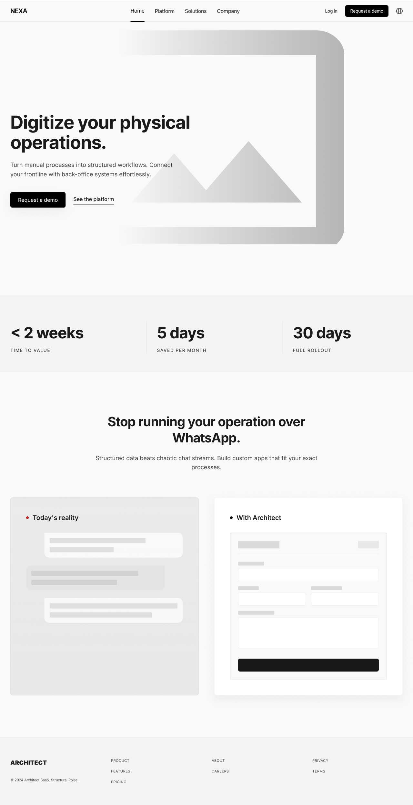
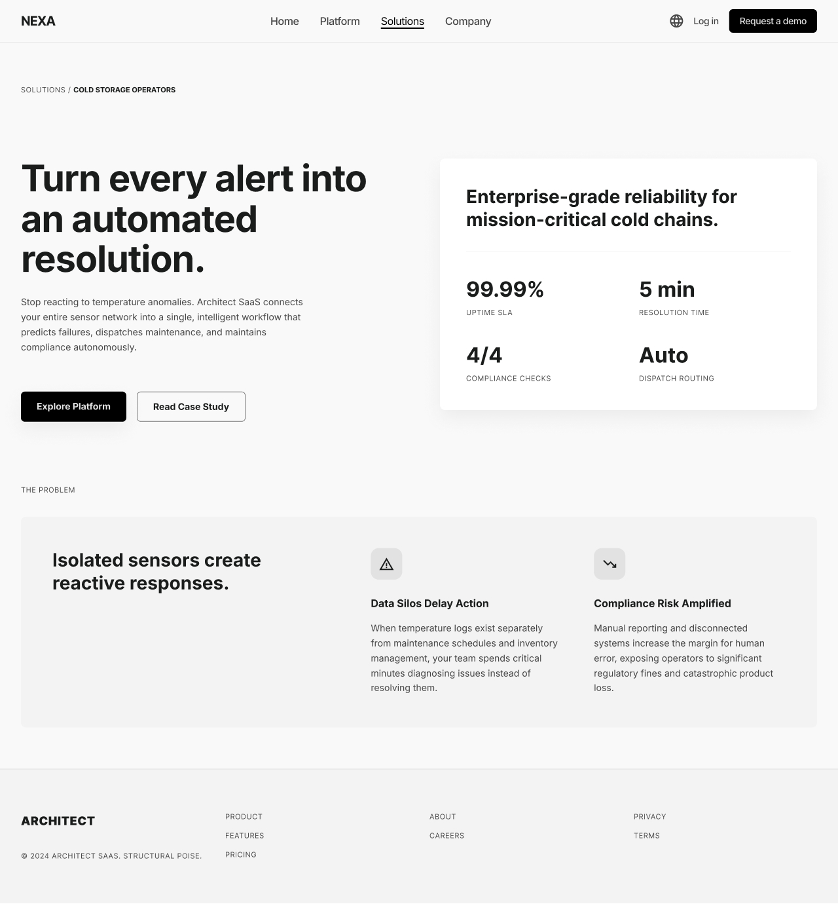
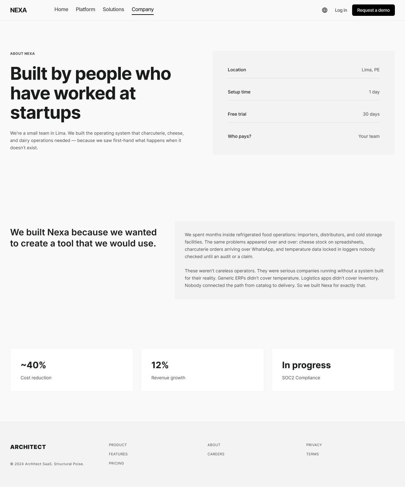
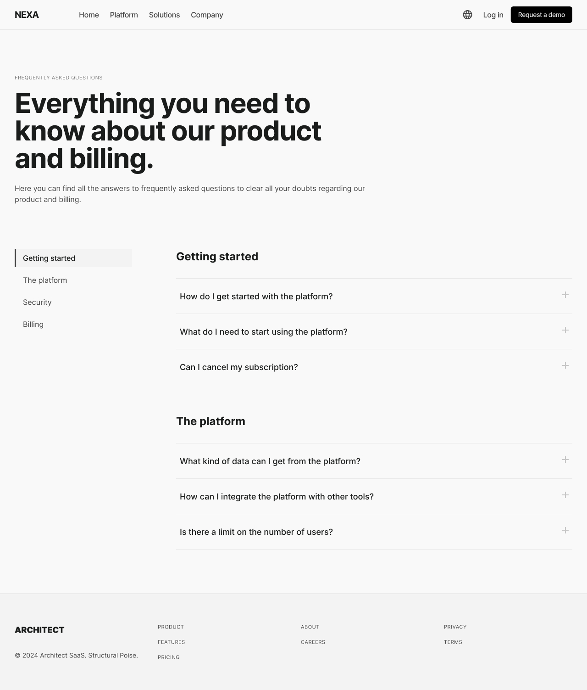
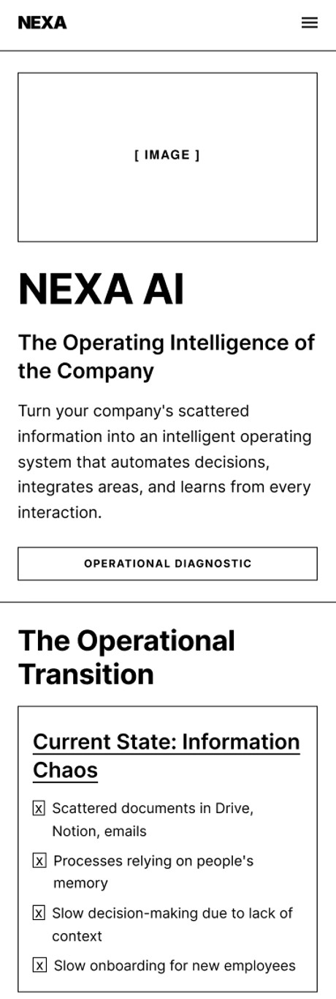
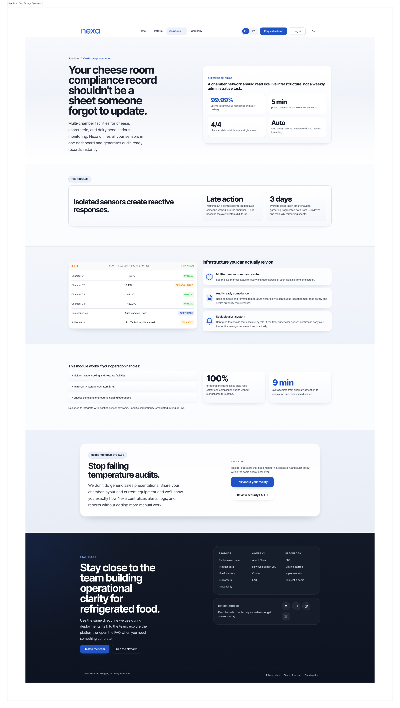
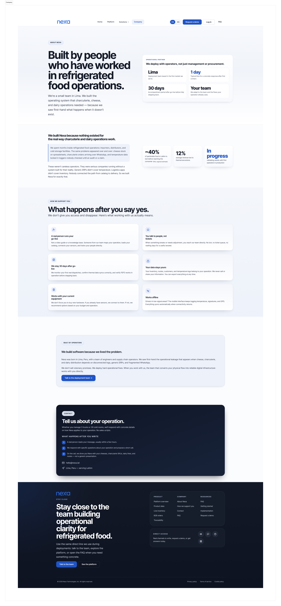
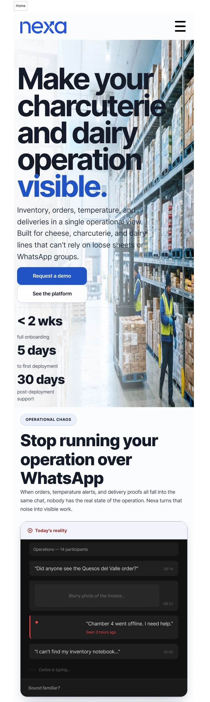

## 4.3. Landing Page UI Design.

La landing page es la superficie pública de entrada al ecosistema Nexa. Su función principal es comunicar la propuesta de valor, segmentar visitantes por tipo de operación y dirigirlos hacia la demostración o el acceso al producto.

La evidencia desplegada de la landing se encuentra en: [https://upc-pre-202610-1asi0730-12242-king.github.io/nexa-website/](https://upc-pre-202610-1asi0730-12242-king.github.io/nexa-website/).

Cada elemento del sitio público tiene continuidad con alguna superficie operativa de la webapp o del portal B2B:

| Elemento de la landing | Continuidad en el producto | Superficie relacionada |
|---|---|---|
| CTA "Ingresar" | Acceso autenticado al sistema | [Webapp login](https://upc-pre-202610-1asi0730-12242-king.github.io/nexa-webapp/#/auth/login) |
| Segmento Importadores/Mayoristas | Flujos de pedido asistido para S1: Coordinación comercial / ventas internas | `/ops/orders/new` |
| Segmento Distribuidores | Control logístico y despacho para S2: Jefatura logística / coordinación operativa | `/ops/dispatch`, `/ops/inventory` |
| Segmento Cámaras Frías | Monitoreo y trazabilidad para S2: Jefatura logística / coordinación operativa | `/ops/inventory`, `/ops/reports` |
| Propuesta de catálogo/pedidos | Compra autónoma B2B para S3: Comprador B2B / cliente comercial | `/portal/catalog`, `/portal/orders` |
| Explicación de la plataforma | Dashboard y módulos operativos | `/ops/dashboard` |

Esta continuidad no implica que la landing replique las pantallas operativas. Los CTAs principales dirigen al sitio desplegado o al login de la webapp; las rutas internas documentadas sirven como referencia de comportamiento dentro del producto autenticado.

### 4.3.1. Landing Page Wireframe.

La landing page de Nexa se trabajó primero en **Figma** mediante wireframes de baja fidelidad. En esta etapa se ordenaron contenido, jerarquía de secciones, navegación, rutas por tipo de visitante y puntos de conversión antes de pasar a mockups de mayor detalle.

La revisión se hizo para **Desktop Web Browser** y **Mobile Web Browser**, manteniendo la misma lógica de lectura: entender el problema, reconocer el tipo de operación, revisar la plataforma y encontrar una vía clara de contacto o acceso.

#### A. Desktop Web Browser

*Figura. Wireframe desktop de Home*

Nota. Elaboración propia. La portada organiza hero, propuesta principal, CTA y primeros bloques de valor para un visitante que llega por primera vez al sitio.

*Figura. Wireframe desktop de Platform*

Nota. Elaboración propia. La página Platform ordena módulos, beneficios funcionales y lectura general de la solución sin entrar todavía a pantallas autenticadas.

*Figura. Wireframe desktop de Solutions*

Nota. Elaboración propia. El hub de soluciones separa rutas públicas para visitantes interesados en distribución, importación, mayoristas y cámaras frías.

*Figura. Wireframe desktop de Company*

Nota. Elaboración propia. La página Company da contexto institucional al proyecto y mantiene una estructura de confianza para el visitante comercial.

*Figura. Wireframe desktop de Distribuidores*

Nota. Elaboración propia. La ruta para distribuidores enfatiza coordinación de pedidos, visibilidad operativa y continuidad de atención.

*Figura. Wireframe desktop de Importadores*

Nota. Elaboración propia. La ruta para importadores y mayoristas prioriza abastecimiento, disponibilidad y lectura de inventario para operaciones B2B.

*Figura. Wireframe desktop de FAQ*

Nota. Elaboración propia. La página FAQ organiza dudas frecuentes sobre acceso, uso, alcance del producto y contacto comercial.

#### B. Mobile Web Browser

La versión móvil conserva la misma secuencia pública, pero reduce densidad visual y concentra navegación, lectura de propuesta y CTA en una estructura vertical más compacta.

*Figura. Wireframe mobile de Home*

Nota. Elaboración propia. La versión móvil concentra hero, navegación compacta, bloques principales y cierre comercial en una lectura continua.

### 4.3.2. Landing Page Mock-up.

Una vez validada la estructura, los mockups se desarrollaron en **Figma** para fijar tratamiento visual, jerarquía de botones, ritmo de secciones, color, tipografía e identidad de marca. Las capturas corresponden al recorrido principal en **Desktop Web Browser** y a una muestra de adaptación para **Mobile Web Browser**.

#### A. Desktop Web Browser

*Figura. Mockup desktop de Home*

Nota. Elaboración propia. Home presenta el mensaje principal, CTA, bloques de capacidades y cierre del recorrido público.

*Figura. Mockup desktop de Platform*

Nota. Elaboración propia. Platform muestra la propuesta funcional del producto mediante módulos, beneficios operativos y lectura de plataforma.

*Figura. Mockup desktop para operadores de cámaras frías*

Nota. Elaboración propia. La variante para cámaras frías comunica control, almacenamiento y trazabilidad de productos sensibles.

*Figura. Mockup desktop de Company*

Nota. Elaboración propia. Company refuerza el contexto del proyecto y la confianza necesaria antes de iniciar contacto comercial.

*Figura. Mockup desktop para distribuidores*

Nota. Elaboración propia. La ruta para distribuidores enfatiza pedido, coordinación y continuidad operativa.

*Figura. Mockup desktop para importadores y mayoristas*

Nota. Elaboración propia. La ruta para importadores y mayoristas adapta la propuesta a operaciones con dependencia de abastecimiento y stock.

*Figura. Mockup desktop de FAQ*

Nota. Elaboración propia. FAQ reduce fricción previa al contacto mediante respuestas breves y navegación directa.

#### B. Mobile Web Browser

La adaptación móvil mantiene el mismo lenguaje visual del sitio público y prioriza lectura vertical, CTA visible y bloques más compactos para consulta desde teléfono.

*Figura. Mockup mobile de Home*

Nota. Elaboración propia. La captura móvil valida hero, navegación compacta, secciones principales y cierre de contacto en una sola experiencia responsiva.
