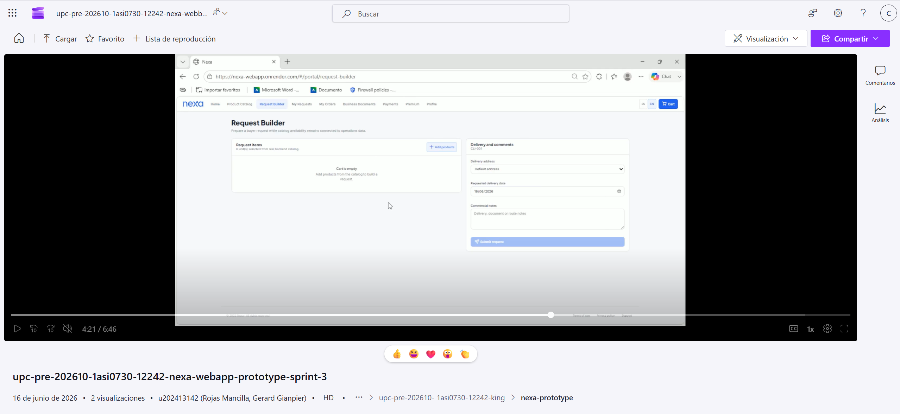

## 4.5. Web Applications Prototyping.

El prototipo incluye versión web y versión móvil responsive, ambas navegables desde Figma y documentadas mediante video.

El prototipado constituye **evidencia de diseño interactivo**. La evidencia de implementación, ejecución, despliegue académico AV2 y servicios simulados se documenta en el Capítulo V.

| Evidencia de prototipado | Propósito |
|---|---|
| [Proyecto Figma del equipo](https://www.figma.com/files/team/1586383034175281439/project/587167294) | Espacio maestro con wireframes, mockups y decisiones de diseño |
| [Archivo Figma de la web application](https://www.figma.com/design/buDa5VZmYjPNokbl4FEJqx/Web-App?node-id=0-1) | Versión navegable con frames conectados de la aplicación |

**Tabla. Criterios aplicados para las decisiones de interacción del prototipo**

| Criterio | Aplicación en Nexa | Relación con arquitectura de información |
|---|---|---|
| Navegación por responsabilidad | S1, S2 y S3 acceden a módulos distintos según su rol y alcance operativo | Refuerza la separación entre Commercial Coordination, Operations / Account Owner y Buyer Portal |
| Flujo | Segmento | Cobertura en prototipo | Evidencia | Estado TB1 |
|---|---|---|---|---|
| S1 — Coordinación comercial | Ventas internas / pedidos | Completa: dashboard, pedidos, clientes, reportes comerciales | [Userflow S1](https://lucid.app/lucidchart/8f6d6af2-f229-47f8-ba02-86b27cdc6fed/edit?invitationId=inv_09391266-7e11-4614-8edf-12cf979cdabf) + Figma frames | Documentado e implementado |

**Tabla. Artefactos de prototipado y cobertura documentada**

| Artefacto de prototipado | Propósito | Cobertura documentada |
|---|---|---|
| [Proyecto Figma del equipo](https://www.figma.com/files/team/1586383034175281439/project/587167294) | Espacio maestro con wireframes, mockups y decisiones visuales del equipo | Referencia visual del diseño del producto |
| [Archivo Figma de la Web Application](https://www.figma.com/design/buDa5VZmYjPNokbl4FEJqx/Web-App?node-id=0-1) | Prototipo navegable con frames conectados de la aplicación | Recorridos principales de la Web Application interna |
| [Video del prototipo — Web y Móvil](https://upcedupe-my.sharepoint.com/:v:/g/personal/u202323040_upc_edu_pe/IQAOXrLcl2ziRpTDa5QgX__QARetYOg71_XS5G2YR84vlVs?nav=eyJyZWZlcnJhbEluZm8iOnsicmVmZXJyYWxBcHAiOiJPbmVEcml2ZUZvckJ1c2luZXNzIiwicmVmZXJyYWxBcHBQbGF0Zm9ybSI6IldlYiIsInJlZmVycmFsTW9kZSI6InZpZXciLCJyZWZlcnJhbFZpZXciOiJNeUZpbGVzTGlua0NvcHkifX0&e=MTgzyN) | Video de recorrido del prototipo Web y Mobile | Enlace audiovisual del prototipo de Web Application interna |
| [FigJam — Userflow y Wireflow S1/S2](https://www.figma.com/board/LjIjtyfoOpeYa5OCSJUYpD/Nexa-Ops-S1-S2-Userflow-Wireflow?node-id=0-1&t=F9ZnAAAzCUpiK4qs-1) | Board de trabajo para validar rutas, flujos y decisiones de interacción | Wireflow y userflow de S1/S2 |
| Screenshot de video para Web Application interna | Captura de referencia audiovisual del prototipo | Figura incluida en esta sección |
*Captura referencial del prototipo de la web application*

### Video de prototyping WebApp Sprint 3

El video inicia con el flujo de S1 — Commercial Coordination y luego incorpora los cambios hacia S2 — Operations / Account Owner y S3 — B2B Buyer Portal. La grabación permite evidenciar la navegación integrada del prototipo WebApp y su comportamiento de interacción para los segmentos principales.

| Elemento | Detalle |
|---|---|
El prototipado constituye **evidencia de diseño integrado**, no evidencia de despliegue autenticado ni de operación en producción. Su valor es demostrar que la web application fue diseñada como un sistema consistente y recorrible antes de la implementación.

### 4.5.1. Sistema de navegación aplicado al prototipo

| Superficie | Segmento | Navegación principal | Propósito |
|---|---|---|---|
| Web Application interna | S1 — Commercial Coordination | Dashboard comercial, catálogo, solicitudes de compra (`Purchase Requests`), órdenes de compra (`Purchase Orders`), registro manual de pedido (`Manual Order Entry`), cuentas de cliente (`Client Accounts`) y documentos comerciales (`Business Documents`) | Validar solicitudes, revisar clientes, crear o convertir pedidos y gestionar documentos comerciales |
| Web Application interna | S2 — Operations / Account Owner | Dashboard operativo, control de inventario (`Inventory Control`), lotes de inventario (`Inventory Lots`), órdenes de despacho (`Dispatch Orders`), evidencia de entrega (`Proof of Delivery` / POD), analítica operativa (`Operational Analytics`), promociones, portales de cliente (`Customer Portals`) y administración de empresa (`Company Administration`) | Controlar inventario, lotes, despacho, evidencias, operación y configuración de empresa/tenant |
| Buyer Portal | S3 — B2B Buyer Portal | Home, catálogo de productos (`Product Catalog`), constructor de solicitud (`Request Builder`), mis solicitudes (`My Requests`), mis órdenes (`My Orders`), documentos comerciales (`Business Documents`), beneficios premium y perfil (`Profile`) | Permitir autoservicio del comprador para solicitar productos, revisar pedidos, documentos y tracking |

La navegación es **role-aware**: el usuario autenticado accede a una experiencia según su perfil y alcance operativo. S1 y S2 comparten la consola interna, pero no necesariamente comparten la misma prioridad de módulos. S3 utiliza el Buyer Portal como superficie separada para evitar exposición innecesaria de información operativa interna.

### 4.5.2. Interacciones principales del prototipo

El prototipo utiliza patrones de interacción consistentes con la arquitectura de información y los user flows. Las interacciones no se plantean como animaciones decorativas, sino como respuestas a decisiones del negocio: validar un cliente, confirmar productos, revisar disponibilidad, despachar una orden o consultar un estado.

| Patrón de interacción | Uso en el prototipo | Segmento |
|---|---|---|
| Login con selección de experiencia | Permite entrar a la superficie correspondiente según usuario autenticado | S1, S2, S3 |
| Dashboard inicial | Resume actividad relevante y accesos frecuentes | S1, S2, S3 |
| Tablas con filtros | Permiten revisar solicitudes, clientes, pedidos, lotes y despachos | S1, S2 |
| Drawers de detalle | Muestran información contextual sin abandonar la vista principal | S1, S2 |
| Flujo guiado por pasos | Permite construir o revisar una solicitud/pedido antes de confirmar | S1, S3 |
| Estados visuales | Comunican avance de solicitud, pedido, inventario o despacho | S1, S2, S3 |
| Confirmaciones | Reducen errores antes de registrar cambios importantes | S1, S2, S3 |
| Tracking y documentos visibles | Permiten al comprador consultar avance y soporte documental | S3 |

### 4.5.3. Paths de prototipo por user goal

Los paths del prototipo siguen los user flows definidos en 4.4. Cada recorrido cubre un objetivo de usuario y una secuencia de interacción esperada.

| Segmento | User goal | Path de prototipo | Cobertura documentada |
La navegación es **rol-consciente**: S1: Coordinación comercial / ventas internas ve por defecto Pedidos y Clientes; S3: Comprador B2B / cliente comercial ve Catálogo, Mis pedidos y Seguimiento; S2: Jefatura logística / coordinación operativa ve Gestión operativa, Despachos y Evidencias. Los *call-to-actions* primarios (crear pedido, despachar, cerrar entrega) se mantienen siempre visibles como *floating action* en la parte inferior derecha del frame, respetando la lógica **mobile-first**. Las transiciones entre frames siguen el principio de *progressive disclosure*: el usuario avanza solo cuando el sistema ya puede confirmar stock, crédito o estado, evitando pantallas intermedias sin valor.