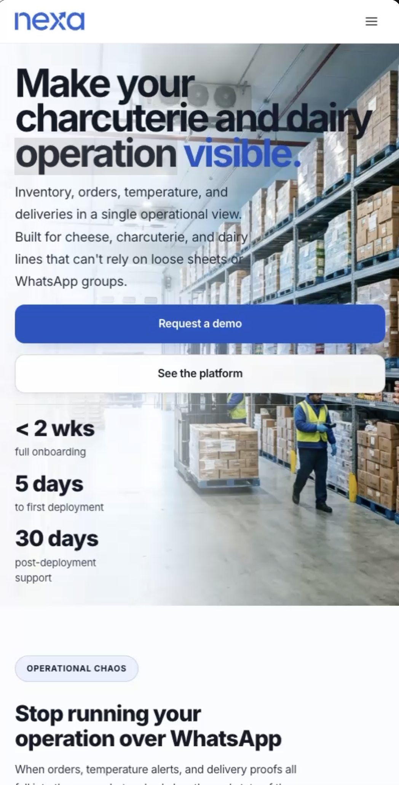

## 4.5. Web Applications Prototyping.

El prototipado de la web application se actualizó para TB1 con el fin de reflejar los flujos operativos implementados en Sprint 2. El prototipo Figma conecta frames por rol y módulo, cubriendo los recorridos de coordinación comercial (S1) y jefatura logística (S2). El portal comprador (S3) permanece como alcance parcial de planificación.

El prototipo incluye versión web y versión móvil responsive, ambas navegables desde Figma y documentadas mediante video.

*Tabla. Artefactos de prototipado y evidencia disponible para TB1*

| Evidencia de prototipado | Propósito |
|---|---|
| [Proyecto Figma del equipo](https://www.figma.com/files/team/1586383034175281439/project/587167294) | Espacio maestro con wireframes, mockups y decisiones de diseño |
| [Archivo Figma de la web application](https://www.figma.com/design/buDa5VZmYjPNokbl4FEJqx/Web-App?node-id=0-1) | Versión navegable con frames conectados de la aplicación |
| [Video del prototipo — Web y Móvil](https://upcedupe-my.sharepoint.com/:v:/g/personal/u202323040_upc_edu_pe/IQAOXrLcl2ziRpTDa5QgX__QARetYOg71_XS5G2YR84vlVs?nav=eyJyZWZlcnJhbEluZm8iOnsicmVmZXJyYWxBcHAiOiJPbmVEcml2ZUZvckJ1c2luZXNzIiwicmVmZXJyYWxBcHBQbGF0Zm9ybSI6IldlYiIsInJlZmVycmFsTW9kZSI6InZpZXciLCJyZWZlcnJhbFZpZXciOiJNeUZpbGVzTGlua0NvcHkifX0&e=MTgzyN) | Recorrido completo del prototipo web y móvil como evidencia audiovisual |
| [FigJam — Userflow y Wireflow S1/S2](https://www.figma.com/board/LjIjtyfoOpeYa5OCSJUYpD/Nexa-Ops-S1-S2-Userflow-Wireflow?node-id=0-1&t=F9ZnAAAzCUpiK4qs-1) | Board de trabajo para validación de rutas y flujos operativos |

*Tabla. Cobertura de prototipado por flujo y segmento en TB1*

| Flujo | Segmento | Cobertura en prototipo | Evidencia | Estado TB1 |
|---|---|---|---|---|
| S1 — Coordinación comercial | Ventas internas / pedidos | Completa: dashboard, pedidos, clientes, reportes comerciales | [Userflow S1](https://lucid.app/lucidchart/8f6d6af2-f229-47f8-ba02-86b27cdc6fed/edit?invitationId=inv_09391266-7e11-4614-8edf-12cf979cdabf) + Figma frames | Documentado e implementado |
| S2 — Jefatura logística | Inventario, despacho, operación | Completa: inventario, lotes, despacho, reportes operativos | [Userflow S2](https://lucid.app/lucidchart/b91c8e98-a38b-456a-92e5-f942be7e8439/edit?invitationId=inv_5c030713-67e5-4e84-90bf-661b26cef528) + Figma frames | Documentado e implementado |
| S3 — Portal comprador B2B | Catálogo, pedido, seguimiento | Parcial: frames de catálogo y carrito en Figma, sin userflow completo en Lucidchart | Documentación de sección 4.4 | Planificado / parcial |

*Captura referencial del prototipo de la web application*

> *Nota:* Pantalla principal del prototipo con la lógica de dashboard operativo utilizada como punto de entrada a la aplicación. Elaboración propia.

*Prueba de interacción del prototipo responsive en navegador móvil*

> *Nota:* Captura del prototipo Figma ejecutado en vista móvil responsive, validando la adaptación del diseño a pantallas reducidas. Elaboración propia.

El prototipado constituye **evidencia de diseño integrado**, no evidencia de despliegue autenticado ni de operación en producción. Su valor es demostrar que la web application fue diseñada como un sistema consistente y recorrible antes de la implementación.

### 4.5.1. Sistema de navegación aplicado al prototipo

El prototipo aplica un **sistema de navegación jerárquico por rol** con un nivel global y dos niveles contextuales, consistente con la arquitectura de información definida en la sección 4.2. El nivel global se expresa en un *top bar* persistente con identidad de marca, selector de contexto (empresa activa) y acciones de cuenta; el primer nivel contextual se expresa en un *side navigation* por módulo del dominio (Catálogo, Pedidos, Inventario, Clientes, Despacho, Trazabilidad); el segundo nivel se expresa como *tabs* y *breadcrumbs* dentro de cada módulo para movimientos laterales sin perder contexto.

La navegación es **rol-consciente**: S1: Coordinación comercial / ventas internas ve por defecto Pedidos y Clientes; S3: Comprador B2B / cliente comercial ve Catálogo, Mis pedidos y Seguimiento; S2: Jefatura logística / coordinación operativa ve Gestión operativa, Despachos y Evidencias. Los *call-to-actions* primarios (crear pedido, despachar, cerrar entrega) se mantienen siempre visibles como *floating action* en la parte inferior derecha del frame, respetando la lógica **mobile-first**. Las transiciones entre frames siguen el principio de *progressive disclosure*: el usuario avanza solo cuando el sistema ya puede confirmar stock, crédito o estado, evitando pantallas intermedias sin valor.
