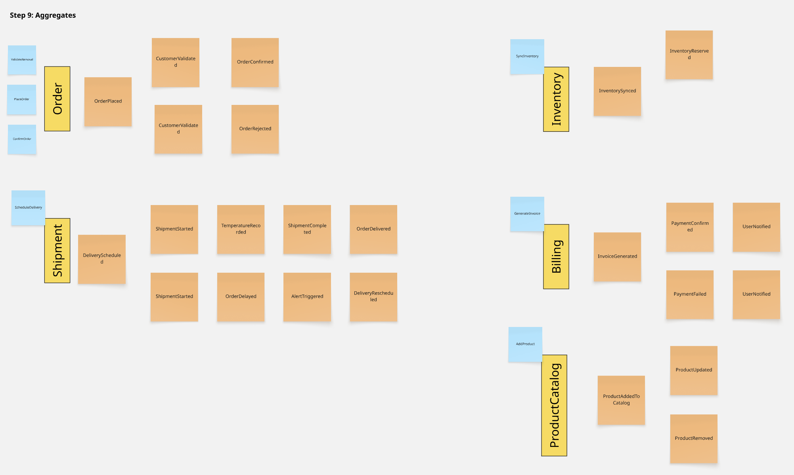
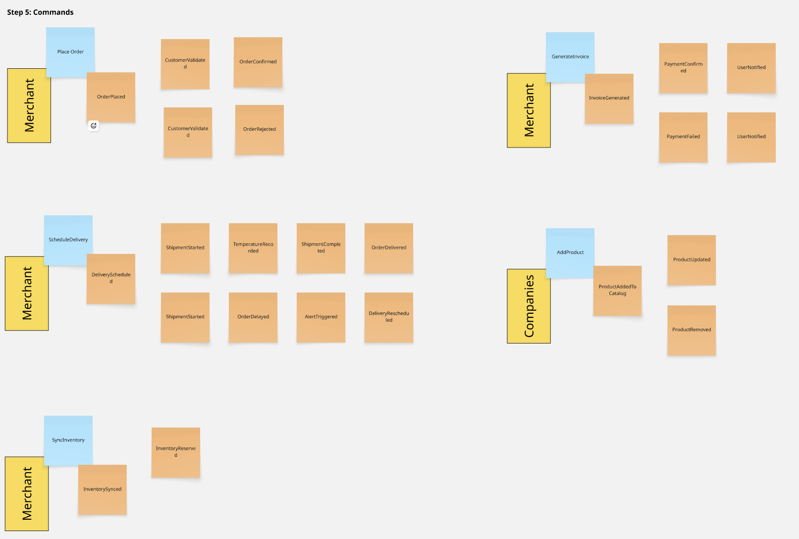
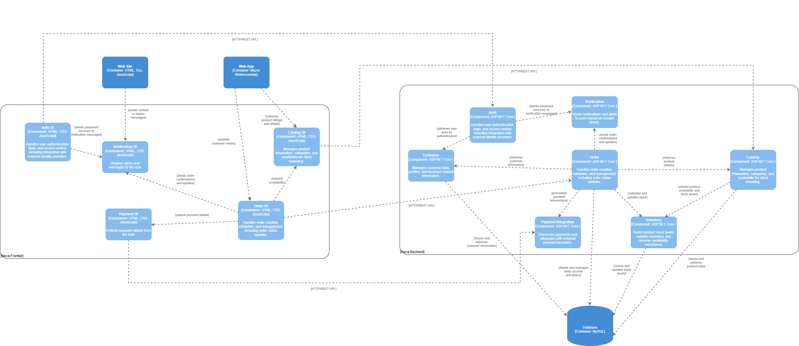

> **Nota de alcance**: Las secciones 4.6, 4.7 y 4.8 documentan la arquitectura objetivo del sistema. En el corte TB1, la webapp opera con Fake API (JSON Server) para simular integración; el backend real y la base de datos normalizada son planificación arquitectónica, no implementación desplegada. Esta distinción es importante para no confundir diseño de dominio con evidencia de producción.

Nexa soporta un proceso de distribución B2B de productos gourmet refrigerados. Por ello, el dominio no se modeló como un sistema genérico de pedidos. En su lugar, se dividió en límites de negocio que separan las responsabilidades de catálogo, gestión comercial de pedidos, operaciones de almacén, trazabilidad de despacho y visibilidad documental/pagos.

En esta sección el foco está en el vínculo entre workshop y arquitectura. La separación más fina del dominio se desarrolla después en las secciones 4.7 y 4.8, donde se presentan los diagramas de clases y persistencia por bounded context.

Los bounded contexts finales definidos para Nexa son:

| Bounded Context | Responsabilidad principal |
|---|---|
| Catalog Management | Gestiona productos, categorías, códigos internos de producto, visibilidad comercial, condiciones de conservación y promociones. |
El Design-Level EventStorming permitió pasar de un flujo general del pedido a una lectura más ordenada del dominio. Las primeras tres etapas (Exploration, Timeline y Pain Points) se documentan en la sección 2.4 como parte del entendimiento del negocio. Las capturas siguientes corresponden al desarrollo técnico posterior usado por el equipo. Como respaldo adicional se mantiene el board de Miro: [Design-Level EventStorming en Miro](https://miro.com/welcomeonboard/OC95SW9ySW9zY3Q5QURlWWFpTlN4NmVuY2xHWVRYdTBkd3hZR2FHcEZ1cDRBYm5SY1NYMkpvNFdYSmc1T1hLZ2lsQko3Z2RKUDdlbWF6ZmRRU21EalNzSEZqc2NKT2l6MTc2TXBFbjFUTTM2L3phOTVDWktNeTVnY1hVZGVEZjZBd044SHFHaVlWYWk0d3NxeHNmeG9BPT0hdjE=?share_link_id=419986690457).

*Design-Level EventStorming — Step 4: Pivotal Points*

*Design-Level EventStorming — Step 5: Commands*

El proceso de Design-Level EventStorming se utilizó para refinar el modelo de dominio inicialmente explorado en la sección de Big Picture EventStorming. El objetivo fue identificar domain events, commands, policies, read models, aggregates y bounded contexts con un mayor nivel de detalle.
*Design-Level EventStorming — Step 6: Policies*

*Design-Level EventStorming — Step 7: Read Models*

### Step 4: Pivotal Points

*Design-Level EventStorming — Step 9: Consolidated Flow by Context*

Los pivotal points representan decisiones relevantes del negocio donde el flujo normal puede derivar en rutas alternativas. En Nexa, estos puntos incluyen validación comercial, revisión de disponibilidad de stock, programación de despacho, gestión de incidencias, confirmación de entrega y actualización del estado de pago.
*Design-Level EventStorming — Step 10: Bounded Contexts*

### 4.6.2. Software Architecture Context Diagram

Para las vistas C4 utilizamos Structurizr como herramienta de modelado, manteniendo los diagramas y sus archivos de definición dentro del repositorio. La vista de contexto ubica a Nexa frente a sus usuarios y sistemas externos; la vista de contenedores separa landing page, webapp, Fake API y componentes objetivo de backend/plataforma; y la vista de componentes detalla la distribución esperada de responsabilidades dentro de la arquitectura objetivo.

La siguiente tabla resume los principales commands por bounded context:
*Tabla. Relación entre vistas C4 y alcance TB1*

| Bounded Context | Commands principales |
|---|---|
| Catalog Management | RegisterProduct, UpdateProduct, DeactivateProduct, PublishPromotion, UpdateProductVisibility |
| Sales | SubmitPurchaseRequest, ValidateCommercialCondition, RejectPurchaseRequest, ConfirmSalesOrder, RegisterManualRequest |
| Warehouse | RegisterInventoryLot, ReserveStock, ReleaseReservation, AdjustStock, ApplyFefoReservation |
| Logistics | ScheduleDispatch, StartDispatch, RegisterTraceabilityEvent, RegisterDeliveryIncident, RegisterTemperatureCheck, RegisterDeliveryEvidence |
|---|---|---|
| Commercial validation policy | Una solicitud de compra no puede convertirse en una orden de venta confirmada hasta que se validen las condiciones comerciales del cliente B2B. | Sales |
| Credit warning policy | Una solicitud puede requerir revisión cuando el cliente tiene restricciones de crédito o alertas por pagos pendientes. | Sales / Invoicing |
| Stock reservation policy | El stock debe reservarse antes de iniciar el proceso de despacho. | Warehouse |
| Context | Usuarios, Nexa, operación B2B e integraciones externas consideradas en el ecosistema | Representa la ubicación del sistema y sus actores principales |
| Container | Landing page, webapp, Fake API, backend/plataforma objetivo y almacenamiento objetivo | Landing y webapp desplegadas; Fake API usada como simulación; backend y persistencia como diseño objetivo |
| Component | Responsabilidades internas esperadas por módulo o contexto funcional | Referencia arquitectónica para la evolución posterior del backend/plataforma |

El diagrama de contexto muestra a Nexa como sistema central dentro de dos frentes de uso: el frente público del sitio y el frente operativo del producto. También ubica integraciones externas que acompañan el ecosistema, como autenticación, notificaciones, almacenamiento documental, calendario y pagos.

Los read models representan vistas de información requeridas por los usuarios para tomar decisiones o completar tareas. Son especialmente relevantes para dashboards, monitoreo operativo y pantallas de consulta orientadas al comprador.

| Read Model | Descripción | Contexto fuente |
|---|---|---|
| ProductCatalogView | Muestra productos activos, categorías, datos de conservación y visibilidad comercial. | Catalog Management |
| ProductDetailView | Muestra información detallada del producto usando el código interno de producto. | Catalog Management |
| SalesPipelineView | Muestra solicitudes de compra, estado de validación y órdenes confirmadas. | Sales |

### Step 9: Consolidated Flow by Context

*Leyenda del diagrama C4 de contexto*

El flujo consolidado organiza los principales events, commands y read models según los límites finales del dominio. Esta vista permite validar que cada bounded context tenga una responsabilidad de negocio clara y evita mezclar responsabilidades entre catálogo, ventas, almacén, logística e invoicing.

### Step 10: Bounded Contexts
El contexto deja ver que el sistema no se limita a un solo actor. Hay visitantes que exploran la propuesta de valor, personal de la distribuidora que coordina la operación y clientes B2B que consultan catálogo, registran pedidos y siguen su estado. Las integraciones externas se entienden como apoyo del ecosistema, no como el núcleo del dominio.

La vista de contenedores separa el sitio público, la web application transaccional, el Fake API usado para TB1 y la plataforma/backend objetivo. Esa separación permite distinguir mejor el frente comercial del frente operativo y evita mezclar en una sola pieza la experiencia pública, la lógica de negocio simulada y la persistencia planificada.

| Bounded Context | Aggregates | Domain Events | Commands | Queries / Read Models |
|---|---|---|---|---|
| Catalog Management | Product, Category, Promotion | ProductRegistered, ProductUpdated, ProductDeactivated, PromotionPublished | RegisterProduct, UpdateProduct, DeactivateProduct, PublishPromotion | ProductCatalogView, ProductDetailView, ActivePromotionsView |
*Diagrama de Contenedores del Sistema Nexa (C4 — Nivel 2)*

El modelo resultante mantiene Identity and Access Management como una capacidad de soporte. Esta área de soporte provee gestión de usuarios, roles, permisos, tenants y sesiones, pero no reemplaza ninguno de los cinco contextos core del negocio.

Nota. Elaboración propia mediante Structurizr.

El diagrama de contexto C4 presenta a Nexa como el sistema de software central y muestra su interacción con los principales usuarios y sistemas externos de soporte.

**Nota:** Elaboración propia usando Structurizr.

En esta versión del C4, el sitio público se representa como una capa en HTML, CSS y JavaScript; la aplicación transaccional aparece como un cliente web separado; el Fake API se mantiene como soporte de simulación para TB1; y el backend/plataforma, la persistencia y las integraciones externas quedan como arquitectura objetivo. También se muestran servicios externos de soporte como pagos, notificaciones, autenticación, calendario y almacenamiento documental.

> **Nota de alcance TB1:** Este diagrama representa la arquitectura objetivo del sistema Nexa. En TB1, la entrega incluye únicamente la aplicación web (Vue 3 SPA) conectada a una API simulada mediante JSON Server. El backend en ASP.NET Core, la base de datos MySQL y las integraciones externas (Stripe, OAuth, Calendar, Cloud Storage) forman parte del diseño de la arquitectura objetivo y están previstas para etapas posteriores de implementación.

El contexto del sistema considera los siguientes actores externos:

| Actor | Descripción | Interacción principal con Nexa |
|---|---|---|
| Visitor | Usuario público interesado en la propuesta SaaS. | Revisa el Landing Page y accede al call-to-action correspondiente. |
La vista de componentes baja un nivel más y muestra cómo se reparte la responsabilidad entre interfaz, backend y servicios de apoyo. No todos los bounded contexts aparecen con la misma granularidad en esta lámina, por lo que su lectura debe complementarse con 4.7 y 4.8.

El diagrama de contexto es consistente con los tres segmentos objetivo principales del producto: coordinación comercial, operaciones/account ownership y compradores B2B.

En la imagen aparecen piezas visibles como Auth, Catalog, Order, Inventory y Customer dentro del backend objetivo, además de componentes de soporte como Payment Integration y Notification. Para mantener coherencia con el dominio consolidado, el informe conserva como núcleo los contextos **Identity & Access**, **Catalog**, **Orders & Commercial Management**, **Inventory** y **Dispatch & Traceability**. En esa lectura, **Auth** se alinea con **Identity & Access**, **Order** con **Orders & Commercial Management**, y los servicios de pago o notificación se tratan como apoyo transversal, no como bounded contexts principales.

**Nota:** Elaboración propia usando Structurizr.

**Nota:** Leyenda del diagrama generada por Structurizr.

| Container | Tecnología / enfoque | Responsabilidad |
|---|---|---|
| Landing Page | HTML5, CSS3 y JavaScript | Presenta el modelo de negocio, propuesta de valor, beneficios y enlaces call-to-action para cada segmento objetivo. |
| Web Application | Vue, PrimeVue, PrimeFlex, PrimeIcons, Vue Router, Vue I18n y Axios | Proporciona la experiencia transaccional para compradores B2B, usuarios comerciales y usuarios de operaciones. |
| RESTful API | ASP.NET Core Web API y C# | Expone application services y operaciones de dominio para catálogo, ventas, almacén, logística e invoicing. |
| Relational Database | PostgreSQL (base de datos relacional para el corte backend AV2) | Persiste datos de negocio relacionados con productos, clientes, órdenes, inventario, despachos, documentos y pagos. |
| External Services | Servicios de terceros | Dan soporte a autenticación, notificaciones, almacenamiento documental, integración con calendario o simulación de pago según el alcance de implementación. |

La Web Application se comunica con la RESTful API mediante solicitudes HTTP. La RESTful API centraliza el comportamiento de dominio y el acceso a datos. La base de datos relacional PostgreSQL persiste la información requerida por los bounded contexts y los read models derivados.

Esta decisión evita forzar una correspondencia literal entre cada caja del C4 y cada bloque del dominio. El C4 resume capas e integraciones; los capítulos siguientes afinan la separación interna del modelo. Por eso Commercial Conditions y Traceability se desarrollan con más precisión en las secciones 4.7 y 4.8, donde la lógica del dominio se documenta con mayor detalle.