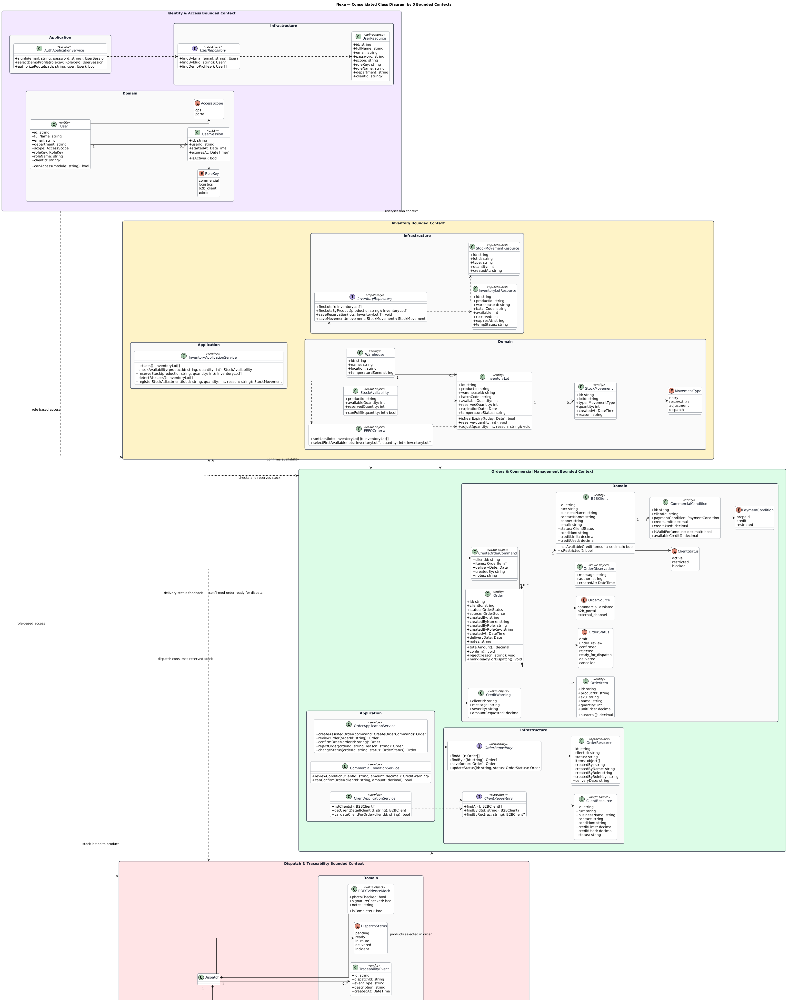
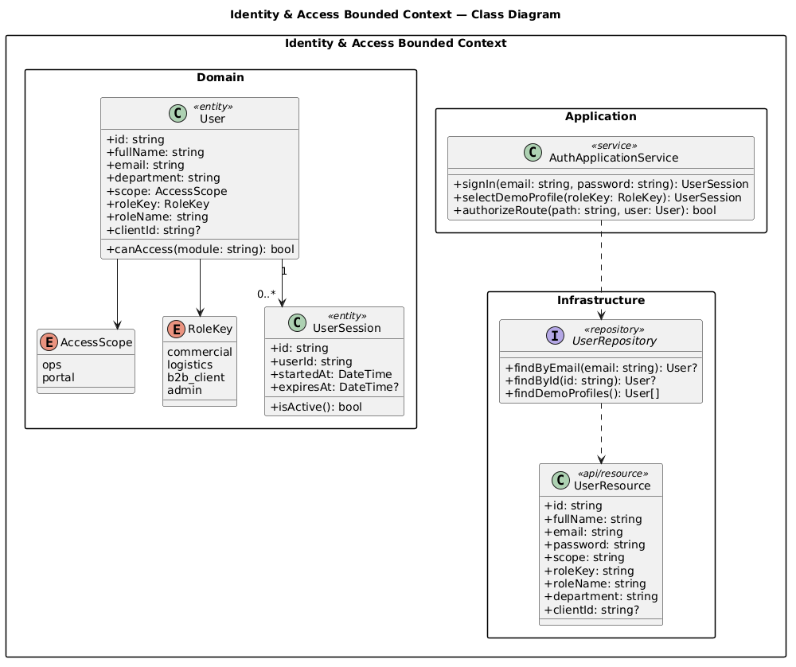
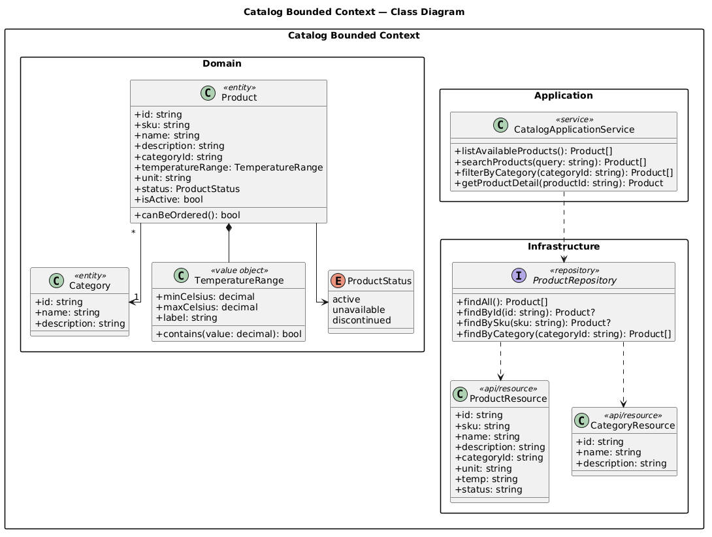
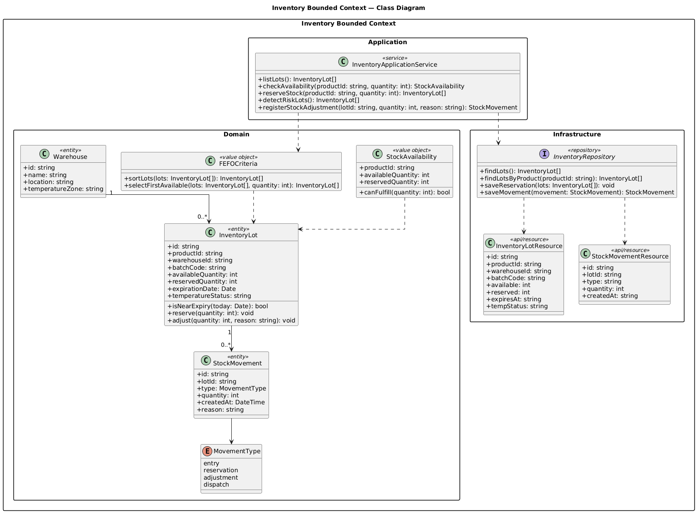

## 4.7. Software Object-Oriented Design

Para el diseño orientado a objetos de Nexa, organizamos los diagramas de clases a partir de los cinco bounded contexts consolidados durante el modelado táctico: **Identity & Access**, **Catalog**, **Orders & Commercial Management**, **Inventory** y **Dispatch & Traceability**. Esta separación mantiene la trazabilidad con el EventStorming, el modelo DDD y la vista C4, evitando mezclar responsabilidades comerciales, logísticas y de acceso dentro de un único modelo general.

Definimos los diagramas con PlantUML para mantener una representación consistente de entidades, value objects, servicios de aplicación, repositorios y recursos expuestos por cada contexto. El diagrama general presenta la relación táctica entre contextos, mientras que los diagramas individuales permiten revisar con mayor detalle las clases y dependencias internas de cada parte del dominio.

En TB1, estos diagramas representan el diseño objetivo del dominio. La webapp utiliza Fake API como simulación para validar flujos y estructura funcional, por lo que no se afirma la existencia de un backend productivo, una base de datos productiva ni autenticación productiva. Los reportes no se modelan como bounded context independiente, sino como read models derivados de **Orders & Commercial Management**, **Inventory** y **Dispatch & Traceability**.

### 4.7.1. Class Diagrams

En los diagramas individuales se muestran las clases principales de cada bounded context, junto con sus atributos, operaciones, visibilidad y relaciones. Cuando el modelo lo requiere, se incluyen enumeraciones para representar estados del dominio y relaciones con multiplicidad para precisar cardinalidades entre entidades.

*Tabla. Criterios UML aplicados en los diagramas de clases*

| Criterio UML | Aplicación en Nexa |
|---|---|
| Clases y responsabilidades | Cada bounded context agrupa las clases que concentran la lógica principal de su parte del dominio. |
| Atributos y métodos | Las clases incluyen miembros relevantes para expresar estado y comportamiento esperado. |
| Visibilidad / scope | PlantUML representa scope cuando corresponde mediante `+` public, `-` private y `#` protected. |
| Relaciones y dirección | Las asociaciones muestran dependencias entre clases y dirección cuando el modelo la hace explícita. |
| Multiplicidad | Las relaciones indican cardinalidad cuando resulta necesaria para leer el vínculo entre entidades. |
| Enumeraciones de dominio | Los estados del dominio se modelan como enumeraciones cuando el diagrama lo requiere. |
| Separación por bounded context | Identity & Access, Catalog, Orders & Commercial Management, Inventory y Dispatch & Traceability se mantienen como límites tácticos. |

> *Nota:* Elaboración propia, basada en los criterios UML solicitados para la sección de Class Diagrams.

*Figura. Mapa táctico general de clases por bounded context*

Nota. Elaboración propia mediante PlantUML. El mapa consolida la relación entre los cinco bounded contexts y ubica los read models de reportes como salidas derivadas del dominio operativo.

*Figura. Diagrama de clases del bounded context Identity & Access*

Nota. Elaboración propia mediante PlantUML. Este contexto concentra usuarios, sesiones, roles, permisos y validaciones de acceso como diseño objetivo.

*Figura. Diagrama de clases del bounded context Catalog*

Nota. Elaboración propia mediante PlantUML. Catalog organiza productos, categorías y reglas de conservación sin asumir stock ni despacho.

*Figura. Diagrama de clases del bounded context Orders & Commercial Management*

Nota. Elaboración propia mediante PlantUML. Este contexto integra cliente B2B, condiciones comerciales, alertas de crédito, pedidos, ítems y observaciones.

*Figura. Diagrama de clases del bounded context Inventory*

Nota. Elaboración propia mediante PlantUML. Inventory modela almacenes, lotes, disponibilidad, reserva y movimientos de stock.

*Figura. Diagrama de clases del bounded context Dispatch & Traceability*

Nota. Elaboración propia mediante PlantUML. Dispatch & Traceability modela despacho, incidentes, eventos trazables y evidencia POD como continuidad operativa del pedido.

### 4.7.2. Design Criteria

Consolidamos el diseño en cinco bounded contexts para mantener límites tácticos claros. **Identity & Access** resuelve acceso y sesiones; **Catalog** conserva la información maestra de productos; **Orders & Commercial Management** agrupa cliente, condiciones y pedido; **Inventory** administra lotes, almacenes y movimientos; **Dispatch & Traceability** cubre salida, seguimiento, incidencias y evidencia de entrega.

Usamos referencias entre contextos solo cuando son necesarias para expresar continuidad del flujo. Un pedido puede requerir productos del catálogo, disponibilidad de inventario y despacho posterior, pero cada contexto conserva sus clases propias para evitar que una entidad concentre responsabilidades que pertenecen a otra parte del dominio.

Los reportes se tratan como read models. En el diseño aparecen como resultados consultables que se alimentan de Orders & Commercial Management, Inventory y Dispatch & Traceability, no como un bounded context adicional.

### 4.7.3. Traceability Matrix: Requirements and OOD

La siguiente matriz resume la relación entre requerimientos relevantes y las clases o métodos que los sostienen dentro del diseño orientado a objetos.

| User Story ID | Req. Title | Bounded context | Main Class | Related Method or Logic |
| :--- | :--- | :--- | :--- | :--- |
| **US54** | Login interno | Identity & Access | `User` / `UserSession` | `startSession()`, `validateAccessScope()` |
| **US57** | Roles y permisos | Identity & Access | `Role` / `Permission` | `hasPermission(code)`, `assignRole(role)` |
| **US24** | Consultar catálogo | Catalog | `Product` / `Category` | `describeStorageRange()`, `filterByCategory()` |
| **US45** | Registro de lotes | Inventory | `InventoryLot` | `isExpired()`, `calculateDaysToExpiry()` |
| **US44** | Monitor de inventario | Inventory | `InventoryLot` / `Warehouse` | `availableQuantity`, `reservedQuantity` |
| **US47** | Reserva de stock | Inventory | `InventoryLot` / `StockMovement` | `reserve(quantity)`, `registerMovement(type)` |
| **US32** | Validación de crédito | Orders & Commercial Management | `CommercialCondition` | `hasAvailableCredit(amount)` |
| **US51** | Saldo y riesgo comercial | Orders & Commercial Management | `CommercialCondition` / `CreditWarning` | `availableCredit`, `createWarning(amount)` |
| **US41** | Estados del pedido | Orders & Commercial Management | `Order` | `updateStatus(newStatus)` |
| **US61** | Registro de pedido | Orders & Commercial Management | `Order` / `OrderItem` | `calculateTotal()`, `addItem(product, quantity)` |
| **US64** | Actualizar avance de despacho | Dispatch & Traceability | `Dispatch` / `TraceabilityEvent` | `updateStatus(newStatus)`, `recordEvent(type)` |
| **US65** | Registrar incidencia durante el despacho | Dispatch & Traceability | `DispatchIncident` | `registerIncident(severity)`, `resolve()` |
| **US66** | Confirmar entrega con evidencia | Dispatch & Traceability | `PodEvidence` / `Dispatch` | `closeWithEvidence(pod)`, `markDelivered()` |

La matriz no reemplaza la especificación funcional del capítulo 3. Su función es mostrar qué clases concentran la lógica de dominio necesaria para responder a los requerimientos más importantes. Elaboración propia.
