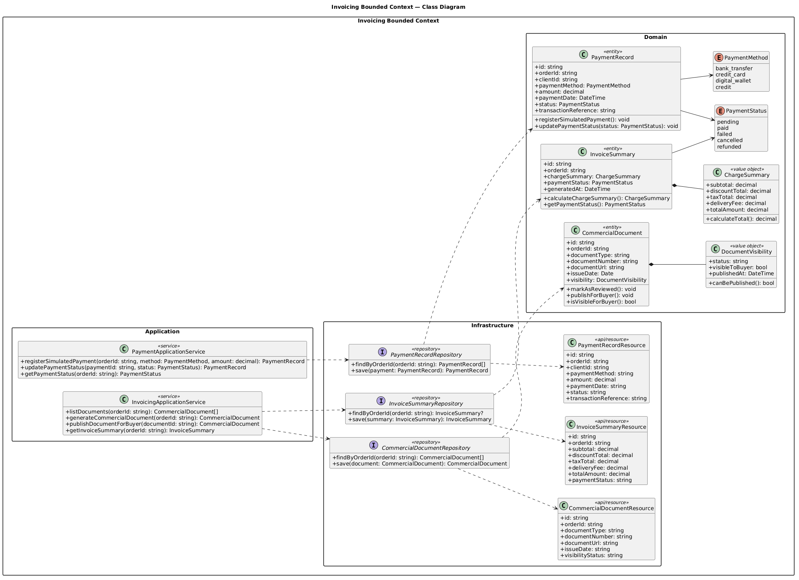

# 4.7. Software Object-Oriented Design

Esta sección presenta el diseño orientado a objetos de Nexa. El diseño está alineado con la arquitectura de software dirigida por el dominio definida en la sección 4.6 y utiliza diagramas de clases UML para representar las principales entidades, value objects, enumeraciones, servicios, repositorios y relaciones requeridas por el sistema.

El modelo orientado a objetos se organiza alrededor de los bounded contexts finales de Nexa: **Catalog Management**, **Sales**, **Warehouse**, **Logistics** e **Invoicing**. Identity and Access Management se documenta como soporte transversal porque permite el acceso seguro y la operación basada en tenants, pero no se considera uno de los bounded contexts principales del negocio.

Los diagramas también mantienen trazabilidad con el diseño de base de datos presentado en la sección 4.8. Por ello, las entidades principales representadas en los diagramas de clases tienen una estructura de persistencia correspondiente en el modelo relacional de base de datos.

## 4.7.1. Class Diagrams

Los diagramas de clases incluyen clases, atributos, operaciones, scope, enumeraciones, asociaciones y multiplicidades. El objetivo es representar la estructura orientada a implementación de cada bounded context sin perder consistencia con el lenguaje del dominio.

## 4.7. Software Object-Oriented Design

|---|---|
| Separación por bounded context | Cada diagrama agrupa clases según una responsabilidad específica del negocio. |
| Entidades | Clases con identidad y ciclo de vida, como Product, PurchaseRequest, SalesOrder, InventoryLot y DispatchOrder. |
| Value Objects | Clases sin identidad propia que describen valores del dominio, como TemperatureRange, DeliveryWindow, ChargeSummary o FEFOCriteria. |
| Enumeraciones | Estados del dominio como ProductStatus, RequestStatus, OrderStatus, DispatchStatus y PaymentStatus. |
| Multiplicidad | Las relaciones incluyen cardinalidades para evitar ambigüedad entre clases. |
| Soporte transversal | Las clases de Identity and Access se separan de los principales contextos de negocio. |
| Trazabilidad | Las clases están alineadas con los bounded contexts y las tablas de base de datos documentadas en este capítulo. |

### Consolidated Tactical Class Map

**Nota:** El mapa táctico resume la relación entre bounded contexts, aggregates y componentes de soporte transversal.

El mapa táctico de clases presenta los cinco bounded contexts principales y sus objetos de dominio más relevantes:

| Bounded Context | Clases principales |
|---|---|
| Catalog Management | Product, Category, Promotion, ProductInternalCode, TemperatureRange, ProductStatus |
| Sales | B2BClient, PurchaseRequest, SalesOrder, OrderItem, CommercialCondition, CreditWarning, OrderObservation |
| Warehouse | Warehouse, InventoryLot, Reservation, StockMovement, StockAvailability, FEFOCriteria |
| Logistics | DispatchOrder, TraceabilityEvent, DeliveryIncident, TemperatureCheck, DeliveryWindow, DeliveryEvidence |
| Invoicing | CommercialDocument, PaymentRecord, PaymentStatus, InvoiceSummary, ChargeSummary |
| Transversal Support | User, Role, Permission, Tenant, UserSession, AccessPolicy |

### Identity and Access Support Class Diagram

**Nota:** Identity and Access se representa como soporte transversal para autenticación, autorización y control de acceso basado en tenants.

El modelo de soporte de Identity and Access contiene las clases requeridas para gestionar el acceso a la plataforma. Este soporte permite la operación de la Web Application mediante la validación de usuarios, sesiones, roles y permisos.

| Clase | Tipo | Responsabilidad |
|---|---|---|
| User | Entidad | Representa un usuario de la plataforma con credenciales y datos de perfil. |
| Role | Entidad | Define el rol funcional asignado a un usuario. |
| Permission | Entidad | Representa una capacidad de acceso permitida dentro de la plataforma. |
| Tenant | Entidad | Representa la organización o cuenta que utiliza Nexa. |
| UserSession | Entidad | Representa una sesión autenticada. |
| AccessPolicy | Domain Service / lógica de soporte | Valida si un usuario puede realizar una operación. |

Este modelo no debe interpretarse como un bounded context principal. Es una capacidad de soporte transversal requerida por todos los módulos de negocio.

### Catalog Management Class Diagram

**Nota:** Catalog Management gestiona productos, categorías, promociones, visibilidad del producto e información de conservación.

Catalog Management es responsable de mantener el catálogo comercial de productos. Los productos se identifican usando un código interno de producto, no SKU, porque el lenguaje ubicuo de Nexa utiliza el concepto de código interno de producto.

| Clase | Tipo | Responsabilidad |
|---|---|---|
| Product | Entidad / Aggregate Root | Representa un producto gourmet refrigerado ofrecido en el catálogo. |
| Category | Entidad | Agrupa productos según una categoría de negocio. |
| Promotion | Entidad | Representa promociones comerciales asociadas a productos o categorías. |
| ProductInternalCode | Value Object | Encapsula el código interno usado para identificar productos. |
| TemperatureRange | Value Object | Define el rango de temperatura recomendado para la conservación. |
| ProductStatus | Enumeración | Define si el producto está activo, inactivo o no disponible. |
| CatalogApplicationService | Application Service | Coordina los casos de uso del catálogo. |
| ProductRepository | Repository Interface | Proporciona operaciones de persistencia para productos. |

Relaciones recomendadas:

| Relación | Multiplicidad | Descripción |
|---|---|---|
| Category - Product | 1 a muchos | Una categoría puede agrupar muchos productos. |
| Product - ProductInternalCode | 1 a 1 | Cada producto tiene un código interno de producto. |
| Product - TemperatureRange | 1 a 1 | Cada producto refrigerado tiene un rango de temperatura recomendado. |
| Product - Promotion | muchos a muchos o 1 a muchos | Un producto puede estar asociado a promociones según las reglas del negocio. |

### Sales Class Diagram

**Nota:** Sales gestiona clientes B2B, solicitudes de compra, validación comercial y órdenes de venta confirmadas.

Sales es el bounded context responsable del flujo comercial de pedidos. Este contexto distingue una solicitud de compra de una orden de venta confirmada. Esta distinción es importante porque no toda solicitud se convierte en orden. Una solicitud primero requiere validación comercial, revisión de crédito y coordinación de disponibilidad de stock.

| Clase | Tipo | Responsabilidad |
|---|---|---|
| B2BClient | Entidad / Aggregate Root | Representa un cliente empresarial que compra productos mediante Nexa. |
| PurchaseRequest | Entidad / Aggregate Root | Representa la solicitud inicial enviada por un comprador o registrada manualmente por un usuario comercial. |
| SalesOrder | Entidad / Aggregate Root | Representa una orden comercialmente validada y confirmada. |
| OrderItem | Entidad | Representa un producto y cantidad incluidos en una solicitud u orden. |
| CommercialCondition | Entidad / Value Object | Representa términos de pago, condiciones de crédito y reglas comerciales de un cliente. |
| CreditWarning | Entidad / Value Object | Representa una alerta relacionada con crédito o pagos pendientes. |
| OrderObservation | Entidad | Representa notas comerciales u observaciones operativas relacionadas con una solicitud u orden. |
| RequestStatus | Enumeración | Representa el estado del ciclo de vida de una solicitud de compra. |
| OrderStatus | Enumeración | Representa el estado del ciclo de vida de una orden de venta. |
| SalesApplicationService | Application Service | Coordina el envío de solicitudes, validación y confirmación de órdenes. |
| SalesOrderRepository | Repository Interface | Proporciona operaciones de persistencia para órdenes de venta. |

Relaciones recomendadas:

| Relación | Multiplicidad | Descripción |
|---|---|---|
| B2BClient - PurchaseRequest | 1 a muchos | Un cliente B2B puede enviar varias solicitudes de compra. |
| PurchaseRequest - OrderItem | 1 a muchos | Una solicitud contiene uno o más ítems solicitados. |
| PurchaseRequest - SalesOrder | 0..1 a 1 | Una solicitud validada puede convertirse en una orden de venta confirmada. |
| SalesOrder - OrderItem | 1 a muchos | Una orden contiene uno o más ítems. |
| B2BClient - CommercialCondition | 1 a 1 o 1 a muchos | Un cliente tiene condiciones comerciales usadas durante la validación. |
| PurchaseRequest - OrderObservation | 0 a muchos | Una solicitud puede contener observaciones comerciales u operativas. |

### Warehouse Class Diagram

**Nota:** Warehouse gestiona almacenes, lotes de inventario, reservas de stock, movimientos de stock y criterios FEFO.

Warehouse es responsable de la disponibilidad física y operativa de los productos. Este contexto debe representar explícitamente lotes de inventario y reservas de stock porque los productos gourmet refrigerados requieren trazabilidad por lote y fecha de vencimiento.

| Clase | Tipo | Responsabilidad |
|---|---|---|
| Warehouse | Entidad / Aggregate Root | Representa una ubicación de almacenamiento de inventario. |
| InventoryLot | Entidad | Representa stock asociado a un producto, almacén y fecha de vencimiento. |
| Reservation | Entidad | Representa stock reservado para una solicitud de compra u orden de venta. |
| StockMovement | Entidad | Representa movimientos de ingreso, salida o ajuste. |
| StockAvailability | Value Object / Read Model | Representa cantidades disponibles, reservadas y totales de stock. |
| FEFOCriteria | Value Object / Domain Service | Encapsula la lógica de selección basada en earliest-expiration-first. |
| LotStatus | Enumeración | Representa si un lote está disponible, reservado, bloqueado o vencido. |
| MovementType | Enumeración | Representa movimientos de ingreso, salida, ajuste o liberación. |
| WarehouseApplicationService | Application Service | Coordina los casos de uso de inventario. |
| InventoryLotRepository | Repository Interface | Proporciona operaciones de persistencia para lotes de inventario. |

Relaciones recomendadas:

| Relación | Multiplicidad | Descripción |
|---|---|---|
| Warehouse - InventoryLot | 1 a muchos | Un almacén contiene muchos lotes de inventario. |
| InventoryLot - Reservation | 1 a muchos | Un lote puede reservarse varias veces hasta agotar su cantidad disponible. |
| InventoryLot - StockMovement | 1 a muchos | Un lote puede tener muchos movimientos de stock. |
| Reservation - PurchaseRequest / SalesOrder | muchos a 1 | Las reservas se asocian con la demanda comercial proveniente de Sales. |
| InventoryLot - FEFOCriteria | muchos a 1 lógico | Los criterios FEFO se usan para seleccionar lotes por fecha de vencimiento. |

### Logistics Class Diagram

**Nota:** Logistics gestiona órdenes de despacho, eventos de trazabilidad, incidencias de entrega, controles de temperatura y evidencia de entrega.

Logistics es responsable de monitorear el proceso de entrega desde la programación del despacho hasta la evidencia de entrega. El modelo incluye eventos de trazabilidad y evidencia de entrega porque el negocio necesita visibilidad sobre el estado de cada orden y entrega.

| Clase | Tipo | Responsabilidad |
|---|---|---|
| DispatchOrder | Entidad / Aggregate Root | Representa un despacho creado para una orden de venta confirmada. |
| TraceabilityEvent | Entidad | Representa un evento de seguimiento registrado durante la entrega. |
| DeliveryIncident | Entidad | Representa una incidencia durante el proceso de despacho. |
| TemperatureCheck | Entidad / Value Object | Representa una lectura o control referencial de temperatura durante la entrega. |
| DeliveryWindow | Value Object | Representa el rango esperado de entrega. |
| DeliveryEvidence | Entidad | Representa evidencia de entrega, como datos de confirmación o evidencia adjunta. |
| DispatchStatus | Enumeración | Representa estados como programado, en tránsito, con incidencia, entregado o cancelado. |
| IncidentSeverity | Enumeración | Representa el nivel de severidad de una incidencia de entrega. |
| LogisticsApplicationService | Application Service | Coordina los casos de uso de despacho y trazabilidad. |
| DispatchOrderRepository | Repository Interface | Proporciona operaciones de persistencia para órdenes de despacho. |

Relaciones recomendadas:

| Relación | Multiplicidad | Descripción |
|---|---|---|
| SalesOrder - DispatchOrder | 1 a 0..1 | Una orden de venta confirmada puede generar una orden de despacho. |
| DispatchOrder - TraceabilityEvent | 1 a muchos | Un despacho tiene varios eventos de trazabilidad. |
| DispatchOrder - DeliveryIncident | 1 a muchos | Un despacho puede tener cero o más incidencias de entrega. |
| DispatchOrder - TemperatureCheck | 1 a muchos | Un despacho puede incluir varios controles de temperatura. |
| DispatchOrder - DeliveryEvidence | 1 a 0..1 | Un despacho entregado debe tener evidencia de entrega. |
| DispatchOrder - DeliveryWindow | 1 a 1 | Un despacho tiene una ventana esperada de entrega. |

### Invoicing Class Diagram

**Nota:** Invoicing gestiona documentos comerciales, resúmenes de cobro, pagos simulados y visibilidad del estado de pago.

Invoicing es responsable de la visibilidad documental y de pago de la orden. En el alcance actual, el proceso de pago se representa como un flujo simulado, mientras que el dominio mantiene el modelado de estado de pago y visibilidad de documentos comerciales.

| Clase | Tipo | Responsabilidad |
|---|---|---|
| CommercialDocument | Entidad / Aggregate Root | Representa un documento comercial asociado a una orden de venta. |
| PaymentRecord | Entidad | Representa el registro de un pago simulado. |
| PaymentStatus | Enumeración / Entidad | Representa el estado de pago actual de una orden. |
| InvoiceSummary | Entidad / Read Model | Representa el resumen de cargos comerciales de una orden. |
| ChargeSummary | Value Object | Encapsula subtotal, impuestos, descuentos, cargos de entrega y monto total. |
| DocumentVisibility | Value Object / Policy | Define si un documento es visible para el comprador. |
| PaymentMethod | Enumeración | Representa el método de pago simulado seleccionado. |
| InvoicingApplicationService | Application Service | Coordina los casos de uso de generación documental y estado de pago. |
| CommercialDocumentRepository | Repository Interface | Proporciona operaciones de persistencia para documentos comerciales. |

Relaciones recomendadas:

| Relación | Multiplicidad | Descripción |
|---|---|---|
| Clases y responsabilidades | Cada bounded context agrupa las clases que concentran la lógica principal de su parte del dominio. |
| Atributos y métodos | Las clases incluyen miembros relevantes para expresar estado y comportamiento esperado. |
| Visibilidad / scope | PlantUML representa scope cuando corresponde mediante `+` public, `-` private y `#` protected. |
| Relaciones y dirección | Las asociaciones muestran dependencias entre clases y dirección cuando el modelo la hace explícita. |
| Multiplicidad | Las relaciones indican cardinalidad cuando resulta necesaria para leer el vínculo entre entidades. |
| Enumeraciones de dominio | Los estados del dominio se modelan como enumeraciones cuando el diagrama lo requiere. |
| Separación por bounded context | Identity & Access, Catalog, Orders & Commercial Management, Inventory y Dispatch & Traceability se mantienen como límites tácticos. |

> *Nota.* Basada en los criterios UML solicitados para la sección de Class Diagrams. Elaboración propia.

*Figura. Mapa táctico general de clases por bounded context*