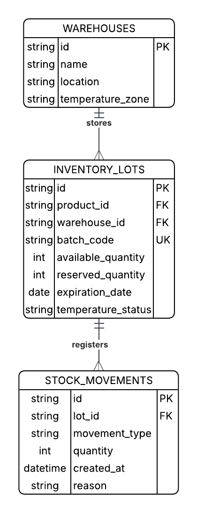
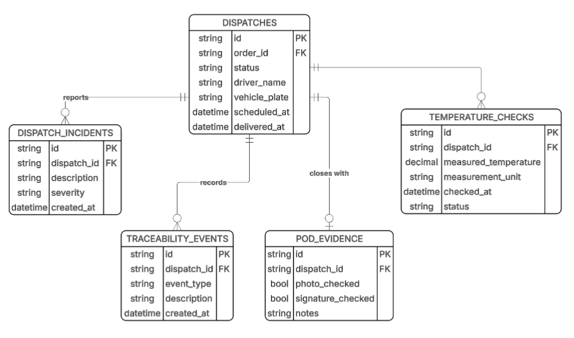
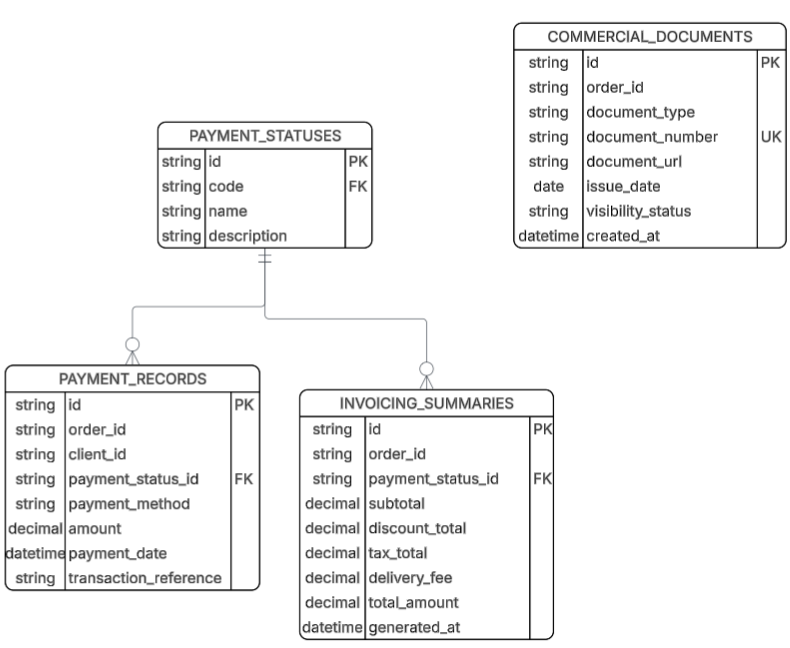
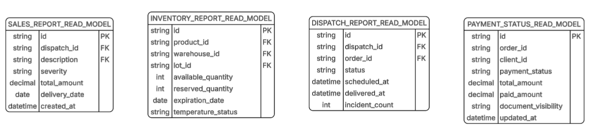

# 4.8. Database Design

Esta sección presenta el diseño de base de datos de Nexa. El modelo de base de datos está alineado con la arquitectura de software dirigida por el dominio documentada en la sección 4.6 y con el diseño orientado a objetos documentado en la sección 4.7.

El modelo de persistencia se organiza alrededor de los cinco bounded contexts principales de la plataforma: **Catalog Management**, **Sales**, **Warehouse**, **Logistics** e **Invoicing**. Además, el modelo incluye tablas de soporte transversal para identity, access y gestión de tenants. Los read models se incluyen como estructuras derivadas utilizadas para dashboards y vistas de reportes.

El diseño sigue un enfoque de base de datos relacional utilizando PostgreSQL para el backend AV2 y el despliegue académico AV2. Cada diagrama presenta tablas, columnas, primary keys, foreign keys y relaciones requeridas para persistir la información gestionada por el modelo de dominio.

Desde la perspectiva DDD, las relaciones entre tablas de distintos bounded contexts se interpretan como referencias persistentes por identificador dentro de un modelo relacional integrado. Estas relaciones no implican que los aggregates de un contexto accedan directamente al comportamiento interno de otro contexto. La coordinación entre contextos debe realizarse mediante application services, domain events, integration events o consultas controladas según el caso de uso.

## 4.8.1. Database Diagrams

Los diagramas de base de datos se agrupan por contexto para preservar los límites del dominio y mejorar la mantenibilidad. Esta estructura también ayuda a evitar que los datos comerciales, de inventario, logística e invoicing se mezclen en un mismo modelo conceptual.

| Grupo | Propósito |
|---|---|
| Identity and Access Support | Soporta la gestión de usuarios, roles, permisos, tenants y sesiones. |
| Catalog Management | Persiste productos, categorías, promociones y datos de visibilidad del catálogo. |
| Sales | Persiste clientes B2B, solicitudes de compra, órdenes de venta, ítems de orden y datos de validación comercial. |
| Warehouse | Persiste almacenes, lotes de inventario, reservas y movimientos de stock. |
| Logistics | Persiste órdenes de despacho, eventos de trazabilidad, incidencias, controles de temperatura y evidencia de entrega. |
| Invoicing | Persiste documentos comerciales, registros de pago, estados de pago y resúmenes de cobro. |
| Read Models | Persiste estructuras derivadas de consulta para reportes y dashboards. |

### Identity and Access Support Database Diagram

 > *Nota:* Identity and Access se representa como un modelo de soporte transversal, no como un bounded context principal del negocio. Elaboración propia.

El modelo de soporte de Identity and Access almacena la información requerida para autenticación, autorización y operación basada en tenants.

| Tabla | Columnas principales | Descripción |
|---|---|---|
| TENANTS | tenant_id, legal_name, trade_name, status, created_at | Almacena las empresas u organizaciones que utilizan Nexa. |
| USERS | user_id, tenant_id, first_name, last_name, email, password_hash, status, created_at | Almacena los usuarios de la plataforma. |
| ROLES | role_id, tenant_id, name, description | Almacena los roles asignados a los usuarios. |
| PERMISSIONS | permission_id, code, description | Almacena los permisos de acceso disponibles. |
| USER_ROLES | user_id, role_id | Asocia usuarios con roles. |
| ROLE_PERMISSIONS | role_id, permission_id | Asocia roles con permisos. |
| USER_SESSIONS | session_id, user_id, started_at, expires_at, status | Almacena sesiones autenticadas de usuarios. |

Restricciones principales:

| Restricción | Descripción |
|---|---|
| USERS.tenant_id FK | Referencia a TENANTS.tenant_id. |
| USER_ROLES.user_id FK | Referencia a USERS.user_id. |
| USER_ROLES.role_id FK | Referencia a ROLES.role_id. |
| ROLE_PERMISSIONS.role_id FK | Referencia a ROLES.role_id. |
| ROLE_PERMISSIONS.permission_id FK | Referencia a PERMISSIONS.permission_id. |
| USER_SESSIONS.user_id FK | Referencia a USERS.user_id. |
| USERS.email UK | Evita correos electrónicos duplicados dentro de la plataforma o dentro del alcance de tenant. |

### Catalog Management Database Diagram

 > *Nota:* Catalog Management almacena el catálogo de productos, categorías, códigos internos de producto e información de visibilidad comercial. Elaboración propia.

Catalog Management debe utilizar `internal_code` como identificador canónico para la búsqueda y reconocimiento de productos dentro del dominio de negocio. El término `sku` no debe utilizarse como término principal del dominio porque el lenguaje ubicuo de Nexa se refiere al código interno de producto.

| Tabla | Columnas principales | Descripción |
|---|---|---|
| CATEGORIES | category_id, name, description, status | Almacena categorías de productos. |
| PRODUCTS | product_id, category_id, internal_code, commercial_name, description, conservation_temperature_min, conservation_temperature_max, unit_price, status, created_at, updated_at | Almacena productos gourmet refrigerados. |
| PROMOTIONS | promotion_id, name, description, start_date, end_date, discount_percentage, status | Almacena promociones comerciales. |
| PRODUCT_PROMOTIONS | product_id, promotion_id | Asocia productos con promociones cuando corresponde. |

Restricciones principales:

| Restricción | Descripción |
|---|---|
| PRODUCTS.category_id FK | Referencia a CATEGORIES.category_id. |
| PRODUCTS.internal_code UK | Asegura que cada producto tenga un código interno único. |
| PRODUCT_PROMOTIONS.product_id FK | Referencia a PRODUCTS.product_id. |
| PRODUCT_PROMOTIONS.promotion_id FK | Referencia a PROMOTIONS.promotion_id. |
| PRODUCTS.status CHECK | Restringe el estado del producto a valores permitidos como active, inactive o unavailable. |

### Sales Database Diagram

 > *Nota:* Sales almacena clientes B2B, solicitudes de compra, validaciones comerciales, órdenes de venta confirmadas e ítems de orden. Elaboración propia.

El modelo de Sales separa las solicitudes de compra de las órdenes de venta confirmadas. Esta separación es necesaria porque el proceso de negocio requiere validación comercial antes de confirmar una orden.

| Tabla | Columnas principales | Descripción |
|---|---|---|
| B2B_CLIENTS | client_id, tenant_id, business_name, tax_identifier, contact_name, contact_email, phone, status | Almacena información de clientes B2B. |
| COMMERCIAL_CONDITIONS | condition_id, client_id, payment_terms, credit_limit, current_credit_balance, status | Almacena condiciones comerciales y de crédito de cada cliente. |
| PURCHASE_REQUESTS | request_id, client_id, requested_by_user_id, request_date, external_channel, request_status, observations | Almacena solicitudes de compra enviadas por compradores o registradas manualmente. |
| PURCHASE_REQUEST_ITEMS | request_item_id, request_id, product_id, requested_quantity, requested_unit_price | Almacena productos solicitados en cada solicitud de compra. |
| SALES_ORDERS | order_id, request_id, client_id, order_date, order_status, total_amount, confirmed_by_user_id | Almacena órdenes de venta confirmadas. |
| ORDER_ITEMS | order_item_id, order_id, product_id, quantity, unit_price, subtotal | Almacena productos incluidos en cada orden de venta confirmada. |
| CREDIT_WARNINGS | warning_id, client_id, request_id, warning_type, description, status, created_at | Almacena alertas de crédito o pago generadas durante la validación comercial. |
| ORDER_OBSERVATIONS | observation_id, order_id, user_id, description, created_at | Almacena observaciones comerciales u operativas relacionadas con una orden. |

Restricciones principales:

| Restricción | Descripción |
|---|---|
| B2B_CLIENTS.tenant_id FK | Referencia a TENANTS.tenant_id. |
| COMMERCIAL_CONDITIONS.client_id FK | Referencia a B2B_CLIENTS.client_id. |
| PURCHASE_REQUESTS.client_id FK | Referencia a B2B_CLIENTS.client_id. |
| PURCHASE_REQUEST_ITEMS.request_id FK | Referencia a PURCHASE_REQUESTS.request_id. |
| PURCHASE_REQUEST_ITEMS.product_id FK | Referencia a PRODUCTS.product_id. |
| SALES_ORDERS.request_id FK | Referencia a PURCHASE_REQUESTS.request_id. |
| SALES_ORDERS.client_id FK | Referencia a B2B_CLIENTS.client_id. |
| ORDER_ITEMS.order_id FK | Referencia a SALES_ORDERS.order_id. |
| ORDER_ITEMS.product_id FK | Referencia a PRODUCTS.product_id. |
| CREDIT_WARNINGS.client_id FK | Referencia a B2B_CLIENTS.client_id. |
| CREDIT_WARNINGS.request_id FK | Referencia a PURCHASE_REQUESTS.request_id. |
| ORDER_OBSERVATIONS.order_id FK | Referencia a SALES_ORDERS.order_id. |

### Warehouse Database Diagram

 > *Nota:* Warehouse almacena almacenes, lotes de inventario, reservas de stock y movimientos de stock. Elaboración propia.

El modelo de Warehouse se basa en lotes de inventario porque los productos gourmet refrigerados requieren control de fecha de vencimiento y trazabilidad. Las reservas se representan explícitamente para conectar la disponibilidad de stock con la demanda comercial validada.

| Tabla | Columnas principales | Descripción |
|---|---|---|
| WAREHOUSES | warehouse_id, tenant_id, name, address, status | Almacena ubicaciones de almacén. |
| INVENTORY_LOTS | lot_id, warehouse_id, product_id, lot_code, expiration_date, total_quantity, available_quantity, reserved_quantity, lot_status | Almacena inventario por producto, almacén y lote. |
| RESERVATIONS | reservation_id, lot_id, request_id, order_id, reserved_quantity, reservation_status, reserved_at, released_at | Almacena stock reservado para solicitudes de compra u órdenes de venta. |
| STOCK_MOVEMENTS | movement_id, lot_id, movement_type, quantity, reason, created_by_user_id, created_at | Almacena ingresos, salidas, ajustes y liberaciones de reserva de stock. |

Restricciones principales:

| Restricción | Descripción |
|---|---|
| WAREHOUSES.tenant_id FK | Referencia a TENANTS.tenant_id. |
| INVENTORY_LOTS.warehouse_id FK | Referencia a WAREHOUSES.warehouse_id. |
| INVENTORY_LOTS.product_id FK | Referencia a PRODUCTS.product_id. |
| RESERVATIONS.lot_id FK | Referencia a INVENTORY_LOTS.lot_id. |
| RESERVATIONS.request_id FK | Referencia a PURCHASE_REQUESTS.request_id cuando la reserva está vinculada a una solicitud. |
| RESERVATIONS.order_id FK | Referencia a SALES_ORDERS.order_id cuando la reserva está vinculada a una orden confirmada. |
| STOCK_MOVEMENTS.lot_id FK | Referencia a INVENTORY_LOTS.lot_id. |
| INVENTORY_LOTS.available_quantity CHECK | Evita disponibilidad negativa de stock. |
| RESERVATIONS.reservation_status CHECK | Restringe el estado de la reserva a active, released, consumed o cancelled. |

### Logistics Database Diagram

 > *Nota:* Logistics almacena órdenes de despacho, eventos de trazabilidad, incidencias de entrega, controles de temperatura y evidencia de entrega. Elaboración propia.

El modelo de Logistics parte de una orden de venta confirmada y registra el ciclo de vida del despacho hasta la entrega. También soporta el registro de incidencias y evidencia de entrega.

| Tabla | Columnas principales | Descripción |
|---|---|---|
| DISPATCH_ORDERS | dispatch_id, order_id, assigned_user_id, delivery_address, scheduled_date, dispatch_status, created_at | Almacena despachos generados para órdenes de venta confirmadas. |
| TRACEABILITY_EVENTS | event_id, dispatch_id, event_type, description, event_date, registered_by_user_id | Almacena eventos de seguimiento durante la entrega. |
| DISPATCH_INCIDENTS | incident_id, dispatch_id, incident_type, severity, description, incident_date, status | Almacena incidencias de entrega. |
| TEMPERATURE_CHECKS | temperature_check_id, dispatch_id, measured_temperature, measurement_unit, checked_at, status | Almacena controles referenciales de temperatura durante el despacho. |
| DELIVERY_EVIDENCE | evidence_id, dispatch_id, received_by, evidence_url, delivered_at, observations | Almacena información de evidencia de entrega. |

Restricciones principales:

| Restricción | Descripción |
|---|---|
| DISPATCH_ORDERS.order_id FK | Referencia a SALES_ORDERS.order_id. |
| DISPATCH_ORDERS.assigned_user_id FK | Referencia a USERS.user_id. |
| TRACEABILITY_EVENTS.dispatch_id FK | Referencia a DISPATCH_ORDERS.dispatch_id. |
| DISPATCH_INCIDENTS.dispatch_id FK | Referencia a DISPATCH_ORDERS.dispatch_id. |
| TEMPERATURE_CHECKS.dispatch_id FK | Referencia a DISPATCH_ORDERS.dispatch_id. |
| DELIVERY_EVIDENCE.dispatch_id FK | Referencia a DISPATCH_ORDERS.dispatch_id. |
| DISPATCH_ORDERS.dispatch_status CHECK | Restringe el estado del despacho a scheduled, in_transit, incident, delivered o cancelled. |
| DISPATCH_INCIDENTS.severity CHECK | Restringe la severidad de incidencias a valores predefinidos. |

### Invoicing Database Diagram

*Figura. Diagrama de base de datos asociado a Invoicing*

> Nota. Invoicing almacena documentos comerciales, registros de pago simulado, estados de pago y resúmenes de cobro asociados a órdenes comerciales. Elaboración propia.
El modelo de Invoicing proporciona visibilidad de pagos y documentos para el comprador. En el alcance actual, el pago se trata como un flujo simulado, pero el diseño de base de datos representa registros de pago y estado de pago para mantener el modelo extensible.

| Tabla | Columnas principales | Descripción |
|---|---|---|
| COMMERCIAL_DOCUMENTS | document_id, order_id, document_type, document_number, document_url, issue_date, visibility_status | Almacena documentos comerciales asociados a órdenes de venta. |
| PAYMENT_RECORDS | payment_id, order_id, client_id, payment_method, amount, payment_date, payment_status_id, transaction_reference | Almacena registros de pago simulado. |
| PAYMENT_STATUSES | payment_status_id, code, name, description | Almacena los estados de pago permitidos. |
| INVOICE_SUMMARIES | invoice_summary_id, order_id, subtotal, discount_total, tax_total, delivery_fee, total_amount, generated_at | Almacena resúmenes de cobro para órdenes de venta. |

Restricciones principales:

| Restricción | Descripción |
|---|---|
| COMMERCIAL_DOCUMENTS.order_id FK | Referencia a SALES_ORDERS.order_id. |
| PAYMENT_RECORDS.order_id FK | Referencia a SALES_ORDERS.order_id. |
| PAYMENT_RECORDS.client_id FK | Referencia a B2B_CLIENTS.client_id. |
| PAYMENT_RECORDS.payment_status_id FK | Referencia a PAYMENT_STATUSES.payment_status_id. |
| INVOICE_SUMMARIES.order_id FK | Referencia a SALES_ORDERS.order_id. |
| COMMERCIAL_DOCUMENTS.visibility_status CHECK | Restringe la visibilidad del documento a visible, hidden o pending. |
| PAYMENT_RECORDS.amount CHECK | Asegura que el monto de pago sea mayor o igual a cero. |

### Read Models Database Diagram

 > *Nota:* Los read models son estructuras derivadas utilizadas para dashboards, monitoreo operativo y reportes. No se consideran un bounded context separado. Elaboración propia.

Los read models consolidan información de los contextos principales para mejorar los casos de uso de consulta y reporting.

| Tabla | Contextos fuente | Descripción |
|---|---|---|
| SALES_REPORT_READ_MODEL | Sales, Catalog Management, Invoicing | Consolida información de órdenes de venta, datos del cliente, referencias de producto y estado de pago. |
| INVENTORY_REPORT_READ_MODEL | Warehouse, Catalog Management | Consolida stock de productos, vencimiento de lotes, almacén e información de reservas. |
| DISPATCH_REPORT_READ_MODEL | Logistics, Sales | Consolida estado de despacho, tiempos de entrega, incidencias y evidencia de entrega. |
| PAYMENT_STATUS_READ_MODEL | Invoicing, Sales | Consolida estado de pago de órdenes, registros de pago y visibilidad documental. |

### Full Database Diagram

 > *Nota:* El diagrama completo de base de datos consolida las principales estructuras relacionales requeridas por los cinco bounded contexts y las capacidades de soporte transversal. Elaboración propia.

La siguiente tabla resume la agrupación completa de base de datos:

| Contexto / área de soporte | Tablas principales | Relaciones principales | Propósito |
|---|---|---|---|
| Identity and Access Support | TENANTS, USERS, ROLES, PERMISSIONS, USER_ROLES, ROLE_PERMISSIONS, USER_SESSIONS | Los usuarios pertenecen a tenants; los usuarios tienen roles; los roles tienen permisos. | Permite acceso seguro y operación basada en tenants dentro de la plataforma. |
| Catalog Management | CATEGORIES, PRODUCTS, PROMOTIONS, PRODUCT_PROMOTIONS | Las categorías agrupan productos; los productos pueden relacionarse con promociones. | Persiste el catálogo comercial de productos. |
| Sales | B2B_CLIENTS, COMMERCIAL_CONDITIONS, PURCHASE_REQUESTS, PURCHASE_REQUEST_ITEMS, SALES_ORDERS, ORDER_ITEMS, CREDIT_WARNINGS, ORDER_OBSERVATIONS | Los clientes envían solicitudes; las solicitudes validadas se convierten en órdenes; las órdenes contienen ítems. | Persiste el flujo comercial de pedidos. |
| Warehouse | WAREHOUSES, INVENTORY_LOTS, RESERVATIONS, STOCK_MOVEMENTS | Los almacenes contienen lotes; los lotes tienen reservas y movimientos. | Persiste disponibilidad de stock, reservas y trazabilidad de inventario. |
| Logistics | DISPATCH_ORDERS, TRACEABILITY_EVENTS, DISPATCH_INCIDENTS, TEMPERATURE_CHECKS, DELIVERY_EVIDENCE | Las órdenes generan despachos; los despachos tienen eventos, incidencias, controles de temperatura y evidencia. | Persiste monitoreo de despacho y trazabilidad de entrega. |
| Invoicing | COMMERCIAL_DOCUMENTS, PAYMENT_RECORDS, PAYMENT_STATUSES, INVOICE_SUMMARIES | Las órdenes generan documentos, registros de pago y resúmenes de cobro. | Persiste documentos comerciales, estado de pago y resúmenes de cobro. |
| Read Models | SALES_REPORT_READ_MODEL, INVENTORY_REPORT_READ_MODEL, DISPATCH_REPORT_READ_MODEL, PAYMENT_STATUS_READ_MODEL | Los read models se derivan de tablas operativas. | Soporta dashboards y vistas de reporting. |

Este diseño de base de datos mantiene consistencia con el modelo de dominio. Los datos de producto pertenecen a Catalog Management, la demanda comercial pertenece a Sales, el control de stock pertenece a Warehouse, la trazabilidad de entrega pertenece a Logistics y la visibilidad documental/de pagos pertenece a Invoicing.

**Tabla. Agrupación de estructuras de base de datos por contexto táctico**

| Contexto / soporte táctico | Tablas principales | PK / FK principales | Relaciones relevantes | Propósito de diseño |
|---|---|---|---|---|
| Soporte transversal de acceso | `USERS`, `USER_SESSIONS` | `user_id`, `session_id`; FK de `USER_SESSIONS.user_id` a `USERS.user_id` | Un usuario puede tener varias sesiones; roles y permisos definen alcance operativo cuando el modelo los incluye | Acceso, sesión y alcance de operación para S1, S2 y S3 |
| Catalog Management | `CATEGORIES`, `PRODUCTS`, `PROMOTIONS`, `PRODUCT_PROMOTIONS` | `category_id`, `product_id`, `promotion_id`; FK de `PRODUCTS.category_id` a `CATEGORIES.category_id`; FK de `PRODUCT_PROMOTIONS.product_id` a `PRODUCTS.product_id`; FK de `PRODUCT_PROMOTIONS.promotion_id` a `PROMOTIONS.promotion_id` | Una categoría agrupa productos; cada producto se identifica mediante `internal_code`; los productos pueden asociarse a promociones cuando corresponde | Catálogo, código interno, condiciones de conservación, promociones y disponibilidad comercial visible |
| Sales | `B2B_CLIENTS`, `COMMERCIAL_CONDITIONS`, `CREDIT_WARNINGS`, `ORDERS`, `ORDER_ITEMS`, `ORDER_OBSERVATIONS` | `client_id`, `order_id`, `order_item_id`; FK de `ORDERS.client_id` a `B2B_CLIENTS.client_id`; FK de `ORDER_ITEMS.order_id` a `ORDERS.order_id`; FK de `ORDER_ITEMS.product_id` a `PRODUCTS.product_id` | Un cliente tiene condiciones comerciales; un cliente genera órdenes; una orden contiene ítems y observaciones | Solicitudes, pedidos, validación comercial, crédito y relación con cliente B2B |
| Warehouse | `WAREHOUSES`, `INVENTORY_LOTS`, `STOCK_MOVEMENTS`, `RESERVATIONS` | `warehouse_id`, `lot_id`, `movement_id`, `reservation_id`; FK de `INVENTORY_LOTS.product_id` a `PRODUCTS.product_id`; FK de `INVENTORY_LOTS.warehouse_id` a `WAREHOUSES.warehouse_id`; FK de `STOCK_MOVEMENTS.lot_id` a `INVENTORY_LOTS.lot_id`; FK de `RESERVATIONS.lot_id` a `INVENTORY_LOTS.lot_id` | Un almacén contiene lotes; un lote registra movimientos; una reserva separa stock para una solicitud u orden validada | Stock, lote, movimiento, reserva y FEFO |
| Logistics | `DISPATCHES`, `DISPATCH_INCIDENTS`, `TRACEABILITY_EVENTS`, `POD_EVIDENCE`, `TEMPERATURE_CHECKS` | `dispatch_id`, `incident_id`, `event_id`, `pod_evidence_id`, `temperature_check_id`; FK de `DISPATCHES.order_id` a `ORDERS.order_id`; FK de eventos, incidencias, evidencia y controles de temperatura a `DISPATCHES.dispatch_id` | Un despacho pertenece a una orden; un despacho contiene eventos trazables, incidencias, evidencia de entrega y controles referenciales de temperatura | Despacho, tracking, incidencias, control referencial de temperatura y evidencia de entrega |
| Invoicing | `COMMERCIAL_DOCUMENTS`, `PAYMENT_RECORDS`, `PAYMENT_STATUSES`, `INVOICE_SUMMARIES` | `document_id`, `payment_id`, `payment_status_id`, `invoice_summary_id`; FK de `COMMERCIAL_DOCUMENTS.order_id` a `ORDERS.order_id`; FK de `PAYMENT_RECORDS.order_id` a `ORDERS.order_id`; FK de `PAYMENT_RECORDS.client_id` a `B2B_CLIENTS.client_id`; FK de `PAYMENT_RECORDS.payment_status_id` a `PAYMENT_STATUSES.payment_status_id`; FK de `INVOICE_SUMMARIES.order_id` a `ORDERS.order_id` | Una orden genera documentos comerciales; los registros de pago simulado se clasifican por estado; el resumen consolida cobro, impuestos, descuentos, cargos y total de la orden | Documentos comerciales, comprobantes, estado de pago, resumen de cobro y proceso de pago simulado |
| Read models derivados | `SALES_REPORT_READ_MODEL`, `INVENTORY_REPORT_READ_MODEL`, `DISPATCH_REPORT_READ_MODEL`, `PAYMENT_STATUS_READ_MODEL` | Identificadores de lectura derivados de órdenes, lotes, despachos, documentos, pagos y estados de pago | Consolidaciones de consulta construidas desde Sales, Warehouse, Logistics e Invoicing; `PAYMENT_STATUS_READ_MODEL` resume estado de pago, monto pagado y visibilidad documental | Reportes y vistas de consulta sin crear un bounded context separado |

> *Nota:* La agrupación mantiene la relación entre modelo relacional objetivo, bounded contexts y diagramas de clases sin declarar persistencia productiva para TB1. Elaboración propia.