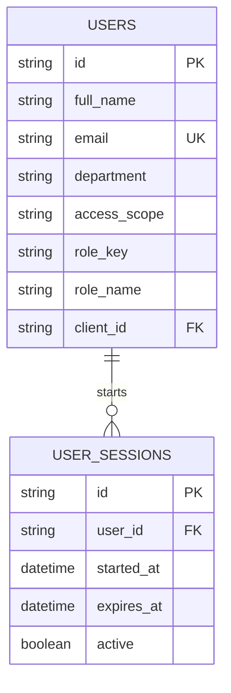
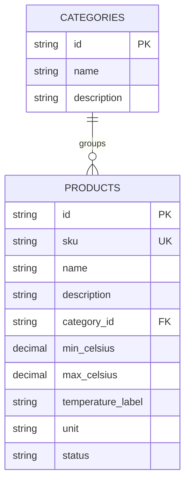
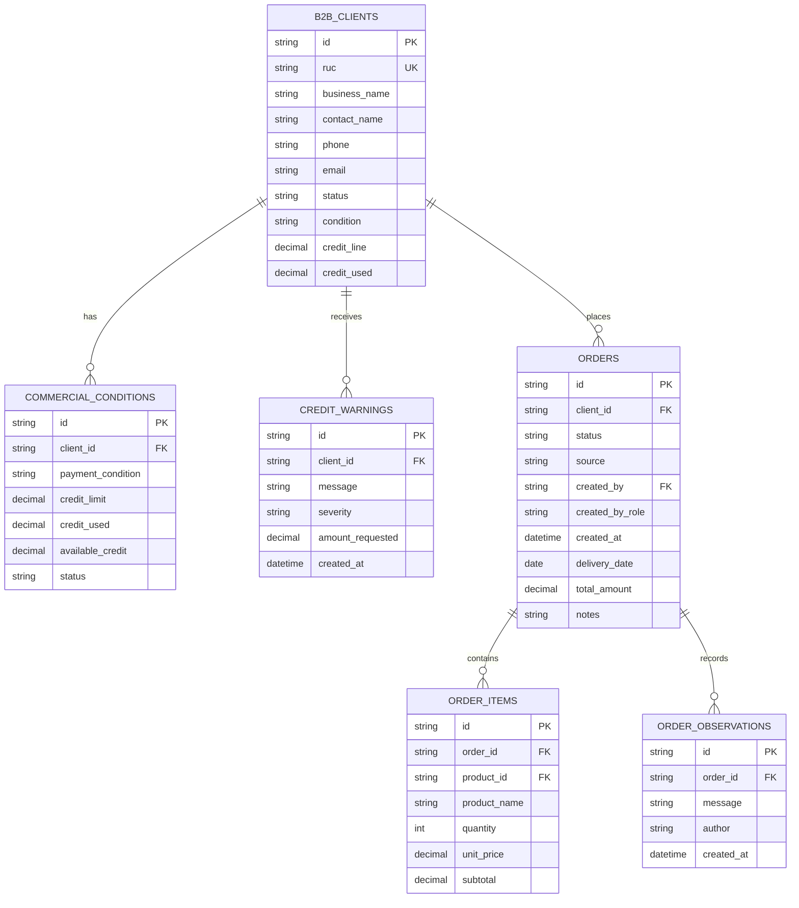
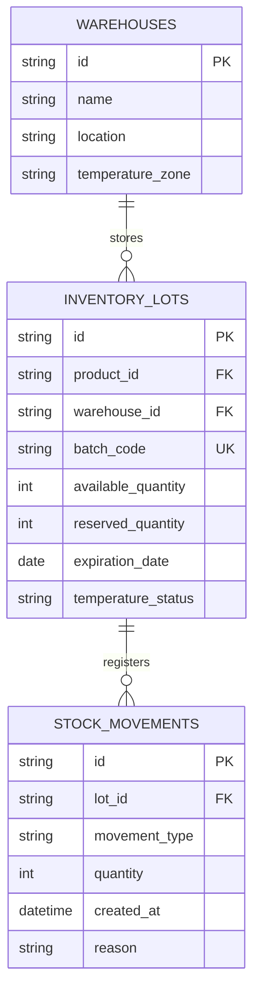
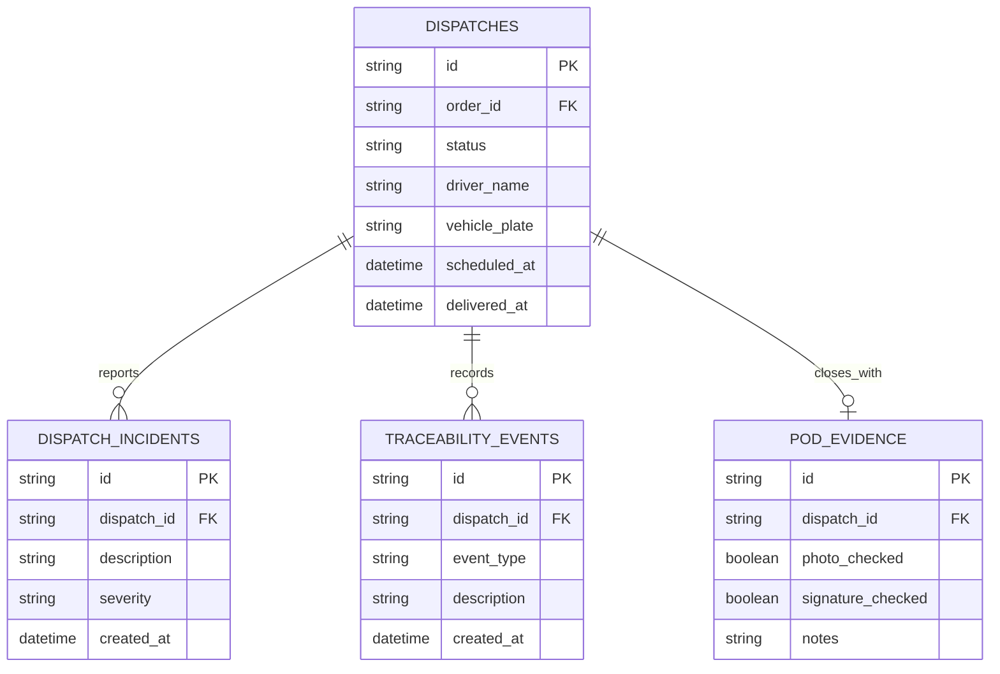
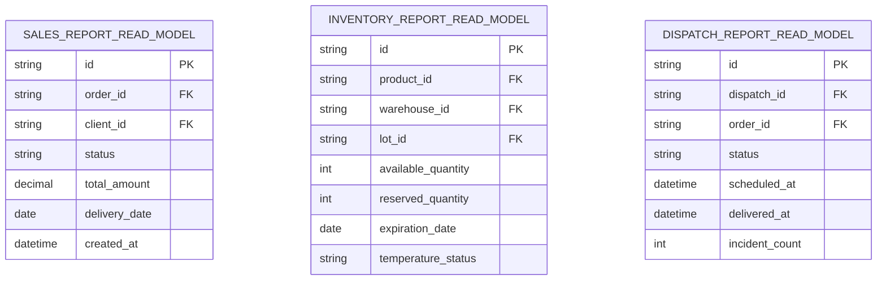
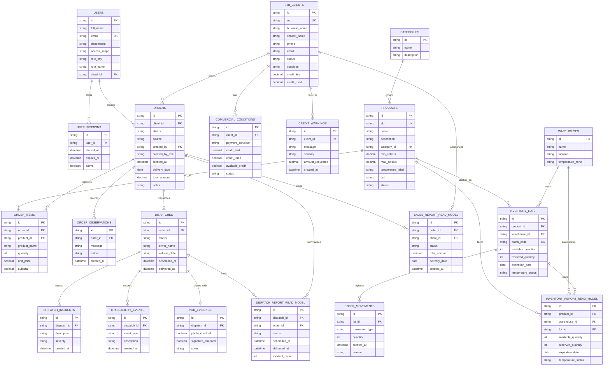

## 4.8. Database Design

El diseño de base de datos de Nexa deriva de los diagramas de clases actualizados y de los bounded contexts consolidados en el diseño táctico. Organizamos las estructuras relacionales alrededor de **Identity & Access**, **Catalog**, **Orders & Commercial Management**, **Inventory** y **Dispatch & Traceability**, manteniendo coherencia con EventStorming, DDD y C4.

El modelo conserva las relaciones necesarias para usuarios, productos, clientes B2B, condiciones comerciales, pedidos, lotes de inventario, movimientos de stock, despacho y trazabilidad. Los reportes se tratan como read models derivados de tablas operativas; no constituyen un bounded context independiente.

En TB1, la webapp utiliza Fake API como simulación para validar flujos y estructura funcional. Los siguientes diagramas representan una arquitectura relacional objetivo para una futura capa backend/base de datos; no declaran persistencia productiva, autenticación productiva ni REST API backend implementada en esta entrega.

### 4.8.1. Database Diagrams

El diseño de base de datos se presenta como un modelo relacional objetivo derivado de los diagramas de clases. Para cada estructura se especifican tablas, columnas, claves primarias, claves foráneas y restricciones relevantes. Las relaciones se representan con cardinalidades para mantener coherencia con las asociaciones del modelo orientado a objetos.

*Figura. Diagrama de base de datos del bounded context Identity & Access.*

Nota. Elaboración propia. El modelo representa el diseño relacional objetivo; no declara persistencia productiva para TB1.

*Figura. Diagrama de base de datos del bounded context Catalog.*

Nota. Elaboración propia. El modelo representa el diseño relacional objetivo; no declara persistencia productiva para TB1.

*Figura. Diagrama de base de datos del bounded context Orders & Commercial Management.*

Nota. Elaboración propia. El modelo representa el diseño relacional objetivo; no declara persistencia productiva para TB1.

*Figura. Diagrama de base de datos del bounded context Inventory.*

Nota. Elaboración propia. El modelo representa el diseño relacional objetivo; no declara persistencia productiva para TB1.

*Figura. Diagrama de base de datos del bounded context Dispatch & Traceability.*

Nota. Elaboración propia. El modelo representa el diseño relacional objetivo; no declara persistencia productiva para TB1.

*Figura. Diagrama de base de datos de read models.*

Nota. Elaboración propia. Los read models se derivan de Orders & Commercial Management, Inventory y Dispatch & Traceability; no constituyen un bounded context independiente.

*Figura. Diagrama consolidado de base de datos objetivo de Nexa.*

Nota. Elaboración propia. La vista consolidada integra las estructuras por bounded context y sus relaciones principales como diseño objetivo.

*Tabla. Agrupación de estructuras de base de datos por bounded context*

| Bounded context | Estructuras principales | Propósito de diseño |
|---|---|---|
| Identity & Access | `USERS`, `USER_SESSIONS` | Administrar usuarios, alcance de acceso, rol y sesiones como diseño objetivo de seguridad. |
| Catalog | `CATEGORIES`, `PRODUCTS` | Mantener información maestra de productos, categorías y condiciones de conservación. |
| Orders & Commercial Management | `B2B_CLIENTS`, `COMMERCIAL_CONDITIONS`, `CREDIT_WARNINGS`, `ORDERS`, `ORDER_ITEMS`, `ORDER_OBSERVATIONS` | Registrar clientes B2B, condiciones comerciales, alertas de crédito, pedidos, detalle y observaciones. |
| Inventory | `WAREHOUSES`, `INVENTORY_LOTS`, `STOCK_MOVEMENTS` | Representar almacenes, lotes, disponibilidad, reservas y movimientos de stock. |
| Dispatch & Traceability | `DISPATCHES`, `DISPATCH_INCIDENTS`, `TRACEABILITY_EVENTS`, `POD_EVIDENCE` | Registrar despacho, incidencias, eventos trazables y evidencia de cierre. |
| Read models | `SALES_REPORT_READ_MODEL`, `INVENTORY_REPORT_READ_MODEL`, `DISPATCH_REPORT_READ_MODEL` | Derivados de Orders & Commercial Management, Inventory y Dispatch & Traceability; no constituyen un bounded context independiente. |

> *Nota:* Elaboración propia. La agrupación mantiene la relación entre modelo relacional objetivo, bounded contexts y diagramas de clases sin declarar persistencia productiva para TB1.
