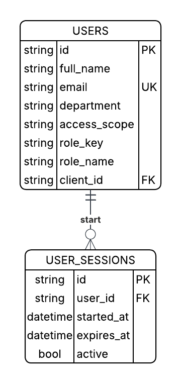
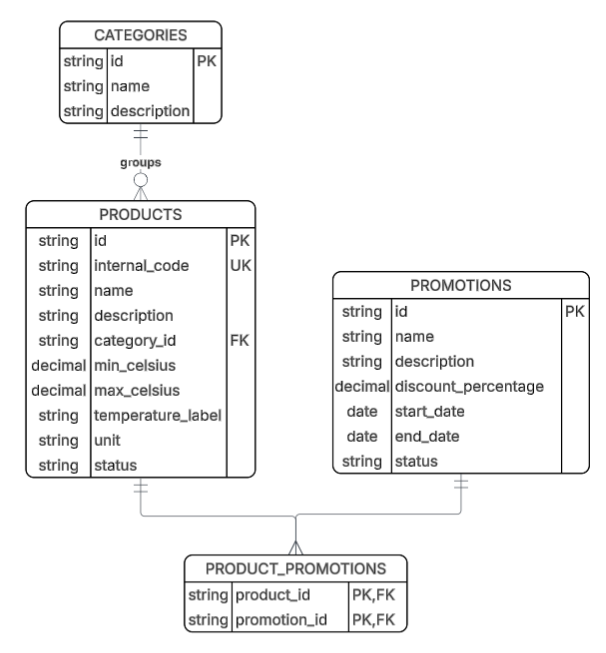
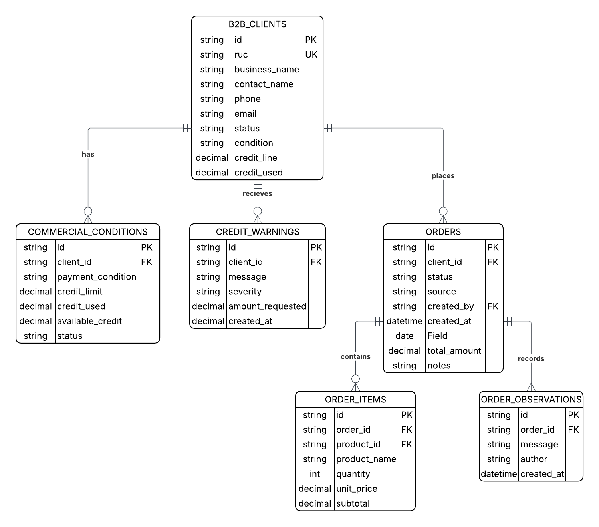
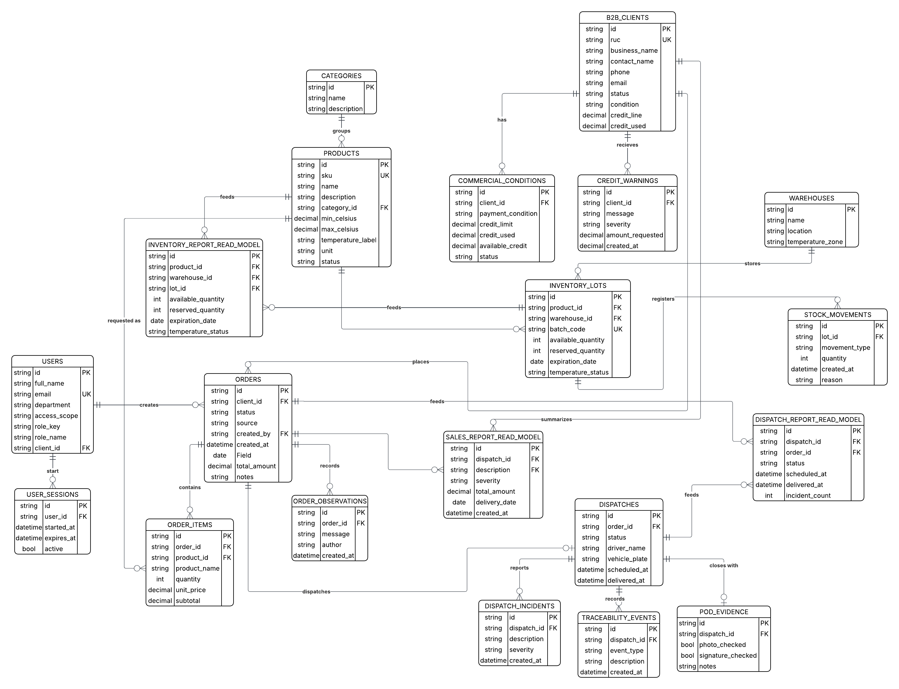

# 4.8. Database Design

Esta sección presenta el diseño de base de datos de Nexa. El modelo de base de datos está alineado con la arquitectura de software dirigida por el dominio documentada en la sección 4.6 y con el diseño orientado a objetos documentado en la sección 4.7.

El modelo de persistencia se organiza alrededor de los cinco bounded contexts principales de la plataforma: **Catalog Management**, **Sales**, **Warehouse**, **Logistics** e **Invoicing**. Además, el modelo incluye tablas de soporte transversal para identity, access y gestión de tenants. Los read models se incluyen como estructuras derivadas utilizadas para dashboards y vistas de reportes.

El diseño sigue un enfoque de base de datos relacional utilizando PostgreSQL para el backend AV2 y el despliegue académico AV2. Cada diagrama presenta tablas, columnas, primary keys, foreign keys y relaciones requeridas para persistir la información gestionada por el modelo de dominio.

Desde la perspectiva DDD, las relaciones entre tablas de distintos bounded contexts se interpretan como referencias persistentes por identificador dentro de un modelo relacional integrado. Estas relaciones no implican que los aggregates de un contexto accedan directamente al comportamiento interno de otro contexto. La coordinación entre contextos debe realizarse mediante application services, domain events, integration events o consultas controladas según el caso de uso.

## 4.8.1. Database Diagrams

Los diagramas de base de datos se agrupan por contexto para preservar los límites del dominio y mejorar la mantenibilidad. Esta estructura también ayuda a evitar que los datos comerciales, de inventario, logística e invoicing se mezclen en un mismo modelo conceptual.

| Grupo | Propósito |
|---|---|
| Identity and Access Support | Soporta la gestión de usuarios, roles, permisos, tenants y sesiones. |
| Catalog Management | Persiste productos, categorías, promociones y datos de visibilidad del catálogo. |
| Sales | Persiste clientes B2B, solicitudes de compra, órdenes de venta, ítems de orden y datos de validación comercial. |
| Warehouse | Persiste almacenes, lotes de inventario, reservas y movimientos de stock. |
| Logistics | Persiste órdenes de despacho, eventos de trazabilidad, incidencias, controles de temperatura y evidencia de entrega. |
| Invoicing | Persiste documentos comerciales, registros de pago, estados de pago y resúmenes de cobro. |
| Read Models | Persiste estructuras derivadas de consulta para reportes y dashboards. |

### Identity and Access Support Database Diagram

 > *Nota:* Identity and Access se representa como un modelo de soporte transversal, no como un bounded context principal del negocio. Elaboración propia.

El modelo de soporte de Identity and Access almacena la información requerida para autenticación, autorización y operación basada en tenants.

| Tabla | Columnas principales | Descripción |
|---|---|---|
| TENANTS | tenant_id, legal_name, trade_name, status, created_at | Almacena las empresas u organizaciones que utilizan Nexa. |
| USERS | user_id, tenant_id, first_name, last_name, email, password_hash, status, created_at | Almacena los usuarios de la plataforma. |
| ROLES | role_id, tenant_id, name, description | Almacena los roles asignados a los usuarios. |
| PERMISSIONS | permission_id, code, description | Almacena los permisos de acceso disponibles. |
| USER_ROLES | user_id, role_id | Asocia usuarios con roles. |
| ROLE_PERMISSIONS | role_id, permission_id | Asocia roles con permisos. |
| USER_SESSIONS | session_id, user_id, started_at, expires_at, status | Almacena sesiones autenticadas de usuarios. |

Restricciones principales:

| Restricción | Descripción |
|---|---|
| USERS.tenant_id FK | Referencia a TENANTS.tenant_id. |
| USER_ROLES.user_id FK | Referencia a USERS.user_id. |
| USER_ROLES.role_id FK | Referencia a ROLES.role_id. |
| ROLE_PERMISSIONS.role_id FK | Referencia a ROLES.role_id. |
| ROLE_PERMISSIONS.permission_id FK | Referencia a PERMISSIONS.permission_id. |
| USER_SESSIONS.user_id FK | Referencia a USERS.user_id. |
| USERS.email UK | Evita correos electrónicos duplicados dentro de la plataforma o dentro del alcance de tenant. |

### Catalog Management Database Diagram

 > *Nota:* Catalog Management almacena el catálogo de productos, categorías, códigos internos de producto e información de visibilidad comercial. Elaboración propia.

Catalog Management debe utilizar `internal_code` como identificador canónico para la búsqueda y reconocimiento de productos dentro del dominio de negocio. El término `sku` no debe utilizarse como término principal del dominio porque el lenguaje ubicuo de Nexa se refiere al código interno de producto.

| Tabla | Columnas principales | Descripción |
|---|---|---|
| CATEGORIES | category_id, name, description, status | Almacena categorías de productos. |
| PRODUCTS | product_id, category_id, internal_code, commercial_name, description, conservation_temperature_min, conservation_temperature_max, unit_price, status, created_at, updated_at | Almacena productos gourmet refrigerados. |
| PROMOTIONS | promotion_id, name, description, start_date, end_date, discount_percentage, status | Almacena promociones comerciales. |
| PRODUCT_PROMOTIONS | product_id, promotion_id | Asocia productos con promociones cuando corresponde. |

Restricciones principales:

| Restricción | Descripción |
|---|---|
| PRODUCTS.category_id FK | Referencia a CATEGORIES.category_id. |
| PRODUCTS.internal_code UK | Asegura que cada producto tenga un código interno único. |
| PRODUCT_PROMOTIONS.product_id FK | Referencia a PRODUCTS.product_id. |
| PRODUCT_PROMOTIONS.promotion_id FK | Referencia a PROMOTIONS.promotion_id. |
| PRODUCTS.status CHECK | Restringe el estado del producto a valores permitidos como active, inactive o unavailable. |

### Sales Database Diagram

 > *Nota:* Sales almacena clientes B2B, solicitudes de compra, validaciones comerciales, órdenes de venta confirmadas e ítems de orden. Elaboración propia.

El modelo de Sales separa las solicitudes de compra de las órdenes de venta confirmadas. Esta separación es necesaria porque el proceso de negocio requiere validación comercial antes de confirmar una orden.

| Tabla | Columnas principales | Descripción |
|---|---|---|
| B2B_CLIENTS | client_id, tenant_id, business_name, tax_identifier, contact_name, contact_email, phone, status | Almacena información de clientes B2B. |
| COMMERCIAL_CONDITIONS | condition_id, client_id, payment_terms, credit_limit, current_credit_balance, status | Almacena condiciones comerciales y de crédito de cada cliente. |
| PURCHASE_REQUESTS | request_id, client_id, requested_by_user_id, request_date, external_channel, request_status, observations | Almacena solicitudes de compra enviadas por compradores o registradas manualmente. |
| PURCHASE_REQUEST_ITEMS | request_item_id, request_id, product_id, requested_quantity, requested_unit_price | Almacena productos solicitados en cada solicitud de compra. |
| SALES_ORDERS | order_id, request_id, client_id, order_date, order_status, total_amount, confirmed_by_user_id | Almacena órdenes de venta confirmadas. |
| ORDER_ITEMS | order_item_id, order_id, product_id, quantity, unit_price, subtotal | Almacena productos incluidos en cada orden de venta confirmada. |
| CREDIT_WARNINGS | warning_id, client_id, request_id, warning_type, description, status, created_at | Almacena alertas de crédito o pago generadas durante la validación comercial. |
| ORDER_OBSERVATIONS | observation_id, order_id, user_id, description, created_at | Almacena observaciones comerciales u operativas relacionadas con una orden. |

Restricciones principales:

| Restricción | Descripción |
|---|---|
| B2B_CLIENTS.tenant_id FK | Referencia a TENANTS.tenant_id. |
| COMMERCIAL_CONDITIONS.client_id FK | Referencia a B2B_CLIENTS.client_id. |
| PURCHASE_REQUESTS.client_id FK | Referencia a B2B_CLIENTS.client_id. |
| PURCHASE_REQUEST_ITEMS.request_id FK | Referencia a PURCHASE_REQUESTS.request_id. |
| PURCHASE_REQUEST_ITEMS.product_id FK | Referencia a PRODUCTS.product_id. |
| SALES_ORDERS.request_id FK | Referencia a PURCHASE_REQUESTS.request_id. |
| SALES_ORDERS.client_id FK | Referencia a B2B_CLIENTS.client_id. |
| ORDER_ITEMS.order_id FK | Referencia a SALES_ORDERS.order_id. |
| ORDER_ITEMS.product_id FK | Referencia a PRODUCTS.product_id. |
| CREDIT_WARNINGS.client_id FK | Referencia a B2B_CLIENTS.client_id. |
| CREDIT_WARNINGS.request_id FK | Referencia a PURCHASE_REQUESTS.request_id. |
## 4.8. Database Design

El diseño de base de datos de Nexa deriva de los diagramas de clases actualizados y de los bounded contexts consolidados en el diseño táctico. Organizamos las estructuras relacionales alrededor de **Identity & Access**, **Catalog**, **Orders & Commercial Management**, **Inventory** y **Dispatch & Traceability**, manteniendo coherencia con EventStorming, DDD y C4.

El modelo conserva las relaciones necesarias para usuarios, productos, clientes B2B, condiciones comerciales, pedidos, lotes de inventario, movimientos de stock, despacho y trazabilidad. Los reportes se tratan como read models derivados de tablas operativas; no constituyen un bounded context independiente.

En TB1, la webapp utiliza Fake API como simulación para validar flujos y estructura funcional. Los siguientes diagramas representan una arquitectura relacional objetivo para una futura capa backend/base de datos; no declaran persistencia productiva, autenticación productiva ni REST API backend implementada en esta entrega.

### 4.8.1. Database Diagrams

El diseño de base de datos se presenta como un modelo relacional objetivo derivado de los diagramas de clases. Para cada estructura se especifican tablas, columnas, claves primarias, claves foráneas y restricciones relevantes. Las relaciones se representan con cardinalidades para mantener coherencia con las asociaciones del modelo orientado a objetos.

*Figura. Diagrama de base de datos del bounded context Identity & Access.*

> *Nota.* El modelo representa el diseño relacional objetivo; no declara persistencia productiva para TB1. Elaboración propia.

*Figura. Diagrama de base de datos del bounded context Catalog.*

> *Nota.* El modelo representa el diseño relacional objetivo; no declara persistencia productiva para TB1. Elaboración propia.

 > *Nota:* El diagrama completo de base de datos consolida las principales estructuras relacionales requeridas por los cinco bounded contexts y las capacidades de soporte transversal. Elaboración propia.

La siguiente tabla resume la agrupación completa de base de datos:

| Contexto / área de soporte | Tablas principales | Relaciones principales | Propósito |
|---|---|---|---|
| Identity and Access Support | TENANTS, USERS, ROLES, PERMISSIONS, USER_ROLES, ROLE_PERMISSIONS, USER_SESSIONS | Los usuarios pertenecen a tenants; los usuarios tienen roles; los roles tienen permisos. | Permite acceso seguro y operación basada en tenants dentro de la plataforma. |
| Catalog Management | CATEGORIES, PRODUCTS, PROMOTIONS, PRODUCT_PROMOTIONS | Las categorías agrupan productos; los productos pueden relacionarse con promociones. | Persiste el catálogo comercial de productos. |
| Sales | B2B_CLIENTS, COMMERCIAL_CONDITIONS, PURCHASE_REQUESTS, PURCHASE_REQUEST_ITEMS, SALES_ORDERS, ORDER_ITEMS, CREDIT_WARNINGS, ORDER_OBSERVATIONS | Los clientes envían solicitudes; las solicitudes validadas se convierten en órdenes; las órdenes contienen ítems. | Persiste el flujo comercial de pedidos. |
| Warehouse | WAREHOUSES, INVENTORY_LOTS, RESERVATIONS, STOCK_MOVEMENTS | Los almacenes contienen lotes; los lotes tienen reservas y movimientos. | Persiste disponibilidad de stock, reservas y trazabilidad de inventario. |
| Logistics | DISPATCH_ORDERS, TRACEABILITY_EVENTS, DISPATCH_INCIDENTS, TEMPERATURE_CHECKS, DELIVERY_EVIDENCE | Las órdenes generan despachos; los despachos tienen eventos, incidencias, controles de temperatura y evidencia. | Persiste monitoreo de despacho y trazabilidad de entrega. |
| Invoicing | COMMERCIAL_DOCUMENTS, PAYMENT_RECORDS, PAYMENT_STATUSES, INVOICE_SUMMARIES | Las órdenes generan documentos, registros de pago y resúmenes de cobro. | Persiste documentos comerciales, estado de pago y resúmenes de cobro. |
| Read Models | SALES_REPORT_READ_MODEL, INVENTORY_REPORT_READ_MODEL, DISPATCH_REPORT_READ_MODEL, PAYMENT_STATUS_READ_MODEL | Los read models se derivan de tablas operativas. | Soporta dashboards y vistas de reporting. |

> *Nota.* La vista consolidada integra las estructuras por bounded context y sus relaciones principales como diseño objetivo. Elaboración propia.

*Tabla. Agrupación de estructuras de base de datos por bounded context*

| Bounded context | Estructuras principales | Propósito de diseño |
|---|---|---|

> *Nota:* La agrupación mantiene la relación entre modelo relacional objetivo, bounded contexts y diagramas de clases sin declarar persistencia productiva para TB1. Elaboración propia.