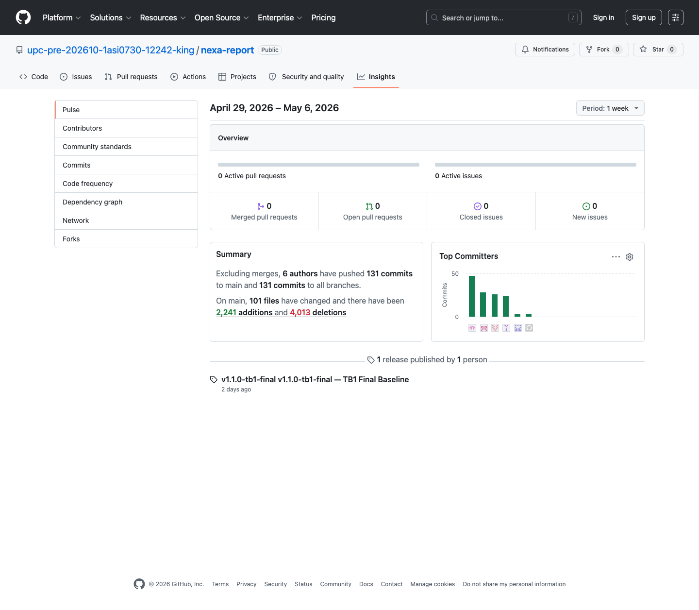

## 5.2.2. Sprint 2

El Sprint 2 corresponde al incremento TB1. El objetivo fue consolidar la Web Application con flujos internos para coordinación comercial y jefatura logística, actualizar la evidencia UX/UI y documentar la implementación frontend asociada al alcance de la entrega.

La evidencia de Sprint 2 se organiza mediante planificación, Sprint Backlog, commits, ejecución, servicios simulados, despliegue y colaboración. S1 y S2 son los flujos principales de la entrega. S3 se mantiene como alcance parcial de planificación y trazabilidad, sin declarar cobertura completa de UI ni validación final del segmento en TB1.

### 5.2.2.1. Sprint Planning 2

| Campo | Registro |
|---|---|
| Sprint # | Sprint 2 |
| Sprint Planning Background | Segundo incremento del proyecto orientado a consolidar la Web Application TB1, documentar flujos S1/S2 y actualizar evidencia de diseño, implementación y colaboración. |
| Date | 2026-04-24 |
| Time | 19:00 PM |
| Location | Reunión virtual del equipo |
| Prepared By | Yucra Sandoval, Diego Sebastian |
| Attendees (to planning meeting) | Yucra Sandoval, Diego Sebastian / Verde Bueno, Joaquín / Marín Cueva, César / Rojas Mancilla, Gerard / Torrejón, Gino |
| Sprint 1 Review Summary | Sprint 1 dejó como base la Landing Page, la estructura Docs-as-Code, el Product Backlog, las User Stories iniciales y los primeros artefactos UX/domain. |
| Sprint 1 Retrospective Summary | El equipo identificó la necesidad de ordenar mejor la evidencia por sprint, reforzar la trazabilidad con Jira y concentrar TB1 en los flujos internos de la Web Application. |
| Sprint Goal & User Stories | Web Application TB1, flujos internos S1/S2, evidencia UX/UI, Sprint Backlog y documentación de implementación. |
| Sprint 2 Goal | Consolidar la Web Application TB1 con flujos internos para coordinación comercial y jefatura logística, manteniendo trazabilidad con Product Backlog, Jira y evidencias de implementación. |
| Sprint 2 Velocity | 208 Story Points |
| Sum of Story Points | 208 Story Points |

Figura. Reunión virtual del equipo para coordinación de Sprint 2.

### 5.2.2.2. Aspect Leaders and Collaborators

| Team Member | GitHub Username | Project Management | UX/UI Design | Software Architecture | Frontend Development | Documentation |
|---|---|:---:|:---:|:---:|:---:|:---:|
| Yucra Sandoval, Diego Sebastian | DiegoS284 | L | C | C | L | L |
| Verde Bueno, Joaquín Francisco | JoaquinVerde115 | C | C | C | C | C |
| Marín Cueva, César Fernando | Cmarin2802 | C | C | C | C | C |
| Torrejón De Los Santos, Gino Rodrigo | R0obxdnt-bit | C | L | C | C | C |
| Rojas Mancilla, Gerard Gianpier | GerardRojasMancilla | C | C | L | C | C |

### 5.2.2.3. Sprint Backlog 2

El Sprint Backlog 2 concentra el trabajo realizado entre el **2026-04-24 y 2026-05-07**. El objetivo principal del sprint fue consolidar la Web Application TB1, documentar los flujos internos de S1 y S2, actualizar la evidencia UX/UI y registrar el avance de implementación correspondiente al incremento de la entrega.

**URL del board/backlog:** [Jira Backlog — Proyecto Nexa](https://team-nexa.atlassian.net/jira/software/projects/NX/boards/1/backlog)

La siguiente tabla presenta los User Stories asignados al Sprint 2 y los Work-items utilizados para descomponer el trabajo. Además de las User Stories, el sprint incluye tareas de soporte documental, configuración y evidencia necesarias para completar el incremento comprometido.

| Sprint # | User Story Id | User Story Title | Work-Item / Task Id | Task Title | Description | Estimation (Hours) | Assigned To | Status |
|---|---|---|---------------------|---|---|---:|---|---|
| Sprint 2 | N/A | Maquetar Login/Register | TS-NX-002-001       | Implementar pantalla de acceso | Construir la pantalla de login utilizada para seleccionar perfiles y acceder a los flujos internos de la Web Application. | 5.0 | César Marín | Done |
| Sprint 2 | N/A | Implementar flujo de pedido asistido para coordinación comercial | TS-NX-002-002       | Construir flujo de pedido asistido | Implementar el recorrido comercial para registrar pedidos internos desde el perfil de coordinación comercial. | 8.0 | Diego Yucra Sandoval | Done |
| Sprint 2 | N/A | Implementar vista de inventario y lotes para jefatura logística | TS-NX-002-003       | Construir vista de inventario y lotes | Implementar la vista de inventario, disponibilidad y lotes como soporte del flujo logístico. | 9.0 | Gerard Rojas Mancilla | Done |
| Sprint 2 | N/A | Implementar tablero de despacho con cierre POD simulado | TS-NX-002-004       | Construir tablero de despacho | Implementar el tablero de despacho y el cierre simulado con evidencia POD para la operación logística. | 8.0 | César Marín | Done |
| Sprint 2 | N/A | Actualizar Capítulo 4 con UX/UI y arquitectura TB1 | TS-NX-002-005       | Actualizar diseño UX/UI y arquitectura | Actualizar la documentación de UX/UI, flujos, mockups y arquitectura correspondiente al avance TB1. | 5.0 | Diego Yucra Sandoval | Done |
| Sprint 2 | N/A | Maquetar layout Dashboard B2B | TS-NX-002-006       | Construir layout principal de dashboard | Preparar la estructura visual base para dashboards y navegación de la Web Application. | 8.0 | Gerard Rojas Mancilla | Done |
| Sprint 2 | US19 | Iniciar sesión como usuario interno autorizado | NX-242              | Implementar acceso de usuario interno | Permitir el ingreso de usuarios internos mediante perfiles usados en la simulación de la Web Application. | 3.0 | Joaquín Verde | Done |
| Sprint 2 | US22 | Acceder según responsabilidad asignada | NX-245              | Configurar acceso por responsabilidad | Diferenciar el acceso de usuarios internos según el perfil operativo seleccionado. | 3.0 | Diego Yucra Sandoval | Done |
| Sprint 2 | US23 | Recibir explicación ante acceso restringido | NX-248              | Documentar restricción de acceso | Mostrar una explicación cuando un perfil intenta ingresar a una ruta que no corresponde a su responsabilidad. | 3.0 | Diego Yucra Sandoval | Done |
| Sprint 2 | US24 | Entender estado de cuenta no disponible | NX-334              | Definir estado de cuenta no disponible | Representar el estado de cuenta no disponible dentro del flujo de acceso y operación. | 3.0 | César Marín | Done |
| Sprint 2 | N/A | Documentar user goal, task flow, wireflow y user flow S1 | TS-NX-002-007       | Documentar flujo comercial S1 | Registrar la relación entre user goal, task flow, wireflow y user flow para coordinación comercial. | 5.0 | Diego Yucra Sandoval | Done |
| Sprint 2 | US39 | Registrar pedido recibido por canal externo | NX-349              | Registrar pedido interno | Permitir que coordinación comercial registre un pedido recibido por canales externos. | 5.0 | Diego Yucra Sandoval | Done |
| Sprint 2 | US40 | Seleccionar cliente durante la captura del pedido | NX-350              | Seleccionar cliente en pedido | Asociar el pedido interno con el cliente correspondiente durante la captura comercial. | 3.0 | Diego Yucra Sandoval | Done |
| Sprint 2 | US41 | Completar productos y cantidades solicitadas | NX-351              | Completar productos y cantidades | Registrar productos y cantidades solicitadas dentro del pedido asistido. | 5.0 | Diego Yucra Sandoval | Done |
| Sprint 2 | US42 | Registrar observaciones comerciales del pedido | NX-352              | Registrar observaciones comerciales | Incluir observaciones comerciales relevantes durante la captura del pedido. | 5.0 | Diego Yucra Sandoval | Done |
| Sprint 2 | US43 | Revisar pedido capturado antes de enviarlo | NX-353              | Revisar pedido antes de enviar | Permitir una revisión previa del pedido para reducir errores antes de enviarlo a revisión. | 5.0 | Diego Yucra Sandoval | Done |
| Sprint 2 | US44 | Diferenciar pedido capturado por comercial y pedido enviado por cliente | NX-354              | Diferenciar origen del pedido | Identificar si el pedido fue capturado internamente o enviado por el comprador. | 5.0 | Diego Yucra Sandoval | Done |
| Sprint 2 | US50 | Consultar historial de cambios del pedido | NX-360              | Consultar historial del pedido | Mostrar cambios relevantes asociados a un pedido para apoyar trazabilidad comercial. | 8.0 | Diego Yucra Sandoval | Done |
| Sprint 2 | US56 | Revisar condiciones comerciales del cliente | NX-366              | Revisar condiciones del cliente | Permitir la consulta de condiciones comerciales antes de confirmar acciones del pedido. | 3.0 | Gino Torrejón | Done |
| Sprint 2 | US57 | Consultar perfil comercial del cliente | NX-367              | Consultar perfil comercial | Mostrar información comercial del cliente para apoyar la captura y seguimiento del pedido. | 3.0 | Diego Yucra Sandoval | Done |
| Sprint 2 | US59 | Registrar nuevo cliente comercial | NX-369              | Registrar cliente comercial | Registrar información básica de un nuevo cliente comercial en la Web Application. | 5.0 | Gino Torrejón | Done |
| Sprint 2 | US60 | Actualizar datos de contacto del cliente | NX-370              | Actualizar datos de contacto | Actualizar información de contacto del cliente comercial. | 5.0 | César Marín | Done |
| Sprint 2 | US61 | Diferenciar clientes por tipo de negocio | NX-371              | Clasificar clientes por tipo | Diferenciar clientes según tipo de negocio para facilitar la lectura comercial. | 5.0 | Gerard Rojas Mancilla | Done |
| Sprint 2 | US69 | Revisar pedidos por estado | NX-379              | Revisar pedidos por estado | Consultar pedidos agrupados por estado para facilitar seguimiento comercial y operativo. | 5.0 | Diego Yucra Sandoval | Done |
| Sprint 2 | US71 | Consultar productos con mayor movimiento | NX-381              | Consultar productos de mayor movimiento | Revisar productos con mayor movimiento como apoyo a reportes comerciales. | 3.0 | Diego Yucra Sandoval | Done |
| Sprint 2 | N/A | Implementar reportes diferenciados para roles comercial y logístico | TS-NX-002-008       | Construir reportes por rol | Implementar reportes separados para lectura comercial y logística según perfil de usuario. | 5.0 | Diego Yucra Sandoval | Done |
| Sprint 2 | N/A | Documentar user goal, task flow, wireflow y user flow S2 | TS-NX-002-009       | Documentar flujo logístico S2 | Registrar la relación entre user goal, task flow, wireflow y user flow para jefatura logística. | 5.0 | Gerard Rojas Mancilla | Done |
| Sprint 2 | US45 | Consultar pedidos por revisar | NX-355              | Consultar pedidos por revisar | Mostrar pedidos en revisión operativa para jefatura logística. | 5.0 | Gerard Rojas Mancilla | Done |
| Sprint 2 | US46 | Revisar detalle operativo de un pedido | NX-356              | Revisar detalle operativo | Permitir la lectura del detalle operativo de un pedido antes de cambiar su estado. | 5.0 | Gerard Rojas Mancilla | Done |
| Sprint 2 | US47 | Cambiar estado de revisión del pedido | NX-357              | Cambiar estado de revisión | Actualizar el estado de revisión de un pedido durante el flujo logístico. | 5.0 | César Marín | Done |
| Sprint 2 | US48 | Registrar motivo de observación o rechazo | NX-358              | Registrar observación o rechazo | Registrar el motivo cuando un pedido queda observado o rechazado. | 5.0 | César Marín | Done |
| Sprint 2 | US49 | Priorizar pedidos por urgencia operativa | NX-359              | Priorizar pedidos urgentes | Ordenar pedidos según urgencia operativa para orientar la revisión logística. | 5.0 | Gerard Rojas Mancilla | Done |
| Sprint 2 | US51 | Consultar disponibilidad de productos | NX-361              | Consultar disponibilidad | Consultar disponibilidad de productos para apoyar decisiones de pedido y preparación. | 5.0 | César Marín | Done |
| Sprint 2 | US52 | Identificar lotes próximos a vencer | NX-362              | Identificar lotes próximos a vencer | Visualizar lotes con riesgo de vencimiento para aplicar criterio operativo. | 5.0 | Joaquín Verde | Done |
| Sprint 2 | US53 | Aplicar criterio FEFO en preparación | NX-363              | Aplicar criterio FEFO | Priorizar productos según vencimiento para reducir merma y mejorar rotación. | 5.0 | César Marín | Done |
| Sprint 2 | US54 | Revisar condición de conservación del producto | NX-364              | Revisar condición de conservación | Consultar información de conservación asociada al producto o lote. | 5.0 | Joaquín Verde | Done |
| Sprint 2 | US55 | Registrar ajuste de disponibilidad | NX-365              | Registrar ajuste de disponibilidad | Actualizar disponibilidad cuando se detecten diferencias operativas. | 8.0 | César Marín | Done |
| Sprint 2 | US58 | Priorizar productos críticos del día | NX-368              | Priorizar productos críticos | Ordenar y priorizar el manejo de productos críticos durante la jornada operativa. | 5.0 | Joaquín Verde | Done |
| Sprint 2 | US70 | Identificar incidencias recurrentes | NX-380              | Identificar incidencias recurrentes | Registrar lectura de incidencias recurrentes como parte de reportes operativos. | 5.0 | Diego Yucra Sandoval | Done |
| Sprint 2 | US68 | Consultar resumen operativo del día | NX-378              | Consultar resumen operativo | Revisar una síntesis operativa diaria para apoyar seguimiento de pedidos e inventario. | 5.0 | Diego Yucra Sandoval | Done |
| Sprint 2 | N/A | Documentar flujo S3 de portal B2B como alcance parcial TB1 | TS-NX-002-010       | Documentar flujo comprador B2B | Registrar el flujo comprador como planificación de alcance, sin afirmar implementación completa de mockups S3. | 5.0 | Diego Yucra Sandoval | Done |
| Sprint 2 | N/A | Actualizar Capítulo 5 con evidencia de Sprint 2 | TS-NX-002-011       | Actualizar evidencias de implementación TB1 | Consolidar en el reporte las evidencias del Sprint 2, incluyendo alcance, implementación y documentación del incremento. | 5.0 | Diego Yucra Sandoval | Done |
| Sprint 2 | N/A | Ruta base del enrutador para la implementación de GitHub Pages | Fix-01              | Configurar ruta base del enrutador | Ajustar la ruta base del enrutador para asegurar el correcto funcionamiento en GitHub Pages. | 5.0 | Diego Yucra Sandoval | Done |
| Sprint 2 | N/A | Rellenar la ventana gráfica en los diseños de autenticación y operaciones añadiendo flex 1 a los contenedores | Fix-02              | Ajustar estilos de contenedores | Añadir la propiedad flex 1 a los contenedores de los diseños de autenticación y operaciones para rellenar la ventana gráfica. | 5.0 | Diego Yucra Sandoval | Done |
| Sprint 2 | N/A | Añadir los atributos title y rel al enlace de vuelta al sitio en AuthLayout | Fix-03              | Añadir atributos a enlace de AuthLayout | Incorporar los atributos title y rel al enlace de retorno al sitio dentro del componente AuthLayout. | 5.0 | Diego Yucra Sandoval | Done |
| Sprint 2 | N/A | Nombre del curso y añadir los repositorios relacionados que faltan | Fix-04              | Actualizar nombre del curso y repositorios | Corregir el nombre del curso y agregar los enlaces a los repositorios relacionados faltantes en la documentación. | 5.0 | Diego Yucra Sandoval | Done |
| Sprint 2 | N/A | Aplicar la protección de ámbito y el cierre de sesión limpio | Fix-05              | Aplicar protección y cierre de sesión | Implementar la protección de ámbito en las rutas y asegurar un proceso de cierre de sesión sin errores. | 5.0 | Sin asignar | Done |
| Sprint 2 | N/A | Usar la fecha real para el cálculo de la caducidad de FEFO | Fix-06              | Corregir cálculo de caducidad FEFO | Modificar la lógica para utilizar la fecha real en el cálculo de la caducidad bajo el criterio FEFO. | 5.0 | Sin asignar | Done |
| Sprint 2 | N/A | Agregar clientId al usuario del portal; Exponer las funciones auxiliares nextOrderId/addOrder en el almacén de datos | Fix-07              | Actualizar datos de usuario y almacén | Agregar el campo clientId al usuario del portal y exponer las funciones nextOrderId y addOrder en el almacén. | 5.0 | Diego Yucra Sandoval | Done |
| Sprint 2 | N/A | Corregir el botón de detalles del pedido que no funcionaba | Fix-08              | Corregir botón de detalles del pedido | Solucionar el problema que impedía el funcionamiento correcto del botón para ver los detalles del pedido. | 5.0 | Diego Yucra Sandoval | Done |
| Sprint 2 | N/A | Sincronizar el estado del pedido en los eventos de ruta/entrega | Fix-09              | Sincronizar estado en ruta/entrega | Asegurar la correcta sincronización del estado del pedido durante los eventos de en ruta y entrega. | 5.0 | Diego Yucra Sandoval | Done |
| Sprint 2 | N/A | Alinear el flujo de estado y las protecciones de pedidos | Fix-10              | Alinear flujo de estado de pedidos | Corregir y alinear las transiciones del flujo de estado y aplicar las protecciones correspondientes a los pedidos. | 5.0 | Diego Yucra Sandoval | Done |
| Sprint 2 | N/A | Mostrar el estado del alcance prohibido | Fix-11              | Mostrar estado de alcance prohibido | Implementar la visualización adecuada para informar al usuario cuando intenta acceder a un alcance prohibido. | 5.0 | Diego Yucra Sandoval | Done |
| Sprint 2 | N/A | Mejorar el acceso al menú lateral y al modal | Fix-12              | Mejorar acceso a menú y modal | Optimizar la usabilidad y el acceso a los componentes del menú lateral y las ventanas modales. | 5.0 | Diego Yucra Sandoval | Done |
| Sprint 2 | N/A | Actualizar las fechas y agregar el favicon | Fix-13              | Actualizar fechas y favicon | Corregir las fechas mostradas en la interfaz y añadir el favicon al proyecto. | 5.0 | Diego Yucra Sandoval | Done |
| Sprint 2 | N/A | Aplicar las claves i18n al encabezado de página, los títulos de sección y las etiquetas de tabla | Fix-14              | Aplicar internacionalización (i18n) | Implementar las claves de internacionalización en el encabezado, títulos de sección y etiquetas de tablas. | 5.0 | Diego Yucra Sandoval | Done |
| Sprint 2 | N/A | Compatibilidad con las rutas de la aplicación web de GitHub Pages | Fix-15              | Corregir rutas para GitHub Pages | Ajustar la configuración de rutas para asegurar la compatibilidad total al desplegar en GitHub Pages. | 5.0 | Diego Yucra Sandoval | Done |
| Sprint 2 | N/A | Aclarar los datos simulados y el backend planificado | Fix-16              | Aclarar datos simulados y backend | Documentar y diferenciar claramente el uso de datos simulados (mock) respecto a la integración con el backend. | 5.0 | Diego Yucra Sandoval | Done |
| Sprint 2 | N/A | Reforzar los límites de los datos del portal | Fix-17              | Reforzar límites de datos | Implementar validaciones adicionales para reforzar los límites y restricciones de datos en el portal. | 5.0 | Diego Yucra Sandoval | Done |
| Sprint 2 | N/A | Alinear los enlaces externos seguros y las redirecciones | Fix-18              | Alinear enlaces y redirecciones | Revisar y asegurar que los enlaces externos y redirecciones sigan las prácticas de seguridad. | 5.0 | Diego Yucra Sandoval | Done |
| Sprint 2 | N/A | Proteger las rutas logísticas por rol | Fix-19              | Proteger rutas logísticas | Aplicar guardias de navegación para proteger el acceso a las rutas logísticas según el rol del usuario. | 5.0 | Diego Yucra Sandoval | Done |
| Sprint 2 | N/A | Persistir las actualizaciones de estado de los pedidos y los envíos simulados | Fix-20              | Persistir estado de pedidos | Configurar la persistencia de datos para las actualizaciones de estado de pedidos y envíos simulados. | 5.0 | Diego Yucra Sandoval | Done |
| Sprint 2 | N/A | Limpiar el alcance de los informes y la configuración específica de cada rol | Fix-21              | Limpiar informes y configuración de rol | Depurar y ajustar el alcance de los informes mostrados y la configuración específica asignada a cada rol. | 5.0 | Diego Yucra Sandoval | Done |

Nota. Las horas estimadas se usan para control operativo del Sprint Backlog. Los Story Points se conservan como estimación relativa dentro del Product Backlog y Jira. Elaboración propia.

### 5.2.2.4. Development Evidence for Sprint Review

La evidencia de desarrollo del Sprint 2 se organiza por repositorio para mantener trazabilidad directa con cada frente de trabajo. Los commits se verifican desde el historial público de GitHub de la organización [upc-pre-202610-1asi0730-12242-king](https://github.com/upc-pre-202610-1asi0730-12242-king).

*Commits del repositorio `nexa-webapp`*

Web Application TB1 con flujos operativos S1/S2, portal comprador S3 y Fake API.

| Repository | Branch | Commit Id | Commit Message | Commit Message Body | Commited on (Date) |
| :--- | :--- | :--- | :--- | :--- | :--- |
| `upc-pre-202610-1asi0730-12242-king/nexa-webapp` | `main` | `e7bc689` | `docs: add full README with tech stack, features, and team info` | | 25/04/2026 |
| `upc-pre-202610-1asi0730-12242-king/nexa-webapp` | `main` | `18fddff` | `chore: initialize vite project structure and configure dependencies` | | 25/04/2026 |
| `upc-pre-202610-1asi0730-12242-king/nexa-webapp` | `main` | `b01571c` | `feat(core): bootstrap Vue 3 app entry point with PrimeVue and brand preset` | | 25/04/2026 |
| `upc-pre-202610-1asi0730-12242-king/nexa-webapp` | `main` | `cd2314c` | `feat(router): configure vue-router with auth guard for ops and portal scopes` | | 25/04/2026 |
| `upc-pre-202610-1asi0730-12242-king/nexa-webapp` | `main` | `da0cea4` | `feat(tokens): define full CSS variable system with Material elevation scale` | | 25/04/2026 |
| `upc-pre-202610-1asi0730-12242-king/nexa-webapp` | `main` | `5ebf6e7` | `feat(styles): add global styles for auth, ops shell, and portal pages` | | 25/04/2026 |
| `upc-pre-202610-1asi0730-12242-king/nexa-webapp` | `main` | `39c3b5c` | `feat(i18n): implement vue-i18n with es_419 and en_US complete locale files` | | 26/04/2026 |
| `upc-pre-202610-1asi0730-12242-king/nexa-webapp` | `main` | `a309cb1` | `feat(data): seed mock cold-chain data store with products, lots, and orders` | | 26/04/2026 |
| `upc-pre-202610-1asi0730-12242-king/nexa-webapp` | `main` | `fb21cae` | `feat(cart): add shopping cart Pinia store for B2B portal` | | 26/04/2026 |
| `upc-pre-202610-1asi0730-12242-king/nexa-webapp` | `main` | `d1f004f` | `feat(shared): add order status helpers and days-until date utility` | | 26/04/2026 |
| `upc-pre-202610-1asi0730-12242-king/nexa-webapp` | `main` | `98f85aa` | `feat(http): add axios http service layer with base URL configuration` | | 26/04/2026 |
| `upc-pre-202610-1asi0730-12242-king/nexa-webapp` | `main` | `35b7c57` | `feat(iam): build auth layout with brand panel and responsive card container` | | 26/04/2026 |
| `upc-pre-202610-1asi0730-12242-king/nexa-webapp` | `main` | `da3f105` | `feat(iam): build login view with scope selector, i18n form, and auth store` | | 27/04/2026 |
| `upc-pre-202610-1asi0730-12242-king/nexa-webapp` | `main` | `609c36c` | `feat(iam): add password recovery and blocked account views` | | 27/04/2026 |
| `upc-pre-202610-1asi0730-12242-king/nexa-webapp` | `main` | `7c71d9d` | `feat(ops-layout): build sidebar shell with i18n nav, lang switcher, and ARIA roles` | | 27/04/2026 |
| `upc-pre-202610-1asi0730-12242-king/nexa-webapp` | `main` | `6096375` | `feat(dashboard): build ops dashboard with KPI cards, alert strip, and activity feed` | | 27/04/2026 |
| `upc-pre-202610-1asi0730-12242-king/nexa-webapp` | `main` | `300e368` | `feat(catalog): build product catalog with search, filters, and responsive 5-col grid` | | 28/04/2026 |
| `upc-pre-202610-1asi0730-12242-king/nexa-webapp` | `main` | `d2d3a6d` | `feat(inventory): build inventory with FEFO lot tracking and stock movement log` | | 28/04/2026 |
| `upc-pre-202610-1asi0730-12242-king/nexa-webapp` | `main` | `6a8331d` | `feat(orders): build orders list with status filters and accessible table markup` | | 28/04/2026 |
| `upc-pre-202610-1asi0730-12242-king/nexa-webapp` | `main` | `0938f04` | `feat(orders): add create-order wizard and order detail view` | | 28/04/2026 |
| `upc-pre-202610-1asi0730-12242-king/nexa-webapp` | `main` | `dbdebd7` | `feat(dispatch): build dispatch board with in-route and delivery confirmation actions` | | 28/04/2026 |
| `upc-pre-202610-1asi0730-12242-king/nexa-webapp` | `main` | `0f1c08b` | `feat(clients): replace toast stub with full client profile drawer` | Clicking a client row opens a right drawer with contact info, conditions and recent orders. | 29/04/2026 |
| `upc-pre-202610-1asi0730-12242-king/nexa-webapp` | `main` | `dc80775` | `feat(inventory): add lot detail drawer with movement history` | Lot rows open detail with metadata, stock movements and FEFO context. | 29/04/2026 |
| `upc-pre-202610-1asi0730-12242-king/nexa-webapp` | `main` | `d692ed6` | `feat(reports): add operational reports screen with KPIs, status breakdown, and FEFO alerts` | | 29/04/2026 |
| `upc-pre-202610-1asi0730-12242-king/nexa-webapp` | `main` | `a076e6a` | `fix(dispatch): sync order status on route/delivery events; fix dead order detail button` | | 29/04/2026 |
| `upc-pre-202610-1asi0730-12242-king/nexa-webapp` | `main` | `5ca8ff2` | `feat(orders): persist new order to store and navigate to its detail on confirm` | | 29/04/2026 |
| `upc-pre-202610-1asi0730-12242-king/nexa-webapp` | `main` | `6053d18` | `feat(portal): close B2B order loop — cart checkout persists to store, orders filtered by client` | | 29/04/2026 |
| `upc-pre-202610-1asi0730-12242-king/nexa-webapp` | `main` | `3a9d049` | `feat(clients): build client list with credit usage bars and contact actions` | | 29/04/2026 |
| `upc-pre-202610-1asi0730-12242-king/nexa-webapp` | `main` | `0ff014d` | `feat(portal): build B2B portal home, catalog, and orders views` | | 29/04/2026 |
| `upc-pre-202610-1asi0730-12242-king/nexa-webapp` | `main` | `b73e13d` | `feat(portal-layout): build portal topbar with cart drawer, ARIA labels, and terms footer` | | 29/04/2026 |
| `upc-pre-202610-1asi0730-12242-king/nexa-webapp` | `main` | `7a7b6b5` | `feat(settings): build company info and user role management settings view` | | 29/04/2026 |
| `upc-pre-202610-1asi0730-12242-king/nexa-webapp` | `main` | `7c06512` | `feat(profile): scaffold profile bounded context with model and service layer` | | 30/04/2026 |
| `upc-pre-202610-1asi0730-12242-king/nexa-webapp` | `main` | `9f69572` | `feat(profile): add profile Pinia store with language persistence and auth sync` | | 30/04/2026 |
| `upc-pre-202610-1asi0730-12242-king/nexa-webapp` | `main` | `95adeb4` | `feat(profile): build ProfileView with personal info, preferences, and password change` | | 30/04/2026 |
| `upc-pre-202610-1asi0730-12242-king/nexa-webapp` | `main` | `93387ba` | `ci: add GitHub Actions workflow for Vite build and Pages deployment` | | 02/05/2026 |
| `upc-pre-202610-1asi0730-12242-king/nexa-webapp` | `main` | `39d4627` | `feat(i18n): add reports section with operational KPI and table labels` | | 02/05/2026 |
| `upc-pre-202610-1asi0730-12242-king/nexa-webapp` | `main` | `340f8d6` | `fix(reports): apply i18n keys to page header, section titles, and table labels` | | 02/05/2026 |
| `upc-pre-202610-1asi0730-12242-king/nexa-webapp` | `main` | `4aa2812` | `chore(mock-api): add json-server fake api` | | 04/05/2026 |
| `upc-pre-202610-1asi0730-12242-king/nexa-webapp` | `main` | `7b9bf07` | `refactor(api): add axios services by bounded context` | | 04/05/2026 |
| `upc-pre-202610-1asi0730-12242-king/nexa-webapp` | `main` | `dbee8ed` | `refactor(stores): connect stores to application layer` | | 04/05/2026 |
| `upc-pre-202610-1asi0730-12242-king/nexa-webapp` | `main` | `ca38d05` | `feat(auth): add internal demo roles for S1 and S2 segments` | Add role-aware users to Fake API and fix auth store to reject invalid credentials. | 05/05/2026 |
| `upc-pre-202610-1asi0730-12242-king/nexa-webapp` | `main` | `ad68f8c` | `feat(login): add demo profile selector for quick role access` | | 05/05/2026 |
| `upc-pre-202610-1asi0730-12242-king/nexa-webapp` | `main` | `d6696c8` | `feat(ops): adapt navigation and dashboard by role` | Filter sidebar and mobile nav items by roleKey; reports vary by role. | 05/05/2026 |
| `upc-pre-202610-1asi0730-12242-king/nexa-webapp` | `main` | `b008b68` | `fix(dispatch): persist mock dispatch and order status updates` | Mark-in-route and POD closure PATCH the Fake API via application layer. | 05/05/2026 |
| `upc-pre-202610-1asi0730-12242-king/nexa-webapp` | `main` | `91caab8` | `refactor(webapp): align context structure with course architecture` | | 05/05/2026 |

*Commits del repositorio `nexa-website`*

Landing Page pública con conexión a webapp y mejoras SEO/a11y.

| Repository | Branch | Commit Id | Commit Message | Commit Message Body | Commited on (Date) |
| :--- | :--- | :--- | :--- | :--- | :--- |
| `upc-pre-202610-1asi0730-12242-king/nexa-website` | `main` | `22a715c` | `feat: connect login button to nexa-webapp GitHub Pages` | | 28/04/2026 |
| `upc-pre-202610-1asi0730-12242-king/nexa-website` | `main` | `c301fc2` | `style: align landing visual tokens with webapp design system` | | 28/04/2026 |
| `upc-pre-202610-1asi0730-12242-king/nexa-website` | `main` | `f21754c` | `feat(seo): add og:url and og:site_name to landing homepage` | | 28/04/2026 |
| `upc-pre-202610-1asi0730-12242-king/nexa-website` | `main` | `316d355` | `feat(seo): add og:url and og:site_name to company page` | | 28/04/2026 |
| `upc-pre-202610-1asi0730-12242-king/nexa-website` | `main` | `73b7c62` | `feat(seo): add og:url and og:site_name to platform and faq pages` | | 28/04/2026 |
| `upc-pre-202610-1asi0730-12242-king/nexa-website` | `main` | `e804da1` | `style(tokens): align text, border, surface and easing tokens with webapp design system` | | 28/04/2026 |
| `upc-pre-202610-1asi0730-12242-king/nexa-website` | `main` | `9c57146` | `fix(website): align TB1 links and roadmap copy` | | 29/04/2026 |
| `upc-pre-202610-1asi0730-12242-king/nexa-website` | `main` | `1883c50` | `fix(seo): add robots and theme-color meta to landing homepage` | | 02/05/2026 |
| `upc-pre-202610-1asi0730-12242-king/nexa-website` | `main` | `aa9b1f1` | `fix(seo): add robots and theme-color meta to platform and faq pages` | | 02/05/2026 |
| `upc-pre-202610-1asi0730-12242-king/nexa-website` | `main` | `972c842` | `fix(seo): add robots and theme-color meta to all solution subpages` | | 02/05/2026 |
| `upc-pre-202610-1asi0730-12242-king/nexa-website` | `main` | `8f0119b` | `fix(seo): add robots and theme-color meta to company page` | | 02/05/2026 |
| `upc-pre-202610-1asi0730-12242-king/nexa-website` | `main` | `13ea635` | `fix(landing): align ctas with webapp routes` | | 02/05/2026 |
| `upc-pre-202610-1asi0730-12242-king/nexa-website` | `main` | `4951d66` | `fix(landing): add favicon and tighten tb1 copy` | | 02/05/2026 |
| `upc-pre-202610-1asi0730-12242-king/nexa-website` | `main` | `a6b9e3b` | `fix(readme): restore website presentation style` | | 03/05/2026 |

*Commits del repositorio `nexa-report` (Sprint 2)*

Documentación académica del proyecto actualizada para TB1.

| Repository | Branch | Commit Id | Commit Message | Commit Message Body | Commited on (Date) |
| :--- | :--- | :--- | :--- | :--- | :--- |
| `upc-pre-202610-1asi0730-12242-king/nexa-report` | `main` | `f6de96c` | `docs(ch4): rebuild webapp ux section structure and wireframe tables` | | 05/05/2026 |
| `upc-pre-202610-1asi0730-12242-king/nexa-report` | `main` | `e8e7afa` | `docs(ch4): align webapp flows with user goals` | | 05/05/2026 |
| `upc-pre-202610-1asi0730-12242-king/nexa-report` | `main` | `f3e6296` | `docs(ch4): update webapp wireflow documentation with three-persona flow` | | 05/05/2026 |
| `upc-pre-202610-1asi0730-12242-king/nexa-report` | `main` | `22efcb2` | `docs(ch4): add current webapp mockup selections` | | 05/05/2026 |
| `upc-pre-202610-1asi0730-12242-king/nexa-report` | `main` | `b7c7ac9` | `docs(ch5): document sprint two tb1 evidence` | | 05/05/2026 |
| `upc-pre-202610-1asi0730-12242-king/nexa-report` | `main` | `1193a5f` | `docs(ch4): clarify buyer portal scope in ux flows` | | 06/05/2026 |
| `upc-pre-202610-1asi0730-12242-king/nexa-report` | `main` | `7677b49` | `docs(ch5): clarify fake api and service documentation scope` | | 06/05/2026 |
| `upc-pre-202610-1asi0730-12242-king/nexa-report` | `main` | `930d802` | `docs(ch4): add lucid userflow visual evidence` | | 06/05/2026 |
| `upc-pre-202610-1asi0730-12242-king/nexa-report` | `main` | `9a44aaa` | `fix(report): update cover metadata for TB1` | | 07/05/2026 |
| `upc-pre-202610-1asi0730-12242-king/nexa-report` | `main` | `076d85c` | `refactor(report): split implementation evidence by sprint` | | 07/05/2026 |
| `upc-pre-202610-1asi0730-12242-king/nexa-report` | `main` | `00fc933` | `fix(sprint): align sprint planning tables with statement` | | 07/05/2026 |
| `upc-pre-202610-1asi0730-12242-king/nexa-report` | `main` | `9815e4c` | `fix(scm): complete conventions and LACX format` | | 07/05/2026 |
| `upc-pre-202610-1asi0730-12242-king/nexa-report` | `main` | `fe79939` | `docs(sprint): add formal sprint backlog evidence` | | 07/05/2026 |
| `upc-pre-202610-1asi0730-12242-king/nexa-report` | `main` | `4574130` | `docs(backlog): add Jira evidence for product backlog` | | 07/05/2026 |
| `upc-pre-202610-1asi0730-12242-king/nexa-report` | `main` | `1033376` | `fix(ux): replace mermaid user flows with visual evidence` | | 07/05/2026 |
| `upc-pre-202610-1asi0730-12242-king/nexa-report` | `main` | `6ff1c44` | `docs(report): polish TB1 report format and evidence alignment` | | 08/05/2026 |
| `upc-pre-202610-1asi0730-12242-king/nexa-report` | `main` | `095a80f` | `docs(report): restore statement formats and strengthen TB1 evidence` | | 08/05/2026 |
| `upc-pre-202610-1asi0730-12242-king/nexa-report` | `main` | `0b8c920` | `chore(assets): reorganize report images and import updated artifacts` | | 08/05/2026 |
| `upc-pre-202610-1asi0730-12242-king/nexa-report` | `main` | `67d8ddd` | `docs(report): update UX documentation with refreshed artifacts` | | 08/05/2026 |
| `upc-pre-202610-1asi0730-12242-king/nexa-report` | `main` | `1cda3e6` | `docs(architecture): update class and database design artifacts` | | 08/05/2026 |
| `upc-pre-202610-1asi0730-12242-king/nexa-report` | `main` | `ee625e9` | `docs(report): strengthen architecture evidence and fake api deployment` | | 09/05/2026 |
| `upc-pre-202610-1asi0730-12242-king/nexa-report` | `main` | `bc103eb` | `chore(assets): add database images folder` | | 09/05/2026 |
| `upc-pre-202610-1asi0730-12242-king/nexa-report` | `main` | `1044388` | `docs(ch4): update database diagrams` | | 09/05/2026 |
| `upc-pre-202610-1asi0730-12242-king/nexa-report` | `main` | `ed64d57` | `chore(report): correction of notes in database diagrams` | | 10/05/2026 |
| `upc-pre-202610-1asi0730-12242-king/nexa-report` | `main` | `acdd810` | `docs(report): update solution profile with user friction details` | | 10/05/2026 |
| `upc-pre-202610-1asi0730-12242-king/nexa-report` | `main` | `2e73b6c` | `docs(ch2): update 2-2-interviews` | | 10/05/2026 |

*Commits del repositorio `nexa-platform`*

Repositorio base para el backend planificado.

| Repository | Branch | Commit Id | Commit Message | Commit Message Body | Commited on (Date) |
| :--- | :--- | :--- | :--- | :--- | :--- |
| `upc-pre-202610-1asi0730-12242-king/nexa-platform` | `main` | `53a8069` | `chore(platform): reset repository to tb1 planned scope` | | 03/05/2026 |

Las siguientes capturas son evidencia visual complementaria del historial de commits en GitHub.

Figura. Historial de commits registrados en `nexa-report` durante TB1. Elaboración propia.

Figura. Historial de commits registrados en `nexa-webapp` durante TB1. Elaboración propia.

Figura. Historial de commits registrados en `nexa-website` durante TB1. Elaboración propia.

Figura. Actividad y contribución en GitHub durante TB1. Elaboración propia.

#### Commit Evidence for Sprint 2 / TB1

La siguiente evidencia de commits corresponde a una selección representativa del trabajo realizado hasta el corte TB1. No reemplaza el historial completo de GitHub; resume los commits más relevantes para la trazabilidad del Sprint 2 y la implementación/documentación asociada.

> **Nota:** Esta es una selección representativa, no exhaustiva. El historial completo está disponible en cada repositorio de la organización [upc-pre-202610-1asi0730-12242-king](https://github.com/upc-pre-202610-1asi0730-12242-king).

*Tabla. Commits representativos — nexa-report (TB1, selección representativa)*

| Fecha | Hash | Autor | Tipo | Descripción | Alcance |
|---|---|---|---|---|---|
| 2026-05-12 | `7d11c12` | JoaquinVB115 | docs | Revisión de nota en pantalla principal del prototipo webapp | ch4 |
| 2026-05-11 | `0e1e573` | Diego Y. Sandoval | docs | Incorporación de enlaces activos y alineación de descripciones en README | readme |
| 2026-05-11 | `ef65254` | DiegoS284 | fix | Corrección de niveles de encabezado en secciones de evidencia de sprint | report |
| 2026-05-11 | `54f5182` | DiegoS284 | docs | Adición de tablas de evidencia de desarrollo de Sprint 2 por repositorio | chapter-5 |
| 2026-05-10 | `7481b28` | Cmarin2802 | chore | Corrección de notas en diagramas de base de datos | report |
| 2026-05-10 | `c06a098` | Gino Torrejon | docs | Actualización de transcripciones de entrevistas (sección 2.2) | ch2 |
| 2026-05-09 | `7da9097` | DiegoS284 | docs | Refuerzo de evidencia de arquitectura y despliegue de API simulada | report |
| 2026-05-09 | `be718c8` | DiegoS284 | docs | Actualización de artefactos de diseño de clases y base de datos | architecture |
| 2026-05-08 | `152217a` | DiegoS284 | docs | Restauración de formatos de enunciado y refuerzo de evidencia TB1 | report |
| 2026-05-07 | `6a3c515` | DiegoS284 | fix | Eliminación de afirmaciones GitFlow no respaldadas para TB1 | scm |
| 2026-05-07 | `a8f6951` | DiegoS284 | docs | Incorporación de evidencia formal del Sprint Backlog | sprint |
| 2026-05-07 | `b118a69` | DiegoS284 | docs | Adición de evidencia Jira para el Product Backlog | backlog |
| 2026-05-06 | `fca1030` | DiegoS284 | docs | Alineación del Lenguaje Ubicuo con términos del dominio | ch2 |
| 2026-05-05 | `ec8252e` | DiegoS284 | docs | Documentación de evidencia de Sprint 2 para TB1 | ch5 |

*Tabla. Commits representativos — nexa-webapp (TB1, selección representativa)*

| Fecha | Hash | Autor | Tipo | Descripción | Alcance |
|---|---|---|---|---|---|
| 2026-05-12 | `da87629` | Diego Y. Sandoval | release | Preparación para despliegue en Render y Firebase — versión TB1 | deploy |
| 2026-05-12 | `276d646` | Diego Y. Sandoval | refactor | Asignación de recursos de API a entidades de dominio mediante ensambladores | webapp |
| 2026-05-12 | `1e96ac5` | Diego Y. Sandoval | feat | Configuración de Firebase Hosting con API simulada estática JSON para TB1 | deploy |
| 2026-05-11 | `98867ff` | Diego Y. Sandoval | refactor | Renombrado de contextos acotados con nombres específicos del dominio | webapp |
| 2026-05-11 | `b6c382f` | Joaquín Verde | refactor | Incorporación de recursos de aplicación y ensambladores | webapp |
| 2026-05-11 | `3cd8ec3` | César Marín | refactor | Adición de capa de modelo de dominio para los contextos acotados | webapp |
| 2026-05-05 | `9c97f8e` | Diego Y. Sandoval | feat | Registro del origen del pedido asistido y visualización del creador | orders |
| 2026-05-05 | `de06f20` | Diego Y. Sandoval | feat | Adaptación de navegación y panel según el rol del usuario | ops |
| 2026-05-04 | `459f6d8` | DiegoS284 | chore | Incorporación del API simulada con json-server | mock-api |
| 2026-05-04 | `fb3a8f1` | DiegoS284 | refactor | Adición de servicios Axios por contexto acotado | api |
| 2026-05-02 | `93387ba` | DiegoS284 | ci | Configuración de flujo de integración continua para construcción Vite y despliegue | ci |
| 2026-04-29 | `d692ed6` | DiegoS284 | feat | Pantalla de analítica operativa con indicadores, estados y alertas FEFO | reports |
| 2026-04-28 | `d2d3a6d` | DiegoS284 | feat | Vista de inventario con seguimiento de lotes FEFO y registro de movimientos | inventory |
| 2026-04-25 | `18fddff` | DiegoS284 | chore | Inicialización de la estructura del proyecto con Vite y configuración de dependencias | core |

*Tabla. Commits representativos — nexa-website (TB1, selección representativa)*

| Fecha | Hash | Autor | Tipo | Descripción | Alcance |
|---|---|---|---|---|---|
| 2026-05-11 | `c296b5f` | Diego Y. Sandoval | docs | Incorporación de enlace activo de la webapp y alineación de descripciones | readme |
| 2026-05-03 | `76a3914` | DiegoS284 | chore | Limpieza de presentación del repositorio para la entrega TB1 | repo |
| 2026-05-02 | `13ea635` | Diego Y. Sandoval | fix | Alineación de llamadas a la acción con rutas de la webapp | landing |
| 2026-05-02 | `8f0119b` | Rojas Mancilla, Gerard Gianpier | fix | Adición de metaetiquetas robots y theme-color en página de empresa | seo |
| 2026-05-02 | `aa9b1f1` | Torrejon De Los Santos, Gino Rodrigo | fix | Adición de metaetiquetas en páginas de plataforma y preguntas frecuentes | seo |
| 2026-05-02 | `1883c50` | Marin Cueva, Cesar Fernando | fix | Adición de metaetiquetas en la página principal | seo |
| 2026-04-28 | `22a715c` | Diego Y. Sandoval | feat | Conexión del botón de inicio de sesión con la webapp en GitHub Pages | landing |
| 2026-04-28 | `e804da1` | Torrejon De Los Santos, Gino Rodrigo | style | Alineación de variables visuales del sitio con el sistema de diseño | tokens |

*Tabla. Commits representativos — nexa-platform (TB1, selección representativa)*

| Fecha | Hash | Autor | Tipo | Descripción | Alcance |
|---|---|---|---|---|---|
| 2026-05-11 | `c247e87` | Diego Y. Sandoval | docs | Adición de estrategia de ramas y alineación de tabla de equipo | readme |
| 2026-05-03 | `eb9ea8d` | DiegoS284 | chore | Restablecimiento del repositorio al alcance planificado para TB1 | platform |
| 2026-05-02 | `fa02e37` | Verde Bueno, Joaquin Francisco | feat | Registro de la entidad Lot en DbContext con índice único de código de lote | infrastructure |
| 2026-05-02 | `14714af` | Torrejon De Los Santos, Gino Rodrigo | feat | Adición de ProductRepository con filtros de categoría y estado | infrastructure |
| 2026-05-02 | `94cdb1b` | Cmarin2802 | feat | Estructura del InventoryController con endpoints de lotes y FEFO | api |
| 2026-05-02 | `dcbef85` | Rojas Mancilla, Gerard Gianpier | feat | Entidad Lot con soporte FEFO y seguimiento de disponibilidad | domain |
| 2026-04-29 | `c8b4853` | DiegoS284 | feat | ProductsController y OrdersController con operaciones CRUD y transiciones de estado | api |
| 2026-04-26 | `c13b458` | Rojas Mancilla, Gerard Gianpier | feat | Estructura de entidades Product y Order con invariantes y lógica de stock | domain |

#### Contribution Evidence by Repository

*Tabla. Contribución por colaborador al cierre de TB1*

| Repositorio | Colaborador | Cantidad de commits | Área principal |
|---|---|---:|---|
| `nexa-report` | DiegoS284 / Diego Y. Sandoval | 172 | Documentación, arquitectura, SCM, evidencia de sprint |
| `nexa-report` | Gino Torrejon / Gino Torrejón | 95 | Entrevistas, portada, colaboración |
| `nexa-report` | Cmarin2802 / Cesar Marin | 116 | Capítulos de diseño, correcciones, recursos visuales |
| `nexa-report` | Joaquin Verde Bueno / JoaquinVB115 | 109 | UX, perfil de equipo, perfil de solución |
| `nexa-report` | Gerard Rojas Mancilla | 58 | Arquitectura, historias de usuario, correcciones |
| `nexa-webapp` | Diego Y. Sandoval / DiegoS284 | 94 | Integración DDD, despliegue, flujos operativos |
| `nexa-webapp` | JoaquinVerde115 / Joaquín Verde | 15 | Recursos, ensambladores, internacionalización |
| `nexa-webapp` | Cmarin2802 / César Marín | 15 | Modelo de dominio, internacionalización |
| `nexa-webapp` | R0obxdnt-bit (Gino Torrejón) | 14 | Documentación DDD, internacionalización |
| `nexa-webapp` | GerardRojasMancilla | 12 | Versión, correcciones, limpieza |
| `nexa-website` | Diego Y. Sandoval / DiegoS284 | 38 | README, landing, despliegue, rutas |
| `nexa-website` | Torrejon De Los Santos, Gino Rodrigo | 12 | SEO, variables de diseño |
| `nexa-website` | Verde Bueno, Joaquin Francisco | 10 | SEO, variables de diseño |
| `nexa-website` | Cmarin28 / Marin Cueva, Cesar Fernando | 10 | SEO, correcciones |
| `nexa-website` | GerardRojasMancilla / Rojas Mancilla, Gerard Gianpier | 12 | SEO, correcciones |
| `nexa-platform` | DiegoS284 / Diego Y. Sandoval | 7 | Estructura inicial, ajuste de alcance, README |
| `nexa-platform` | Verde Bueno, Joaquin Francisco | 2 | Infraestructura, DbContext |
| `nexa-platform` | Torrejon De Los Santos, Gino Rodrigo | 2 | Repositorio, interfaces |
| `nexa-platform` | Cmarin2802 | 2 | Controladores, DTOs |
| `nexa-platform` | Rojas Mancilla, Gerard Gianpier | 2 | Entidades de dominio |

La evidencia de commits refleja el estado de los repositorios al cierre de documentación TB1. Capturas de despliegue o disponibilidad de plataforma se documentan por separado.

#### Traceability between Work Fronts and Commits

*Tabla. Correspondencia entre frentes de trabajo y trazabilidad usada en TB1*

| Frente de trabajo | Evidencia de trazabilidad |
|---|---|
| Reestructuración de segmentos objetivo | Commits documentales en el historial del informe |
| Actualización de needfinding | Commits documentales y referencias en Capítulo II |
| Reescritura de User Stories | Commits documentales y tabla de User Stories |
| Priorización del Product Backlog | Commits documentales y evidencia Jira en Capítulo III |
| Implementación de Landing Page AV1 | Historial del repositorio del sitio público y evidencia Sprint 1 |
| Implementación base de Web Application TB1 | Historial del repositorio webapp y evidencia Sprint 2 |
| Configuración de API simulada / JSON Server | Documentación del alcance simulado TB1 |
| Evidencia de Sprint 2 | Commits del informe y capturas Jira integradas |
| Limpieza final de entrega | Commits convencionales y consolidación en `main` |
| Corrección crítica de redacción o nombres | Commits convencionales sobre el informe |

En la práctica, `nexa-report`, `nexa-website` y `nexa-webapp` funcionan como flujos sincronizados: el primero preserva justificación ingenieril, el segundo sostiene la capa pública y el tercero concentra la experiencia operativa TB1. Esta separación reduce ruido entre documentación y código y facilita relacionar commits, artefactos de diseño y despliegue público dentro de un mismo sprint.

La futura capa backend sigue nombrada en backlog, arquitectura y diseño, pero no se presenta como implementada. Por ello, el capítulo distingue webapp TB1 con API simulada de servicios productivos futuros.

### 5.2.2.5. Execution Evidence for Sprint Review

| Área ejecutada | Estado TB1 defendible | Evidencia de repositorio | Límite explícito |
|---|---|---|---|
| Landing → Webapp | CTAs y links alineados hacia GitHub Pages webapp | `nexa-website`: `22a715c`, `13ea635`, `4951d66` | No implica servicios productivos |
| Login demo | Selector de perfiles y acceso rápido para revisión académica | `nexa-webapp`: `ca38d05`, `ad68f8c` | No es autenticación productiva |
| Ops S1/S2 | Dashboard, navegación adaptada, clientes, pedidos, inventario, despacho y reportes | `nexa-webapp`: commits de dashboard/orders/inventory/dispatch/reports | Role-aware frontend, no IAM corporativo |
| Portal comprador S3 | Recorrido comprador documentado como planificación de catálogo, pedido y seguimiento | FigJam y documentación de sección 4.4 | No declara pantallas webapp implementadas ni validación final de S3 en TB1 |
| Fake API | JSON Server y servicios por bounded context | `nexa-webapp`: `4aa2812`, `7b9bf07`, `dbee8ed`, `6bffa73`; configuración Render documentada | No es API final |
| UX/UI reportada | FigJam wireflows y Lucidchart userflows, mockups actuales y evidencia por user goal | `nexa-report`: commits Ch4 del 5 de mayo | No sustituye un export completo de FigJam |

### 5.2.2.6. Services Documentation Evidence for Sprint Review

Para Sprint 2, la evidencia de servicios se aborda como soporte simulado para la Web Application, sin declarar todavía una RESTful API productiva. Esta evidencia no reemplaza la documentación OpenAPI solicitada para el Web Service interno en hitos posteriores; solo registra el soporte usado por la Web Application en TB1.

| Capa | Estado TB1 | Evidencia | Nota de alcance |
|---|---|---|---|
| Fake API | Soporte simulado para la Web Application | `mock-api/db.json`, JSON Server, configuración Render y commits de 04/05/2026 | Sirve para revisión académica y pruebas frontend |
| Servicios cliente | Organización interna de consumo de datos simulados | commits `7b9bf07` y `dbee8ed` | Preparan transición hacia API interna |
| Backend ASP.NET Core | Planificado | `nexa-platform` y arquitectura objetivo | No implementado productivamente en TB1 |
| Base de datos relacional | Modelo objetivo | Capítulo 4.8 | No implementada productivamente en TB1 |
| POD | Mock confirmation | flujo de despacho TB1 | No hay evidencia de entrega productiva en TB1 |

El Fake API se configuró con JSON Server sobre `db.json`. En desarrollo local se ejecutó con `json-server --watch db.json --port 3000`; para el despliegue, Render se configuró con `npm install` como Build Command y `json-server --watch db.json --port 10000` como Start Command. La URL pública documentada para consumo de la webapp es [https://nexa-api.onrender.com](https://nexa-api.onrender.com), lo que evita depender de `localhost` desde el navegador del usuario final.

*Tabla. Recursos principales del Fake API TB1*

| Recurso | Endpoint | Uso en Nexa |
|---|---|---|
| users | `/users` | Usuarios y roles simulados |
| products | `/products` | Catálogo e inventario visual |
| clients | `/clients` | Clientes B2B |
| orders | `/orders` | Pedidos |
| inventoryLots | `/inventoryLots` | Lotes e inventario |
| stockMovements | `/stockMovements` | Movimientos de stock |
| dispatches | `/dispatches` | Despacho |
| warehouses | `/warehouses` | Almacenes |
| alerts | `/alerts` | Alertas operativas |
| activityLog | `/activityLog` | Actividad reciente |

> *Nota:* Elaboración propia a partir de la configuración del Fake API. Estos endpoints simulan recursos RESTful para TB1 y no reemplazan la API interna objetivo.

### 5.2.2.7. Software Deployment Evidence for Sprint Review

| Artefacto | Estado TB1 | URL / evidencia | Observación |
|---|---|---|---|
| Landing page `nexa-website` | Publicada como capa pública | [GitHub Pages – nexa-website](https://upc-pre-202610-1asi0730-12242-king.github.io/nexa-website/) | Punto de entrada comercial |
| Web application `nexa-webapp` | Publicada para revisión TB1 con hash routing | [GitHub Pages – nexa-webapp](https://upc-pre-202610-1asi0730-12242-king.github.io/nexa-webapp/#/auth/login) | Frontend con datos simulados |
| Fake API | Configurado como simulación de servicios | [Render – nexa-api](https://nexa-api.onrender.com) | JSON Server documentado para consumo público desde la webapp desplegada |
| Reporte `nexa-report` | Fuente Docs-as-Code | repositorio GitHub y fuente Markdown | Evidencia documental |
| Backend / plataforma | Planificado | [nexa-platform](https://github.com/upc-pre-202610-1asi0730-12242-king/nexa-platform) | No se declara desplegado |

### 5.2.2.8. Team Collaboration Insights during Sprint

La colaboración de Sprint 2 se sostiene en commits distribuidos, revisión documental y separación clara de responsabilidades. No se afirma que todos aportaron igual; se documenta el aporte según evidencia y alcance.

| Dimensión colaborativa | Evidencia TB1 | Resultado |
|---|---|---|
| Liderazgo | Diego coordinó integración de reporte, webapp scope, QA y cierre Docs-as-Code | Dirección clara para la entrega TB1 |
| Apoyo documental | César, Joaquín y Gino sostuvieron limpieza, estructura, UX/UI y revisión de secciones | Reporte más consistente con Capítulos 1–4 |
| Arquitectura | Gerard aportó principalmente DDD/C4 y piezas técnicas puntuales | Arquitectura presente sin sobredimensionar contribución |
| Coordinación por repositorio | Commits en report, website, webapp y platform | Evidencia verificable sin inventar Jira |
| Manejo de ajustes | Correcciones de nombres, segmentos, style guidelines, assets, mockups y alcance Fake API | Reducción de contradicciones antes de entrega |

La lectura final de Sprint 2 es que TB1 consolida una web application frontend y una documentación técnica defendible, manteniendo límites explícitos sobre servicios productivos, autenticación productiva, base de datos real, evidencia de entrega productiva y seguimiento en vivo.
