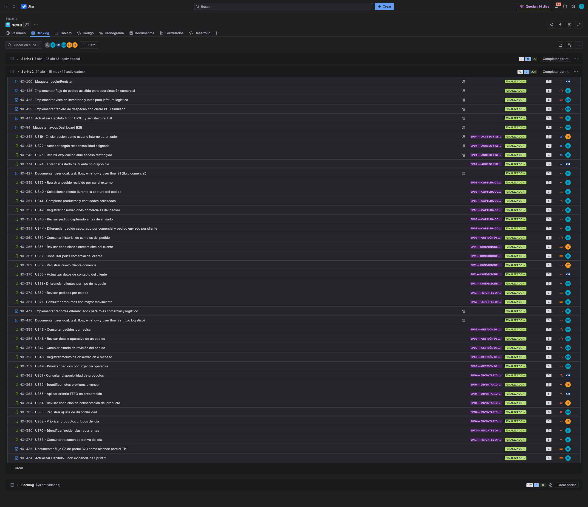

## 5.2.2. Sprint 2

El Sprint 2 corresponde al incremento TB1. El objetivo fue consolidar la Web Application con flujos internos para coordinación comercial y jefatura logística, actualizar la evidencia UX/UI y documentar la implementación frontend asociada al alcance de la entrega.

La evidencia de Sprint 2 se organiza mediante planificación, Sprint Backlog, commits, ejecución, servicios simulados, despliegue y colaboración. S1 y S2 son los flujos principales de la entrega. S3 se mantiene como alcance parcial de planificación y trazabilidad, sin declarar cobertura completa de UI ni validación final del segmento en TB1.

#### 5.2.2.1. Sprint Planning 2

| Campo | Registro |
|---|---|
| Sprint # | Sprint 2 |
| Sprint Planning Background | Segundo incremento del proyecto orientado a consolidar la Web Application TB1, documentar flujos S1/S2 y actualizar evidencia de diseño, implementación y colaboración. |
| Date | 2026-04-24 |
| Time | 19:00 PM |
| Location | Reunión virtual del equipo |
| Prepared By | Yucra Sandoval, Diego Sebastian |
| Attendees (to planning meeting) | Yucra Sandoval, Diego Sebastian / Verde Bueno, Joaquín / Marín Cueva, César / Rojas Mancilla, Gerard / Torrejón, Gino |
| Sprint 1 Review Summary | Sprint 1 dejó como base la Landing Page, la estructura Docs-as-Code, el Product Backlog, las User Stories iniciales y los primeros artefactos UX/domain. |
| Sprint 1 Retrospective Summary | El equipo identificó la necesidad de ordenar mejor la evidencia por sprint, reforzar la trazabilidad con Jira y concentrar TB1 en los flujos internos de la Web Application. |
| Sprint Goal & User Stories | Web Application TB1, flujos internos S1/S2, evidencia UX/UI, Sprint Backlog y documentación de implementación. |
| Sprint 2 Goal | Consolidar la Web Application TB1 con flujos internos para coordinación comercial y jefatura logística, manteniendo trazabilidad con Product Backlog, Jira y evidencias de implementación. |
| Sprint 2 Velocity | 208 Story Points |
| Sum of Story Points | 208 Story Points |

Figura. Reunión virtual del equipo para coordinación de Sprint 2.

#### 5.2.2.2. Aspect Leaders and Collaborators

| Team Member | GitHub Username | Project Management | UX/UI Design | Software Architecture | Frontend Development | Documentation |
|---|---|:---:|:---:|:---:|:---:|:---:|
| Yucra Sandoval, Diego Sebastian | DiegoS284 | L | C | C | L | L |
| Verde Bueno, Joaquín Francisco | JoaquinVerde115 | C | C | C | C | C |
| Marín Cueva, César Fernando | Cmarin2802 | C | C | C | C | C |
| Torrejón De Los Santos, Gino Rodrigo | R0obxdnt-bit | C | L | C | C | C |
| Rojas Mancilla, Gerard Gianpier | GerardRojasMancilla | C | C | L | C | C |

#### 5.2.2.3. Sprint Backlog 2

El Sprint Backlog 2 concentra el trabajo realizado entre el **2026-04-24 y 2026-05-07**. El objetivo principal del sprint fue consolidar la Web Application TB1, documentar los flujos internos de S1 y S2, actualizar la evidencia UX/UI y registrar el avance de implementación correspondiente al incremento de la entrega.

**URL del board/backlog:** [Jira Backlog — Proyecto Nexa](https://team-nexa.atlassian.net/jira/software/projects/NX/boards/1/backlog)

La siguiente tabla presenta los User Stories asignados al Sprint 2 y los Work-items utilizados para descomponer el trabajo. Además de las User Stories, el sprint incluye tareas de soporte documental, configuración y evidencia necesarias para completar el incremento comprometido.

| Sprint # | User Story Id | User Story Title | Work-Item / Task Id | Task Title | Description | Estimation (Hours) | Assigned To | Status |
|---|---|---|---|---|---|---:|---|---|
| Sprint 2 | N/A | Maquetar Login | NX-100 | Implementar pantalla de acceso | Construir la pantalla de login utilizada para seleccionar perfiles y acceder a los flujos internos de la Web Application. | 5.5 | César Marín | Done |
| Sprint 2 | N/A | Implementar flujo de pedido asistido para coordinación comercial | NX-26 | Construir flujo de pedido asistido | Implementar el recorrido comercial para registrar pedidos internos desde el perfil de coordinación comercial. | 8.5 | Diego Yucra Sandoval | Done |
| Sprint 2 | N/A | Implementar vista de inventario y lotes para jefatura logística | NX-28 | Construir vista de inventario y lotes | Implementar la vista de inventario, disponibilidad y lotes como soporte del flujo logístico. | 9.0 | Gerard Rojas Mancilla | Done |
| Sprint 2 | N/A | Implementar tablero de despacho con cierre POD simulado | NX-29 | Construir tablero de despacho | Implementar el tablero de despacho y el cierre simulado con evidencia POD para la operación logística. | 8.0 | César Marín | Done |
| Sprint 2 | N/A | Actualizar Capítulo 4 con UX/UI y arquitectura TB1 | NX-33 | Actualizar diseño UX/UI y arquitectura | Actualizar la documentación de UX/UI, flujos, mockups y arquitectura correspondiente al avance TB1. | 6.0 | Diego Yucra Sandoval | Done |
| Sprint 2 | N/A | Maquetar layout Dashboard B2B | NX-4 | Construir layout principal de dashboard | Preparar la estructura visual base para dashboards y navegación de la Web Application. | 8.0 | Gerard Rojas Mancilla | Done |
| Sprint 2 | US19 | Iniciar sesión como usuario interno autorizado | NX-242 | Implementar acceso de usuario interno | Permitir el ingreso de usuarios internos mediante perfiles usados en la simulación de la Web Application. | 3.0 | Joaquín Verde | Done |
| Sprint 2 | US22 | Acceder según responsabilidad asignada | NX-245 | Configurar acceso por responsabilidad | Diferenciar el acceso de usuarios internos según el perfil operativo seleccionado. | 3.5 | Diego Yucra Sandoval | Done |
| Sprint 2 | US23 | Recibir explicación ante acceso restringido | NX-248 | Documentar restricción de acceso | Mostrar una explicación cuando un perfil intenta ingresar a una ruta que no corresponde a su responsabilidad. | 3.0 | Diego Yucra Sandoval | Done |
| Sprint 2 | US24 | Entender estado de cuenta no disponible | NX-334 | Definir estado de cuenta no disponible | Representar el estado de cuenta no disponible dentro del flujo de acceso y operación. | 2.5 | César Marín | Done |
| Sprint 2 | N/A | Documentar user goal, task flow, wireflow y user flow S1 | NX-27 | Documentar flujo comercial S1 | Registrar la relación entre user goal, task flow, wireflow y user flow para coordinación comercial. | 5.0 | Diego Yucra Sandoval | Done |
| Sprint 2 | US39 | Registrar pedido recibido por canal externo | NX-349 | Registrar pedido interno | Permitir que coordinación comercial registre un pedido recibido por canales externos. | 5.5 | Diego Yucra Sandoval | Done |
| Sprint 2 | US40 | Seleccionar cliente durante la captura del pedido | NX-350 | Seleccionar cliente en pedido | Asociar el pedido interno con el cliente correspondiente durante la captura comercial. | 3.5 | Diego Yucra Sandoval | Done |
| Sprint 2 | US41 | Completar productos y cantidades solicitadas | NX-351 | Completar productos y cantidades | Registrar productos y cantidades solicitadas dentro del pedido asistido. | 5.0 | Diego Yucra Sandoval | Done |
| Sprint 2 | US42 | Registrar observaciones comerciales del pedido | NX-352 | Registrar observaciones comerciales | Incluir observaciones comerciales relevantes durante la captura del pedido. | 4.0 | Diego Yucra Sandoval | Done |
| Sprint 2 | US43 | Revisar pedido capturado antes de enviarlo | NX-353 | Revisar pedido antes de enviar | Permitir una revisión previa del pedido para reducir errores antes de enviarlo a revisión. | 4.5 | Diego Yucra Sandoval | Done |
| Sprint 2 | US44 | Diferenciar pedido capturado por comercial y pedido enviado por cliente | NX-354 | Diferenciar origen del pedido | Identificar si el pedido fue capturado internamente o enviado por el comprador. | 5.0 | Diego Yucra Sandoval | Done |
| Sprint 2 | US50 | Consultar historial de cambios del pedido | NX-360 | Consultar historial del pedido | Mostrar cambios relevantes asociados a un pedido para apoyar trazabilidad comercial. | 8.0 | Diego Yucra Sandoval | Done |
| Sprint 2 | US56 | Revisar condiciones comerciales del cliente | NX-366 | Revisar condiciones del cliente | Permitir la consulta de condiciones comerciales antes de confirmar acciones del pedido. | 3.5 | Joaquín Verde | Done |
| Sprint 2 | US57 | Consultar perfil comercial del cliente | NX-367 | Consultar perfil comercial | Mostrar información comercial del cliente para apoyar la captura y seguimiento del pedido. | 3.5 | Diego Yucra Sandoval | Done |
| Sprint 2 | US59 | Registrar nuevo cliente comercial | NX-369 | Registrar cliente comercial | Registrar información básica de un nuevo cliente comercial en la Web Application. | 5.5 | Gino Torrejón | Done |
| Sprint 2 | US60 | Actualizar datos de contacto del cliente | NX-370 | Actualizar datos de contacto | Actualizar información de contacto del cliente comercial. | 5.0 | César Marín | Done |
| Sprint 2 | US61 | Diferenciar clientes por tipo de negocio | NX-371 | Clasificar clientes por tipo | Diferenciar clientes según tipo de negocio para facilitar la lectura comercial. | 4.5 | Gerard Rojas Mancilla | Done |
| Sprint 2 | US69 | Revisar pedidos por estado | NX-79 | Revisar pedidos por estado | Consultar pedidos agrupados por estado para facilitar seguimiento comercial y operativo. | 5.0 | Diego Yucra Sandoval | Done |
| Sprint 2 | US71 | Consultar productos con mayor movimiento | NX-81 | Consultar productos de mayor movimiento | Revisar productos con mayor movimiento como apoyo a reportes comerciales. | 3.5 | Diego Yucra Sandoval | Done |
| Sprint 2 | N/A | Implementar reportes diferenciados por roles comercial y logístico | NX-31 | Construir reportes por rol | Implementar reportes separados para lectura comercial y logística según perfil de usuario. | 5.5 | Diego Yucra Sandoval | Done |
| Sprint 2 | N/A | Documentar user goal, task flow, wireflow y user flow S2 | NX-40 | Documentar flujo logístico S2 | Registrar la relación entre user goal, task flow, wireflow y user flow para jefatura logística. | 5.0 | Gerard Rojas Mancilla | Done |
| Sprint 2 | US45 | Consultar pedidos por revisar | NX-355 | Consultar pedidos por revisar | Mostrar pedidos en revisión operativa para jefatura logística. | 5.0 | Gerard Rojas Mancilla | Done |
| Sprint 2 | US46 | Revisar detalle operativo de un pedido | NX-356 | Revisar detalle operativo | Permitir la lectura del detalle operativo de un pedido antes de cambiar su estado. | 5.0 | Gerard Rojas Mancilla | Done |
| Sprint 2 | US47 | Cambiar estado de revisión del pedido | NX-357 | Cambiar estado de revisión | Actualizar el estado de revisión de un pedido durante el flujo logístico. | 5.5 | Gerard Rojas Mancilla | Done |
| Sprint 2 | US48 | Registrar motivo de observación o rechazo | NX-358 | Registrar observación o rechazo | Registrar el motivo cuando un pedido queda observado o rechazado. | 5.0 | Gerard Rojas Mancilla | Done |
| Sprint 2 | US49 | Priorizar pedidos por urgencia operativa | NX-359 | Priorizar pedidos urgentes | Ordenar pedidos según urgencia operativa para orientar la revisión logística. | 5.0 | Gerard Rojas Mancilla | Done |
| Sprint 2 | US51 | Consultar disponibilidad de productos | NX-361 | Consultar disponibilidad | Consultar disponibilidad de productos para apoyar decisiones de pedido y preparación. | 5.0 | César Marín | Done |
| Sprint 2 | US52 | Identificar lotes próximos a vencer | NX-362 | Identificar lotes próximos a vencer | Visualizar lotes con riesgo de vencimiento para aplicar criterio operativo. | 5.0 | Joaquín Verde | Done |
| Sprint 2 | US53 | Aplicar criterio FEFO en preparación | NX-363 | Aplicar criterio FEFO | Priorizar productos según vencimiento para reducir merma y mejorar rotación. | 5.0 | César Marín | Done |
| Sprint 2 | US54 | Revisar condición de conservación del producto | NX-364 | Revisar condición de conservación | Consultar información de conservación asociada al producto o lote. | 5.0 | Joaquín Verde | Done |
| Sprint 2 | US55 | Registrar ajuste de disponibilidad | NX-365 | Registrar ajuste de disponibilidad | Actualizar disponibilidad cuando se detecten diferencias operativas. | 8.0 | Gerard Rojas Mancilla | Done |
| Sprint 2 | US68 | Consultar resumen operativo del día | NX-78 | Consultar resumen operativo | Revisar una síntesis operativa diaria para apoyar seguimiento de pedidos e inventario. | 5.0 | Diego Yucra Sandoval | Done |
| Sprint 2 | US70 | Identificar incidencias recurrentes | NX-80 | Identificar incidencias recurrentes | Registrar lectura de incidencias recurrentes como parte de reportes operativos. | 5.0 | Diego Yucra Sandoval | Done |
| Sprint 2 | N/A | Documentar flujo S3 de portal B2B como alcance parcial TB1 | NX-43 | Documentar flujo comprador B2B | Registrar el flujo comprador como planificación de alcance, sin afirmar implementación completa de mockups S3. | 5.0 | Diego Yucra Sandoval | Done |
| Sprint 2 | N/A | Actualizar Capítulo 5 con evidencia de Sprint 2 | NX-34 | Actualizar evidencias de implementación TB1 | Consolidar en el reporte las evidencias del Sprint 2, incluyendo alcance, implementación y documentación del incremento. | 5.5 | Diego Yucra Sandoval | Done |

Nota. Las horas estimadas se usan para control operativo del Sprint Backlog. Los Story Points se conservan como estimación relativa dentro del Product Backlog y Jira. Elaboración propia.

#### 5.2.2.4. Development Evidence for Sprint Review

La siguiente tabla resume una selección canónica de commits representativos del trabajo realizado durante TB1. La evidencia completa se mantiene en los historiales de GitHub de cada repositorio; el reporte incluye una selección para mantener legibilidad y trazabilidad con los productos de Sprint 2.

| Repository | Branch | Commit Id | Commit Message | Commit Message Body | Commited on (Date) |
|---|---|---|---|---|---|
| upc-pre-202610-1asi0730-12242-king/nexa-report | main | `f6de96c` | docs(ch4): rebuild webapp ux section structure and wireframe tables | - | 2026-05-05 |
| upc-pre-202610-1asi0730-12242-king/nexa-report | main | `e8e7afa` | docs(ch4): align webapp flows with user goals | - | 2026-05-05 |
| upc-pre-202610-1asi0730-12242-king/nexa-report | main | `f3e6296` | docs(ch4): update webapp wireflow documentation with three-persona flow | - | 2026-05-05 |
| upc-pre-202610-1asi0730-12242-king/nexa-report | main | `ec6c63c` | docs(ch4): replace webapp user flows with proper flowcharts per persona | - | 2026-05-05 |
| upc-pre-202610-1asi0730-12242-king/nexa-report | main | `22efcb2` | docs(ch4): add current webapp mockup selections | - | 2026-05-05 |
| upc-pre-202610-1asi0730-12242-king/nexa-report | main | `b7c7ac9` | docs(ch5): document sprint two tb1 evidence | - | 2026-05-05 |
| upc-pre-202610-1asi0730-12242-king/nexa-report | main | `1193a5f` | docs(ch4): clarify buyer portal scope in ux flows | Update 4.4 intro paragraph to explicitly distinguish webapp Ops S1/S2 from portal B2B S3. | 2026-05-06 |
| upc-pre-202610-1asi0730-12242-king/nexa-report | main | `7677b49` | docs(ch5): clarify fake api and service documentation scope | Add explicit note to 5.2.2.6: TB1 functional integration validated via Fake API with mock data. | 2026-05-06 |
| upc-pre-202610-1asi0730-12242-king/nexa-website | main | `22a715c` | feat: connect login button to nexa-webapp GitHub Pages | Commit body documents replacement of the previous toast state with navigation to the webapp GitHub Pages URL. | 2026-04-28 |
| upc-pre-202610-1asi0730-12242-king/nexa-website | main | `c301fc2` | style: align landing visual tokens with webapp design system | Typography and tokens aligned with webapp visual system. | 2026-04-28 |
| upc-pre-202610-1asi0730-12242-king/nexa-website | main | `13ea635` | fix(landing): align ctas with webapp routes | - | 2026-05-02 |
| upc-pre-202610-1asi0730-12242-king/nexa-website | main | `4951d66` | fix(landing): add favicon and tighten tb1 copy | - | 2026-05-02 |
| upc-pre-202610-1asi0730-12242-king/nexa-website | main | `a6b9e3b` | fix(readme): restore website presentation style | - | 2026-05-03 |
| upc-pre-202610-1asi0730-12242-king/nexa-webapp | main | `ca38d05` | feat(auth): add internal demo roles for S1 and S2 segments | Add role-aware users to Fake API and fix auth store to reject invalid credentials. | 2026-05-05 |
| upc-pre-202610-1asi0730-12242-king/nexa-webapp | main | `ad68f8c` | feat(login): add demo profile selector for quick role access | Show Valeria and Roberto as quick-access cards on the login view. | 2026-05-05 |
| upc-pre-202610-1asi0730-12242-king/nexa-webapp | main | `d6696c8` | feat(ops): adapt navigation and dashboard by role | Filter sidebar and mobile nav items by roleKey; reports vary by role. | 2026-05-05 |
| upc-pre-202610-1asi0730-12242-king/nexa-webapp | main | `0f1c08b` | feat(clients): replace toast stub with full client profile drawer | Clicking a client row opens a right drawer with contact info, conditions and recent orders. | 2026-04-29 |
| upc-pre-202610-1asi0730-12242-king/nexa-webapp | main | `dc80775` | feat(inventory): add lot detail drawer with movement history | Lot rows open detail with metadata, stock movements and FEFO context. | 2026-04-29 |
| upc-pre-202610-1asi0730-12242-king/nexa-webapp | main | `a076e6a` | fix(dispatch): sync order status on route/delivery events; fix dead order detail button | markInRoute sets order.status to dispatched; submitPod sets delivered. | 2026-04-29 |
| upc-pre-202610-1asi0730-12242-king/nexa-webapp | main | `d692ed6` | feat(reports): add operational reports screen with KPIs, status breakdown, and FEFO alerts | New ReportsView with KPI row, status table, category bars and expiring lots. | 2026-04-29 |
| upc-pre-202610-1asi0730-12242-king/nexa-webapp | main | `4aa2812` | chore(mock-api): add json-server fake api | - | 2026-05-04 |
| upc-pre-202610-1asi0730-12242-king/nexa-webapp | main | `7b9bf07` | refactor(api): add axios services by bounded context | - | 2026-05-04 |
| upc-pre-202610-1asi0730-12242-king/nexa-webapp | main | `dbee8ed` | refactor(stores): connect stores to application layer | - | 2026-05-04 |
| upc-pre-202610-1asi0730-12242-king/nexa-webapp | main | `b008b68` | fix(dispatch): persist mock dispatch and order status updates | Mark-in-route and POD closure PATCH the Fake API via application layer. | 2026-05-05 |
| upc-pre-202610-1asi0730-12242-king/nexa-webapp | main | `91caab8` | refactor(webapp): align context structure with course architecture | - | 2026-05-05 |
| upc-pre-202610-1asi0730-12242-king/nexa-platform | main | `53a8069` | chore(platform): reset repository to tb1 planned scope | - | 2026-05-03 |

Las siguientes capturas son evidencia visual complementaria. La tabla anterior conserva el formato solicitado por el statement; las capturas no sustituyen la tabla ni representan screenshots por cada commit.

Figura. Evidencia visual complementaria de commits registrados en `nexa-report` durante TB1.

Figura. Evidencia visual complementaria de commits registrados en `nexa-website` durante TB1.

Figura. Evidencia visual complementaria de commits registrados en `nexa-webapp` durante TB1.

Figura. Evidencia visual complementaria de actividad y contribución en GitHub durante TB1.

#### 5.2.2.5. Execution Evidence for Sprint Review

| Área ejecutada | Estado TB1 defendible | Evidencia de repositorio | Límite explícito |
|---|---|---|---|
| Landing → Webapp | CTAs y links alineados hacia GitHub Pages webapp | `nexa-website`: `22a715c`, `13ea635`, `4951d66` | No implica servicios productivos |
| Login demo | Selector de perfiles y acceso rápido para revisión académica | `nexa-webapp`: `ca38d05`, `ad68f8c` | No es autenticación productiva |
| Ops S1/S2 | Dashboard, navegación adaptada, clientes, pedidos, inventario, despacho y reportes | `nexa-webapp`: commits de dashboard/orders/inventory/dispatch/reports | Role-aware frontend, no IAM corporativo |
| Portal comprador parcial | Recorrido simulado de catálogo, pedido y seguimiento para mantener trazabilidad de S3 | `nexa-webapp`: `6053d18`, `5b53e6e`, `6db2e58` | No declara cobertura completa de UI ni validación final de S3 en TB1 |
| Fake API | JSON Server y servicios por bounded context | `nexa-webapp`: `4aa2812`, `7b9bf07`, `dbee8ed`, `6bffa73` | No es API final |
| UX/UI reportada | FigJam wireflows y Lucidchart userflows, mockups actuales y evidencia por user goal | `nexa-report`: commits Ch4 del 5 de mayo | No sustituye un export completo de FigJam |

#### 5.2.2.6. Services Documentation Evidence for Sprint Review

Para Sprint 2, la evidencia de servicios se aborda como soporte simulado para la Web Application, sin declarar todavía una RESTful API productiva. Esta evidencia no reemplaza la documentación OpenAPI solicitada para el Web Service interno en hitos posteriores; solo registra el soporte usado por la Web Application en TB1.

| Capa | Estado TB1 | Evidencia | Nota de alcance |
|---|---|---|---|
| Fake API | Soporte simulado para la Web Application | `mock-api/db.json`, JSON Server, commits de 04/05/2026 | Sirve para revisión académica y pruebas frontend |
| Servicios cliente | Organización interna de consumo de datos simulados | commits `7b9bf07` y `dbee8ed` | Preparan transición hacia API interna |
| Backend ASP.NET Core | Planificado | `nexa-platform` y arquitectura objetivo | No implementado productivamente en TB1 |
| Base de datos relacional | Modelo objetivo | Capítulo 4.8 | No implementada productivamente en TB1 |
| POD | Mock confirmation | flujo de despacho TB1 | No hay evidencia de entrega productiva en TB1 |

#### 5.2.2.7. Software Deployment Evidence for Sprint Review

| Artefacto | Estado TB1 | URL / evidencia | Observación |
|---|---|---|---|
| Landing page `nexa-website` | Publicada como capa pública | [GitHub Pages – nexa-website](https://upc-pre-202610-1asi0730-12242-king.github.io/nexa-website/) | Punto de entrada comercial |
| Web application `nexa-webapp` | Publicada para revisión TB1 con hash routing | [GitHub Pages – nexa-webapp](https://upc-pre-202610-1asi0730-12242-king.github.io/nexa-webapp/) | Frontend con datos simulados |
| Reporte `nexa-report` | Fuente Docs-as-Code | repositorio GitHub y fuente Markdown | Evidencia documental |
| Backend / plataforma | Planificado | `nexa-platform` | No se declara desplegado |

#### 5.2.2.8. Team Collaboration Insights during Sprint

La colaboración de Sprint 2 se sostiene en commits distribuidos, revisión documental y separación clara de responsabilidades. No se afirma que todos aportaron igual; se documenta el aporte según evidencia y alcance.

| Dimensión colaborativa | Evidencia TB1 | Resultado |
|---|---|---|
| Liderazgo | Diego coordinó integración de reporte, webapp scope, QA y cierre Docs-as-Code | Dirección clara para la entrega TB1 |
| Apoyo documental | César, Joaquín y Gino sostuvieron limpieza, estructura, UX/UI y revisión de secciones | Reporte más consistente con Capítulos 1–4 |
| Arquitectura | Gerard aportó principalmente DDD/C4 y piezas técnicas puntuales | Arquitectura presente sin sobredimensionar contribución |
| Coordinación por repositorio | Commits en report, website, webapp y platform | Evidencia verificable sin inventar Jira |
| Manejo de ajustes | Correcciones de nombres, segmentos, style guidelines, assets, mockups y alcance Fake API | Reducción de contradicciones antes de entrega |

La lectura final de Sprint 2 es que TB1 consolida una web application frontend y una documentación técnica defendible, manteniendo límites explícitos sobre servicios productivos, autenticación productiva, base de datos real, evidencia de entrega productiva y seguimiento en vivo.
