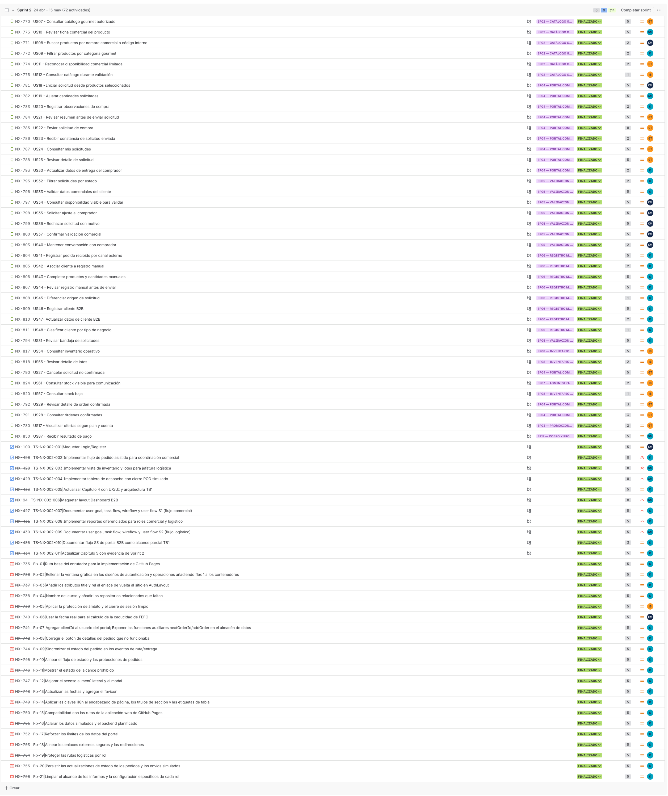

## 5.2.2. Sprint 2

El Sprint 2 corresponde al incremento TB1. El objetivo fue consolidar la Web Application con flujos internos para coordinación comercial y jefatura logística, actualizar la evidencia UX/UI y documentar la implementación frontend asociada al alcance de la entrega.

La evidencia de Sprint 2 se organiza mediante planificación, Sprint Backlog, commits, ejecución, servicios simulados, despliegue y colaboración. S1 y S2 son los flujos principales de la entrega. S3 se mantiene como alcance parcial de planificación y trazabilidad, sin declarar cobertura completa de UI ni validación cerrada del segmento en TB1.

### 5.2.2.1. Sprint Planning 2

| Campo | Registro |
|---|---|
| Sprint # | Sprint 2 |
| Sprint Planning Background | Segundo incremento del proyecto orientado a consolidar la Web Application TB1, documentar flujos S1/S2 y actualizar evidencia de diseño, implementación y colaboración. |
| Date | 2026-04-24 |
| Time | 07:00 PM |
| Location | Reunión virtual del equipo |
| Prepared By | Yucra Sandoval, Diego Sebastian |
| Attendees (to planning meeting) | Yucra Sandoval, Diego Sebastian / Verde Bueno, Joaquín / Marín Cueva, César / Rojas Mancilla, Gerard / Torrejón, Gino |
| Sprint 1 Review Summary | Sprint 1 dejó como base la Landing Page, la estructura Docs-as-Code, el Product Backlog, las User Stories iniciales y los primeros artefactos UX/domain. |
| Sprint 1 Retrospective Summary | El equipo identificó la necesidad de ordenar mejor la evidencia por sprint, reforzar la trazabilidad con Jira y concentrar TB1 en los flujos internos de la Web Application. |
| Sprint Goal & User Stories | Web Application TB1, flujos internos S1/S2, evidencia UX/UI, Sprint Backlog y documentación de implementación. |
| Sprint 2 Goal | Consolidar la Web Application TB1 con flujos internos para coordinación comercial y jefatura logística, manteniendo trazabilidad con Product Backlog, Jira y evidencias de implementación. |
| Sprint 2 Velocity | 208 Story Points |
| Sum of Story Points | 208 Story Points |

Figura. Reunión virtual del equipo para coordinación de Sprint 2.

### 5.2.2.2. Aspect Leaders and Collaborators

| Team Member | GitHub Username | Project Management | UX/UI Design | Software Architecture | Frontend Development | Documentation |
|---|---|:---:|:---:|:---:|:---:|:---:|
| Yucra Sandoval, Diego Sebastian | DiegoS284 | L | C | C | L | L |
| Verde Bueno, Joaquín Francisco | JoaquinVerde115 | C | C | C | C | C |
| Marín Cueva, César Fernando | Cmarin2802 | C | C | C | C | C |
| Torrejón De Los Santos, Gino Rodrigo | R0obxdnt-bit | C | L | C | C | C |
| Rojas Mancilla, Gerard Gianpier | GerardRojasMancilla | C | C | L | C | C |

### 5.2.2.3. Sprint Backlog 2

El Sprint Backlog 2 concentra el trabajo realizado entre el **2026-04-24 y 2026-05-07**. El objetivo principal del sprint fue consolidar la Web Application TB1, documentar los flujos internos de S1 y S2, actualizar la evidencia UX/UI y registrar el avance de implementación correspondiente al incremento de la entrega.

> *Nota.* La captura muestra la planificación actualizada del Sprint 2 en Jira, incluyendo las User Stories, tasks de implementación, responsables, estados y estimaciones utilizadas para sostener la entrega TB1. Elaboración propia.

**URL del board/backlog Jira — Proyecto Nexa:** [https://team-nexa.atlassian.net/jira/software/projects/NX/boards/1/backlog](https://team-nexa.atlassian.net/jira/software/projects/NX/boards/1/backlog)

La siguiente tabla presenta los User Stories asignados al Sprint 2 y los Work-items utilizados para descomponer el trabajo. Además de las User Stories, el sprint incluye tareas de soporte documental, configuración y evidencia necesarias para completar el incremento comprometido.

| Sprint # | User Story Id | User Story Title | Work-Item / Task Id | Task Title | Description | Estimation (Hours) | Assigned To | Status |
|---|---|---|---------------------|---|---|---:|---|---|
| Sprint 2 | N/A | Maquetar Login/Register | TS-NX-002-001       | Implementar pantalla de acceso | Construir la pantalla de login utilizada para seleccionar perfiles y acceder a los flujos internos de la Web Application. | 5.0 | César Marín | Done |
| Sprint 2 | N/A | Implementar flujo de pedido asistido para coordinación comercial | TS-NX-002-002       | Construir flujo de pedido asistido | Implementar el recorrido comercial para registrar pedidos internos desde el perfil de coordinación comercial. | 8.0 | Diego Yucra Sandoval | Done |
| Sprint 2 | N/A | Implementar vista de inventario y lotes para jefatura logística | TS-NX-002-003       | Construir vista de inventario y lotes | Implementar la vista de inventario, disponibilidad y lotes como soporte del flujo logístico. | 9.0 | Gerard Rojas Mancilla | Done |
| Sprint 2 | N/A | Implementar tablero de despacho con cierre POD simulado | TS-NX-002-004       | Construir tablero de despacho | Implementar el tablero de despacho y el cierre simulado con evidencia POD para la operación logística. | 8.0 | César Marín | Done |
| Sprint 2 | N/A | Actualizar Capítulo 4 con UX/UI y arquitectura TB1 | TS-NX-002-005       | Actualizar diseño UX/UI y arquitectura | Actualizar la documentación de UX/UI, flujos, mockups y arquitectura correspondiente al avance TB1. | 5.0 | Diego Yucra Sandoval | Done |
| Sprint 2 | N/A | Maquetar layout Dashboard B2B | TS-NX-002-006       | Construir layout principal de dashboard | Preparar la estructura visual base para dashboards y navegación de la Web Application. | 8.0 | Gerard Rojas Mancilla | Done |
| Sprint 2 | US19 | Iniciar sesión como usuario interno autorizado | NX-242              | Implementar acceso de usuario interno | Permitir el ingreso de usuarios internos mediante perfiles usados en la simulación de la Web Application. | 3.0 | Joaquín Verde | Done |
| Sprint 2 | US22 | Acceder según responsabilidad asignada | NX-245              | Configurar acceso por responsabilidad | Diferenciar el acceso de usuarios internos según el perfil operativo seleccionado. | 3.0 | Diego Yucra Sandoval | Done |
| Sprint 2 | US23 | Recibir explicación ante acceso restringido | NX-248              | Documentar restricción de acceso | Mostrar una explicación cuando un perfil intenta ingresar a una ruta que no corresponde a su responsabilidad. | 3.0 | Diego Yucra Sandoval | Done |
| Sprint 2 | US24 | Entender estado de cuenta no disponible | NX-334              | Definir estado de cuenta no disponible | Representar el estado de cuenta no disponible dentro del flujo de acceso y operación. | 3.0 | César Marín | Done |
| Sprint 2 | N/A | Documentar user goal, task flow, wireflow y user flow S1 | TS-NX-002-007       | Documentar flujo comercial S1 | Registrar la relación entre user goal, task flow, wireflow y user flow para coordinación comercial. | 5.0 | Diego Yucra Sandoval | Done |
| Sprint 2 | US39 | Registrar pedido recibido por canal externo | NX-349              | Registrar pedido interno | Permitir que coordinación comercial registre un pedido recibido por canales externos. | 5.0 | Diego Yucra Sandoval | Done |
| Sprint 2 | US40 | Seleccionar cliente durante la captura del pedido | NX-350              | Seleccionar cliente en pedido | Asociar el pedido interno con el cliente correspondiente durante la captura comercial. | 3.0 | Diego Yucra Sandoval | Done |
| Sprint 2 | US41 | Completar productos y cantidades solicitadas | NX-351              | Completar productos y cantidades | Registrar productos y cantidades solicitadas dentro del pedido asistido. | 5.0 | Diego Yucra Sandoval | Done |
| Sprint 2 | US42 | Registrar observaciones comerciales del pedido | NX-352              | Registrar observaciones comerciales | Incluir observaciones comerciales relevantes durante la captura del pedido. | 5.0 | Diego Yucra Sandoval | Done |
| Sprint 2 | US43 | Revisar pedido capturado antes de enviarlo | NX-353              | Revisar pedido antes de enviar | Permitir una revisión previa del pedido para reducir errores antes de enviarlo a revisión. | 5.0 | Diego Yucra Sandoval | Done |
| Sprint 2 | US44 | Diferenciar pedido capturado por comercial y pedido enviado por cliente | NX-354              | Diferenciar origen del pedido | Identificar si el pedido fue capturado internamente o enviado por el comprador. | 5.0 | Diego Yucra Sandoval | Done |
| Sprint 2 | US50 | Consultar historial de cambios del pedido | NX-360              | Consultar historial del pedido | Mostrar cambios relevantes asociados a un pedido para apoyar trazabilidad comercial. | 8.0 | Diego Yucra Sandoval | Done |
| Sprint 2 | US56 | Revisar condiciones comerciales del cliente | NX-366              | Revisar condiciones del cliente | Permitir la consulta de condiciones comerciales antes de confirmar acciones del pedido. | 3.0 | Gino Torrejón | Done |
| Sprint 2 | US57 | Consultar perfil comercial del cliente | NX-367              | Consultar perfil comercial | Mostrar información comercial del cliente para apoyar la captura y seguimiento del pedido. | 3.0 | Diego Yucra Sandoval | Done |
| Sprint 2 | US59 | Registrar nuevo cliente comercial | NX-369              | Registrar cliente comercial | Registrar información básica de un nuevo cliente comercial en la Web Application. | 5.0 | Gino Torrejón | Done |
| Sprint 2 | US60 | Actualizar datos de contacto del cliente | NX-370              | Actualizar datos de contacto | Actualizar información de contacto del cliente comercial. | 5.0 | César Marín | Done |
| Sprint 2 | US61 | Diferenciar clientes por tipo de negocio | NX-371              | Clasificar clientes por tipo | Diferenciar clientes según tipo de negocio para facilitar la lectura comercial. | 5.0 | Gerard Rojas Mancilla | Done |
| Sprint 2 | US69 | Revisar pedidos por estado | NX-379              | Revisar pedidos por estado | Consultar pedidos agrupados por estado para facilitar seguimiento comercial y operativo. | 5.0 | Diego Yucra Sandoval | Done |
| Sprint 2 | US71 | Consultar productos con mayor movimiento | NX-381              | Consultar productos de mayor movimiento | Revisar productos con mayor movimiento como apoyo a reportes comerciales. | 3.0 | Diego Yucra Sandoval | Done |
| Sprint 2 | N/A | Implementar reportes diferenciados para roles comercial y logístico | TS-NX-002-008       | Construir reportes por rol | Implementar reportes separados para lectura comercial y logística según perfil de usuario. | 5.0 | Diego Yucra Sandoval | Done |
| Sprint 2 | N/A | Documentar user goal, task flow, wireflow y user flow S2 | TS-NX-002-009       | Documentar flujo logístico S2 | Registrar la relación entre user goal, task flow, wireflow y user flow para jefatura logística. | 5.0 | Gerard Rojas Mancilla | Done |
| Sprint 2 | US45 | Consultar pedidos por revisar | NX-355              | Consultar pedidos por revisar | Mostrar pedidos en revisión operativa para jefatura logística. | 5.0 | Gerard Rojas Mancilla | Done |
| Sprint 2 | US46 | Revisar detalle operativo de un pedido | NX-356              | Revisar detalle operativo | Permitir la lectura del detalle operativo de un pedido antes de cambiar su estado. | 5.0 | Gerard Rojas Mancilla | Done |
| Sprint 2 | US47 | Cambiar estado de revisión del pedido | NX-357              | Cambiar estado de revisión | Actualizar el estado de revisión de un pedido durante el flujo logístico. | 5.0 | César Marín | Done |
| Sprint 2 | US48 | Registrar motivo de observación o rechazo | NX-358              | Registrar observación o rechazo | Registrar el motivo cuando un pedido queda observado o rechazado. | 5.0 | César Marín | Done |
| Sprint 2 | US49 | Priorizar pedidos por urgencia operativa | NX-359              | Priorizar pedidos urgentes | Ordenar pedidos según urgencia operativa para orientar la revisión logística. | 5.0 | Gerard Rojas Mancilla | Done |
| Sprint 2 | US51 | Consultar disponibilidad de productos | NX-361              | Consultar disponibilidad | Consultar disponibilidad de productos para apoyar decisiones de pedido y preparación. | 5.0 | César Marín | Done |
| Sprint 2 | US52 | Identificar lotes próximos a vencer | NX-362              | Identificar lotes próximos a vencer | Visualizar lotes con riesgo de vencimiento para aplicar criterio operativo. | 5.0 | Joaquín Verde | Done |
| Sprint 2 | US53 | Aplicar criterio FEFO en preparación | NX-363              | Aplicar criterio FEFO | Priorizar productos según vencimiento para reducir merma y mejorar rotación. | 5.0 | César Marín | Done |
| Sprint 2 | US54 | Revisar condición de conservación del producto | NX-364              | Revisar condición de conservación | Consultar información de conservación asociada al producto o lote. | 5.0 | Joaquín Verde | Done |
| Sprint 2 | US55 | Registrar ajuste de disponibilidad | NX-365              | Registrar ajuste de disponibilidad | Actualizar disponibilidad cuando se detecten diferencias operativas. | 8.0 | César Marín | Done |
| Sprint 2 | US58 | Priorizar productos críticos del día | NX-368              | Priorizar productos críticos | Ordenar y priorizar el manejo de productos críticos durante la jornada operativa. | 5.0 | Joaquín Verde | Done |
| Sprint 2 | US70 | Identificar incidencias recurrentes | NX-380              | Identificar incidencias recurrentes | Registrar lectura de incidencias recurrentes como parte de reportes operativos. | 5.0 | Diego Yucra Sandoval | Done |
| Sprint 2 | US68 | Consultar resumen operativo del día | NX-378              | Consultar resumen operativo | Revisar una síntesis operativa diaria para apoyar seguimiento de pedidos e inventario. | 5.0 | Diego Yucra Sandoval | Done |
| Sprint 2 | N/A | Documentar flujo S3 de portal B2B como alcance parcial TB1 | TS-NX-002-010       | Documentar flujo comprador B2B | Registrar el flujo comprador como planificación de alcance, sin afirmar implementación completa de mockups S3. | 5.0 | Diego Yucra Sandoval | Done |
| Sprint 2 | N/A | Actualizar Capítulo 5 con evidencia de Sprint 2 | TS-NX-002-011       | Actualizar evidencias de implementación TB1 | Consolidar en el reporte las evidencias del Sprint 2, incluyendo alcance, implementación y documentación del incremento. | 5.0 | Diego Yucra Sandoval | Done |
| Sprint 2 | N/A | Ruta base del enrutador para la implementación de GitHub Pages | Fix-01              | Configurar ruta base del enrutador | Ajustar la ruta base del enrutador para asegurar el correcto funcionamiento en GitHub Pages. | 5.0 | Diego Yucra Sandoval | Done |
| Sprint 2 | N/A | Rellenar la ventana gráfica en los diseños de autenticación y operaciones añadiendo flex 1 a los contenedores | Fix-02              | Ajustar estilos de contenedores | Añadir la propiedad flex 1 a los contenedores de los diseños de autenticación y operaciones para rellenar la ventana gráfica. | 5.0 | Diego Yucra Sandoval | Done |
| Sprint 2 | N/A | Añadir los atributos title y rel al enlace de vuelta al sitio en AuthLayout | Fix-03              | Añadir atributos a enlace de AuthLayout | Incorporar los atributos title y rel al enlace de retorno al sitio dentro del componente AuthLayout. | 5.0 | Diego Yucra Sandoval | Done |
| Sprint 2 | N/A | Nombre del curso y añadir los repositorios relacionados que faltan | Fix-04              | Actualizar nombre del curso y repositorios | Corregir el nombre del curso y agregar los enlaces a los repositorios relacionados faltantes en la documentación. | 5.0 | Diego Yucra Sandoval | Done |
| Sprint 2 | N/A | Aplicar la protección de ámbito y el cierre de sesión limpio | Fix-05              | Aplicar protección y cierre de sesión | Implementar la protección de ámbito en las rutas y asegurar un proceso de cierre de sesión sin errores. | 5.0 | Sin asignar | Done |
| Sprint 2 | N/A | Usar la fecha real para el cálculo de la caducidad de FEFO | Fix-06              | Corregir cálculo de caducidad FEFO | Modificar la lógica para utilizar la fecha real en el cálculo de la caducidad bajo el criterio FEFO. | 5.0 | Sin asignar | Done |
| Sprint 2 | N/A | Agregar clientId al usuario del portal; Exponer las funciones auxiliares nextOrderId/addOrder en el almacén de datos | Fix-07              | Actualizar datos de usuario y almacén | Agregar el campo clientId al usuario del portal y exponer las funciones nextOrderId y addOrder en el almacén. | 5.0 | Diego Yucra Sandoval | Done |
| Sprint 2 | N/A | Corregir el botón de detalles del pedido que no funcionaba | Fix-08              | Corregir botón de detalles del pedido | Solucionar el problema que impedía el funcionamiento correcto del botón para ver los detalles del pedido. | 5.0 | Diego Yucra Sandoval | Done |
| Sprint 2 | N/A | Sincronizar el estado del pedido en los eventos de ruta/entrega | Fix-09              | Sincronizar estado en ruta/entrega | Asegurar la correcta sincronización del estado del pedido durante los eventos de en ruta y entrega. | 5.0 | Diego Yucra Sandoval | Done |
| Sprint 2 | N/A | Alinear el flujo de estado y las protecciones de pedidos | Fix-10              | Alinear flujo de estado de pedidos | Corregir y alinear las transiciones del flujo de estado y aplicar las protecciones correspondientes a los pedidos. | 5.0 | Diego Yucra Sandoval | Done |
| Sprint 2 | N/A | Mostrar el estado del alcance prohibido | Fix-11              | Mostrar estado de alcance prohibido | Implementar la visualización adecuada para informar al usuario cuando intenta acceder a un alcance prohibido. | 5.0 | Diego Yucra Sandoval | Done |
| Sprint 2 | N/A | Mejorar el acceso al menú lateral y al modal | Fix-12              | Mejorar acceso a menú y modal | Optimizar la usabilidad y el acceso a los componentes del menú lateral y las ventanas modales. | 5.0 | Diego Yucra Sandoval | Done |
| Sprint 2 | N/A | Actualizar las fechas y agregar el favicon | Fix-13              | Actualizar fechas y favicon | Corregir las fechas mostradas en la interfaz y añadir el favicon al proyecto. | 5.0 | Diego Yucra Sandoval | Done |
| Sprint 2 | N/A | Aplicar las claves i18n al encabezado de página, los títulos de sección y las etiquetas de tabla | Fix-14              | Aplicar internacionalización (i18n) | Implementar las claves de internacionalización en el encabezado, títulos de sección y etiquetas de tablas. | 5.0 | Diego Yucra Sandoval | Done |
| Sprint 2 | N/A | Compatibilidad con las rutas de la aplicación web de GitHub Pages | Fix-15              | Corregir rutas para GitHub Pages | Ajustar la configuración de rutas para asegurar la compatibilidad total al desplegar en GitHub Pages. | 5.0 | Diego Yucra Sandoval | Done |
| Sprint 2 | N/A | Aclarar los datos simulados y el backend planificado | Fix-16              | Aclarar datos simulados y backend | Documentar y diferenciar claramente el uso de datos simulados (mock) respecto a la integración con el backend. | 5.0 | Diego Yucra Sandoval | Done |
| Sprint 2 | N/A | Reforzar los límites de los datos del portal | Fix-17              | Reforzar límites de datos | Implementar validaciones adicionales para reforzar los límites y restricciones de datos en el portal. | 5.0 | Diego Yucra Sandoval | Done |
| Sprint 2 | N/A | Alinear los enlaces externos seguros y las redirecciones | Fix-18              | Alinear enlaces y redirecciones | Revisar y asegurar que los enlaces externos y redirecciones sigan las prácticas de seguridad. | 5.0 | Diego Yucra Sandoval | Done |
| Sprint 2 | N/A | Proteger las rutas logísticas por rol | Fix-19              | Proteger rutas logísticas | Aplicar guardias de navegación para proteger el acceso a las rutas logísticas según el rol del usuario. | 5.0 | Diego Yucra Sandoval | Done |
| Sprint 2 | N/A | Persistir las actualizaciones de estado de los pedidos y los envíos simulados | Fix-20              | Persistir estado de pedidos | Configurar la persistencia de datos para las actualizaciones de estado de pedidos y envíos simulados. | 5.0 | Diego Yucra Sandoval | Done |
| Sprint 2 | N/A | Limpiar el alcance de los informes y la configuración específica de cada rol | Fix-21              | Limpiar informes y configuración de rol | Depurar y ajustar el alcance de los informes mostrados y la configuración específica asignada a cada rol. | 5.0 | Diego Yucra Sandoval | Done |

Nota. Las horas estimadas se usan para control operativo del Sprint Backlog. Los Story Points se conservan como estimación relativa dentro del Product Backlog y Jira. Elaboración propia.

### 5.2.2.4. Development Evidence for Sprint Review

La evidencia de desarrollo del Sprint 2 corresponde al alcance TB1: consolidación de la Web Application, actualización del Landing Page, documentación del incremento y soporte de servicios simulados para revisión académica. De acuerdo con el alcance de TB1, la evidencia principal se concentra en `nexa-webapp`, `nexa-website` y `nexa-ecosystem-report`.

El repositorio `nexa-webapp` registra la primera versión de la Web Application, incluyendo estructura Vue, routing, layouts, IAM simulado, flujos S1/S2, portal comprador parcial, Fake API, servicios cliente y preparación de release. El repositorio `nexa-website` registra la actualización del Landing Page para conectarse con la Web Application, reforzar contenido, SEO, páginas legales, rutas y versiones de release. El repositorio `nexa-ecosystem-report` conserva la evidencia documental del Sprint 2, incluyendo backlog, diseño UX/UI, evidencia de implementación, despliegue, colaboración y cierre TB1.

El repositorio `nexa-platform` se mantiene como backend planificado para una fase posterior; por ello no se declara como Web Services implementado ni desplegado en TB1.

*Commits del repositorio `nexa-webapp`*

Web Application TB1 con flujos operativos S1/S2, portal comprador parcial, Fake API, routing, i18n, componentes compartidos y preparación de release.

| Repository | Branch | Commit Id | Commit Message | Commit Message Body | Commited on (Date) |
|---|---|---|---|---|---|
| `upc-pre-202610-1asi0730-12242-king/nexa-webapp` | `main` | `508aeb2` | `build(vite): configure Vue 3 webapp toolchain` | | 2026-04-27 |
| `upc-pre-202610-1asi0730-12242-king/nexa-webapp` | `main` | `3a21842` | `feat(app): bootstrap Vue application entry point` | | 2026-04-27 |
| `upc-pre-202610-1asi0730-12242-king/nexa-webapp` | `main` | `21bf5b6` | `feat(routing): add ops and portal layout route shell` | | 2026-04-27 |
| `upc-pre-202610-1asi0730-12242-king/nexa-webapp` | `main` | `7ecc433` | `feat(iam): add authentication bounded context` | | 2026-04-27 |
| `upc-pre-202610-1asi0730-12242-king/nexa-webapp` | `main` | `bf841d8` | `feat(shared): add HTTP and utility foundation` | | 2026-04-28 |
| `upc-pre-202610-1asi0730-12242-king/nexa-webapp` | `main` | `abe36c3` | `feat(i18n): add bilingual locale structure` | | 2026-04-28 |
| `upc-pre-202610-1asi0730-12242-king/nexa-webapp` | `main` | `7ad15fc` | `feat(fake-api): add json-server service scaffold` | | 2026-04-28 |
| `upc-pre-202610-1asi0730-12242-king/nexa-webapp` | `main` | `44bf98d` | `chore(release): merge webapp v0.2.0 to main` | | 2026-04-29 |
| `upc-pre-202610-1asi0730-12242-king/nexa-webapp` | `main` | `949c5da` | `feat(dashboard): add operational analytics route` | | 2026-05-02 |
| `upc-pre-202610-1asi0730-12242-king/nexa-webapp` | `main` | `f4ce731` | `feat(analytics): add operational analytics API adapter` | | 2026-05-02 |
| `upc-pre-202610-1asi0730-12242-king/nexa-webapp` | `main` | `3fb66ed` | `feat(analytics): add dashboard application store` | | 2026-05-02 |
| `upc-pre-202610-1asi0730-12242-king/nexa-webapp` | `main` | `13b4e1d` | `feat(sales): add client account route surface` | | 2026-05-03 |
| `upc-pre-202610-1asi0730-12242-king/nexa-webapp` | `main` | `6b50a5b` | `feat(sales): add client account data layer` | | 2026-05-03 |
| `upc-pre-202610-1asi0730-12242-king/nexa-webapp` | `main` | `bc4198b` | `feat(sales): add purchase order routes and views` | | 2026-05-03 |
| `upc-pre-202610-1asi0730-12242-king/nexa-webapp` | `main` | `8ba2bde` | `feat(logistics): add dispatch board routes` | | 2026-05-04 |
| `upc-pre-202610-1asi0730-12242-king/nexa-webapp` | `main` | `f4fa86a` | `feat(logistics): map dispatch order API resources` | | 2026-05-04 |
| `upc-pre-202610-1asi0730-12242-king/nexa-webapp` | `main` | `8e9ce33` | `feat(logistics): add dispatch order store` | | 2026-05-04 |
| `upc-pre-202610-1asi0730-12242-king/nexa-webapp` | `main` | `ea5cb6b` | `feat(warehouse): add inventory control routes` | | 2026-05-05 |
| `upc-pre-202610-1asi0730-12242-king/nexa-webapp` | `main` | `90e3f29` | `feat(warehouse): add inventory domain model` | | 2026-05-05 |
| `upc-pre-202610-1asi0730-12242-king/nexa-webapp` | `main` | `e34d95d` | `feat(warehouse): map inventory lot resources` | | 2026-05-05 |
| `upc-pre-202610-1asi0730-12242-king/nexa-webapp` | `main` | `43adef7` | `feat(warehouse): add inventory control store` | | 2026-05-05 |
| `upc-pre-202610-1asi0730-12242-king/nexa-webapp` | `main` | `2dceefe` | `feat(catalog): add catalog management routes` | | 2026-05-06 |
| `upc-pre-202610-1asi0730-12242-king/nexa-webapp` | `main` | `ced5994` | `feat(catalog): map product domain resources` | | 2026-05-06 |
| `upc-pre-202610-1asi0730-12242-king/nexa-webapp` | `main` | `0553d20` | `feat(catalog): add catalog API adapter` | | 2026-05-06 |
| `upc-pre-202610-1asi0730-12242-king/nexa-webapp` | `main` | `7d611c6` | `feat(catalog): add product catalog store` | | 2026-05-06 |
| `upc-pre-202610-1asi0730-12242-king/nexa-webapp` | `main` | `c3372b8` | `docs(readme): document TB1 WebApp workflow` | | 2026-05-07 |
| `upc-pre-202610-1asi0730-12242-king/nexa-webapp` | `main` | `da9bfc4` | `chore(release): prepare webapp v1.0.0` | | 2026-05-11 |
| `upc-pre-202610-1asi0730-12242-king/nexa-webapp` | `main` | `32dff38` | `chore(release): merge webapp v1.0.0 to main` | | 2026-05-11 |
| `upc-pre-202610-1asi0730-12242-king/nexa-webapp` | `main` | `5cd4834` | `fix(routing): clarify protected scope behavior` | | 2026-05-12 |
| `upc-pre-202610-1asi0730-12242-king/nexa-webapp` | `main` | `0b02c8f` | `chore(release): prepare webapp v1.0.1` | | 2026-05-12 |
| `upc-pre-202610-1asi0730-12242-king/nexa-webapp` | `main` | `c3bc9ca` | `fix(release): merge webapp v1.0.1 routing hotfix` | | 2026-05-12 |

*Commits del repositorio `nexa-website`*

Actualización del Landing Page para TB1 con conexión hacia Web Application, contenido bilingüe, versiones de release, páginas legales, pricing, cookie notice y ajustes de navegación.

| Repository | Branch | Commit Id | Commit Message | Commit Message Body | Commited on (Date) |
|---|---|---|---|---|---|
| `upc-pre-202610-1asi0730-12242-king/nexa-website` | `main` | `1d9e5be` | `chore(gitflow): merge i18n-content into develop` | | 2026-04-28 |
| `upc-pre-202610-1asi0730-12242-king/nexa-website` | `main` | `bbce32b` | `feat(i18n): update bilingual content mappings` | | 2026-04-28 |
| `upc-pre-202610-1asi0730-12242-king/nexa-website` | `main` | `5b03e59` | `chore(release): prepare website v1.1.0` | | 2026-04-29 |
| `upc-pre-202610-1asi0730-12242-king/nexa-website` | `main` | `6ca19f3` | `chore(release): merge website v1.1.0 to main` | | 2026-04-29 |
| `upc-pre-202610-1asi0730-12242-king/nexa-website` | `main` | `552fe24` | `refactor(interactions): refine static page behavior` | | 2026-04-30 |
| `upc-pre-202610-1asi0730-12242-king/nexa-website` | `main` | `c6b22bb` | `chore(release): prepare website v1.2.0` | | 2026-05-01 |
| `upc-pre-202610-1asi0730-12242-king/nexa-website` | `main` | `b78d11f` | `chore(release): merge website v1.2.0 to main` | | 2026-05-01 |
| `upc-pre-202610-1asi0730-12242-king/nexa-website` | `main` | `1ab8c54` | `feat(legal): add website legal pages` | | 2026-05-02 |
| `upc-pre-202610-1asi0730-12242-king/nexa-website` | `main` | `32de637` | `chore(release): prepare website v2.0.0` | | 2026-05-03 |
| `upc-pre-202610-1asi0730-12242-king/nexa-website` | `main` | `fa16b58` | `chore(release): merge website v2.0.0 to main` | | 2026-05-03 |
| `upc-pre-202610-1asi0730-12242-king/nexa-website` | `main` | `5da8147` | `fix(pricing): add pricing route fallback` | | 2026-05-04 |
| `upc-pre-202610-1asi0730-12242-king/nexa-website` | `main` | `a7f4904` | `fix(release): merge website v2.0.1 hotfix to main` | | 2026-05-04 |
| `upc-pre-202610-1asi0730-12242-king/nexa-website` | `main` | `77af8b3` | `feat(pricing): add plans page and pricing scripts` | | 2026-05-05 |
| `upc-pre-202610-1asi0730-12242-king/nexa-website` | `main` | `d61d321` | `chore(release): merge website v2.1.0 to main` | | 2026-05-07 |
| `upc-pre-202610-1asi0730-12242-king/nexa-website` | `main` | `0120ead` | `feat(cookies): add cookie notice behavior` | | 2026-05-08 |
| `upc-pre-202610-1asi0730-12242-king/nexa-website` | `main` | `dc7a296` | `chore(release): prepare website v2.2.0` | | 2026-05-09 |
| `upc-pre-202610-1asi0730-12242-king/nexa-website` | `main` | `a421767` | `chore(release): merge website v2.2.0 to main` | | 2026-05-09 |

*Commits del repositorio `nexa-ecosystem-report`*

Actualización documental TB1 con evidencia de Sprint 2, UX/UI, backlog, Jira, implementación, despliegue, colaboración y preparación de release del informe.

| Repository | Branch | Commit Id | Commit Message | Commit Message Body | Commited on (Date) |
|---|---|---|---|---|---|
| `upc-pre-202610-1asi0730-12242-king/nexa-ecosystem-report` | `main` | `34e30a0` | `docs(ch5): add sprint 2 implementation, deployment and collaboration evidence` | | 2026-05-02 |
| `upc-pre-202610-1asi0730-12242-king/nexa-ecosystem-report` | `main` | `72cf226` | `docs(ch4): reference web application screenshots in design evidence` | | 2026-05-02 |
| `upc-pre-202610-1asi0730-12242-king/nexa-ecosystem-report` | `main` | `870bc73` | `docs(backlog): mirror sprint 2 jira plan and tb2 future backlog` | | 2026-05-02 |
| `upc-pre-202610-1asi0730-12242-king/nexa-ecosystem-report` | `main` | `5aea404` | `docs(jira): add sprint 2 issue import plan annex` | | 2026-05-02 |
| `upc-pre-202610-1asi0730-12242-king/nexa-ecosystem-report` | `main` | `43ea1a3` | `docs(report): finalize sprint 2 evidence references` | | 2026-05-02 |
| `upc-pre-202610-1asi0730-12242-king/nexa-ecosystem-report` | `main` | `07f6191` | `docs(report): integrate final tb1 requirements sections` | | 2026-05-03 |
| `upc-pre-202610-1asi0730-12242-king/nexa-ecosystem-report` | `main` | `fbda62a` | `docs(chapter-5): add sprint 2 development evidence tables per repository` | | 2026-05-11 |
| `upc-pre-202610-1asi0730-12242-king/nexa-ecosystem-report` | `main` | `e44028e` | `docs(report): revise web app prototyping images and notes` | | 2026-05-12 |
| `upc-pre-202610-1asi0730-12242-king/nexa-ecosystem-report` | `main` | `4eb34fe` | `docs(report): update repository commit evidence` | | 2026-05-12 |
| `upc-pre-202610-1asi0730-12242-king/nexa-ecosystem-report` | `main` | `e661faa` | `chore(gitflow): merge chapter-5 updates into develop for v2` | | 2026-05-12 |
| `upc-pre-202610-1asi0730-12242-king/nexa-ecosystem-report` | `main` | `10bf1bb` | `chore(release): finalize report v2 source snapshot` | | 2026-05-12 |
| `upc-pre-202610-1asi0730-12242-king/nexa-ecosystem-report` | `main` | `777c3ba` | `chore(release): merge report v2 to main` | | 2026-05-12 |

Las siguientes capturas son evidencia visual complementaria del historial de commits en GitHub.

Figura. Historial de commits registrados en `nexa-ecosystem-report` durante TB1. Elaboración propia.

Figura. Historial de commits registrados en `nexa-webapp` durante TB1. Elaboración propia.

Figura. Historial de commits registrados en `nexa-website` durante TB1. Elaboración propia.

Figura. Actividad y contribución en GitHub durante TB1. Elaboración propia.

La selección anterior representa el alcance real del Sprint 2. `nexa-webapp` documenta la implementación de la Web Application TB1; `nexa-website` evidencia la actualización del Landing Page y su relación con la Web Application; y `nexa-ecosystem-report` conserva la trazabilidad documental del incremento. No se incluye `nexa-platform` como evidencia de implementación TB1 porque la primera versión de Web Services corresponde al alcance AV2.

### 5.2.2.5. Execution Evidence for Sprint Review

La evidencia de ejecución del Sprint 2 corresponde al alcance TB1: Web Application desplegada para revisión académica, Landing Page actualizada para conectar con la Web Application, soporte de datos simulados para revisar flujos frontend y documentación del incremento en el Project Report. La ejecución se presenta con límites explícitos para evitar declarar como productivos servicios, autenticación, base de datos o backend que todavía corresponden a fases posteriores.

| Área ejecutada | Estado TB1 defendible | Evidencia de repositorio | Límite explícito |
|---|---|---|---|
| Web Application foundation | Aplicación Vue configurada con routing, layouts, IAM simulado, i18n, utilidades compartidas y estructura inicial de dominios frontend. | `nexa-webapp`: `508aeb2`, `3a21842`, `21bf5b6`, `7ecc433`, `bf841d8`, `abe36c3` | No representa integración con backend productivo. |
| Flujos operativos S1/S2 | Flujos de coordinación comercial, pedidos, inventario, logística, despacho, catálogo y analítica operativa. | `nexa-webapp`: `13b4e1d`, `bc4198b`, `8ba2bde`, `ea5cb6b`, `2dceefe`, `949c5da` | Son flujos frontend con soporte de datos simulados. |
| Portal comprador parcial S3 | Superficie inicial del portal comprador y catálogo como alcance parcial de TB1. | `nexa-webapp`: `2dceefe`, `ced5994`, `0553d20`, `7d611c6` | No declara cobertura completa ni validación cerrada del segmento S3. |
| Soporte de datos simulados | JSON Server, adapters y stores para consumo de datos durante revisión académica. | `nexa-webapp`: `7ad15fc`, `bf841d8`, `f4ce731`, `6b50a5b`, `f4fa86a`, `e34d95d`, `0553d20` | No reemplaza la RESTful API interna objetivo. |
| Landing Page actualizada | Landing Page actualizada con contenido bilingüe, páginas legales, pricing, cookie notice y releases del sitio. | `nexa-website`: `1d9e5be`, `bbce32b`, `1ab8c54`, `77af8b3`, `0120ead`, `a421767` | No implica que los Web Services estén desplegados. |
| Project Report TB1 | Documentación del Sprint 2, evidencia de implementación, despliegue, backlog, UX/UI y cierre documental. | `nexa-ecosystem-report`: `34e30a0`, `72cf226`, `870bc73`, `fbda62a`, `4eb34fe`, `777c3ba` | Evidencia documental, no evidencia de backend productivo. |

La evidencia de ejecución confirma que TB1 consolida una Web Application frontend revisable, una Landing Page actualizada y una capa de datos simulada para sostener los recorridos principales. El backend ASP.NET Core y la RESTful API interna se mantienen como alcance posterior.

### 5.2.2.6. Services Documentation Evidence for Sprint Review

Para Sprint 2, la evidencia de servicios se documenta como soporte simulado para la Web Application. Esta evidencia permite revisar los flujos frontend con datos consistentes, pero no sustituye la primera versión de Web Services solicitada para AV2.

| Capa | Estado TB1 | Evidencia | Nota de alcance |
|---|---|---|---|
| Fake API | Soporte simulado para la Web Application | `nexa-webapp`: `7ad15fc`, `bf841d8`, `c3372b8` | Sirve para revisión académica y pruebas frontend. |
| Servicios cliente | Organización interna de consumo de datos simulados por dominio frontend | `nexa-webapp`: `f4ce731`, `6b50a5b`, `f4fa86a`, `e34d95d`, `0553d20` | Prepara la transición hacia API interna. |
| Web Application | Consume datos simulados mediante adapters, stores y rutas por contexto frontend | `nexa-webapp`: commits de Sales, Logistics, Warehouse, Catalog y Dashboard | No representa integración progresiva con backend real. |
| Backend ASP.NET Core | Planificado para fase posterior | `nexa-platform` y arquitectura objetivo | No implementado como Web Services de TB1. |
| Base de datos relacional | Modelo objetivo documentado | Capítulo 4.8 | No implementada productivamente en TB1. |

El Fake API se utiliza para simular recursos RESTful durante TB1. En desarrollo local puede ejecutarse con JSON Server, mientras que la revisión académica puede apoyarse en la Web Application desplegada y en la configuración de datos simulados documentada por el equipo.

*Tabla. Recursos principales del Fake API TB1*

| Recurso | Endpoint simulado | Uso en Nexa |
|---|---|---|
| users | `/users` | Usuarios y roles simulados |
| products | `/products` | Catálogo e inventario visual |
| clients | `/clients` | Clientes B2B |
| orders | `/orders` | Pedidos |
| inventoryLots | `/inventoryLots` | Lotes e inventario |
| stockMovements | `/stockMovements` | Movimientos de stock |
| dispatches | `/dispatches` | Despacho |
| warehouses | `/warehouses` | Almacenes |
| alerts | `/alerts` | Alertas operativas |
| activityLog | `/activityLog` | Actividad reciente |

> *Nota:* Estos endpoints corresponden a recursos simulados para TB1. No reemplazan la RESTful API interna que se documenta como primera versión de Web Services en AV2.

### 5.2.2.7. Software Deployment Evidence for Sprint Review

La evidencia de despliegue de Sprint 2 se concentra en la Web Application, el Landing Page actualizado y el soporte de Fake API. El backend se mantiene como artefacto planificado y no se declara desplegado en TB1.

| Artefacto | Estado TB1 | URL / evidencia | Observación |
|---|---|---|---|
| Landing Page `nexa-website` | Publicada como capa pública actualizada | **GitHub Pages – nexa-website:** [https://upc-pre-202610-1asi0730-12242-king.github.io/nexa-website/](https://upc-pre-202610-1asi0730-12242-king.github.io/nexa-website/) | Punto de entrada comercial y conexión hacia la Web Application. |
| Web Application `nexa-webapp` | Publicada para revisión académica con navegación frontend; en AV2 se registra despliegue en Render. | **Render – nexa-webapp:** [https://nexa-webapp.onrender.com](https://nexa-webapp.onrender.com) | Frontend con datos simulados parciales, flujos operativos y preparación progresiva hacia backend. |
| Fake API | Soporte simulado para revisión frontend | JSON Server / configuración documentada en `nexa-webapp` | No corresponde a Web Services internos productivos. |
| Project Report `nexa-ecosystem-report` | Fuente Docs-as-Code del informe | Repositorio GitHub y fuente Markdown | Evidencia documental y trazabilidad TB1. |
| Backend / `nexa-platform` | Planificado para fase posterior | **nexa-platform:** [https://github.com/upc-pre-202610-1asi0730-12242-king/nexa-platform](https://github.com/upc-pre-202610-1asi0730-12242-king/nexa-platform) | No se declara desplegado en TB1. |

La lectura de despliegue para TB1 es deliberadamente limitada: Landing Page y Web Application se presentan como productos revisables, mientras que el Fake API sostiene la simulación de datos. La primera versión de Web Services queda reservada para AV2.

### 5.2.2.8. Team Collaboration Insights during Sprint

La colaboración de Sprint 2 se sostiene en la separación de responsabilidades entre Web Application, Landing Page, Project Report y soporte de datos simulados. La evidencia se documenta mediante commits distribuidos, capturas de GitHub y trazabilidad de Jira, sin duplicar tablas de commits dentro de esta sección.

| Dimensión colaborativa | Evidencia TB1 | Resultado |
|---|---|---|
| Coordinación del incremento | Planificación de Sprint 2, Sprint Backlog y cierre documental en `nexa-ecosystem-report` | El equipo mantuvo una línea clara entre alcance TB1, evidencia de implementación y documentación del reporte. |
| Implementación frontend | Commits en `nexa-webapp` asociados a routing, IAM simulado, Sales, Logistics, Warehouse, Catalog, Dashboard y release | La Web Application quedó preparada para revisión académica con flujos S1/S2 y alcance parcial S3. |
| Landing Page y entrada pública | Commits en `nexa-website` asociados a i18n, legal pages, pricing, cookie notice y releases del sitio | El sitio público se actualizó para sostener la continuidad hacia la Web Application. |
| Documentación académica | Commits en `nexa-ecosystem-report` asociados a Sprint 2, UX/UI, backlog, despliegue y evidencia | El informe conserva trazabilidad entre diseño, backlog, implementación, despliegue y colaboración. |
| Gestión de alcance | Separación explícita entre Fake API, Web Application frontend y backend planificado | Se evita declarar servicios productivos, autenticación productiva o base de datos real en TB1. |

*Tabla. Correspondencia entre frentes de trabajo y trazabilidad usada en TB1*

| Frente de trabajo | Evidencia de trazabilidad |
|---|---|
| Web Application TB1 | Historial de `nexa-webapp` y evidencia de Sprint 2 |
| Landing Page actualizada | Historial de `nexa-website` y evidencia de despliegue público |
| Fake API / datos simulados | Recursos simulados y commits de soporte frontend en `nexa-webapp` |
| UX/UI y documentación | Actualizaciones del Capítulo 4 y Capítulo 5 en `nexa-ecosystem-report` |
| Sprint Backlog y Jira | Tabla redactada en el reporte y captura del tablero Sprint 2 |
| Alcance backend posterior | Mención de `nexa-platform` como backend planificado, sin declararlo implementado ni desplegado en TB1 |

La lectura final de Sprint 2 es que TB1 consolida una Web Application frontend y una documentación técnica defendible, manteniendo límites explícitos sobre Web Services productivos, autenticación productiva, base de datos real, evidencia de entrega productiva y seguimiento operativo en vivo.
