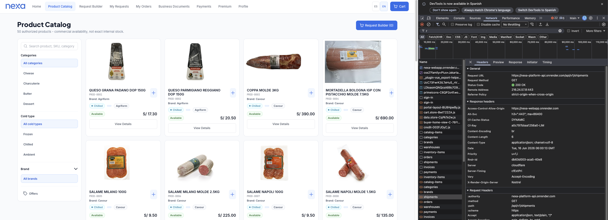
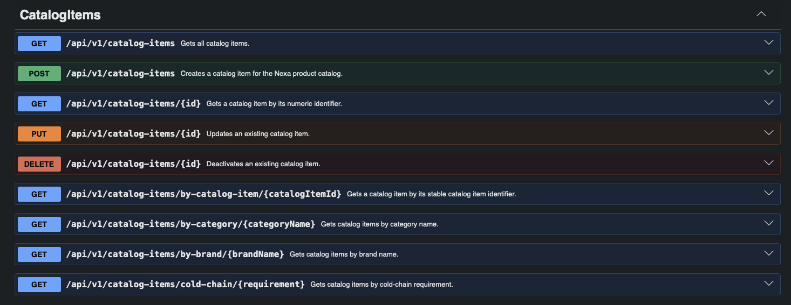
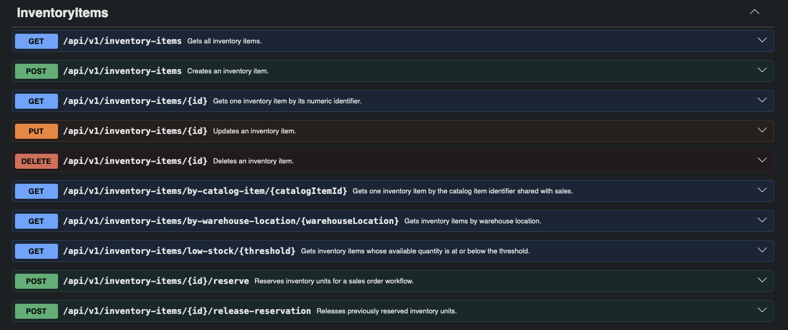
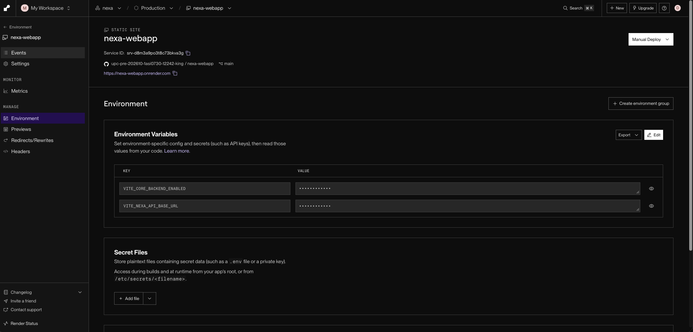
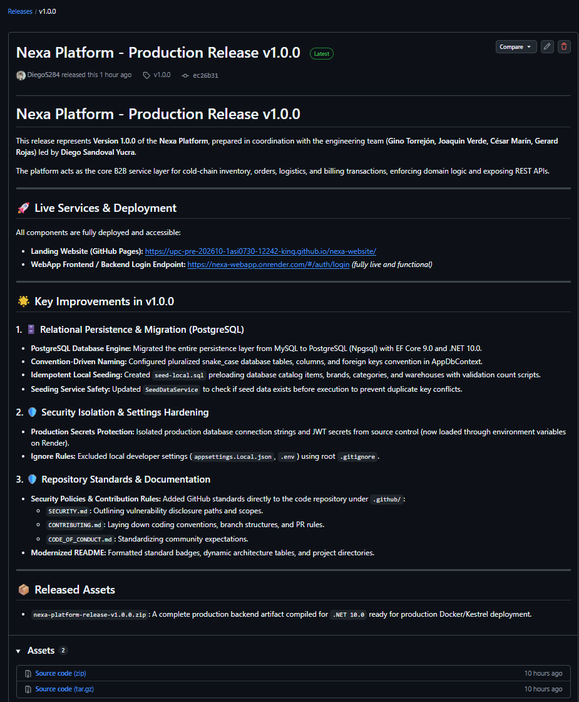
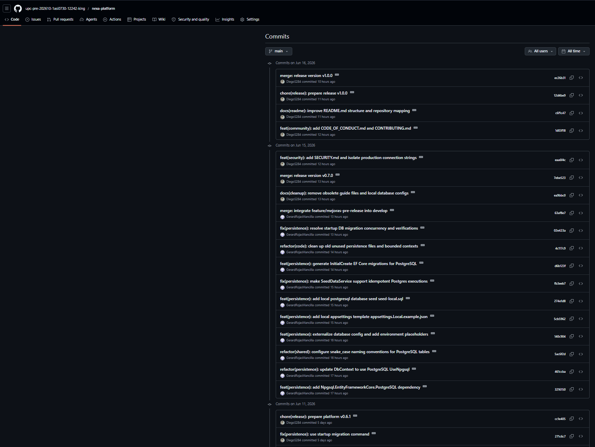
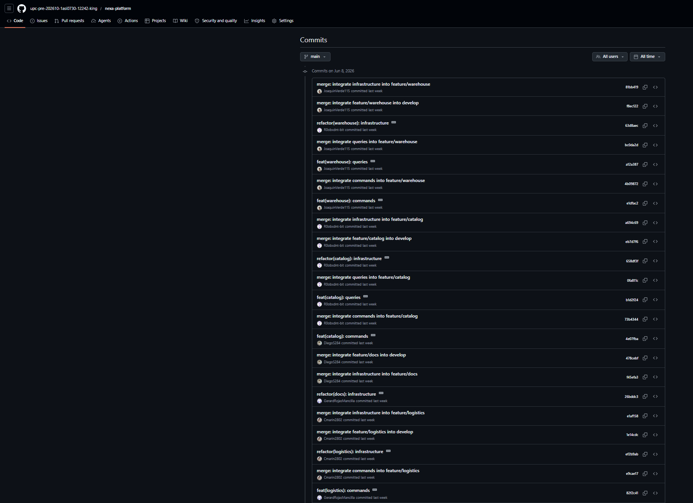

## 5.2.3. Sprint 3

El Sprint 3 corresponde al incremento **Backend Foundation Sprint** y al corte AV2 frontend/backend de Nexa. La evidencia de cierre técnico disponible registra `nexa-platform v1.0.0` como release de cierre AV2 de Web Services, `nexa-website v3.0.0` como release de cierre AV2 de Landing Page y `nexa-webapp v2.0.0` como release de cierre AV2 de Web Application. Este alcance marca una transición controlada desde servicios simulados hacia backend real, despliegue en Render y configuración/migración de persistencia hacia PostgreSQL, sin declarar todavía el cierre completo de evidencias no técnicas.

La versión de referencia disponible del backend para esta evidencia parcial es `v1.0.0`, construida con ASP.NET Core Web API, C#, .NET 10, Domain-Driven Design, modular monolith, bounded contexts, Shared Kernel, EF Core, PostgreSQL, controladores REST, commands, queries, infrastructure y ajustes de autenticación IAM alineados con la Web Application. Este incremento prioriza los flujos core de Catalog Management, Warehouse y Sales como base para revisión académica y validación controlada, sin declarar todavía operación productiva, integración total con toda la Web Application, reemplazo completo de todos los mocks ni cobertura total del roadmap backend.

### 5.2.3.1. Sprint Planning 3

La planificación del Sprint 3 organizó el avance técnico del backend de Nexa Platform. El sprint priorizó la creación de una foundation backend defendible, organizada por bounded contexts y preparada para documentar recursos REST internos sin declarar todavía operación productiva.

| Campo | Registro |
|---|---|
| Sprint # | Sprint 3 |
| Sprint Planning Background | Tercer incremento del proyecto orientado a consolidar la foundation backend de Nexa Platform con ASP.NET Core Web API, arquitectura modular por bounded contexts y recursos REST iniciales para Catalog Management, Sales y Warehouse. |
| Date | 2026-05-20 |
| Time | 08:00 PM |
| Location | Reunión virtual del equipo |
| Prepared By | Yucra Sandoval, Diego Sebastian |
| Attendees (to planning meeting) | Yucra Sandoval, Diego Sebastian / Verde Bueno, Joaquín / Marín Cueva, César / Rojas Mancilla, Gerard / Torrejón, Gino |
| Sprint 2 Review Summary | Sprint 2 dejó como base la Web Application TB1, los flujos internos S1/S2, el alcance parcial de S3 y el soporte de servicios simulados para validar recorridos frontend. |
| Sprint 2 Retrospective Summary | El equipo identificó la necesidad de separar con mayor claridad la simulación frontend de la API interna objetivo, reforzando la foundation backend y la trazabilidad técnica del repositorio `nexa-platform`. |
| Sprint Goal & User Stories | Primer incremento AV2 frontend/backend, actualización de la Landing Page y Web Application, primera versión de Web Services, integración inicial con WebApp, despliegue académico en Render, PostgreSQL, Swagger/OpenAPI y evidencia para Sprint Review de los flujos principales de S1 Commercial Coordination, S2 Operations / Account Owner y S3 B2B Buyer Portal. |
| Sprint 3 Goal | Nuestro foco está en entregar la primera versión de Web Services de Nexa e integrarla inicialmente con la WebApp, dejando el incremento AV2 desplegado académicamente en Render con PostgreSQL y documentación Swagger/OpenAPI para revisión. Creemos que esto aporta trazabilidad técnica y demostración funcional del corte AV2 para S1 Commercial Coordination, S2 Operations / Account Owner y S3 B2B Buyer Portal. Esto se confirmará cuando los endpoints documentados, el despliegue académico y los flujos principales puedan demostrarse con evidencias durante el Sprint Review. |
| Sprint 3 Velocity | 213 completed Story Points |
| Sum of Story Points | 213 Story Points |

> *Nota.* El dato se obtiene del Sprint Backlog 3 en Jira, donde la estimación visible del sprint registra `213 de 213` Story Points.

Para evitar ambigüedad de alcance, se distingue entre endpoint HTTP, REST resource y core endpoint group o core flow. Un endpoint HTTP corresponde a una operación concreta expuesta por la API, por ejemplo una ruta con un método específico. Un REST resource agrupa operaciones asociadas a una entidad o aggregate, como `/api/v1/orders`. Un core endpoint group representa una capacidad funcional priorizada para validar conexión frontend/backend. Por ello, Catalog, Inventory/Warehouse y Orders/Sales se documentan como tres flujos core agrupados, mientras que el backend actual registra 25 operaciones HTTP estructuradas.

### 5.2.3.2. Aspect Leaders and Collaborators

La ejecución del Sprint 3 se organiza por responsabilidades backend. La distribución prioriza ownership por bounded context y distingue liderazgo técnico transversal cuando la evidencia corresponde a arquitectura, API bootstrapping, documentación backend o higiene de ramas y releases.

*Distribución de liderazgos y roles funcionales en el Sprint 3*

| Team Member | GitHub Username | Project Management | Backend Architecture | Domain Modeling | REST API Development | Persistence | Documentation |
|---|---|:---:|:---:|:---:|:---:|:---:|:---:|
| Yucra Sandoval, Diego Sebastian | DiegoS284 | L | L | L | L | C | L |
| Verde Bueno, Joaquín Francisco | JoaquinVerde115 | C | C | L | L | L | C |
| Marín Cueva, César Fernando | Cmarin2802 | - | - | C | C | - | C |
| Torrejón De Los Santos, Gino Rodrigo | R0obxdnt-bit | C | C | L | L | C | C |
| Rojas Mancilla, Gerard Gianpier | GerardRojasMancilla | - | C | C | - | C | C |

DiegoS284 queda representado como líder del bounded context Sales y como responsable transversal de API bootstrapping, documentación backend y release hygiene. R0obxdnt-bit queda registrado como líder de Catalog Management, mientras que JoaquinVerde115 queda registrado como líder de Warehouse. Cmarin2802 participa en Logistics y documentación de dominio. GerardRojasMancilla participa en Shared Kernel, Persistence e Invoicing.

### 5.2.3.3. Sprint Backlog 3

El Sprint Backlog 3 concentra el trabajo asociado al primer corte AV2 frontend/backend y a la consolidación de la base backend de Nexa Platform. Su objetivo principal fue establecer una base técnica coherente para la primera Web Services API, organizada por bounded contexts, con controladores iniciales, Shared Kernel, patrones de repositorio, Unit of Work, persistencia mediante EF Core/PostgreSQL para el despliegue controlado y trazabilidad de release para revisar la transición desde mocks hacia backend real.

> *Nota.* La captura evidencia la planificación actualizada del Sprint 3, con 41 actividades visibles, estimación total del sprint, responsables, estados y work-items orientados al cierre AV2 de WebApp, Web Services, Swagger/OpenAPI, PostgreSQL y release. Elaboración propia.

**URL del board/backlog:** [Jira Backlog — Proyecto Nexa](https://team-nexa.atlassian.net/jira/software/projects/NX/boards/1/backlog)

La siguiente tabla presenta los Work-items utilizados para descomponer el Sprint 3. Los identificadores se mantienen como trazabilidad documental del cierre AV2 registrado en Jira.

| Sprint # | User Story Id | User Story Title | Work-Item / Task Id | Task Title | Description                                                                                                                                                                                                                                                                                                                          | Estimation (Hours) | Assigned To | Status |
|---|---|---|---|---|--------------------------------------------------------------------------------------------------------------------------------------------------------------------------------------------------------------------------------------------------------------------------------------------------------------------------------------|---:|---|---|
| Sprint 3 | N/A | Backend foundation de Nexa Platform | TS-NX-003-001 | Configurar ASP.NET Core Web API foundation | Preparar la estructura inicial del backend con C#, .NET 10, `Program.cs`, controladores REST, Swagger/OpenAPI y configuración base para ejecución local. | Ver Sprint Backlog 3 en Jira | Diego Yucra Sandoval | To Validate |
| Sprint 3 | N/A | Arquitectura modular backend | TS-NX-003-002 | Organizar bounded contexts y modular monolith | Estructurar el proyecto como modular monolith, separando Catalog Management, Sales, Warehouse y Shared Kernel como módulos iniciales del backend. | Ver Sprint Backlog 3 en Jira | Diego Yucra Sandoval | To Validate |
| Sprint 3 | N/A | Catalog Management REST resource | TS-NX-003-003 | Implementar recurso `/api/v1/catalog-items` | Implementar la base del aggregate `CatalogItem`, su controller REST y contratos iniciales para la gestión de productos refrigerados. | Ver Sprint Backlog 3 en Jira | Gino Torrejón | To Validate |
| Sprint 3 | N/A | Sales REST resource | TS-NX-003-004 | Implementar recurso `/api/v1/orders` | Implementar la base del aggregate `Order`, su controller REST y contratos iniciales para la gestión de órdenes comerciales B2B. | Ver Sprint Backlog 3 en Jira | Diego Yucra Sandoval | To Validate |
| Sprint 3 | N/A | Warehouse REST resource | TS-NX-003-005 | Implementar recurso `/api/v1/inventory-items` | Implementar la base del aggregate `InventoryItem`, su controller REST y contratos iniciales para disponibilidad e inventario. | Ver Sprint Backlog 3 en Jira | Joaquín Verde | To Validate |
| Sprint 3 | N/A | Shared Kernel y patrones de persistencia | TS-NX-003-006 | Configurar Shared Kernel, repositories y Unit of Work | Registrar contratos compartidos, interfaces de repositorio y Unit of Work como base de infraestructura para los bounded contexts iniciales. | Ver Sprint Backlog 3 en Jira | Diego Yucra Sandoval | To Validate |
| Sprint 3 | N/A | EF Core/PostgreSQL | TS-NX-003-007 | Preparar persistencia relacional para AV2 | Configurar la base técnica de EF Core y PostgreSQL para sostener el despliegue controlado en Render, sin declarar operación productiva ni validación completa de datos. | Ver Sprint Backlog 3 en Jira | Joaquín Verde | To Validate |
| Sprint 3 | N/A | Documentación Swagger/OpenAPI | TS-NX-003-008 | Registrar evidencia de OpenAPI local | Documentar la exposición local de Swagger/OpenAPI para los recursos REST priorizados del Sprint 3. | Ver Sprint Backlog 3 en Jira | Diego Yucra Sandoval | In Review |
| Sprint 3 | N/A | Release backend `v1.0.0` | TS-NX-003-009 | Documentar release técnico backend | Registrar el alcance de la versión `v1.0.0`, sus límites técnicos y la trazabilidad del incremento backend. | Ver Sprint Backlog 3 en Jira | Diego Yucra Sandoval | In Review |
| Sprint 3 | N/A | GitFlow y colaboración backend | TS-NX-003-010 | Registrar ramas feature/release | Documentar evidencia de colaboración mediante ramas por bounded context y capa, incluyendo `main`, `develop`, releases disponibles para revisión y commits de persistencia/PostgreSQL asociados al corte AV2. | Ver Sprint Backlog 3 en Jira | Diego Yucra Sandoval | To Validate |
| Sprint 3 | N/A | AV2 frontend/backend release | TS-NX-003-011 | Prepare frontend/backend release version for AV2 | Preparar una versión guiada por release para la Web Application y la Web Services API, manteniendo trazabilidad de alcance sin declarar despliegue productivo. | Ver Sprint Backlog 3 en Jira | Ver Sprint Backlog 3 en Jira | In Review |
| Sprint 3 | N/A | Backend build and local execution | TS-NX-003-012 | Validate backend build and local execution | Validar build y ejecución local del backend antes de reportar la foundation como evidencia cerrada. | Ver Sprint Backlog 3 en Jira | Ver Sprint Backlog 3 en Jira | To Validate |
| Sprint 3 | N/A | README/release execution guide | TS-NX-003-013 | Document README/release execution guide | Documentar instrucciones de ejecución, alcance de release y límites técnicos para revisar el corte AV2 frontend/backend. | Ver Sprint Backlog 3 en Jira | Ver Sprint Backlog 3 en Jira | In Review |
| Sprint 3 | N/A | Swagger endpoint validation | TS-NX-003-014 | Validate 25 structured backend endpoints in Swagger | Validar en Swagger/OpenAPI los 25 endpoints HTTP estructurados en backend C# antes de declararlos como alcance cerrado. | Ver Sprint Backlog 3 en Jira | Ver Sprint Backlog 3 en Jira | To Validate |
| Sprint 3 | N/A | Core frontend-backend flows | TS-NX-003-017 | Preserve core frontend-backend flows for Catalog, Inventory and Orders | Mantener la trazabilidad de los flujos core Catalog, Inventory/Warehouse y Orders/Sales como prioridad de conexión frontend/backend. | Ver Sprint Backlog 3 en Jira | Ver Sprint Backlog 3 en Jira | To Validate |

Nota. El detalle individual de estimación y asignación se respalda en las capturas de Jira incorporadas para Sprint 3. La métrica consolidada del sprint se registra como 213/213 Story Points según el Sprint Backlog 3. Elaboración propia.

### 5.2.3.4. Development Evidence for Sprint Review

La evidencia de desarrollo del Sprint 3 se organiza de acuerdo con el alcance AV2: primera versión de Web Services, nueva versión de Web Application, nueva versión de Landing Page y actualización del Project Report. Aunque el foco técnico principal del sprint fue la backend foundation de `nexa-platform`, también se registran commits puntuales de `nexa-webapp` y `nexa-website` cuando estos corresponden al corte AV2 y no a entregas anteriores.

Los commits incluidos son una selección representativa del incremento Sprint 3. No reemplazan el historial completo de GitHub; su propósito es evidenciar trazabilidad entre implementación, integración frontend/backend, documentación de release y actualización del informe académico.

*Commits del repositorio `nexa-platform`*

Release de cierre AV2 disponible para revisión. Este repositorio concentra la base backend con ASP.NET Core Web API, bounded contexts, Shared Kernel, EF Core/PostgreSQL, IAM, commands, queries, infrastructure, documentación técnica y release `v1.0.0` con título visible `Nexa Platform - Production Release v1.0.0`. Historial de commits: [https://github.com/upc-pre-202610-1asi0730-12242-king/nexa-platform/commits/main/](https://github.com/upc-pre-202610-1asi0730-12242-king/nexa-platform/commits/main/).

| Repository | Branch | Commit Id | Commit Message | Commit Message Body | Commited on (Date) |
|---|---|---|---|---|---|
| `upc-pre-202610-1asi0730-12242-king/nexa-platform` | `main` | `ec26b31` | `merge: release version v1.0.0` | Release merge for the AV2 review cut. | 2026-06-16 |
| `upc-pre-202610-1asi0730-12242-king/nexa-platform` | `develop` | `12d4be9` | `chore(release): prepare release v1.0.0` | Release metadata and version preparation for `v1.0.0`. | 2026-06-16 |
| `upc-pre-202610-1asi0730-12242-king/nexa-platform` | `main` | `c6f1c47` | `docs(readme): improve README.md structure and repository mapping` | Repository documentation and mapping alignment. | 2026-06-16 |
| `upc-pre-202610-1asi0730-12242-king/nexa-platform` | `main` | `1d03f18` | `feat(community): add CODE_OF_CONDUCT.md and CONTRIBUTING.md` | Community and contribution guidelines for repository governance. | 2026-06-16 |
| `upc-pre-202610-1asi0730-12242-king/nexa-platform` | `main` | `eaa6f4c` | `feat(security): add SECURITY.md and isolate production connection strings` | Security policy and connection string isolation for the deployment evidence. | 2026-06-15 |
| `upc-pre-202610-1asi0730-12242-king/nexa-platform` | `main` | `7ebe523` | `merge: release version v0.7.0` | Intermediate release merge before the `v1.0.0` closeout. | 2026-06-15 |
| `upc-pre-202610-1asi0730-12242-king/nexa-platform` | `main` | `ea9bbc0` | `docs(cleanup): remove obsolete guide files and local database configs` | Cleanup of obsolete local guides and database configuration files. | 2026-06-15 |
| `upc-pre-202610-1asi0730-12242-king/nexa-platform` | `develop` | `63af8e7` | `merge: integrate feature/mejoras-pre-release into develop` | Integration of pre-release improvements into the development branch. | 2026-06-15 |
| `upc-pre-202610-1asi0730-12242-king/nexa-platform` | `develop` | `02e423a` | `fix(persistence): resolve startup DB migration concurrency and verifications` | Startup migration concurrency and verification fix. | 2026-06-15 |
| `upc-pre-202610-1asi0730-12242-king/nexa-platform` | `develop` | `4c117c9` | `refactor(code): clean up old unused persistence files and bounded contexts` | Cleanup of unused persistence files and bounded context structure. | 2026-06-15 |
| `upc-pre-202610-1asi0730-12242-king/nexa-platform` | `develop` | `d6b123f` | `feat(persistence): generate InitialCreate EF Core migrations for PostgreSQL` | Initial persistence migration for PostgreSQL. | 2026-06-15 |
| `upc-pre-202610-1asi0730-12242-king/nexa-platform` | `develop` | `fb3eeb7` | `fix(persistence): make SeedDataService support idempotent Postgres executions` | Idempotent seed execution support. | 2026-06-15 |
| `upc-pre-202610-1asi0730-12242-king/nexa-platform` | `develop` | `274e1d8` | `feat(persistence): add local postgresql database seed seed-local.sql` | Local PostgreSQL seed script for review support. | 2026-06-15 |
| `upc-pre-202610-1asi0730-12242-king/nexa-platform` | `develop` | `5cb5962` | `feat(persistence): add local appsettings template appsettings.Local.example.json` | Local application settings template. | 2026-06-15 |
| `upc-pre-202610-1asi0730-12242-king/nexa-platform` | `develop` | `5ac6f2d` | `refactor(shared): configure snake_case naming conventions for PostgreSQL tables` | Naming convention alignment for PostgreSQL tables. | 2026-06-15 |
| `upc-pre-202610-1asi0730-12242-king/nexa-platform` | `develop` | `461ccba` | `refactor(persistence): update DbContext to use PostgreSQL UseNpgsql` | DbContext provider update for PostgreSQL. | 2026-06-15 |
| `upc-pre-202610-1asi0730-12242-king/nexa-platform` | `develop` | `3216150` | `feat(persistence): add Npgsql.EntityFrameworkCore.PostgreSQL dependency` | PostgreSQL provider dependency for EF Core. | 2026-06-15 |

*Commits del repositorio `nexa-webapp`*

Release de cierre AV2 disponible para revisión de la Web Application. Estos commits se incluyen porque corresponden al corte `nexa-webapp v2.0.0`: eliminación de dependencia de Mock API / JSON-server, consolidación de estado local/in-memory para flujos no dependientes de API real, documentación de patrones DDD/frontend architecture, ajustes de layout/responsividad y preparación del release `v2.0.0`.

| Repository | Branch | Commit Id | Commit Message | Commit Message Body | Commited on (Date) |
|---|---|---|---|---|---|
| `upc-pre-202610-1asi0730-12242-king/nexa-webapp` | `main` | `4f1701c` | `Merge branch 'release/v2.0.0' into main` | Consolidation of the WebApp release branch for the AV2 review cut. | 2026-06-16 |
| `upc-pre-202610-1asi0730-12242-king/nexa-webapp` | `release/v2.0.0` | `88b4172` | `chore(release): bump package version to 2.0.0 and add release notes` | Version metadata and release notes for `v2.0.0`. | 2026-06-16 |
| `upc-pre-202610-1asi0730-12242-king/nexa-webapp` | `develop` | `c1305dc` | `Merge branch 'feature/cleanup' into develop` | Integration of cleanup changes before the release branch. | 2026-06-16 |
| `upc-pre-202610-1asi0730-12242-king/nexa-webapp` | `develop` | `4f5b959` | `config(git): minimize gitignore and remove history items` | Repository hygiene for the WebApp release trail. | 2026-06-16 |
| `upc-pre-202610-1asi0730-12242-king/nexa-webapp` | `develop` | `afff8e7` | `build(cleanup): delete obsolete local verification logs` | Cleanup of obsolete local verification artifacts. | 2026-06-16 |
| `upc-pre-202610-1asi0730-12242-king/nexa-webapp` | `develop` | `5f1f4ee` | `build(cleanup): delete deprecated firebase routing configuration` | Removal of deprecated routing configuration. | 2026-06-16 |
| `upc-pre-202610-1asi0730-12242-king/nexa-webapp` | `develop` | `bae804c` | `Merge branch 'feature/documentation-compliance' into develop` | Integration of documentation compliance work. | 2026-06-16 |
| `upc-pre-202610-1asi0730-12242-king/nexa-webapp` | `develop` | `daafae5` | `docs(architecture): document clean architecture and frontend DDD patterns` | Documentation of frontend architecture and DDD alignment. | 2026-06-16 |
| `upc-pre-202610-1asi0730-12242-king/nexa-webapp` | `develop` | `ef22c5a` | `docs(wiki): create engineering wiki pages and navigation index` | Engineering wiki pages and navigation index. | 2026-06-16 |
| `upc-pre-202610-1asi0730-12242-king/nexa-webapp` | `develop` | `8b7fa35` | `docs(contrib): enforce structured multiline commit messages` | Contribution documentation for structured commit messages. | 2026-06-16 |
| `upc-pre-202610-1asi0730-12242-king/nexa-webapp` | `develop` | `2db3c82` | `docs(security): update security policy and reporting channels` | Security policy and reporting channel update. | 2026-06-16 |
| `upc-pre-202610-1asi0730-12242-king/nexa-webapp` | `develop` | `143e5c2` | `docs(readme): rewrite main readme with premium layout` | README structure and execution guidance alignment. | 2026-06-15 |
| `upc-pre-202610-1asi0730-12242-king/nexa-webapp` | `main` | `8299be1` | `Merge branch 'release/v1.8.0' into main` | Intermediate cleanup/layout release before `v2.0.0`. | 2026-06-15 |
| `upc-pre-202610-1asi0730-12242-king/nexa-webapp` | `release/v1.8.0` | `08f8170` | `chore(release): bump package version to 1.8.0 and add release notes` | Release metadata for the cleanup/layout polish cut. | 2026-06-15 |
| `upc-pre-202610-1asi0730-12242-king/nexa-webapp` | `develop` | `75fb950` | `style(ops): apply fluid auto-fit columns to quick-actions grid` | Responsive quick-actions layout adjustment. | 2026-06-15 |
| `upc-pre-202610-1asi0730-12242-king/nexa-webapp` | `develop` | `f8a1b8a` | `style(sales): improve create order catalog grid responsiveness` | Responsive catalog grid adjustment for order creation. | 2026-06-15 |
| `upc-pre-202610-1asi0730-12242-king/nexa-webapp` | `develop` | `2f1eb35` | `build(cleanup): delete server directory` | Removal of the obsolete local mock server directory. | 2026-06-15 |
| `upc-pre-202610-1asi0730-12242-king/nexa-webapp` | `develop` | `48914dc` | `refactor(api): remove useMockApi from context APIs` | Removal of mock API switching from context APIs. | 2026-06-15 |
| `upc-pre-202610-1asi0730-12242-king/nexa-webapp` | `develop` | `8cb8ab7` | `feat(store): configure in-memory data store for local resources` | In-memory store for local resource flows not dependent on a live API. | 2026-06-15 |
| `upc-pre-202610-1asi0730-12242-king/nexa-webapp` | `develop` | `3282b57` | `feat(shared): configure base API http clients for production` | Base API HTTP clients aligned with the deployed API endpoint strategy. | 2026-06-15 |
| `upc-pre-202610-1asi0730-12242-king/nexa-webapp` | `develop` | `7568f26` | `build(deps): remove json-server dependency and mock scripts` | Removal of JSON-server dependency and mock scripts. | 2026-06-15 |

*Commits del repositorio `nexa-website`*

Release de cierre AV2 disponible para revisión. `nexa-website v3.0.0` se registra con el título visible `v3.0.0 - Nexa Landing Website Production Release` e incorpora el cierre de Landing Page, navegación, páginas de detalle, correcciones visuales y documentación de repositorio. Historial de commits: [https://github.com/upc-pre-202610-1asi0730-12242-king/nexa-website/commits/main/](https://github.com/upc-pre-202610-1asi0730-12242-king/nexa-website/commits/main/).

| Repository | Branch | Commit Id | Commit Message | Commit Message Body | Commited on (Date) |
|---|---|---|---|---|---|
| `upc-pre-202610-1asi0730-12242-king/nexa-website` | `main` | `2fce6a1` | `docs(github): configure repository security policies and guides` | Repository governance documents for the AV2 closeout. | 2026-06-15 |
| `upc-pre-202610-1asi0730-12242-king/nexa-website` | `main` | `9b5e285` | `docs(readme): rewrite readme format and modernize badges` | README structure and badge modernization. | 2026-06-15 |
| `upc-pre-202610-1asi0730-12242-king/nexa-website` | `main` | `a401b76` | `fix(pages): clean content banners and link redirections` | Content banner cleanup and link redirection fixes. | 2026-06-15 |
| `upc-pre-202610-1asi0730-12242-king/nexa-website` | `main` | `6fc2bfb` | `feat(navigation): configure dedicated detail views for product and team` | Dedicated detail views for product and team pages. | 2026-06-15 |
| `upc-pre-202610-1asi0730-12242-king/nexa-website` | `main` | `7ee4a8e` | `fix(i18n): finalize team roles translation mappings` | Team role translation mapping adjustments. | 2026-06-15 |
| `upc-pre-202610-1asi0730-12242-king/nexa-website` | `main` | `d621862` | `feat(platform): introduce product showcase details to platform page` | Product showcase details for the platform page. | 2026-06-15 |
| `upc-pre-202610-1asi0730-12242-king/nexa-website` | `main` | `1954001` | `style(company): format team showcase grids and card hover actions` | Team showcase grid formatting and card hover interactions. | 2026-06-15 |
| `upc-pre-202610-1asi0730-12242-king/nexa-website` | `main` | `26da256` | `feat(company): integrate pixel-perfect team showcase section` | Team showcase section integration. | 2026-06-15 |
| `upc-pre-202610-1asi0730-12242-king/nexa-website` | `main` | `c2596a0` | `fix(legal): update legal pages lang attributes and remove demo tags` | Legal page language attributes and demo tag cleanup. | 2026-06-15 |
| `upc-pre-202610-1asi0730-12242-king/nexa-website` | `main` | `b2c8833` | `fix(faq): resolve FAQ list toggles and contrast issues` | FAQ toggle and contrast fixes. | 2026-06-15 |
| `upc-pre-202610-1asi0730-12242-king/nexa-website` | `main` | `8d503fa` | `fix(style): register missing status color tokens in design system` | Missing status color tokens for the design system. | 2026-06-15 |
| `upc-pre-202610-1asi0730-12242-king/nexa-website` | `main` | `e01c6e9` | `fix(core): update login redirect paths to render production backend` | Login redirect paths aligned with the deployed backend endpoint. | 2026-06-15 |
| `upc-pre-202610-1asi0730-12242-king/nexa-website` | `main` | `a25dff1` | `feat(website): add about content for AV2 release` | Adds About the Product and About the Team pages for the AV2 release path. | 2026-06-11 |
| `upc-pre-202610-1asi0730-12242-king/nexa-website` | `main` | `df83d0e` | `docs(readme): fix report repository links and name` | Corrects report repository references. | 2026-06-05 |

*Commits del repositorio `nexa-ecosystem-report`*

Actualización del informe académico para AV2. Estos commits documentan la incorporación del Sprint 3, ajustes de mockups, evidencias y alineación del alcance de Web Services.

| Repository | Branch | Commit Id | Commit Message | Commit Message Body | Commited on (Date) |
|---|---|---|---|---|---|
| `upc-pre-202610-1asi0730-12242-king/nexa-ecosystem-report` | `feature/ch3` | `b3ed14b` | `docs(impact-mapping): refine names and remove unnecessary content` | | 2026-06-03 |
| `upc-pre-202610-1asi0730-12242-king/nexa-ecosystem-report` | `main` | `7fec7ca` | `docs(assets): add updated landing page mockups` | | 2026-06-03 |
| `upc-pre-202610-1asi0730-12242-king/nexa-ecosystem-report` | `main` | `1fac304` | `docs(landing-page): update mockup images in report` | | 2026-06-03 |
| `upc-pre-202610-1asi0730-12242-king/nexa-ecosystem-report` | `feature/ch4` | `0537d19` | `docs(mockups): replace segment mockup images` | | 2026-06-06 |
| `upc-pre-202610-1asi0730-12242-king/nexa-ecosystem-report` | `main` | `e83deb7` | `docs(ch5): update implementation section for sprint 3 backend foundation` | | 2026-06-06 |
| `upc-pre-202610-1asi0730-12242-king/nexa-ecosystem-report` | `main` | `6aa80f5` | `docs(ch5): add sprint 3 backend foundation report` | | 2026-06-06 |
| `upc-pre-202610-1asi0730-12242-king/nexa-ecosystem-report` | `feature/ch5` | `6035681` | `docs(ch5): align sprint 3 with AV2 web services scope` | | 2026-06-07 |

La selección anterior evita reutilizar commits propios de AV1 o TB1. `nexa-platform`, `nexa-website` y `nexa-webapp` concentran la evidencia técnica de cierre AV2 disponible para revisión; y `nexa-ecosystem-report` mantiene la trazabilidad documental del incremento. La evidencia visual complementaria de Jira, ejecución local, Swagger/OpenAPI y release se registra en las subsecciones siguientes.

### 5.2.3.5. Execution Evidence for Sprint Review

El Sprint 3 presenta evidencia de ejecución para el corte AV2 frontend + backend. La revisión del incremento debe considerar `nexa-platform v1.0.0`, `nexa-website v3.0.0` y `nexa-webapp v2.0.0` como evidencia técnica disponible para revisión. También se consideran el README o guía de ejecución, el despliegue controlado en Render, la documentación Swagger/OpenAPI y la preparación de los flujos core para validación.

La ejecución se documenta como evidencia técnica del incremento y despliegue controlado, no como despliegue productivo. El alcance conserva límites explícitos: no se declara integración total con toda la Web Application, reemplazo total de mocks, autenticación productiva completa ni base de datos de operación final.

*Evidencia de ejecución esperada para Sprint Review*

| Execution Element | Evidence | Scope Statement | Status |
|---|---|---|---|
| Frontend release version | Captura real incorporada del release `nexa-webapp v2.0.0`. | Evidencia de versión frontend preparada para revisión AV2, sin declarar integración total con todos los servicios. | Incorporated |
| Backend release version | Captura real incorporada del release `nexa-platform v1.0.0`. | Evidencia de versión backend disponible para revisión AV2. | Incorporated |
| README/release guide | Release notes y README del repositorio `nexa-webapp` cubren guía de ejecución, alcance y notas del corte `v2.0.0`. | Instrucciones para ejecutar y revisar el corte AV2 frontend/backend. | Incorporated |
| WebApp Render | Evidencia incorporada: servicio Render y capturas de sign-in/catálogo de la WebApp desplegada. | Verifica despliegue controlado de la Web Application para revisión académica. | Incorporated |
| Platform API Render | Evidencia incorporada: servicio Render de Platform API y documentación Swagger/OpenAPI desplegada. | Verifica despliegue controlado de la Platform API para revisión académica. | Incorporated |
| Swagger/OpenAPI | Evidencia incorporada: captura general de Swagger/OpenAPI y endpoints priorizados. | Permite validar documentación de endpoints del backend. | Incorporated |
| Core flows prepared for validation | Evidencia incorporada parcialmente mediante capturas de login, catálogo, video de navegación, Swagger/OpenAPI y despliegues Render. | Registra flujos core priorizados para conexión frontend/backend sin declarar cobertura total. | Partially incorporated |
| Video de navegación Sprint 3 / AV2 | Video: `upc-pre-202610-1asi0730-12242-nexa-webapp-prototype-sprint-3`. URL: [Microsoft Stream / SharePoint](https://upcedupe-my.sharepoint.com/personal/u202416289_upc_edu_pe/_layouts/15/stream.aspx?id=%2Fpersonal%2Fu202416289%5Fupc%5Fedu%5Fpe%2FDocuments%2Fupc%2Dpre%2D202610%2D%201asi0730%2D12242%2Dking%2Fnexa%2Dprototype%2Fupc%2Dpre%2D202610%2D1asi0730%2D12242%2Dnexa%2Dwebbapp%2Emp4&referrer=StreamWebApp%2EWeb&referrerScenario=AddressBarCopied%2Eview%2E739e15be%2D2efd%2D49c4%2Da343%2D4cb5d8cab16a). Duración: `6:46`. S2: `1:44`. S3: `3:49`. | Demostrar la navegación lograda durante Sprint 3 y respaldar la revisión del incremento AV2. | Incorporated |

**Evidencia pendiente de captura específica de la estructura del proyecto backend.**

> *Nota:* El mismo video registrado como evidencia de prototyping en la sección 4.5 se reutiliza como evidencia de navegación del Sprint 3, debido a que muestra el recorrido de la WebApp por los segmentos S1, S2 y S3, incluyendo la transición hacia el Buyer Portal.

> *Nota:* Figura. Sign-in de la Web Application desplegada en Render.

> *Nota:* Figura. Catálogo de productos de la Web Application desplegada en Render.

### 5.2.3.6. Services Documentation Evidence for Sprint Review

La documentación de servicios del Sprint 3 se alinea con el Final Project Statement para AV2: registrar la primera versión de Web Services y su evidencia OpenAPI/Swagger. Los tres recursos REST principales representan flujos core agrupados para conexión frontend/backend; no equivalen al total de operaciones HTTP disponibles en el backend.

| Bounded Context | Aggregate | REST Resource | Main Responsibility | Owner |
|---|---|---|---|---|
| Catalog Management | CatalogItem | `/api/v1/catalog-items` | Gestionar catálogo de productos refrigerados. | R0obxdnt-bit |
| Sales | Order | `/api/v1/orders` | Gestionar órdenes comerciales B2B. | DiegoS284 |
| Warehouse | InventoryItem | `/api/v1/inventory-items` | Gestionar disponibilidad e inventario. | JoaquinVerde115 |

*Endpoint coverage summary for AV2*

| Coverage Level | Description | Count | Status |
|---|---|---:|---|
| Core frontend-backend flows | Catalog Management, Warehouse and Sales as prioritized flows for the AV2 review. | 3 groups | Documented |
| Current backend HTTP endpoints | Operations structured in IAM, Catalog Management, Warehouse, Sales, Invoicing and Logistics controllers. | 25 | To Validate |
| Current core business endpoints | Catalog Management, Warehouse and Sales HTTP operations. | 15 | To Validate |
| Core endpoints with IAM access | Core business endpoints plus sign-in/sign-up operations. | 17 | To Validate |

Note. Endpoint counts distinguish individual HTTP operations from grouped core capabilities. The Sprint 3 report documents the current backend foundation and does not declare full roadmap coverage, production deployment, complete Web Application integration or complete replacement of simulated frontend services.

*Currently structured backend endpoints*

| Module / Controller | Functional Scope                                 | HTTP Endpoint Count | Status      |
| ------------------- | ------------------------------------------------ | ------------------: | ----------- |
| Catalog Management  | Catalog item management                          |                   3 | To Validate |
| Warehouse           | Inventory availability, reservation and release  |                   6 | To Validate |
| Sales               | Orders, confirmation, rejection and cancellation |                   6 | To Validate |
| IAM                 | Sign-in and sign-up foundation                   |                   2 | To Validate |
| Invoicing           | Invoice creation and payment status              |                   4 | To Validate |
| Logistics           | Shipment scheduling and delivery status          |                   4 | To Validate |
| Total               | Current structured backend endpoints             |                  25 | To Validate |

Estos endpoints se encuentran estructurados en backend C# y deben validarse mediante build, ejecución local y Swagger/OpenAPI antes de declararse como alcance cerrado del incremento.

> *Nota:* Figura. Swagger/OpenAPI general de la Platform API.

> *Nota:* Figura. Endpoints de autenticación documentados en Swagger/OpenAPI.

> *Nota:* Figura. Endpoints de Catalog Items documentados en Swagger/OpenAPI.

> *Nota:* Figura. Endpoints de Inventory Items documentados en Swagger/OpenAPI.

> *Nota:* Figura. Endpoints de Orders documentados en Swagger/OpenAPI.

### 5.2.3.7. Software Deployment Evidence for Sprint Review

El Sprint 3 documenta evidencia de despliegue y preparación de release para AV2, incluyendo `nexa-platform v1.0.0`, `nexa-website v3.0.0` y `nexa-webapp v2.0.0` como evidencia técnica disponible para revisión. Esta sección no declara operación productiva; registra los artefactos que deben respaldar la revisión académica del corte frontend/backend.

La evidencia debe distinguir entre versión preparada para revisión, ejecución local y validación pendiente. No se declara integración total con toda la Web Application, reemplazo completo de servicios simulados, autenticación productiva completa, base de datos de operación final ni cobertura completa del roadmap backend.

| Deployment / Release Evidence | Evidence | Scope Statement | Status |
|---|---|---|---|
| Backend release evidence | Captura real incorporada del release backend `v1.0.0`. | Registra la versión de Web Services disponible para revisión AV2. | Incorporated |
| Frontend release evidence | Captura real incorporada del release `nexa-webapp v2.0.0`. | Registra la versión frontend asociada al corte AV2. | Incorporated |
| README execution guide | Release notes y README del repositorio `nexa-webapp` cubren guía de ejecución, alcance y notas del corte `v2.0.0`. | Explica cómo ejecutar y revisar frontend/backend sin depender de despliegue productivo. | Incorporated |
| WebApp Render deployment | Evidencia incorporada con captura real del servicio Render WebApp. | Documenta el despliegue controlado de la Web Application para revisión académica. | Incorporated |
| Platform API Render deployment | Evidencia incorporada con captura real del servicio Render Platform API. | Documenta el despliegue controlado de la API backend estructurada en C# como primer corte de servicios. | Incorporated |
| Swagger/OpenAPI URL or capture | Evidencia incorporada con captura real de Swagger/OpenAPI. | Evidencia de documentación de endpoints; no implica operación productiva. | Incorporated |

> *Nota:* Figura. Vista general del dashboard de Render usado como evidencia del despliegue académico AV2.

> *Nota:* Figura. Servicios de Nexa visibles en Render para revisión académica del corte AV2.

> *Nota:* Figura. Servicio Render de la Web Application desplegada.

> *Nota:* Figura. Variables o configuración de entorno del servicio WebApp en Render.

> *Nota:* Figura. Servicio Render de la Platform API desplegada.

> *Nota:* Figura. Variables o configuración de entorno de la Platform API en Render.

> *Nota:* Figura. Servicio PostgreSQL en Render asociado al despliegue académico AV2.

> *Nota:* Figura. Despliegue de la Landing Page en GitHub Pages.

### Evidencias visuales pendientes de Sprint 3 / AV2

La siguiente tabla ordena las capturas disponibles y pendientes para respaldar el incremento Sprint 3 / AV2. Las rutas indicadas permiten distinguir evidencia real ya incorporada de evidencia que todavía debe completarse para el cierre global del sprint.

| Evidencia | Propósito en Sprint 3 | Ruta sugerida en assets | Estado |
|---|---|---|---|
| Jira Sprint 3 / board final | Evidenciar el tablero final usado para organizar el incremento AV2. | `report/assets/images/chapter-5/sprint-evidence/jira/sprint-3-board-jira.png` | Incorporado con imagen real. |
| Sprint Backlog o tablero de tareas | Respaldar la planificación y seguimiento de tareas del Sprint 3. | `report/assets/images/chapter-5/sprint-evidence/jira/sprint-3-backlog-jira.png`; `report/assets/images/chapter-5/sprint-evidence/jira/sprint-3-task-status-jira.png` | Incorporado con imágenes reales. |
| Render WebApp service | Evidenciar el servicio Render asociado a la Web Application desplegada en `https://nexa-webapp.onrender.com`. | `report/assets/images/chapter-5/sprint-evidence/deployment/render-webapp-service.png` | Incorporado con imagen real. |
| Render Platform API service | Evidenciar el servicio Render asociado a la Platform API desplegada en `https://nexa-platform-api.onrender.com`. | `report/assets/images/chapter-5/sprint-evidence/deployment/render-platform-api-service.png` | Incorporado con imagen real. |
| Render PostgreSQL database service o configuración PostgreSQL | Respaldar la configuración PostgreSQL usada por `nexa-platform` en el despliegue académico AV2. | `report/assets/images/chapter-5/sprint-evidence/deployment/render-postgresql-service.png` | Incorporado con imagen real. |
| Swagger/OpenAPI de Platform API | Evidenciar la documentación de Web Services AV2 con .NET 10, Swagger/OpenAPI y endpoints estructurados. | `report/assets/images/chapter-5/sprint-evidence/backend/swagger-openapi-platform-api.png` | Incorporado con imagen real. |
| Estructura del proyecto backend `nexa-platform` | Mostrar la organización backend por bounded contexts, Web Services, EF Core y PostgreSQL para AV2. | `report/assets/images/chapter-5/sprint-evidence/backend/nexa-platform-project-structure.png` | Pendiente de captura |
| GitHub Release `nexa-website v3.0.0` | Respaldar el release de cierre AV2 disponible para revisión de Landing Page. | `report/assets/images/chapter-5/sprint-evidence/releases/nexa-website-v3-0-0-release.png` | Incorporado con imagen real. |
| GitHub Release `nexa-webapp v2.0.0` | Respaldar el release de cierre AV2 disponible para revisión de Web Application. | `report/assets/images/chapter-5/sprint-evidence/releases/nexa-webapp-v2-0-0-release.png` | Incorporado con imagen real. |
| GitHub Release `nexa-platform v1.0.0` | Respaldar el release de cierre AV2 disponible para revisión de Web Services. | `report/assets/images/chapter-5/sprint-evidence/releases/nexa-platform-v1-0-0-release.png` | Incorporado con imagen real. |
| Branches `nexa-website` | Evidenciar la rama principal de Landing Page durante el corte AV2. | `report/assets/images/chapter-5/sprint-evidence/gitflow/nexa-website-branches.png` | Incorporado con imagen real. |
| Branches `nexa-platform` | Evidenciar ramas `main` y `develop` de Web Services durante el corte AV2. | `report/assets/images/chapter-5/sprint-evidence/gitflow/nexa-platform-branches.png` | Incorporado con imagen real. |
| Branches `nexa-webapp` | Evidenciar ramas `main` y `develop` de Web Application durante el corte AV2. | `report/assets/images/chapter-5/sprint-evidence/gitflow/nexa-webapp-branches.png` | Incorporado con imagen real. |
| Commits recientes AV2 `nexa-website` | Evidenciar commits recientes de Landing Page asociados al corte AV2. | `report/assets/images/chapter-5/sprint-evidence/collaboration/nexa-website-commits-av2-recent.png` | Incorporado con imagen real. |
| Commits históricos de cierre AV2 `nexa-website` | Evidenciar continuidad histórica de commits de Landing Page para AV2. | `report/assets/images/chapter-5/sprint-evidence/collaboration/nexa-website-commits-av2-history.png` | Incorporado con imagen real. |
| Commits recientes AV2 `nexa-platform` | Evidenciar commits recientes de Web Services asociados al release disponible para revisión. | `report/assets/images/chapter-5/sprint-evidence/collaboration/nexa-platform-commits-av2-recent.png` | Incorporado con imagen real. |
| Commits por bounded context `nexa-platform` | Evidenciar commits por bounded context y ramas de integración de Web Services. | `report/assets/images/chapter-5/sprint-evidence/collaboration/nexa-platform-commits-av2-contexts.png` | Incorporado con imagen real. |
| Commits recientes AV2 `nexa-webapp` | Evidenciar commits recientes de Web Application asociados al release disponible para revisión. | `report/assets/images/chapter-5/sprint-evidence/collaboration/nexa-webapp-commits-av2-recent-1.png`; `report/assets/images/chapter-5/sprint-evidence/collaboration/nexa-webapp-commits-av2-recent-2.png` | Incorporado con imágenes reales. |
| GitHub Insights AV2 `nexa-webapp` | Evidenciar autores, commits y releases de Web Application durante el corte AV2. | `report/assets/images/front-matter/collaboration/github-insights/nexa-webapp-insights-av2.png` | Incorporado en Collaboration Insights. |
| Captura de ejecución WebApp desplegada | Evidenciar la ejecución de la Web Application en el entorno de despliegue AV2. | `report/assets/images/chapter-5/sprint-evidence/execution/webapp-login-render.png`; `report/assets/images/chapter-5/sprint-evidence/execution/webapp-catalog-render.png` | Parcialmente incorporado con login y catálogo desplegados. |
| Captura de ejecución Platform API desplegada | Evidenciar la ejecución de la Platform API en el entorno de despliegue AV2. | `report/assets/images/chapter-5/sprint-evidence/backend/swagger-openapi-platform-api.png` | Cubierto parcialmente por Swagger/OpenAPI desplegado. |
| Video de navegación Sprint 3 / AV2 | Demostrar la navegación lograda durante Sprint 3 con evidencia audiovisual para revisión AV2. | `report/assets/images/chapter-5/sprint-evidence/video/sprint-3-navigation-video-screenshot.png` | Incorporado con captura real, duración `6:46`, transición S2 `1:44`, transición S3 `3:49` y URL Microsoft Stream / SharePoint. |

> *Nota:* Esta evidencia registra el cierre técnico AV2 disponible para `nexa-website`, `nexa-platform` y `nexa-webapp`. El cierre completo de la entrega mantiene pendientes las evidencias no técnicas de validación, videos, coordinación y revisión AV2.

> *Nota.* La captura muestra el release `nexa-webapp v2.0.0`, utilizado como evidencia de cierre AV2 de la Web Application. Elaboración propia.

> *Nota:* Figura. Branches de `nexa-webapp` durante el corte AV2.

> *Nota:* Figura. Commits recientes de `nexa-webapp` para el release `v2.0.0`, parte 1.

> *Nota:* Figura. Commits recientes de `nexa-webapp` para el release `v2.0.0`, parte 2.

El rastro de releases de WebApp se interpreta de forma incremental: `v1.7.1` queda como patch AV2 previo, `v1.8.0` registra cleanup y layout polish, y `v2.0.0` queda como release de cierre actual de WebApp para el corte AV2.

> *Nota:* Figura. Release de cierre AV2 disponible para revisión de `nexa-website v3.0.0`.

> *Nota:* Figura. Branches de `nexa-website` durante el corte AV2.

> *Nota:* Figura. Commits recientes de `nexa-website` para el corte AV2.

> *Nota:* Figura. Commits históricos de cierre AV2 de `nexa-website`.

> *Nota:* Figura. Release de cierre AV2 disponible para revisión de `nexa-platform v1.0.0`.

> *Nota:* Figura. Branches de `nexa-platform` durante el corte AV2.

> *Nota:* Figura. Commits recientes de `nexa-platform` para el corte AV2.

> *Nota:* Figura. Commits por bounded context de `nexa-platform`.

### 5.2.3.8. Team Collaboration Insights during Sprint

La colaboración del Sprint 3 se estructuró por bounded context, preparación de release y responsabilidades transversales de frontend/backend. Esta distribución permitió separar el avance de Catalog Management, Sales y Warehouse, mientras se mantenía una base compartida para configuración de API, documentación, Shared Kernel, repositorios, Unit of Work, guía de ejecución y preparación de la primera Web Services API.

El flujo de trabajo permitió organizar responsabilidades backend alrededor de ramas por bounded context y capa, incluyendo `main`, `develop`, commits de persistencia/PostgreSQL, documentación de repositorio, seguridad, comunidad y el tag `v1.0.0` como release disponible para revisión AV2.

> *Nota.* El tablero de Jira muestra la distribución del trabajo del Sprint 3 por estados del flujo de trabajo, permitiendo observar el seguimiento operativo de las actividades del incremento AV2. Elaboración propia.

> *Nota.* La vista de seguimiento de tareas muestra responsables, informadores, prioridad, estado, resolución y fechas de actualización, reforzando la trazabilidad del trabajo realizado durante Sprint 3. Elaboración propia.

| Frente | Organización del trabajo | Resultado esperado |
|---|---|---|
| Catalog Management | Ownership de R0obxdnt-bit sobre `CatalogItem` y `/api/v1/catalog-items` | Recurso inicial para catálogo de productos refrigerados |
| Sales | Liderazgo de DiegoS284 sobre `Order`, `/api/v1/orders`, bootstrapping de API, documentación backend y release hygiene | Recurso inicial para órdenes comerciales B2B y coordinación técnica transversal |
| Warehouse | Ownership de JoaquinVerde115 sobre `InventoryItem` y `/api/v1/inventory-items` | Recurso inicial para disponibilidad e inventario |
| Shared foundation | Coordinación sobre Shared Kernel, repositories, Unit of Work, EF Core/PostgreSQL y Swagger/OpenAPI | Base técnica común para evolución backend |
| GitFlow/release hygiene | Separación por ramas, consolidación de `nexa-platform v1.0.0`, `nexa-website v3.0.0` y `nexa-webapp v2.0.0` como releases disponibles para revisión AV2 | Trazabilidad del incremento sin declarar operación productiva |

La conclusión del Sprint 3 es que Nexa establece su primer corte AV2 frontend/backend, documenta endpoints HTTP estructurados en C# y prioriza tres flujos core de integración asociados a Catalog Management, Warehouse y Sales. El incremento reduce la dependencia conceptual de servicios simulados, registra WebApp y Platform API en Render, y documenta la evolución hacia PostgreSQL para el despliegue controlado. El alcance conserva límites explícitos: no declara operación productiva, integración total con toda la Web Application, reemplazo total de servicios simulados, autenticación productiva completa ni validación cerrada con usuarios.
