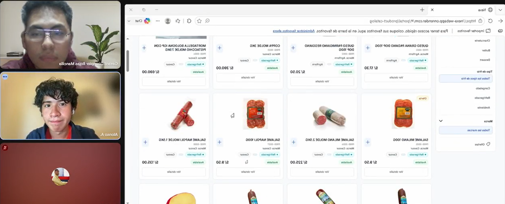

## 5.3. Validation Interviews

La presente sección prepara el protocolo de entrevistas de validación para AV2. Su propósito es evaluar si los segmentos definidos comprenden el flujo de Nexa, la propuesta de valor y el uso articulado de la Landing Page, la Web Application y los flujos principales asociados a cada rol. La sección no declara entrevistas ejecutadas ni resultados obtenidos; queda preparada para registrar evidencia verificable cuando el equipo complete las sesiones con participantes reales.

### 5.3.1. Diseño de Entrevistas

El diseño de entrevistas se orienta a validar comprensión, utilidad percibida y fricciones del flujo por segmento. Cada sesión debe mostrar el alcance disponible de Nexa sin presentar funcionalidades no implementadas como terminadas. La validación considera la Landing Page, la Web Application y los user flows asociados a cada segmento objetivo.

**Marco heurístico usado en las entrevistas.**

| N.º | Heurística | Enfoque durante la validación |
| --- | --- | --- |
| 1 | Visibilidad del estado del sistema | Verificar si el participante entiende estados, avances, confirmaciones y cambios durante el flujo. |
| 2 | Correspondencia entre el sistema y el mundo real | Verificar si términos, acciones y datos coinciden con el lenguaje del negocio. |
| 3 | Control y libertad del usuario | Verificar si el usuario puede volver, corregir, cancelar o revisar acciones. |
| 4 | Coherencia y estándares | Verificar si nombres, botones, estados y patrones se mantienen consistentes. |
| 5 | Prevención de errores | Verificar si el flujo ayuda a evitar acciones incorrectas antes de confirmarlas. |
| 6 | Reconocimiento en lugar de recuerdo | Verificar si la información necesaria está visible sin depender de memoria externa. |
| 7 | Flexibilidad y eficiencia de uso | Verificar si el flujo resulta rápido para usuarios frecuentes y comprensible para usuarios nuevos. |
| 8 | Diseño estético y minimalista | Verificar si la interfaz muestra lo necesario sin sobrecargar al usuario. |
| 9 | Reconocer, diagnosticar y recuperarse de errores | Verificar si los errores o incidencias son comprensibles y accionables. |
| 10 | Ayuda y documentación | Verificar si el usuario necesita guías, glosarios o explicaciones adicionales. |

Esta tabla funciona como marco de observación para el entrevistador. Durante la sesión no es necesario mencionar el nombre técnico de cada heurística; las preguntas se formulan en lenguaje natural mientras el participante revisa el flujo.

#### Diseño de entrevista S1: Commercial Coordination

**Objetivo de la sesión.** Validar si una persona vinculada a coordinación comercial comprende la propuesta de valor de Nexa, encuentra información comercial relevante en la Landing Page y entiende cómo iniciar o continuar un proceso comercial B2B.

**Flujo mostrado al participante.** Landing Page de Nexa, lectura de propuesta de valor, navegación por secciones de solución, beneficios y segmentos, consulta de información comercial, revisión de llamados a la acción, contacto o solicitud de demo, y explicación del flujo comercial hacia solicitud validada u orden cuando el alcance mostrado lo permita.

**Tareas guiadas.**

1. Revisar la Landing Page desde la primera vista.
2. Explicar con sus palabras qué problema intenta resolver Nexa.
3. Buscar información sobre beneficios, segmentos atendidos y alcance del servicio.
4. Ubicar una vía para solicitar contacto, demo o más información comercial.
5. Revisar cómo el flujo comercial avanzaría desde interés inicial hacia solicitud u orden.
6. Identificar qué información le daría confianza para continuar el proceso.

**Guion conversacional para la sesión.**

> Te voy a mostrar la Landing Page y el recorrido comercial inicial de Nexa. Mientras navegas, por favor dime en voz alta qué entiendes, qué te resulta claro, qué información buscarías antes de contactar al equipo y qué te generaría confianza para avanzar.
>
> Imagina que evalúas una solución para mejorar la coordinación comercial B2B en cadena de frío. No buscamos que aprendas el sitio de memoria, sino saber si la propuesta, los llamados a la acción y el flujo comercial se entienden de forma natural.

**Preguntas para conversar con el entrevistado.**

1. Al ver la primera pantalla, ¿queda claro qué ofrece Nexa y para quién está pensado?
2. ¿La propuesta de valor te parece expresada con palabras cercanas al contexto comercial B2B?
3. ¿Encuentras rápido información sobre beneficios, segmentos atendidos o tipo de solución?
4. Si quisieras pedir una demo o conversar con el equipo, ¿sabrías dónde hacerlo?
5. ¿Qué información comercial te faltaría antes de dejar tus datos o solicitar contacto?
6. ¿El recorrido entre Landing Page, información de la solución y contacto se siente claro?
7. ¿Hay términos, mensajes o secciones que podrían generar confusión?
8. ¿La página transmite suficiente confianza para iniciar una conversación comercial?
9. ¿La información visible ayuda a reducir llamadas, correos o explicaciones adicionales?
10. ¿Necesitarías una explicación adicional para entender cómo una solicitud comercial pasa luego a validación u orden?

#### Diseño de entrevista S2: Operations / Account Owner

**Objetivo de la sesión.** Evaluar si el usuario operativo comprende cómo Nexa apoya la coordinación de disponibilidad, reserva, despacho y trazabilidad de una orden.

**Flujo mostrado al participante.** Revisión de inventario operativo, consulta de lotes, stock bajo o vencimientos, reserva de inventario para solicitudes validadas, aplicación del criterio FEFO, preparación de orden con lotes trazables, creación o revisión de despacho, actualización de estado de despacho, registro de evidencia o incidencia y revisión de indicadores o documentos operativos si corresponde.

**Tareas guiadas.**

1. Revisar el inventario operativo.
2. Consultar lotes, stock bajo o vencimientos.
3. Reservar inventario para una solicitud validada.
4. Aplicar criterio FEFO al seleccionar lotes.
5. Preparar una orden con lotes trazables.
6. Crear o revisar un despacho.
7. Actualizar el estado de despacho.
8. Registrar evidencia o incidencia.
9. Revisar indicadores o documentos operativos si corresponde al flujo mostrado.

**Guion conversacional para la sesión.**

> Te voy a mostrar el flujo operativo de inventario, reserva y despacho de Nexa. Mientras lo revisas, por favor dime en voz alta qué entiendes, qué te parece claro, qué te genera duda y qué cambiarías para trabajar con menos errores.
>
> Imagina que estás revisando inventario disponible, lotes con fecha de vencimiento, stock bajo, reservas y preparación de despacho para una orden B2B. No buscamos que memorices el sistema, sino saber si el flujo se parece a tu forma real de trabajar y si te ayudaría a tomar decisiones operativas.

**Preguntas para conversar con el entrevistado.**

1. Cuando ves esta pantalla, ¿queda claro en qué estado está el inventario, la reserva o el despacho?
2. ¿Los términos como lote, vencimiento, stock bajo, reserva, FEFO o despacho te resultan naturales para tu trabajo?
3. Si seleccionas un lote equivocado o quieres revisar una reserva antes de confirmarla, ¿sientes que podrías corregirlo fácilmente?
4. ¿Los estados, botones y nombres se mantienen consistentes durante el flujo?
5. ¿La pantalla te ayudaría a evitar errores, como reservar un lote vencido, con stock insuficiente o no recomendado por FEFO?
6. ¿La información que necesitas aparece en pantalla o tendrías que recordarla o buscarla en otro lugar?
7. ¿El flujo te parece suficientemente rápido para alguien que realiza estas tareas todos los días?
8. ¿La pantalla se siente ordenada o hay demasiada información al mismo tiempo?
9. Si aparece un problema, como stock bajo, vencimiento cercano o una incidencia de despacho, ¿queda claro qué deberías hacer?
10. ¿Necesitarías una guía, glosario o explicación adicional para usar esta parte del sistema con confianza?

#### Diseño de entrevista S3: B2B Buyer Portal

**Objetivo de la sesión.** Evaluar si el comprador B2B entiende el portal, puede navegar el catálogo, preparar una solicitud o pedido, revisar órdenes y comprender el seguimiento comercial u operativo disponible.

**Flujo mostrado al participante.** Llegada desde Landing Page o CTA, acceso al portal o inicio de sesión, revisión de catálogo, búsqueda o filtrado de productos, revisión de ficha de producto, agregado de productos a solicitud, ajuste de cantidades, revisión de resumen, envío de solicitud, consulta de estado de solicitudes y órdenes, y revisión de tracking, documentos o estado de pago según el alcance mostrado.

**Tareas guiadas.**

1. Llegar al portal desde la Landing Page o un CTA.
2. Acceder al portal o iniciar sesión.
3. Revisar el catálogo.
4. Buscar o filtrar productos.
5. Revisar la ficha de producto.
6. Agregar productos a una solicitud.
7. Ajustar cantidades.
8. Revisar el resumen antes de enviar.
9. Enviar la solicitud.
10. Consultar estado de solicitudes y órdenes.
11. Revisar tracking, documentos o estado de pago según el alcance mostrado.

**Guion conversacional para la sesión.**

> Te voy a mostrar el portal del comprador B2B de Nexa. Mientras navegas, por favor dime qué entiendes, qué información te ayuda a decidir, qué parte te genera duda y qué necesitarías para usarlo con confianza en una compra real.
>
> Imagina que quieres consultar productos, armar una solicitud, revisar una orden y hacer seguimiento de una compra. La idea es observar si el portal resulta claro tanto para compradores frecuentes como para usuarios nuevos.

**Preguntas para conversar con el entrevistado.**

1. Al entrar al portal, ¿queda claro qué puedes hacer como comprador?
2. ¿El catálogo te ayuda a encontrar productos y entender qué estás solicitando?
3. ¿La ficha de producto muestra la información que necesitarías antes de agregarlo a una solicitud?
4. ¿El armado de pedido o solicitud se siente claro y fácil de seguir?
5. Antes de enviar la solicitud, ¿el resumen te ayudaría a revisar cantidades, productos y posibles errores?
6. ¿Se entiende la diferencia entre una solicitud enviada y una orden confirmada?
7. ¿La revisión de órdenes, documentos comerciales o estados te resulta suficiente para hacer seguimiento?
8. ¿El tracking o estado de compra te permite saber qué está pasando y qué esperar después?
9. ¿El portal sería rápido de usar para un comprador frecuente y comprensible para alguien nuevo?
10. ¿Qué ayuda, explicación o información adicional necesitarías para usar el portal con confianza?

*Evidencia de entrevista: Alonso Alcántara*

> *Nota:* Captura de sesión de entrevista. Elaboración propia.

### 5.3.2. Registro de Entrevistas

La siguiente tabla queda preparada para registrar entrevistas reales. La información se completará únicamente cuando existan participantes, evidencia audiovisual y autorización de uso dentro del reporte.

| Código | Nombres y apellidos     | Edad | Distrito   | Segmento | Screenshot del video | URL Microsoft Stream | Timing de inicio | Duración | Resumen descriptivo                                                             |
| --- |-------------------------|------|------------| --- | --- | --- |------------------|----------|---------------------------------------------------------------------------------|
| VI-S3-01 | Alonso Alcántara Cerdán | 19   | San Isidro | S3 | | https://upcedupe-my.sharepoint.com/:v:/g/personal/u202416289_upc_edu_pe/IQCl_8cJxwFxQJ2j-SPApYDZAZWDTrZYgNXN_r3o5jYW9bE?e=TLhRWn | 0:00             | 3:43     | Se mostró la aplicación a un hijo de un importador en el distrito de San Isidro |

### 5.3.3. Evaluaciones según heurísticas

La matriz de evaluación se utilizará después de ejecutar las entrevistas y revisar la evidencia asociada. Los hallazgos, severidades y recomendaciones se completarán únicamente con base en observaciones verificables, respuestas del participante y observación del recorrido realizado. La evaluación relacionará cada hallazgo con heurísticas de usabilidad, arquitectura de información e inclusive design.

Escala de severidad:

- 0: Sin problema.
- 1: Problema menor.
- 2: Problema moderado.
- 3: Problema crítico.

| Heurística | Criterio de evaluación en Nexa | Evidencia esperada | Hallazgo | Severidad | Recomendación |
| --- | --- |----| --- |-----| --- |
| Visibilidad del estado del sistema | El usuario reconoce estados de solicitud, orden, despacho, pago o inventario según su rol | Se registra conformidad visual del participante mediante la observación directa del flujo de tracking. El usuario verbaliza comprender en qué etapa se encuentra su requerimiento sin necesidad de asistencia externa. | El usuario identificó con precisión y en tiempo real el estado de su solicitud y el progreso del tracking sin registrar dudas. | 0   | Mantener el diseño actual de etiquetas y líneas de tiempo. |
| Correspondencia entre sistema y mundo real | Los términos comerciales, operativos y de compra resultan comprensibles para cada segmento | Captura del diálogo interactivo donde el usuario valida la terminología | Toda la terminología utilizada fue natural y alineada con el lenguaje diario del participante. | 0 | Mantener el glosario y vocabulario técnico actual del sistema. |
| Control y libertad del usuario | El usuario identifica cómo revisar, ajustar, volver o cancelar una acción dentro del flujo mostrado | Se navegó en reversa de forma autónoma, demostrando que la interfaz otorga control total sobre sus acciones comerciales | El participante logró modificar cantidades, regresar a pantallas anteriores y cancelar acciones de manera fluida y autónoma. | 0 | Mantener los flujos de navegación y botones de salida/retorno vigentes. |
| Consistencia y estándares | La interfaz mantiene nombres, acciones, estados y patrones visuales coherentes entre pantallas | Comparativa visual entre la interfaz de la Landing Page y los módulos internos del portal. El análisis del recorrido demuestra la homogeneidad en el uso de tipografías, botones de acción y distribución de menús. | Se validó una consistencia total en los patrones de diseño, colores de botones y nomenclatura entre la Landing y la app web. | 0 | Preservar el sistema de diseño (Design System) actual de Nexa. |
| Prevención de errores | El flujo reduce errores antes de validar solicitudes, reservar inventario, enviar solicitudes o actualizar despachos | Se constata mediante la interacción guiada que el sistema bloquea activamente posibles acciones accidentales del usuario. | Las pantallas de resumen y los modales de confirmación funcionaron eficazmente, evitando envíos accidentales o erróneos. | 0 | Mantener los mecanismos y alertas de confirmación previa al envío. |
| Reconocimiento antes que recuerdo | La interfaz muestra información suficiente para decidir sin depender de memoria externa | El flujo documenta que el usuario dispone de todos los datos críticos en pantalla, eliminando la necesidad de recordar precios o códigos previos. | La información crítica (stock, precios, nombres) se mantuvo visible en todo momento, evitando que el usuario deba memorizar datos. | 0 | Conservar la disposición de datos en las fichas de producto y carrito. |
| Flexibilidad y eficiencia de uso | El flujo permite completar tareas frecuentes con filtros, accesos directos o vistas relevantes | Registro secuencial de la aplicación de filtros en el catálogo. El usuario completó la selección de ítems recurrentes de manera ágil, validando los accesos rápidos diseñados para compradores frecuentes | El uso de filtros avanzados y la estructura del catálogo permitieron realizar la búsqueda y el pedido de forma ágil y rápida. | 0 | Mantener la arquitectura de la información y la jerarquía de los filtros. |
| Diseño estético y minimalista | Las pantallas priorizan información relevante sin sobrecargar decisiones comerciales, operativas o de compra | Las notas de observación confirman una respuesta positiva hacia la limpieza visual, destacando que el espacio en blanco reduce la fatiga cognitiva. | El participante destacó positivamente la limpieza visual de la interfaz, manifestando que no hay elementos distractores. | 0 | Conservar la estética limpia, el uso de espacios en blanco y el minimalismo actual. |
| Ayuda para reconocer, diagnosticar y recuperarse de errores | El usuario entiende mensajes, incidencias o estados problemáticos y cómo resolverlos | Despliegue de mensajes informativos ante campos vacíos o formatos erróneos.Gracias al lenguaje claro y humano del sistema. | Ante simulaciones de campos incompletos, el usuario comprendió inmediatamente el mensaje de error contextual y lo solucionó. | 0 | Mantener el formato instructivo y claro de los mensajes de validación. |
| Ayuda y documentación | El flujo ofrece soporte casi suficiente para comprender acciones, documentos, estados y próximos pasos | Registro del cierre de la entrevista donde se consulta la necesidad de soporte. El párrafo de control concluye que la autoexplicación de la interfaz hace  casi innecesaria la consulta de manuales o guías anexas. pero sugiere que una indicación visual para volver al catálogo le habría brindado mayor tranquilidad para continuar explorando sin temor a perder su avance.  | El usuario manifiesta que durante el trámite de compra e ingreso de datos, echa en falta un botón directo o asistencia visual para regresar de forma ágil a la tienda principal en caso de querer agregar más productos a último momento, lo que genera una ligera duda sobre si se perderá el progreso de su carrito actual. | 1   | Evaluar la adición de un enlace sutil de retorno o configurar el sistema para que, si el usuario decide consultar la tienda, esta se abra en una ventana aparte, garantizando así que no se pierdan los cambios realizados en el carrito de compras. |

#### DESCRIPCIÓN DE PROBLEMA:

**Problema #1:** No hay un control visual que permita regresar a la tienda durante el trámite de compra 

**Severidad:** 1

**Heurística Violada:** Usabilidad - Libertad y control del usuario 

**Problema:** Al momento de ingresar nuestros datos, no podemos regresar a la tienda en caso de que así se requiera. Una vez el cliente pase al trámite de compra, en caso de que este quiera regresar a la tienda, no hay un botón que lo envíe al inicio de la web, lo cual nos obliga a efectuar el trámite y al momento de elegir más productos, realizar otro, incrementándose así la cantidad de esfuerzo del usuario.

**Recomendación:** La más práctica es que al momento en que queramos realizar dicho trámite, el navegador lo abra en una ventana aparte para no perder los cambios realizados en nuestro carrito de compras. 
