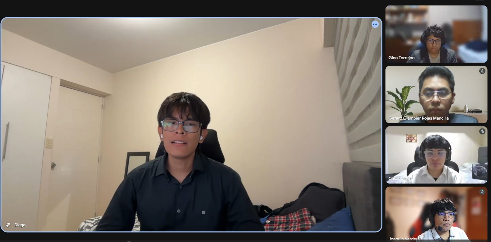

## 5.4. Video About-the-Product

El Video About-the-Product documenta de forma audiovisual la propuesta de valor de Nexa y el alcance académico presentado en AV2. La pieza fue publicada en Microsoft Stream / SharePoint y YouTube, y cuenta con evidencia visual incorporada en el reporte.

### 5.4.1. Objetivo del video

El objetivo del video es presentar a Nexa como una plataforma digital que conecta compradores y proveedores en un solo ecosistema. La comunicación explica el problema de buscar proveedores confiables en fuentes dispersas, comparar opciones manualmente y gestionar información comercial por separado, y muestra cómo Nexa facilita la búsqueda, comparación, gestión y seguimiento de servicios desde una solución clara, moderna y ordenada.

### 5.4.2. Resumen del contenido

El video inicia con la problemática que enfrentan compradores y proveedores al trabajar con información fragmentada. A continuación, presenta la Landing Page como punto de entrada para conocer la propuesta de valor, los beneficios principales y el acceso a la aplicación. El recorrido muestra la Web Application como un entorno centralizado donde los compradores pueden consultar catálogos, encontrar y comparar proveedores, revisar información relevante y gestionar sus procesos.

Para el segmento proveedor, el video explica que Nexa permite presentar productos o servicios de manera profesional, administrar la información comercial y aumentar la visibilidad frente a potenciales clientes. La pieza incorpora testimonios positivos de ambos segmentos y cierra con el mensaje: `Nexa: conecta, gestiona y crece en un solo lugar`.

### 5.4.3. Registro del video

| Elemento | Detalle |
|---|---|
| Título del video | `upc-pre-202610-1asi0730-12242-King-about-the-product-sprint-3` |
| Plataforma de publicación | Microsoft Stream / SharePoint y YouTube |
| URL Microsoft Stream | https://upcedupe-my.sharepoint.com/personal/u202416289_upc_edu_pe/_layouts/15/stream.aspx?id=%2Fpersonal%2Fu202416289%5Fupc%5Fedu%5Fpe%2FDocuments%2Fupc%2Dpre%2D202610%2D%201asi0730%2D12242%2Dking%2Fnexa%2Dmedia%2Fupc%2Dpre%2D202610%2D1asi0730%2D12242%2DKing%2Dabout%2Dthe%2Dproduct%2Dsprint%2D3%2Emp4&referrer=StreamWebApp%2EWeb&referrerScenario=AddressBarCopied%2Eview%2Edc587b63%2Db4f9%2D46cf%2Dbf5f%2D8428348af1f3 |
| URL YouTube | https://youtu.be/ypedAqjH19c?si=YKAWFK_y6Vo0jM5n |
| Duración | `2:14` |
| Fecha de publicación | 18/06/2026 |
| Testimonio positivo incluido | Testimonios de un usuario del segmento comprador y un usuario del segmento proveedor |
| Responsable de edición | Gino Torrejón |
| Responsable de narración | Diego Yucra |
| Evidencia visual | `report/assets/images/chapter-5/video-about-the-product/nexa-about-the-product-av2-screenshot.png` |

### 5.4.4. Evidencia del video

La siguiente captura corresponde al Video About-the-Product publicado para el cierre AV2:

### 5.4.5. Testimonios positivos incluidos

El video incorpora los siguientes testimonios positivos como apoyo a la presentación del producto. Su inclusión no implica que las Validation Interviews AV2 estén concluidas ni que exista una validación concluyente del producto.

| Segmento | Testimonio incluido en el video |
|---|---|
| Usuario del segmento comprador | “Me parece útil porque me ayudaría a encontrar opciones más rápido y comparar proveedores sin tener que buscar en muchos lugares diferentes”. |
| Usuario del segmento proveedor | “La plataforma puede ayudar a que más personas conozcan mi negocio y a organizar mejor la información que muestro a mis clientes”. |

### 5.4.6. Relación del video con el alcance AV2

El video relaciona la Landing Page y la Web Application con la propuesta de valor de Nexa. La Landing Page comunica el problema, los beneficios y el acceso a la solución; la Web Application presenta un espacio centralizado para consultar información y gestionar interacciones entre compradores y proveedores.

Desde la experiencia del comprador, se destacan la búsqueda de opciones, la comparación de proveedores y la consulta organizada de información. Desde la experiencia del proveedor, se presentan la exposición profesional de productos o servicios, la administración de información comercial y la posibilidad de mejorar su visibilidad. En conjunto, el video comunica los beneficios de conectar, gestionar y crecer dentro de un mismo ecosistema digital.

Esta evidencia corresponde al alcance académico de AV2. La publicación y documentación del video no declaran operación productiva definitiva, integración completa ni resultados concluyentes de validación; las Validation Interviews AV2 y las evaluaciones heurísticas permanecen sujetas a evidencia real de ejecución.
