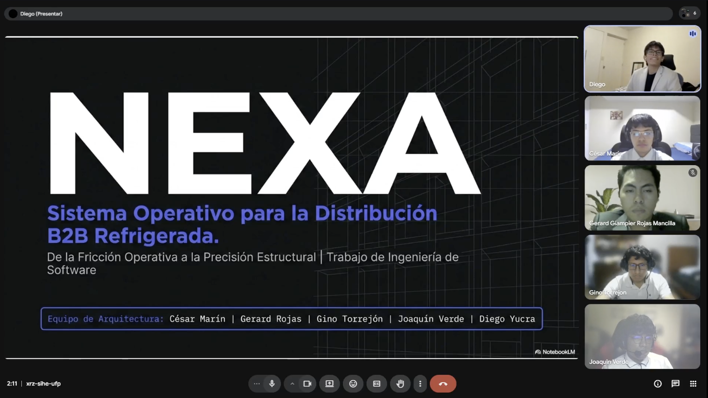

# Anexos

## A.1. Registro de videos del proyecto

*Tabla. Registro de videos según formato Anexo C*

| Sección | Características del video | Sobre el contenido | Integración y entrega |
| Needfinding Interviews | Archivo audiovisual en formato `.mp4`, organizado como registro consolidado de entrevistas. Duración según grabación original de las sesiones. | Presenta entrevistas realizadas a los segmentos objetivo y conserva la evidencia usada para el análisis de requisitos del Capítulo 2. | [Video de entrevistas consolidadas (Stream)](https://upcedupe-my.sharepoint.com/:v:/g/personal/u202323040_upc_edu_pe/IQCQOBuwf0GTTbCMpL2XzFXzAacXrD22oEX1Gat-emtg9u4?nav=eyJyZWZlcnJhbEluZm8iOnsicmVmZXJyYWxBcHAiOiJPbmVEcml2ZUZvckJ1c2luZXNzIiwicmVmZXJyYWxBcHBQbGF0Zm9ybSI6IldlYiIsInJlZmVycmFsTW9kZSI6InZpZXciLCJyZWZlcnJhbFZpZXciOiJNeUZpbGVzTGlua0NvcHkifX0&e=IeXiWj). También se referencia en la sección 2.2. |
| Prototype Navigation / Product Navigation | Video en formato `.mp4`, publicado en Microsoft Stream / SharePoint con duración `6:46`. | Muestra la continuidad de navegación del prototipo WebApp Sprint 3 entre S1, S2 y S3; también sirve como evidencia de navegación Sprint 3 / AV2. | [Video prototyping WebApp Sprint 3](https://upcedupe-my.sharepoint.com/personal/u202416289_upc_edu_pe/_layouts/15/stream.aspx?id=%2Fpersonal%2Fu202416289%5Fupc%5Fedu%5Fpe%2FDocuments%2Fupc%2Dpre%2D202610%2D%201asi0730%2D12242%2Dking%2Fnexa%2Dprototype%2Fupc%2Dpre%2D202610%2D1asi0730%2D12242%2Dnexa%2Dwebbapp%2Emp4&referrer=StreamWebApp%2EWeb&referrerScenario=AddressBarCopied%2Eview%2E739e15be%2D2efd%2D49c4%2Da343%2D4cb5d8cab16a). |
| Validation Interviews AV2 | Archivo audiovisual en formato `.mp4`, asociado a entrevistas de validación con usuarios. | Presenta validaciones, hallazgos y reacciones de usuarios frente al producto o prototipo, incluyendo tareas realizadas y observaciones principales. | Pendiente de enlace real en Microsoft Stream. |
| Sprint 1 | Archivo audiovisual en formato `.mp4`, correspondiente al Sprint 1. | Presentación sobre el resumen del desarrollo Sprint 1 por parte del equipo. | [Video Sprint 1 (Stream)](https://upcedupe-my.sharepoint.com/:v:/g/personal/u202416289_upc_edu_pe/IQAVv8bJe-LRRqMqXfoyPAN9AYa9Qv53vadsd31Y5_3kB_g?nav=eyJyZWZlcnJhbEluZm8iOnsicmVmZXJyYWxBcHAiOiJPbmVEcml2ZUZvckJ1c2luZXNzIiwicmVmZXJyYWxBcHBQbGF0Zm9ybSI6IldlYiIsInJlZmVycmFsTW9kZSI6InZpZXciLCJyZWZlcnJhbFZpZXciOiJNeUZpbGVzTGlua0NvcHkifX0&e=FqpHDx). |
| Exposición AV1 | Archivo audiovisual en formato `.mp4`, correspondiente a la exposición de AV1. | Video de exposición que presenta el desarrollo correspondiente a AV1. | [Video Exposición AV1 (Stream)](https://upcedupe-my.sharepoint.com/:v:/g/personal/u202416289_upc_edu_pe/IQBPOC2cr1MCQoghlbZL2JKuAQoKinH2du6u_Juo-Bfv3RQ?nav=eyJyZWZlcnJhbEluZm8iOnsicmVmZXJyYWxBcHAiOiJPbmVEcml2ZUZvckJ1c2luZXNzIiwicmVmZXJyYWxBcHBQbGF0Zm9ybSI6IldlYiIsInJlZmVycmFsTW9kZSI6InZpZXciLCJyZWZlcnJhbFZpZXciOiJNeUZpbGVzTGlua0NvcHkifX0&e=Ts4oNC). |
| Sprint 2 | Archivo audiovisual en formato `.mp4`, correspondiente al Sprint 2. | Presentación sobre el resumen del desarrollo Sprint 2 por parte del equipo. | [Video Sprint 2 (Stream)](https://upcedupe-my.sharepoint.com/:v:/g/personal/u202416289_upc_edu_pe/IQC49e7lfhaXTKaCqDH7muPMASAYEOMcNaAixhwjVp563U8?nav=eyJyZWZlcnJhbEluZm8iOnsicmVmZXJyYWxBcHAiOiJPbmVEcml2ZUZvckJ1c2luZXNzIiwicmVmZXJyYWxBcHBQbGF0Zm9ybSI6IldlYiIsInJlZmVycmFsTW9kZSI6InZpZXciLCJyZWZlcnJhbFZpZXciOiJNeUZpbGVzTGlua0NvcHkifX0&e=1AsdFO). |
| Exposición TB1 | Archivo audiovisual en formato `.mp4`, correspondiente a la exposición de TB1. | Video de exposición que presenta el desarrollo correspondiente a TB1. | [Video Exposición TB1 (Stream)](https://upcedupe-my.sharepoint.com/:v:/g/personal/u202416289_upc_edu_pe/IQCytZ5SQPVKS57qkWfmXovQAVKa2uHx9uzpxHpiVcmc_Qc?nav=eyJyZWZlcnJhbEluZm8iOnsicmVmZXJyYWxBcHAiOiJPbmVEcml2ZUZvckJ1c2luZXNzIiwicmVmZXJyYWxBcHBQbGF0Zm9ybSI6IldlYiIsInJlZmVycmFsTW9kZSI6InZpZXciLCJyZWZlcnJhbFZpZXciOiJNeUZpbGVzTGlua0NvcHkifX0&e=kRVP8r). |
| Sprint 3 | Archivo audiovisual en formato `.mp4`, correspondiente al Sprint 3. | Presenta el avance AV2 relacionado con frontend, backend foundation, Web Services, validación y evidencias del incremento. | Pendiente de enlace real en Microsoft Stream. |
| Video de navegación Sprint 3 / AV2 | Archivo audiovisual en formato `.mp4`, publicado en Microsoft Stream / SharePoint con duración `6:46`. | Demuestra la navegación lograda durante Sprint 3 / AV2; inicia con S1, cambia a S2 en `1:44` y cambia a S3 en `3:49`. También sirve como evidencia de prototyping WebApp Sprint 3. | [Video de navegación Sprint 3 / AV2](https://upcedupe-my.sharepoint.com/personal/u202416289_upc_edu_pe/_layouts/15/stream.aspx?id=%2Fpersonal%2Fu202416289%5Fupc%5Fedu%5Fpe%2FDocuments%2Fupc%2Dpre%2D202610%2D%201asi0730%2D12242%2Dking%2Fnexa%2Dprototype%2Fupc%2Dpre%2D202610%2D1asi0730%2D12242%2Dnexa%2Dwebbapp%2Emp4&referrer=StreamWebApp%2EWeb&referrerScenario=AddressBarCopied%2Eview%2E739e15be%2D2efd%2D49c4%2Da343%2D4cb5d8cab16a). Captura: `report/assets/images/chapter-5/sprint-evidence/video/sprint-3-navigation-video-screenshot.png`. |
| Exposición AV2 | Archivo audiovisual en formato `.mp4`, correspondiente a la exposición de AV2. | Video de exposición que presenta el desarrollo correspondiente a AV2, incluyendo Sprint 3, Web Services, validación y evidencias audiovisuales. | Pendiente de enlace real en Microsoft Stream. |
| Video About-the-Product AV2 — Microsoft Stream URL | Video en formato `.mp4`, con duración pendiente de registrar y enfoque en propuesta de valor, problema, solución y recorrido principal. | Explica Nexa como producto: problema atendido, segmentos, flujo principal, alcance implementado, beneficios y límites de la entrega AV2. | Pendiente de publicación. |
| Video About-the-Product AV2 — YouTube URL, si aplica | Enlace público o incrustable solo si el equipo decide usar YouTube para la Landing Page. | Permite referenciar el video desde la Landing Page cuando exista publicación verificada. | Pendiente de publicación, si aplica. |
| Captura Video About-the-Product AV2 | Captura o evidencia visual del video publicado. | Respalda la publicación del Video About-the-Product AV2 dentro de la sección 5.4. | Pendiente de captura real. |
| Testimonio positivo incluido en Video About-the-Product | Registro textual o audiovisual de un testimonio positivo validado por usuario. | Debe indicar usuario, segmento y referencia a entrevista de validación cuando exista evidencia real. | Pendiente de validación real. |
| Prototype Navigation / Product Navigation | Video de navegación esperado en formato `.mp4`, con recorrido claro por las pantallas del prototipo o producto. | Debe mostrar la continuidad de navegación entre pantallas, flujos principales y estados relevantes del producto. | No se registra enlace final en este anexo. Se mantiene como requisito de integración para la evidencia de prototipo/producto cuando el equipo publique el video correspondiente. |

> *Nota:* La tabla conserva los enlaces disponibles y mantiene como pendientes controlados los enlaces que dependen de evidencia real antes del cierre completo de AV2. No se agregan URLs, videos ni evidencias que no hayan sido publicados por el equipo.

## A.2. Evidencia de Needfinding

Como respaldo de la fase de levantamiento de requisitos e investigación de campo, se adjunta el video consolidado con las sesiones de entrevistas realizadas a los segmentos objetivo.

| Artefacto | Enlace de Evidencia |
|---|---|

## A.3. Enlaces maestros de soporte
## A.3. Enlaces Maestros de Soporte

El siguiente cuadro concentra los enlaces a las plataformas colaborativas y repositorios utilizados para gestionar el ciclo de vida de Nexa.

| Herramienta / Artefacto | Enlace |
|---|---|
| Jira Product Backlog | [Nexa Product Backlog (Jira)](https://team-nexa.atlassian.net/jira/software/projects/NX/boards/1/backlog) |
| Figma Project (Landing Page) | [Nexa Landing Page Design](https://www.figma.com/files/team/1586383034175281439/project/587167294) |
| Figma Project (Web Application) | [Nexa Web App Design](https://www.figma.com/design/buDa5VZmYjPNokbl4FEJqx/Web-App?node-id=0-1) |
| Repositorio GitHub (Reporte) | [upc-pre-202610-1asi0730-12242-king/nexa-ecosystem-report](https://github.com/upc-pre-202610-1asi0730-12242-king/nexa-ecosystem-report) |
| Repositorio GitHub (Website) | [upc-pre-202610-1asi0730-12242-king/nexa-website](https://github.com/upc-pre-202610-1asi0730-12242-king/nexa-website) |
| Repositorio GitHub (Web Application) | [upc-pre-202610-1asi0730-12242-king/nexa-webapp](https://github.com/upc-pre-202610-1asi0730-12242-king/nexa-webapp) |
| Repositorio GitHub (Web Services / Backend) | [upc-pre-202610-1asi0730-12242-king/nexa-platform](https://github.com/upc-pre-202610-1asi0730-12242-king/nexa-platform) |
| Landing Page desplegada | [https://upc-pre-202610-1asi0730-12242-king.github.io/nexa-website/](https://upc-pre-202610-1asi0730-12242-king.github.io/nexa-website/) |
| Web Application desplegada | [https://nexa-webapp.onrender.com](https://nexa-webapp.onrender.com) |
| Web Services / Platform API AV2 | [https://nexa-platform-api.onrender.com](https://nexa-platform-api.onrender.com) |
| :--- | :--- |

| Artefacto | Enlace |
|---|---|
| `nexa-website v3.0.0` | [https://github.com/upc-pre-202610-1asi0730-12242-king/nexa-website/releases/tag/v3.0.0](https://github.com/upc-pre-202610-1asi0730-12242-king/nexa-website/releases/tag/v3.0.0) |
| `nexa-webapp v2.0.0` | [https://github.com/upc-pre-202610-1asi0730-12242-king/nexa-webapp/releases/tag/v2.0.0](https://github.com/upc-pre-202610-1asi0730-12242-king/nexa-webapp/releases/tag/v2.0.0) |
| `nexa-platform v1.0.0` | [https://github.com/upc-pre-202610-1asi0730-12242-king/nexa-platform/releases/tag/v1.0.0](https://github.com/upc-pre-202610-1asi0730-12242-king/nexa-platform/releases/tag/v1.0.0) |
| `nexa-ecosystem-report v2.0.0` | [https://github.com/upc-pre-202610-1asi0730-12242-king/nexa-ecosystem-report/releases/tag/v2.0.0](https://github.com/upc-pre-202610-1asi0730-12242-king/nexa-ecosystem-report/releases/tag/v2.0.0) |

> *Nota:* `nexa-ecosystem-report v2.0.0` se mantiene como último release documental relevante. Los commits AV2 posteriores se registran como actualizaciones documentales posteriores al tag, sin declarar un nuevo release del reporte.

## A.5. Evidencia de coordinación grupal

### Sprint 1

> *Nota:* Figura. Trabajo colaborativo del equipo KING durante el Sprint 1. Elaboración propia.

> *Nota:* Figura. Reunión de coordinación del equipo KING durante Sprint 1. Elaboración propia.

> *Nota:* Figura. Práctica de exposición del equipo KING para la sustentación AV1. Elaboración propia.

### Sprint 2

> *Nota:* Figura. Reunión de coordinación del equipo KING durante Sprint 2. Elaboración propia.

> *Nota:* Figura. Exposición del equipo KING para la sustentación TB1. Elaboración propia.

### Sprint 3

Las evidencias de coordinación Sprint 3 / AV2 y revisión de evidencias AV2 quedan centralizadas en la tabla A.6 para evitar duplicidad documental. Cuando existan capturas reales, se incorporarán en las rutas sugeridas y se referenciarán desde este anexo.

## A.6. Evidencias AV2 disponibles y pendientes de cierre

La siguiente tabla centraliza las evidencias visuales disponibles para el corte AV2 y mantiene pendientes explícitos para no cerrar globalmente la entrega antes de incorporar las evidencias no técnicas restantes.

| Evidencia AV2 | Referencia | Ruta sugerida o referencia | Estado |
|---|---|---|---|
| Sprint Backlog 1 en Jira | Evidencia actualizada del backlog de Sprint 1. URL: [Jira Backlog — Proyecto Nexa](https://team-nexa.atlassian.net/jira/software/projects/NX/boards/1/backlog) | `report/assets/images/chapter-5/sprint-evidence/jira/sprint-1-backlog-jira.png` | Incorporado |
| Sprint Backlog 2 en Jira | Evidencia actualizada del backlog de Sprint 2. URL: [Jira Backlog — Proyecto Nexa](https://team-nexa.atlassian.net/jira/software/projects/NX/boards/1/backlog) | `report/assets/images/chapter-5/sprint-evidence/jira/sprint-2-backlog-jira.png` | Incorporado |
| Sprint Backlog 3 en Jira | Evidencia actualizada del backlog de Sprint 3. URL: [Jira Backlog — Proyecto Nexa](https://team-nexa.atlassian.net/jira/software/projects/NX/boards/1/backlog) | `report/assets/images/chapter-5/sprint-evidence/jira/sprint-3-backlog-jira.png` | Incorporado |
| Board Sprint 3 en Jira | Evidencia actualizada del tablero Sprint 3. URL: [Jira Backlog — Proyecto Nexa](https://team-nexa.atlassian.net/jira/software/projects/NX/boards/1/backlog) | `report/assets/images/chapter-5/sprint-evidence/jira/sprint-3-board-jira.png` | Incorporado |
| Seguimiento de tareas Sprint 3 en Jira | Evidencia actualizada de seguimiento de tareas Sprint 3. URL: [Jira Backlog — Proyecto Nexa](https://team-nexa.atlassian.net/jira/software/projects/NX/boards/1/backlog) | `report/assets/images/chapter-5/sprint-evidence/jira/sprint-3-task-status-jira.png` | Incorporado |
| Render WebApp | Captura real incorporada en la evidencia de Sprint 3 / AV2. | `report/assets/images/chapter-5/sprint-evidence/deployment/render-webapp-service.png` / [https://nexa-webapp.onrender.com](https://nexa-webapp.onrender.com) | Incorporado |
| Render Platform API | Captura real incorporada en la evidencia de Sprint 3 / AV2. | `report/assets/images/chapter-5/sprint-evidence/deployment/render-platform-api-service.png` / [https://nexa-platform-api.onrender.com](https://nexa-platform-api.onrender.com) | Incorporado |
| Render PostgreSQL | Captura real incorporada en la evidencia de Sprint 3 / AV2. | `report/assets/images/chapter-5/sprint-evidence/deployment/render-postgresql-service.png` | Incorporado |
| Swagger/OpenAPI AV2 | Captura real incorporada en la evidencia de Sprint 3 / AV2. | `report/assets/images/chapter-5/sprint-evidence/backend/swagger-openapi-platform-api.png` | Incorporado |
| GitHub Release `nexa-website v3.0.0` | Release de cierre AV2 disponible para revisión. | `report/assets/images/chapter-5/sprint-evidence/releases/nexa-website-v3-0-0-release.png` | Incorporado |
| Branches `nexa-website` | Evidencia de ramas de Landing Page. | `report/assets/images/chapter-5/sprint-evidence/gitflow/nexa-website-branches.png` | Incorporado |
| Commits recientes AV2 `nexa-website` | URL commits: [https://github.com/upc-pre-202610-1asi0730-12242-king/nexa-website/commits/main/](https://github.com/upc-pre-202610-1asi0730-12242-king/nexa-website/commits/main/) | `report/assets/images/chapter-5/sprint-evidence/collaboration/nexa-website-commits-av2-recent.png` | Incorporado |
| Commits históricos de cierre AV2 `nexa-website` | URL commits: [https://github.com/upc-pre-202610-1asi0730-12242-king/nexa-website/commits/main/](https://github.com/upc-pre-202610-1asi0730-12242-king/nexa-website/commits/main/) | `report/assets/images/chapter-5/sprint-evidence/collaboration/nexa-website-commits-av2-history.png` | Incorporado |
| GitHub Insights AV2 `nexa-website` | Evidencia complementaria del ecosistema AV2. | `report/assets/images/front-matter/collaboration/github-insights/nexa-website-insights-av2.png` | Incorporado |
| GitHub Release `nexa-platform v1.0.0` | Release de cierre AV2 disponible para revisión. | `report/assets/images/chapter-5/sprint-evidence/releases/nexa-platform-v1-0-0-release.png` | Incorporado |
| Branches `nexa-platform` | Evidencia de ramas de Web Services. | `report/assets/images/chapter-5/sprint-evidence/gitflow/nexa-platform-branches.png` | Incorporado |
| Commits recientes AV2 `nexa-platform` | URL commits: [https://github.com/upc-pre-202610-1asi0730-12242-king/nexa-platform/commits/main/](https://github.com/upc-pre-202610-1asi0730-12242-king/nexa-platform/commits/main/) | `report/assets/images/chapter-5/sprint-evidence/collaboration/nexa-platform-commits-av2-recent.png` | Incorporado |
| Commits por bounded context `nexa-platform` | URL commits: [https://github.com/upc-pre-202610-1asi0730-12242-king/nexa-platform/commits/main/](https://github.com/upc-pre-202610-1asi0730-12242-king/nexa-platform/commits/main/) | `report/assets/images/chapter-5/sprint-evidence/collaboration/nexa-platform-commits-av2-contexts.png` | Incorporado |
| GitHub Insights AV2 `nexa-platform` | Evidencia complementaria del ecosistema AV2. | `report/assets/images/front-matter/collaboration/github-insights/nexa-platform-insights-av2.png` | Incorporado |
| GitHub Release `nexa-webapp v2.0.0` | Release de cierre AV2 disponible para revisión de Web Application. | `report/assets/images/chapter-5/sprint-evidence/releases/nexa-webapp-v2-0-0-release.png` | Incorporado |
| Commits finales `nexa-webapp` | URL commits: [https://github.com/upc-pre-202610-1asi0730-12242-king/nexa-webapp/commits/main/](https://github.com/upc-pre-202610-1asi0730-12242-king/nexa-webapp/commits/main/) | `report/assets/images/chapter-5/sprint-evidence/collaboration/nexa-webapp-commits-av2-recent-1.png`; `report/assets/images/chapter-5/sprint-evidence/collaboration/nexa-webapp-commits-av2-recent-2.png` | Incorporado |
| Branches `nexa-webapp` | Evidencia de ramas `main` y `develop` de Web Application. | `report/assets/images/chapter-5/sprint-evidence/gitflow/nexa-webapp-branches.png` | Incorporado |
| Insights `nexa-webapp` | Evidencia complementaria del ecosistema AV2. | `report/assets/images/front-matter/collaboration/github-insights/nexa-webapp-insights-av2.png` | Incorporado |
| Actualización de `02-version-history.md` | Version History actualizado con `nexa-webapp v2.0.0` y cierre técnico de versiones Website/Platform/WebApp para AV2. | `report/front-matter/02-version-history.md` | Incorporado |
| Actualización final de conclusiones | Conclusiones actualizadas con `nexa-webapp v2.0.0` y pendientes no técnicos delimitados. | Secciones de conclusiones del reporte | Incorporado |
| Captura Video About-the-Product AV2 | Pendiente de captura real del video publicado. | Pendiente de ruta o anexo cuando exista captura real | Pendiente de captura |