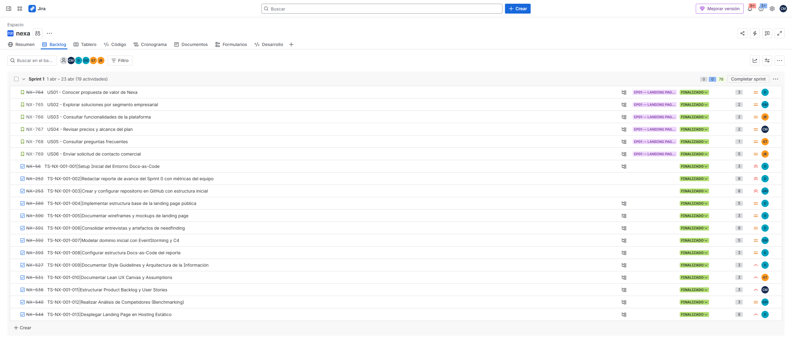
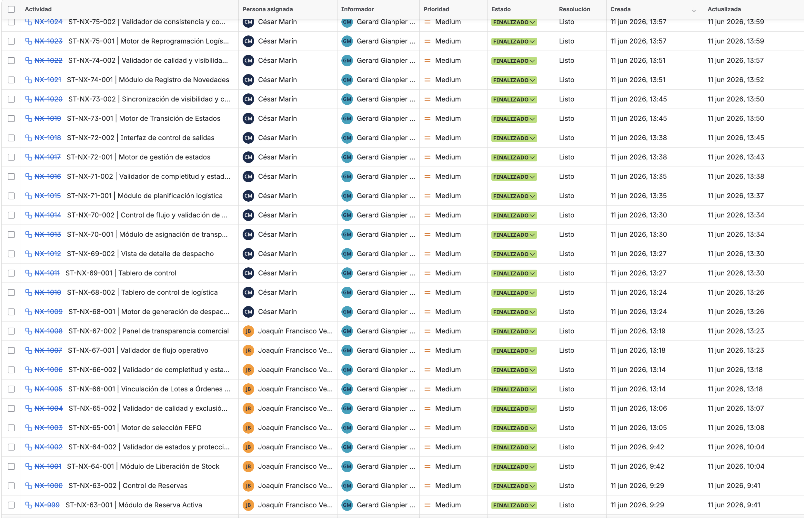
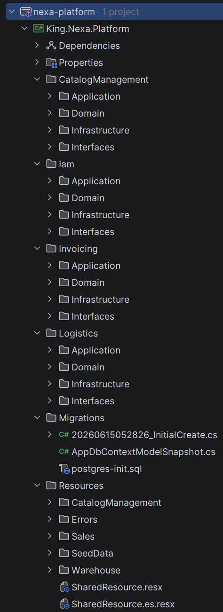
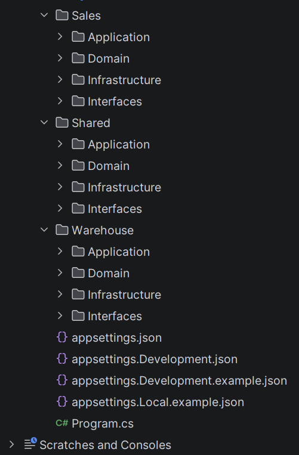

# Annex E: Deployment and Services Evidence

## E.1. Enlaces maestros de soporte

El siguiente cuadro concentra los enlaces a las plataformas colaborativas y repositorios utilizados para gestionar el ciclo de vida de Nexa.

| Herramienta / Artefacto | Enlace |
|---|---|
| Jira Product Backlog | https://team-nexa.atlassian.net/jira/software/projects/NX/boards/1/backlog |
| Figma Project (Landing Page) | https://www.figma.com/files/team/1586383034175281439/project/587167294 |
| Figma Project (Web Application) | https://www.figma.com/design/buDa5VZmYjPNokbl4FEJqx/Web-App?node-id=0-1 |
| Landing Page desplegada | [https://upc-pre-202610-1asi0730-12242-king.github.io/nexa-website/](https://upc-pre-202610-1asi0730-12242-king.github.io/nexa-website/) |
| Web Application desplegada | [https://nexa-webapp.onrender.com](https://nexa-webapp.onrender.com) |
| Web Services / Platform API AV2 | [https://nexa-platform-api.onrender.com](https://nexa-platform-api.onrender.com) |
| Swagger/OpenAPI AV2 | Evidencia incorporada en Sprint 3:  |

## E.2. Jira, deployment and services evidence

| Evidencia AV2 | Referencia | Ruta |
|---|---|---|
| Sprint Backlog 1 en Jira | Evidencia actualizada del backlog de Sprint 1. URL: [Jira Backlog — Proyecto Nexa](https://team-nexa.atlassian.net/jira/software/projects/NX/boards/1/backlog) |  |
| Sprint Backlog 2 en Jira | Evidencia actualizada del backlog de Sprint 2. URL: [Jira Backlog — Proyecto Nexa](https://team-nexa.atlassian.net/jira/software/projects/NX/boards/1/backlog) |  |
| Sprint Backlog 3 en Jira | Evidencia actualizada del backlog de Sprint 3. URL: [Jira Backlog — Proyecto Nexa](https://team-nexa.atlassian.net/jira/software/projects/NX/boards/1/backlog) |  |
| Board Sprint 3 en Jira | Evidencia actualizada del tablero Sprint 3. URL: [Jira Backlog — Proyecto Nexa](https://team-nexa.atlassian.net/jira/software/projects/NX/boards/1/backlog) |  |
| Seguimiento de tareas Sprint 3 en Jira | Evidencia actualizada de seguimiento de tareas Sprint 3. URL: [Jira Backlog — Proyecto Nexa](https://team-nexa.atlassian.net/jira/software/projects/NX/boards/1/backlog) |  |
| Render WebApp | Captura real incorporada en la evidencia de Sprint 3 / AV2. URL: [https://nexa-webapp.onrender.com](https://nexa-webapp.onrender.com) |  |
| Render Platform API | Captura real incorporada en la evidencia de Sprint 3 / AV2. URL: [https://nexa-platform-api.onrender.com](https://nexa-platform-api.onrender.com) |  |
| Render PostgreSQL | Captura real incorporada en la evidencia de Sprint 3 / AV2. |  |
| Swagger/OpenAPI AV2 | Captura real incorporada en la evidencia de Sprint 3 / AV2. |  |
| Estructura del proyecto backend nexa-platform | Capturas de la estructura del backend implementado en AV2, mostrando bounded contexts, capas Application/Domain/Infrastructure/Interfaces, migraciones, recursos y archivos de configuración. |   |
| Actualización de `02-version-history.md` | Version History actualizado con `nexa-ecosystem-report v3.0.0` y cierre de versiones Website/Platform/WebApp para AV2. | `report/front-matter/02-version-history.md` |
| Actualización final de conclusiones | Conclusiones actualizadas con `nexa-webapp v2.0.0` y pendientes no técnicos delimitados. | `report/90-conclusions.md` |
