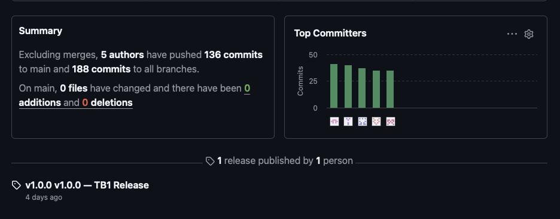
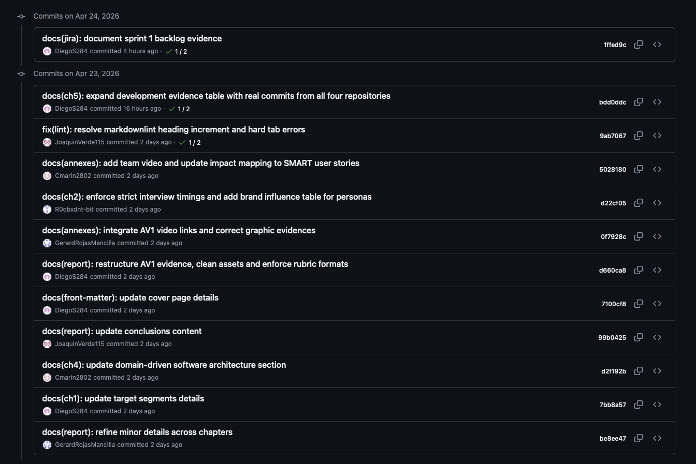
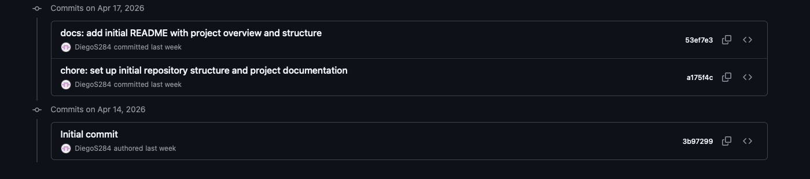
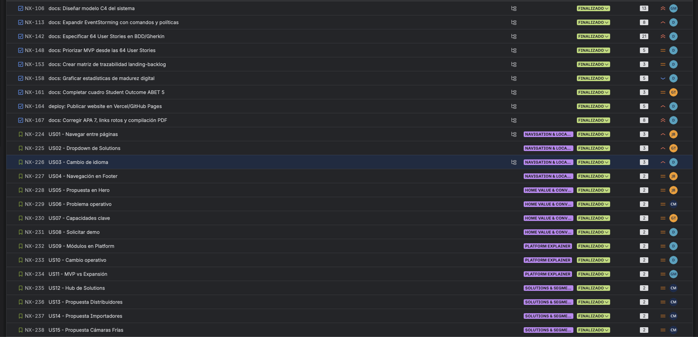
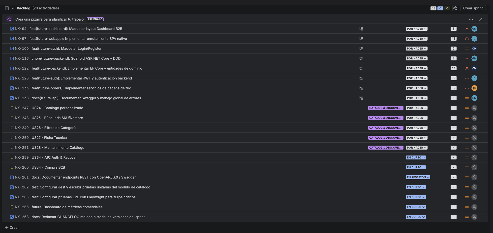
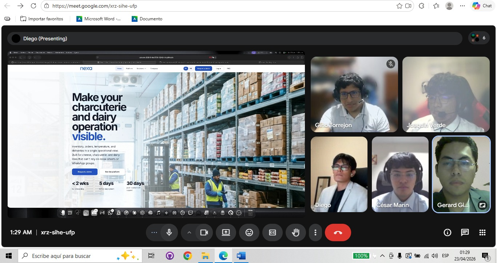

## Project Report Collaboration Insights

Esta sección documenta la colaboración del equipo **KING** alrededor del informe académico y del ecosistema de repositorios de **Nexa**. El trabajo se organizó mediante documentación Docs-as-Code, repositorios GitHub, coordinación por sprint y evidencias visuales de reuniones, diseño y commits.

### Organización en GitHub

| Recurso | URL |
|---|---|
| Organización GitHub del equipo KING | [https://github.com/upc-pre-202610-1asi0730-12242-king](https://github.com/upc-pre-202610-1asi0730-12242-king) |
| Repositorio del informe (Docs-as-Code) | [https://github.com/upc-pre-202610-1asi0730-12242-king/nexa-report](https://github.com/upc-pre-202610-1asi0730-12242-king/nexa-report) |
| Repositorio de la Landing Page | [https://github.com/upc-pre-202610-1asi0730-12242-king/nexa-website](https://github.com/upc-pre-202610-1asi0730-12242-king/nexa-website) |
| Repositorio de la Web Application TB1 | [https://github.com/upc-pre-202610-1asi0730-12242-king/nexa-webapp](https://github.com/upc-pre-202610-1asi0730-12242-king/nexa-webapp) |
| Repositorio del Backend / Plataforma (futuro) | [https://github.com/upc-pre-202610-1asi0730-12242-king/nexa-platform](https://github.com/upc-pre-202610-1asi0730-12242-king/nexa-platform) |
| Landing desplegada (GitHub Pages) | [https://upc-pre-202610-1asi0730-12242-king.github.io/nexa-website/](https://upc-pre-202610-1asi0730-12242-king.github.io/nexa-website/) |

### Distribución de actividades del equipo

El equipo se organizó alrededor de liderazgos funcionales. Cada integrante mantuvo frentes principales y colaboró en tareas transversales de investigación, diseño, arquitectura, documentación y publicación. Para TB1, la evidencia verificable de control de versiones se concentra en `main` y en commits convencionales; GitFlow queda documentado como modelo de trabajo para ordenar futuras iteraciones sin presentarlo como práctica histórica completa.

| Integrante | Frentes de liderazgo | Frentes de colaboración |
|---|---|---|
| Yucra Sandoval, Diego Sebastian | Project Management, integración de capítulos, Product Backlog | Arquitectura, UX/UI, documentación |
| Verde Bueno, Joaquín Francisco | UX/UI Design, EventStorming, Ubiquitous Language | Documentación, User Stories |
| Marín Cueva, César Fernando | Documentación, análisis competitivo, entrevistas | UX/UI, backlog |
| Torrejón De Los Santos, Gino Rodrigo | Documentación, Needfinding, Student Outcome | UX/UI, evidencias |
| Rojas Mancilla, Gerard Gianpier | Software Architecture (C4/DDD), Frontend Development | Documentación, despliegue |

### Evidencias de GitHub Insights

Figura. GitHub Insights: actividad de contribuciones del equipo KING en los repositorios del proyecto Nexa. Elaboración propia.

### Evidencias de commits — nexa-report

Figura. Primeros commits del repositorio `nexa-report`. Elaboración propia.

Figura. Bloque intermedio de commits del repositorio `nexa-report`. Elaboración propia.

Figura. Últimos commits del repositorio `nexa-report` al cierre de AV1. Elaboración propia.

### Evidencias de commits — nexa-website

Figura. Primeros commits del repositorio `nexa-website`. Elaboración propia.

Figura. Bloque intermedio de commits del repositorio `nexa-website`. Elaboración propia.

Figura. Últimos commits del repositorio `nexa-website` al cierre de AV1. Elaboración propia.

### Sprint collaboration en Jira

Figura. Vista general Sprint 0 + Sprint 1 en Jira. Elaboración propia.

Figura. Sprint 1 en Jira, parte 2. Elaboración propia.

Figura. Sprint 1 en Jira, parte 3. Elaboración propia.

Figura. Product Backlog completo en Jira. Elaboración propia.

### TB1 / Sprint 2 — Colaboración y coordinación

Para TB1, el equipo amplió la colaboración desde documentación e investigación hacia la consolidación de la web application y la limpieza integral del reporte. La siguiente tabla resume el trabajo realizado durante Sprint 2.

| Área de colaboración | Cómo trabajamos durante TB1 | Evidencia |
|---|---|---|
| Coordinación general | Diego lideró integración del reporte, alcance webapp, QA Docs-as-Code y consolidación final de la entrega | Commits de integración en `nexa-report`, `nexa-webapp` y `nexa-website` |
| Documentación y revisión | César, Joaquín y Gino sostuvieron limpieza de capítulos, actualización de needfinding, IA, impact mapping, user stories y revisión de entregables | Commits distribuidos en `nexa-report` del 2 al 5 de mayo |
| UX/UI de webapp | Gino y Joaquín actualizaron user flows, wireflows y mockups; Diego reconstruyó la estructura 4.4 | Commits de Capítulo 4 del 5 de mayo |
| Webapp implementation | El repositorio `nexa-webapp` concentra flujos de auth, dashboard, orders, inventory, dispatch, portal, reports e i18n | Commits de `nexa-webapp` del 26/04 al 05/05 |
| Arquitectura | Gerard contribuyó en DDD/C4, HTTP service layer y módulos puntuales de webapp | Commits vinculados a C4 y webapp clients/portal |
| Continuidad landing | César, Joaquín, Gino y Gerard actualizaron SEO, tokens y copy; Diego alineó CTAs con webapp | Commits en `nexa-website` del 28/04 al 03/05 |

| Decisión o ajuste durante TB1 | Motivo | Resultado |
|---|---|---|
| Separar Sprint 1 baseline de Sprint 2 en Capítulo 5 | Evitar mezclar landing AV1 con webapp TB1 | Capítulo 5 con dos sprints documentados por separado |
| Usar Fake API / JSON Server en lugar de backend productivo | Validar flujos frontend sin afirmar servicios no implementados | Webapp demostrable sin sobredeclaración |
| Reconstruir sección 4.4 con wireframes, wireflows y mockups actuales | Evidencia anterior estaba desactualizada respecto al producto | Documentación UX/UI alineada con webapp real |
| Limpiar Capítulos 1–4 de terminología imprecisa | Segmentos, personas y style guidelines requerían coherencia con el producto actual | Reporte más coherente y defendible |
| Documentar contribución real por evidencia | Evitar afirmaciones de contribución igualitaria no verificable | Student Outcome con progresión AV1-TB1 |

### Evidencias de coordinación y trabajo en equipo

Figura. Reunión de coordinación del equipo KING durante el Sprint 1. Elaboración propia.

Figura. Trabajo colaborativo del equipo durante el Sprint 1. Elaboración propia.

Figura. Práctica de exposición y preparación de la sustentación AV1 del equipo KING. Elaboración propia.
